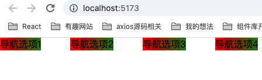
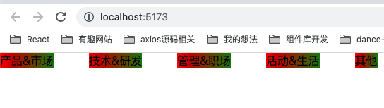

# 需求分析

Vue3简单实现一个MVP版本的Menu，需求分析：

* `props`接收一个`menuList`，作为菜单选项列表进行渲染
* 消费组件（父组件）可以通过`v-model`获取到当前被选中的菜单选项的值，即`menuList[index]`
* 消费组件可以通过监听`Menu`组件的`changeMenu`事件来指定在菜单切换时的回调

# 结构搭建

MVP布局的话，单纯使用一个`ul`作为容器，里面每一项用`li`渲染即可，但这里出于多种考虑，外面再包一层`div.menu-container`，这样可以：

* 拓展导航栏的布局灵活性，易于拓展。例如我们一个横向的菜单导航，左边可能几个选项，右边也有几个选项，这时候可以在`div.container`里面再添加一个`ul`，实现选项集合`ul`的左右布局
* 作为一个vue组件，包裹一个`div`在开发者工具中看dom结构也更加清晰
* ...

并简单添加样式，让`li`标签一行显示，并增加一定的间距

~~~vue
<template>
  

    <ul class="menu-ul">
      <li>导航选项1</li>
      <li>导航选项2</li>
      <li>导航选项3</li>
      <li>导航选项4</li>
    </ul>
  

</template>

~~~

效果：

# 实现`props`接收渲染列表

`
~~~

效果：

但这里有个坑，如果在`setup`中通过`props.menuList`的形式访问`props`属性就会报错，我不知道具体是不是因为打包工具的原因，用`vue-cli`创建的基于`webpack`的项目上面的代码会TS报错：`Property 'menuList' does not exist on type 'Readonly<LooseRequired<Readonly<ExtractPropTypes<readonly string[] | Readonly<ComponentObjectPropsOptions<Record<string, unknown>>>>> & { ...; }>>'`，但是基于`vite`就没事。报错时如果想要在`js`代码中访问`props`，暂时我只想到了`(props as any).menuList`。针对这个错误真的很无奈...

# 添加`v-model`支持    

首先`Menu`组件中需要添加一个`props`属性，这个属性即为消费组件（父组件）中`v-model`绑定的值，即父组件中

`App.vue`：

~~~vue
<template>
	// 即我们希望通过activeMenuInfo变量来获取Menu组件中选中的标签值，v-model:activeMenuItem，这里的activeMenuItem对应Menu组件中的props.activeMenuItem
  <Menu v-model:activeMenuItem="activeMenuInfo" :menuList="menuList"/>
</template>

~~~

`Menu.vue`:

~~~js
...
props: {
		...
    activeMenuItem: { // 添加activeMenuItem
      type: String
    }
  },
},
~~~

同时，给`li`标签绑定`Menu`导航切换时的回调函数`changeMenu`，并传入`index`，这样可以在`changeMenu`函数体中通过`props.menuList[index]`访问选中的新导航的值。

`<Menu />`组件中`emit`数组中添加一个`"update:activeMenuItem"`事件，只需要调用`emit("update:activeMenuItem", value)`即相当于把父组件中通过`v-model:activeMenuItem="xxx"`绑定的`xxx`变量修改为`value`，这里`emit`是从`setup`函数第二个对象参数中解构出来的：

~~~vue
<template>
  

    <ul class="menu-ul">
      <li 
        v-for="(menuItem, index) in menuList" 
        :key="index"
        @click="changeMenu(index)"
      >
        {{ menuItem }}
      </li>
    </ul>
  

</template>

~~~

这样已经完成了`Menu`组件对`v-model`的支持，可以在父组件中通过`watch`函数监听来测试`v-model`绑定的变量的变化，点击导航后`newValue`和`oldValue`都正常访问，功能实现是没有问题的。

当然一般都会给选中的导航添加一些样式，所以我们在`Menu`组件中维护一个被激活导航的标识变量`activeIndex`，`v-for`遍历生成`li`时给`index === activeIndex`的`li`添加样式。

# 实现父组件对导航切换事件的监听

很简单，只需要在`Menu`组件中`emits`数组中添加一个`changeMenu`事件，然后在`Menu`组件内部的导航切换回调中执行`emit("changeMenu")`，即可触发父组件中的回调函数。

# `<Menu />`最终代码

[gitHub](https://github.com/jinrd123/MenuDemo)

`Menu.vue`:

~~~html
<template>
  

    <ul class="menu-ul">
      <li 
        v-for="(menuItem, index) in menuList" 
        :key="index"
        @click="changeMenu(index)"
        :class="{
          'active-li': index===activeIndex
        }"
      >
        {{ menuItem }}
      </li>
    </ul>
  

</template>

~~~

`App.vue`：

~~~html
<template>
  <Menu 
    v-model:activeMenuItem="activeMenuInfo" 
    :menuList="menuList"
    @changeMenu="test"
  />
</template>

~~~

