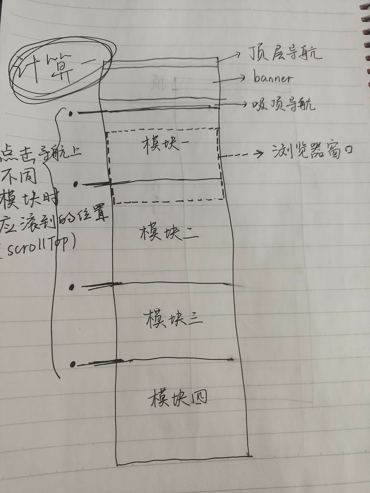

记录一下来公司实现的第一个业务场景——吸顶导航

# 业务场景简介

## 场景描述

首先页面的结构是这样的：

最上面有个项目顶级导航栏，然后下面就是一个路由页面，页面顶部是一个banner图，下面紧接着就是“吸顶导航”，再往下就是吸顶导航对应的模块的具体内容。

所谓吸顶导航的一个表现效果就是：随着向下滚动页面，导航最终在顶部不会移除屏幕：

（吸顶效果的实现：`position: sticky`）

## 业务需求

其实需求也就比较明显了：

* 点击吸顶导航的一个选项，切换导航高亮并且页面滚动到对应模块的位置
* 鼠标滚轮滚动页面的时候，实时监听页面的滚动位置，对导航的高亮进行切换

# 业务实现

因为踩的坑太多走的弯路太多了，所以就不复现踩坑的过程了，直接用最终代码，然后根据最终代码记录一下代码中遇到的坑

总体的实现思路：

1. 实现点击事件
2. 实现滚动事件处理
3. 合并冲突

## 实现点击事件

先实现点击事件回调，说白了逻辑就两点：

* 动态切换记录高亮的变量
* 滚动到应该到的位置

~~~typescript
const handleCheck = (index: number) => {
    moduleIndex.value = index; // 切换高亮
    window.scrollTo({ // 滚动到应该到的位置
        top: checkScrollToList.value[index],
        behavior: 'smooth'
    });
};
~~~

*这里遇到的坑（业务实现思路可跳过横线内部分）*：

----

**入坑**

**问题一： window.scroll这里为什么是window，需要满足什么条件？**

首先scrollTo方法并不是说只有window能去调用，dom元素都可以。调用scrollTo方法的元素应该有滚动条才有效，最初项目的App.vue中的结构样式是这样的：

~~~html

...

~~~

~~~less
#app {
    width: 100%;
    height: 100%;
    overflow: hidden;
    .wrap {
        height: 100%;
        overflow: hidden;
        overflow-y: auto;
        .wrap-container {
            min-height: calc(~'100% - 66px');
        }
    }
}
~~~

首先我们需要分析出来随着内容增大，出现滚动条的是哪一个元素：首先元素设置高度百分比时height是被子元素撑开的。div#app设置了`overflow: hidden;`，是不会出现滚动条的，但它会随着子元素div.wrap的增大被撑大，div.wrap设置了`overflow-y: auto;`，是会出现滚动条的，什么时候出现呢：它的内容超出了它的高度。但是他的高度100%是没有被设限的（设置一个具体的px值），所以这里涉及对`document.body`（<body></body>）的理解，他是div#id的父元素，最大就是浏览器可视区域的高度。(**我们浏览器中能一眼看到的内容区域，就是body**)

动态理解：div.wrap内容越来越多，越来越大，撑的div#app也越来越大，单前期两者都不会出现滚动条，但是一旦浏览器屏幕装不下它俩，它俩的高度就没发继续被撑开了，这时候我们屏幕右边出现了滚动条，其实我们看到的整个屏幕就是div.wrap，滚动条就是它产生的，它外层还包了一层div#app，然后div#app外层还包了一个<body>。

所以上面的项目原代码我是不理解的，为什么要写一些`overflow: hidden`，如果没有`overflow: hidden`限制滚动条出现的话，随着body内部的元素越来越高，最终出现滚动条的肯定是最外层的body。

所以针对上面滚动元素是div.wrap的情况，我一开是写的是`document.querySelector(".wrap").scrollTo`进行滚动的。

上面这样是有问题的（下面遇到会说），也就是之后为什么把div#app和div.wrap的overflow都注释掉，让body作为滚动元素的原因

**出坑**

---

**下面的逻辑按照滚动元素为body的基础继续**（如果像上面我所说的，产生滚动条的元素是div.wrap，那么需要把调用`srcollTo`方法的对象改为div.wrap、把获取scrollTop等属性的元素也换成div.wrap）

完成点击逻辑只需最后一步：计算要滚动到哪里——checkScrollToList数组的计算：

~~~typescript
onMounted(() => {
    // 计算点击导航时需要滚动到的位置
    if (moduleContainer.value) {
        moduleList.value = moduleContainer.value.children ? [...moduleContainer.value.children] : [];
    }
    moduleList.value.forEach((item, index, modules) => {
        if (index === 0) {
            checkScrollToList.value.push(topPartHeight);
        } else {
            checkScrollToList.value.push(checkScrollToList.value[index - 1] + modules[index - 1].offsetHeight);
        }
    });
});
~~~

这里需要我们实现好html布局：对于导航栏的各个模块，应该为同一个父元素中的同级模块：

这样我们通过ref拿到父元素（div.origin-ul）之后直接通过父元素的children属性就可以拿到各个模块对应的子元素。根据子元素的`offsetHeight`属性结合上面顶层导航、banner图、吸顶导航的实际高度，就可以进行算出我们点击导航时滚动元素的srcollTop的值应为多少(下面的checkScrollToList数组)：

~~~typescript
const headerBarHeight = 62; // 顶层导航高度
const reportBannerHeight = 380; // banner图高度
const reportNavHeight = 76; // 吸顶导航高度
const topPartHeight = headerBarHeight + reportBannerHeight; // 没加上reportNavHeight（理解：比如滚动到模块一，浏览器最顶部并不是模块一与吸顶导航的交界，而是吸顶导航与banner的交界，所以相当于所有模块往下滚动的距离都少一个吸顶导航的高度才正确）
onMounted(() => {
    // 计算点击导航时需要滚动到的位置
    if (moduleContainer.value) {
        moduleList.value = moduleContainer.value.children ? [...moduleContainer.value.children] : []; // moduleList数组存放四个模块对应的元素
    }
    moduleList.value.forEach((item, index, modules) => {
        if (index === 0) { // 对于模块一，点击后的scrollTop值为topPartHeight
            checkScrollToList.value.push(topPartHeight);
        } else { // 对于模块二，点击后的scrollTop值为topPartHeight加上模块一的offsetHeight（前提条件是模块之间是没有margin紧密相连的，因为offsetHeight不包含margin）
            checkScrollToList.value.push(checkScrollToList.value[index - 1] + modules[index - 1].offsetHeight);
        }
    });
});
~~~

到这里单独处理点击事件的回调逻辑就完成了。

## 实现监听滚动

目标就是监听滚动，根据当前的一个滚动位置（滚动元素的scrollTop）来更新高亮

忽略滚动处理逻辑部分，代码的一个结构（挂载srcoll监听&&节流处理）如下：

~~~typescript
onMounted(() => {
    window.addEventListener("scroll", handleScroll); 
});
onBeforeUnmount(() => {
    window.removeEventListener("scroll", handleScroll);
});
const throttleTag = ref(false);
const handleScroll = () => {
    if (throttleTag.value) {
        return;
    }
    throttleTag.value = true;
    setTimeout(() => {
      	// -------- 处理滚动的逻辑 ----------
        const currentScrollTop = document.documentElement.scrollTop;
        let currentModuleIndex = getCurrentIndex(document.documentElement.scrollTop);
        if (!hasClick.value) {
            moduleIndex.value = currentModuleIndex;
        } else {
            if (Math.abs(currentScrollTop - targetPosition.value) < 1 
            || isGetBottom()) {
                hasClick.value = false;
            }
        }
      	// --------------------------------
        throttleTag.value = false;
    }, 30);
};
~~~

*这里遇到的坑（业务实现思路可跳过横线内部分）*：

----

**入坑**

滚动盒子不是body的时候，`window.addEventListener("scroll", handleScroll); `添加滚动事件监听无效，需要设置第三个参数为`true`，这是因为用户的滚动行为在事件冒泡阶段就被window捕获，但是window并没有滚动条（非滚动元素），所以不会触发滚动回调然后事件流没有向window的子元素里走就直接结束了（理解前提：滚动回调触发的时机是用户的滚动行为触发了滚动事件流，滚动事件流经过有滚动条的元素会触发这个元素的滚动回调）。

但是滚动元素如果是body，那么window上挂载的scroll监听在冒泡阶段就可以捕获到滚动行为，但是直接给body设置`addEventListener`是无效的。准确原因不理解，但是自己可以理解为：用户行为触发的事件流都是从body元素开始捕获过程的，并且给window添加的监听（`window.addEventListener`）实际都添加给了body。（plus：网上描述事件流都说是从window开始传递，但是这样的话这里就没发解释了）

**出坑**

---

处理滚动，说白了就是根据当前的scrollTop来计算当前的moduleIndex（高亮标记变量）是几。

第一步：`const currentScrollTop = document.documentElement.scrollTop;`

*这里遇到的坑（业务实现思路可跳过横线内部分）*：

----

**入坑**

通过`document.body.scrollTop`来获取body的scrollTop一直都是0（W3C的规定）

**出坑**

---

写一个函数用于根据scrollTop计算当前的moduleIndex：

我觉着我写的这个算法没必要解释太多了，大家肯定都有自己的解决方案，但是需要考虑的一点：**如果像我一样根据scrollTop，也就是浏览器窗口上边界是否达到模块上边界这么一个思路走的话，需要考虑到最后一个模块height很小，窗口上边界永远触碰不到模块上边界导致的滑动到页面最底部吸顶导航最后一个模块也不会亮的问题**

~~~typescript
const getCurrentIndex = (scrollTop: number) => {
    let index = 0;
  	// 还是结合刚刚算出来的checkScrollToList数组（模块上边界）
    for (let i = 0; i < checkScrollToList.value.length; i++) {
        if (scrollTop < checkScrollToList.value[i]) {
            index = (i === 0 ? i + 1 : i);
            break;
        }
    }
  	// 如果滑动到底部，那么就设置index为最后一个模块的index
  	// plus：document.body!.scrollHeight、document.body!.clientHeight这些属性都能正确访问，都表示着他们该有的意义，就是scrollTop特殊
  	// 判等时不能用===，因为浏览器中会有小数点，计算后可能并不相等，所以判断两值相等用两值做差小于1即视为相等
    if (document.body!.scrollHeight - (document.body!.clientHeight + document.documentElement.scrollTop) < 1) {
        index = checkScrollToList.value.length;
    }
    return index - 1;
};
~~~

然后我们的滚动函数大概就完成了：

~~~typescript
const handleScroll = () => {
    if (throttleTag.value) {
        return;
    }
    throttleTag.value = true;
    setTimeout(() => {
        const currentScrollTop = document.documentElement.scrollTop;
        let currentModuleIndex = getCurrentIndex(document.documentElement.scrollTop);
        moduleIndex.value = currentModuleIndex;
        throttleTag.value = false;
    }, 30);
};
~~~

## 解决冲突

### 冲突分析

以上面的完成情况：单单测试点击或者滚动都没有问题，但是需求是这样的：我点击导航滚动到一个模块的时候，模块立即高亮（不能等到滚过去再高亮）

这样两者就有冲突了，比如我现在窗口位置在第一个模块，我点击最后一个模块，点击的一瞬间，最后一个模块高亮一下（点击回调所致），然后瞬间回到当前高亮位置，并且中间经过的模块高亮都会亮一遍（监听滚动所致：scrollTo方法页面滚动，触发滚动监听的回调，会实时根据当前位置动态更新高亮）

### 解决思路

增加一个标记变量`hasClick`，点击回调方法进行时将其设置为`true`，表示点击正在进行，阻止监听方法里的行为

直接放代码和注释吧：

点击事件回调：

~~~typescript
const handleCheck = (index: number) => {
    hasClick.value = true; // 标记变量设置为true，表示此时应该停止监听行为
    targetPosition.value = checkScrollToList.value[index]; // 记录我们要滚动到的位置，这是为了在监听滚动的逻辑中将hasClick重新设置为false的辅助变量
    moduleIndex.value = index;
    window.scrollTo({
        top: checkScrollToList.value[index],
        behavior: 'smooth'
    });
  	// 不能直接在这里执行hasClick.value = true;，这个函数是同步代码，执行完毕才会执行监听回调。所以要把hasClick.value = true;的逻辑放到监听回调逻辑中去
};
~~~

监听滚动的回调：

~~~typescript
const handleScroll = () => {
    if (throttleTag.value) {
        return;
    }
    throttleTag.value = true;
    setTimeout(() => {
        const currentScrollTop = document.documentElement.scrollTop;
        let currentModuleIndex = getCurrentIndex(document.documentElement.scrollTop);
        if (!hasClick.value) { // 修改moduleIndex之前增加逻辑判断，保证在点击导航触发的滚动过程中不修改moduleIndex
            moduleIndex.value = currentModuleIndex;
        } else { // 寻找合适的时机执行hasClick.value = false;：让监听滚动的逻辑重新正常执行
            if (Math.abs(currentScrollTop - targetPosition.value) < 1  // 情况一：滚动到了目标位置
            || isGetBottom()) { // 情况二：因为底部模块可能很小，永远滚动不到目标位置，所以如果触底，我们也应该重新开启监听逻辑
                hasClick.value = false;
            }
        }
        throttleTag.value = false;
    }, 30);
};
// 判断触底函数
const isGetBottom = () => {
    return document.documentElement.scrollTop + document.body.clientHeight == document.body.scrollHeight; // 这里的判等最好也用相减绝对值小于1
};
~~~

## 为什么要把滚动元素修改为body

上面的业务最初完成是在滚动元素为div.wrap的基础上完成的，最后为什么要注释掉App.vue里那几个overflow:hidden，让滚动元素成为body

因为这个页面有几个路由转跳的按钮，点击进行路由跳转之后滚动条并不在页面上方，而且路由文件里也配置了

~~~js
scrollBehavior() {
    return {
        top: 0
    };
},
~~~

我发现，vue自带的`scrollBehavior`生效的前提条件就是滚动元素为body。

这里等以后学习一下vueRouter的实现应该就更清楚了

### 后续

因为滚动盒子变了导致曾经涉及滚动的页面都出问题了...最终我又改回原来的了以div.wrap为滚动盒子的情况。这样的话也不是说不行，路由转跳之前如果想要页面滚动位置在顶部，就需要手动加一行修改滚动盒子的scrollTop的代码：

~~~js
const handleLearnMore = () => {
    scrollBox.value.scrollTop = 0; // 手动更改滚动位置
    router.push(props.targetRoute);
};
~~~

# 最终代码

~~~vue
<template>
    

        

            

                
                

            

        

        

            <ul class="module-header-tab">
                <li
                    v-for="(item, index) in moduleTab"
                    :key="index"
                    :class="{'tab-active': moduleIndex === index}"
                    @click="handleCheck(index)"
                >{{ item }}</li>
            </ul>
        

        

            

                

                    <h1>核心功能</h1>
                    

                        
                        <core-function-module 
                            :infoList="infoLists[0]" 
                            mode="right" 
                            title="学在当下" 
                            targetRoute="/learn"
                        />
                    

                    

                        <core-function-module 
                            :infoList="infoLists[1]" 
                            mode="left" 
                            title="职等你来"
                            targetRoute="/jobrecommend"
                        />
                        
                    

                    

                        
                        <core-function-module 
                            :infoList="infoLists[2]" 
                            mode="right" 
                            title="测评中心" 
                            targetRoute="/evaluation"
                        />
                    

                

                

                    

                        <h1>理论模型</h1>
                        <h2>基于冰山理论的AI+人才管理模型</h2>
                        <h3>通过AI技术能力，HR领域专业理论基础，提炼人才能力模型</h3>
                        
                    

                

                

                    

                        <h1>覆盖人群</h1>
                        <h2>全组织 · 全岗位</h2>
                        <h3>覆盖百度内部所有组织和岗位的员工</h3>
                        

                            

                                

                                    {{bubble.description}}
                                

                                

                                

                                

                                

                                

                                

                            

                        

                    

                

                

                    

                        <h1>技术能力</h1>
                        

                            

                                
{{textOfSkill}}

                                

                                    

                                        
                                        {{option.title}}
                                    

                                

                            

                            

                                

                                    
                                    
                                    {{option.title}}
                                

                            

                        

                    

                

            

        

    

</template>

~~~

