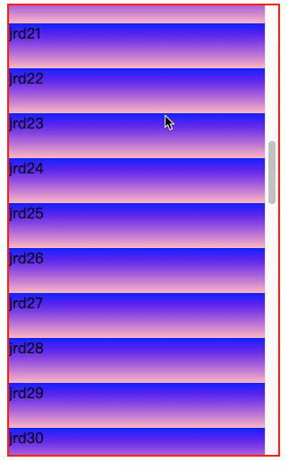
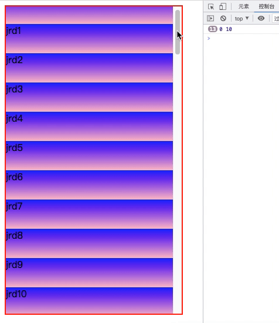
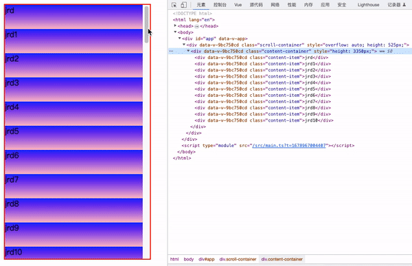
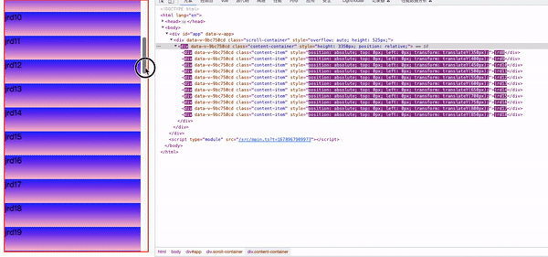
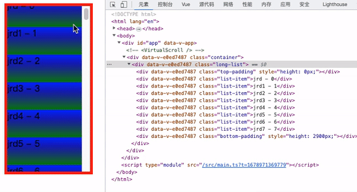
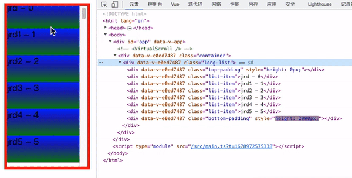
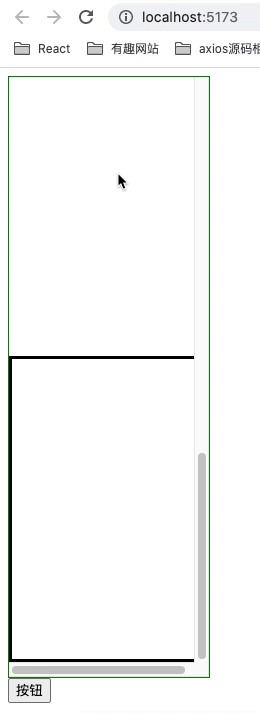

# 总结

通过自己的实践发现，网上相传的虚拟滚动实现方案有种是行不通的（涉及浏览器机制）

* 实现虚拟滚动，滚动元素中利用上下两个只有高度的空盒子撑开空间是不可行的

  `html布局示意`：

  ~~~html
  

    

  
    

    

    

  
    

  

  ~~~

  

* 可行方案：

  `html布局示意`：

  ~~~html
  

    

      

      ...
      

    

  

  ~~~

如果您和我一样，想自己实现一下虚拟滚动，下面 **实现虚拟滚动**部分 中我会尽可能保姆级详细的复现我当时写代码的所有过程（包括建项目...），适合新手（但是不能是小白，需要知道虚拟滚动是干啥的东西，因为我没有去介绍虚拟滚动）。

如果您对这玩意的实现完全没啥好奇的，可以看看 **坑**部分，我详细记录了一个关于浏览器滚动条的特点，或许对你来说有点意思。

# 实现虚拟滚动

下面用vue3写一个demo，并没封装多完善，也不是啥生产可用的东西，但绝对让你清晰虚拟滚动的实现思路（配个动图）

## 项目搭建

`pnpm create vite`创建一个项目，项目名、包名输入`virtualScrollDemo`，选择技术栈`Vue + TypeScript`；再简单安装个`less`，即`pnpm install less less-loader -D`，然后配一下`vite.config.ts`，顺便给`src`配个别名。

`vite.config.ts`：

~~~typescript
import { defineConfig } from "vite";
import vue from "@vitejs/plugin-vue";
import { resolve } from "path"; // 让ts识别模块，这里还需要 pnpm i @types/node

// https://vitejs.dev/config/
export default defineConfig({
  plugins: [vue()],
  css: {
    preprocessorOptions: {
      less: {
      },
    },
  },
  resolve: {
    alias: [
      {
        find: "@",
        replacement: resolve(__dirname, "/src"),
      },
    ],
  },
});
~~~

`App.vue`中`import VirtualScroll from '@/components/VirtualScroll.vue'`还是报错，ts还要配置别名才行，`tsconfig.json`中加一下`baseUrl`和`paths`即可

`tsconfig.ts`：

~~~json
{
  "compilerOptions": {
    "target": "ESNext",
    "useDefineForClassFields": true,
    "module": "ESNext",
    "moduleResolution": "Node",
    "strict": true,
    "jsx": "preserve",
    "resolveJsonModule": true,
    "isolatedModules": true,
    "esModuleInterop": true,
    "lib": ["ESNext", "DOM"],
    "skipLibCheck": true,
    "noEmit": true,
    "baseUrl": "./",
    "paths": {
      "@/*": ["src/*"]
    }
  },
  "include": ["src/**/*.ts", "src/**/*.d.ts", "src/**/*.tsx", "src/**/*.vue"],
  "references": [{ "path": "./tsconfig.node.json" }]
}
~~~

然后项目删一删没用的就成了这样：

~~~
src/
├── App.vue
├── components/
│   └── VirtualScroll.vue
└── shared/
    └── dataConstant.ts
~~~

`dataConstant.ts`是准备的一个长列表渲染的数据源：

~~~typescript
export const dataSource = [
  {
    text: "jrd",
  },
  {
    text: "jrd1",
  },
  ...
]
~~~

## 结构搭建

为了突出重点，**实现虚拟滚动逻辑必要的样式我都写在`:style`中了，辅助性的样式都写在``中**

先把长列表搭建出来：

~~~vue
<template>
  

  

    

      {{ data.text }}
    

  

</template>

~~~

### 注释：

html结构三层嵌套，最外层是`div.scroll-container`，里面依次是`div.content-container`和`div.content-item`。

`div.scroll-container`容器是出现滚动条的容器，所以它需要一个固定高度（可视区域的高度）以及`overflow: auto`，这样他内部元素超过了它的高度它才会出现滚动条；`div.content-container`的作用就是撑开`div.scroll-container`，解释一下，因为我们最终要的效果是只渲染一小部分元素，单单渲染的这一小部分内容肯定是撑不开`div.scroll-container`的，所以根据渲染项的多少以及每个渲染项的高度写死`div.content-container`的高度，不管渲染项目多少，始终保持`div.scroll-container`的`scrollHeight`正常。

## 核心计算

监听`div.scroll-container`的滚动事件，滚动回调中计算`startIndex`和`endIndex`，截取数据源（截取要渲染的一小部分数据，即`renderDataList = dataSource.slice(startIndex, endIndex)`）：

~~~vue
<template>
  

  

    

      {{ data.text }}
    

  

</template>

~~~

### 注释：

`startIndex`和`endIndex`我们都按照从`0`开始（而非`1`开始）的标准来计算
`startIndex`对应`div.scroll-container`上边界压住的`div.content-item`的`index`；`endIndex`对应`div.scroll-container`下边界压住的`div.content-item`的`index`，也就是说，`startIndex`和`endIndex`范围内的数据，是我们在保证可视区域不空白的前提下至少要进行渲染的数据，我可能表述不很清楚，静心想一想不难理解的。

## 收尾

最后的两步就是根据`startIndex`与`endIndex`从`dataSource`中动态截取出来`renderDataList`，`v-for`只渲染`renderDataList`，然后把渲染出来的`div.content-item`通过`定位 + transform`移动到正确的位置即可了。

监听`startIndex`和`endIndex`，变化时修改`renderDataList`

逻辑：

~~~typescript
// 因为slice函数是左闭右开，所以截取时为endIndex.value + 1
const renderDataList = ref(dataSource.slice(startIndex.value, endIndex.value + 1));
watch(() => startIndex.value, () => {
  renderDataList.value = dataSource.slice(startIndex.value, endIndex.value + 1);
})
watch(() => endIndex.value, () => {
  renderDataList.value = dataSource.slice(startIndex.value, endIndex.value + 1);
})
~~~

结构：

~~~html

  {{ data.text }}

~~~

这时候，数据已经正确渲染了，只是位置还不太对

效果：

我们要做的就是通过css把渲染出来的dom移动到正确的位置，这里采取的方案就是`div.content-container`相对定位，`div.content-item`绝对定位，并且`top`与`left`都设置为`0`（所有都移动到左上角），然后通过`translate: transformY`把它们移动到“正确”的位置：

结构：

~~~html

  {{ data.text }}

~~~

经过上面的修改之后已经基本收工了，不知道是哪个样式的原因`div.content-item`的宽度不是`100%`了，手动加上就好了

效果：

## 优化

1. 给滚动事件添加节流
2. 引入缓冲结点数变量`countOfBufferItem`，适当扩充`(startIndex, endIndex)`渲染区间，防止滑动过快出现空白

最终代码：

~~~vue
<template>
  

  

    

      {{ data.text }}
    

  

</template>

~~~

虽说没啥bug吧，但是滚动的快了还是有空白啥的，这应该也算是这个技术方案的瓶颈。

# 坑

## bug复现

我一开始的思路是一个外层`div.container`，设置`overflow: hidden`，然后内部上中下三部分，上面一个空盒子，高度为`startIndex * listItemHeight`；中间部分为`v-for`渲染的列表，下面又是一个空盒子，高度`(dataSource.length - endIndex - 1) * listItemHeight`，总之三部分的总高度始终维持一个定值，即这个值等于所有数据完全渲染时`div.container`的`scrollHeight`。

实现之后，问题出现了：

一旦触发了“机关”，滚动条就会不受控制的滚动到底

我把滚动回调的节流时间设置长为`500ms`：

**发现滚动条似乎陷入了一种循环之中，每次向下移动一个数据块的高度。**分析这个现象，需要下面一些关于滚动条特性的认知。

## 滚动条的特性

先给结论：当一个定高（`scrollHeight`固定）的滚动元素，其（撑开其高度的）子元素高度发生变化时（高度组成发生变化，比如一个变高，一个变低，但保持滚动元素的`scrollHeight`总高度不变），滚动条位置也会发生变化，变化遵循一个原则：**保持当前可视区域展示的元素在可视区域内位置不变。**

写个demo模拟一下上面说的场景，`div.container`是一个滚动且定高的父元素，点击按钮后其内部的`div.top`变高，`div.bottom`变矮

`Test.vue`:

~~~vue
<template>
  

    

    

    

  

  <button @click="test">按钮</button>
</template>

~~~

## 滚动条位置变化demo展示

仔细观察滚动条：

解释一下上图，首先是上面一个红色盒子，底部一个黑色盒子：

* 我们可视区域的左上角在红色区域时点击按钮，这时候浏览器底层判断我们正在浏览红色元素，所以虽然内部元素高度变化，但我们的可视区域相对于红色盒子左上角的位置不变
* 第一次刷新之后，我们可视区域的左上角在中间盒子上，这时候我们点击按钮，红色盒子高度增加，黑色盒子高度减小，中间盒子的相对整个滚动区域的位置就靠下了，但是——浏览器的滚动条也随之向下移动了（而且，`滚动条向下移动的距离 === 红色盒子高度增加值 === 黑色盒子高度减小值 === 中间盒子相对滚动区域向下偏移值`）
* 第二次刷新后，更直观的表现了滚动条的这个特点：我把滚动条恰好移动到中间盒子上，上面紧邻红色盒子，点击三次按钮后，滚动条下移三次，此时我向上滚动一点，接着看到了红色盒子。

## bug原因分析

有了上面的认知，再来看这个图

bug的“生命周期”：

1.我们手动向下滚动滚动条 ——> 2.内部计算（`startIndex`以及`endIndex`的改变）触发上方占位的`
`元素高度增加，下方占位`
`高度减小，中间渲染的内容部分整体位置相对于整个滚动元素下移 ——> 3.（浏览器为了保持当前可视区域展示的元素在可视区域内位置不变）滚动条自动下移 ——> 4.触发新的计算 ——> 2.

感慨：上中下三个部分，上下动态修改高度占位，中间部分渲染数据，思路多么清晰的方案，但谁能想到浏览器滚动条出来加了道菜呢

网上不少地方都给了这个方案...

成功的虚拟滚动、带bug的虚拟滚动和测试组件的源码我都放到这里了，需要的话可以去clone：https://github.com/jinrd123/VirtualScrollDemo（带bug的虚拟滚动是我第一次实现时随性写的，代码组织以及注释可能不是很规范）

