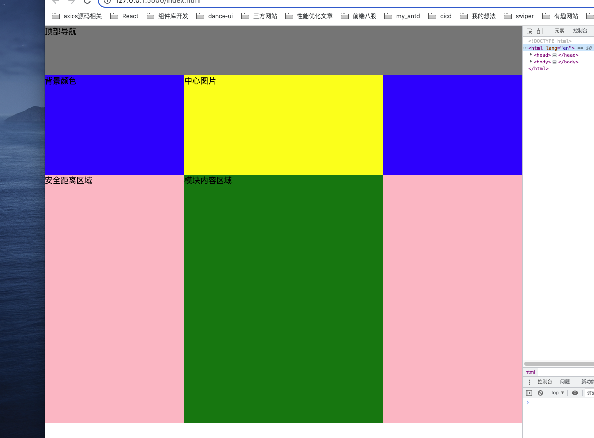

# 静态布局

css静态布局中——保证一个固定大小区域内的布局稳定，内部元素大小稳定：

* 浏览器窗口大于区域大小时区域边缘扩大撑满浏览器窗口；
* 浏览器窗口小于区域大小时出现滚动条，维持区域内稳定。

# 滚动条出现逻辑

`overflow`属性默认值为`visible`，但是`body`（还有`textarea`）元素默认值为`auto`，而且完全可以把`body`理解为一个内置的最外层的块级元素`div`，浏览器布局模型我觉着可以理解为浏览器窗口就是`html`标签，我们用户可以随意缩放这个窗口大小，然后紧接着内层是`body`，从框架开发来说一般`body`内部紧接着就是`div#app`，然后`App.vue`中还有可能有另一个根元素`div#wrap`...

css中块级元素`width`默认为`100%`，所以从最外面的`body`到`div#app`到`div.wrap`我们都没写`width`，往内部逐层找，一直到某个明确写了宽度的container元素，比如`div.wrap`设置了`width: 1200px`，基于浏览器窗口大小与这个元素的大小，就会出现滚动条：

* 浏览器窗口（宽度）小于这个元素（宽度），这个元素的某个父元素就会出现横向滚动条，具体是哪个父元素：从这个元素本身出发逐层寻找其父元素，即第一个设置了`overflow: auto`的父元素，比如对于`div.wrap`来说，父级元素`div#app`没设置`overflow: auto`，所以出现滚动条的就是`body`（`body`默认`overflow: auto`）
* 浏览器窗口大于这个元素，反正父级有多少个就多少个都是浏览器窗口的大小，因为全是`width: 100%`，然后浏览器窗口宽度就是`html`的宽度，比如说`div.wrap`的`width: 1200px;`，此时浏览器窗口宽度是大于1200的，所以`（html宽度 === 浏览器窗口） === body === div#app`都是同一个宽度，突然到`div.wrap`发生断层

# 静态布局实战

## 度成长：

浏览器窗口较宽：

浏览器窗口较窄底部出现横向滚动条：

### 分析：

#### **模拟：**

~~~html
<!DOCTYPE html>
<html lang="en">
  <head>
    <meta charset="UTF-8" />
    <meta http-equiv="X-UA-Compatible" content="IE=edge" />
    <meta name="viewport" content="width=device-width, initial-scale=1.0" />
    <title>Document</title>
  </head>
  <body>
    

      
顶部导航

      

        背景颜色
        
中心图片

      

      
安全距离区域
        
模块内容区域

      

    

    
  </body>
</html>

~~~

#### **效果：**

#### **布局思路：**

1. 不要整体去看这一个页面，包括顶部导航，接着下面的banner图，接着内容模块，不要想着对于这个页面整体来说我到底该如何给父元素加一个宽度，然后一劳永逸的其他模块都基于这个宽度自动出现滚动、实现安全距离之类的。
2. 正确的布局实现方案：一行一行的进行拆分，并对每一模块（每一行）来说制定`min-width`来控制安全距离（对于一个设计稿来说，宽度小到多少px出现横向滚动条应该都有一个唯一标准，比如是400px），举例来说：
   1. 对于顶部的导航，这是一个永远100%占满浏览器的组件，并且组件最窄也要有400px，那我就设置`min-width: 400px`
   2. 对于第二行的banner，底部是一个底色盒子，永远占满浏览器，那么就设置一个`min-width: 400px;`，宽度继承父元素100%，不用写；然后中心区域存放一些内容（文字或者图片），水平垂直居中即可
   3. 第三行模块内容区域，这里不同于上面都是始终100%，要求我们内容两侧有一个所谓的安全距，我们外层container也设置一个`min-width: 400px`“搭建“好外层空间，然后中心内容水平居中即可，自然就有了所谓的安全距离了

#### **总结：**

不要给自己上难度，想着到底该如何布局既能实现100%宽度的模块，又能兼顾有安全距离要求的模块，**主打一个问题拆解，一行一行的、根据目标要求去实现，针对每一行，可以使用`min-width`来清晰静态布局的不可变宽度**