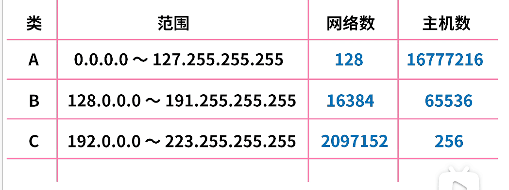
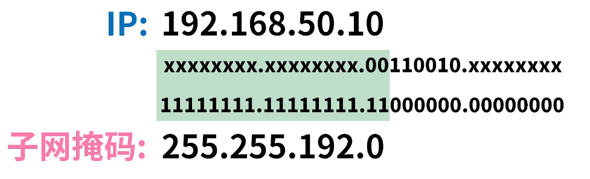
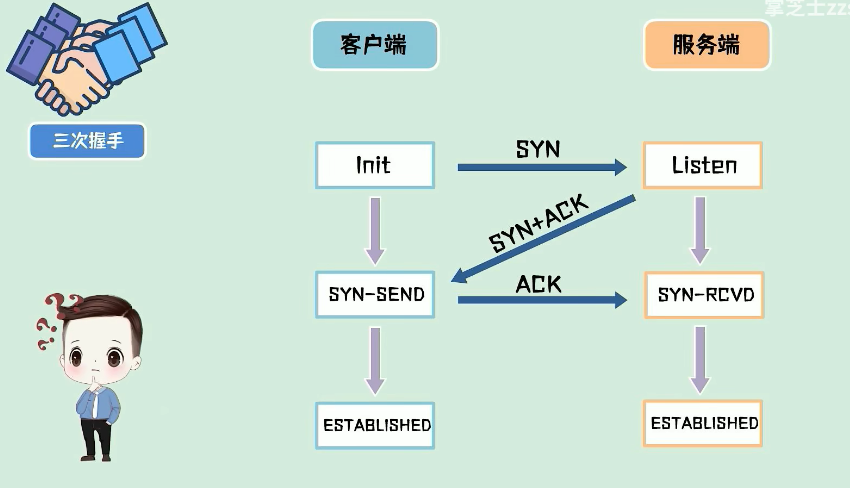
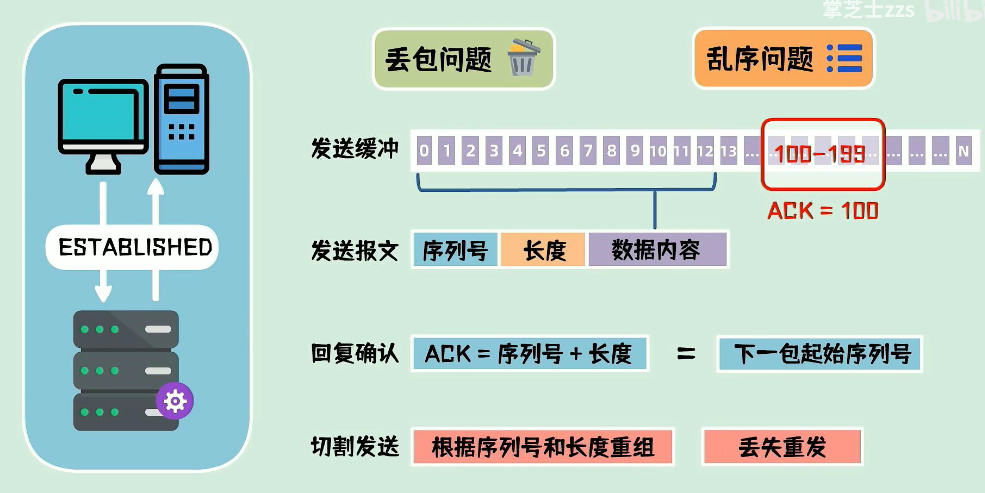
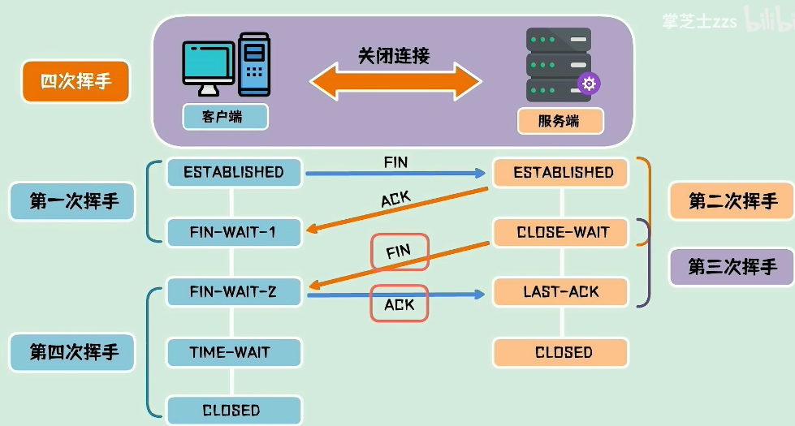
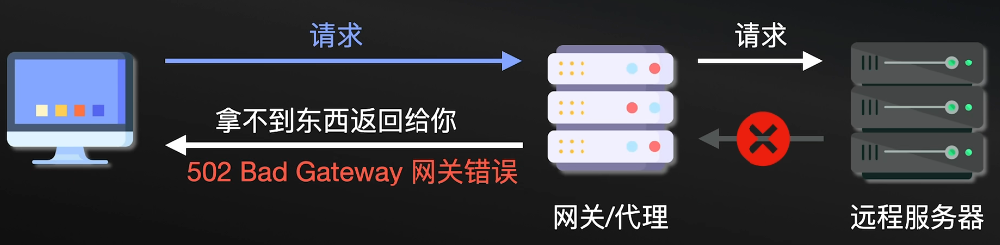
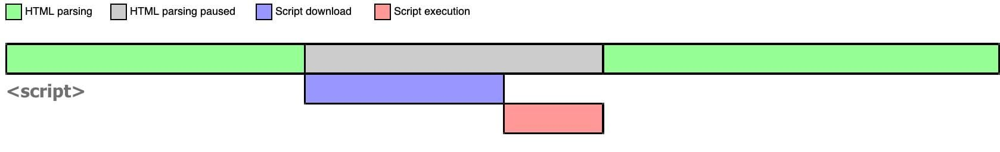
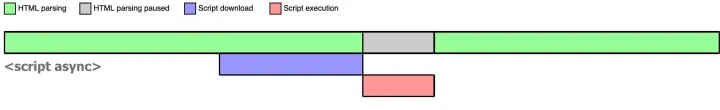
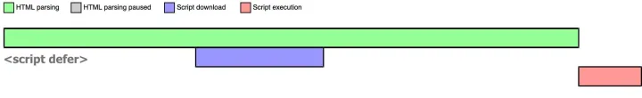
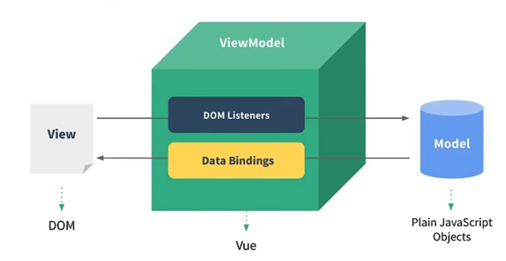

# CSS伪类与伪元素

伪类选择器：

| 属性         | 描述                                   |
| ------------ | -------------------------------------- |
| :active      | 向被激活的元素添加样式                 |
| :focus       | 向拥有键盘输入焦点的元素添加样式       |
| :hover       | 当鼠标悬浮在元素上方时，向元素添加样式 |
| :link        | 向未被访问的链接添加样式               |
| :visited     | 向已被访问的链接添加样式               |
| :first-child | 向元素的第一个子元素添加样式           |
| :lang        | 向带有指定lang属性的元素添加样式       |

伪元素选择器（一般使用双冒号）：

| 属性          | 描述                           |
| ------------- | :----------------------------- |
| :first-letter | 向文本的第一个字母添加特殊样式 |
| :first-line   | 向文本的首行添加特殊样式       |
| :before       | 在元素之前添加内容             |
| :after        | 在元素之后添加内容             |

理解：伪类就是给已经存在的dom元素**整体**添加样式，比如`div:hover`就是鼠标悬浮时div的样式；伪元素就是对dom元素的**部分内容**进行修改，比如`div::first-letter`就是div第一行的样式（类似于给第一行增加一个span），`div::after`就相当于在原本的dom内容之后又增加了一部分内容（相当于在div之后又加了一个span），之所以叫伪元素，是因为好像给原本的dom结构增加了新的dom元素一样。

因为`:before`和`:after`相当于在原来dom的基础上添加新的dom结构，必需有`content`属性（可以为""空字符串）。

可以用伪元素来清除父容器中元素浮动的影响，撑开父容器：

~~~CSS
.main::after {
    /*
        内容设置为空
    */
    content: '';
    /*
        display: block即让伪元素独占一行
    */
    display: block;
    /*
        ::after相当于是在父容器最后添加的一个非浮动流元素，设置clear: both即表示不占用浮动元素空出来的位置
    */
    clear: both;
}
~~~

# 浮动

## 对浮动的理解（曾经的课堂笔记）

* 浮动元素使用套路：
  * 搭配标准流父级盒子：先用标准流父级盒子排列上下位置，之后盒子内部采取浮动排列左右
  * 浮动盒子之间没有间隙，若想设置通过margin、
* 清除浮动：
  * clear：针对设置clear属性的盒子自己产生效果，例如一个盒子是左浮动盒子，他的前面还有一个左浮动盒子，按说他跟在前浮动盒子的右边，给他一个clear：left；那么他将会跑到下一行去。这种位置的变化是在“浮动流”里进行的改变，某个浮动流中的盒子设置了clear并不影响他是一个浮动盒子，只是说他在浮动流中的位置可能发生改变。
  * **clear的作用对象有两种：第一种就是本身已经浮动的元素，第二种就是标准流里的元素，如果作用在浮动元素上，那么clear意思是“浮动流”内部另起一行继续排列浮动流；如果作用在标准流元素上，clear的意思就是不去占浮动元素空出来的位置。**所以一种应用场景：父盒子没有指定高度，希望随着内容的多少进行自动变化，这时候如果父盒子里的元素全部浮动了，那么父盒子相当于没有标准流的内容了，这时候父盒子高度变成了0，这也叫浮动塌陷，解决方法是在父盒子内部的最下面加一个块级元素，然后这个块级元素设置clear：both；这样他就不去补占浮动元素的空位，就会排在父级盒子的最下面，也就把父级盒子撑开了

# 计算机网络

## IPv4和子网掩码

### ip地址：

`192.168.0.1`其实是由四组八位二进制组成的，每一组用`.`分隔，为十进制的0-255中的一个数。

ip地址由两部分组成：网络号和主机号，如下图有几类ip地址的划分，比如A类地址，网络数128也就是说只有四组数只有第一组为网络号，其余三组代表主机号。




上面这种划分，要么网络数很多，主机数很少，要么主机数很多，网络数很少，反正问题就是不能灵活的划分网络与主机，比如一个网络里我只需要四个主机号，那么我只需要最右边的两位二进制作为主机号，其余都是网络号就行了，所以引入子网掩码来解决网络划分的问题。

### 子网掩码

子网掩码就是用来标识一个ip地址的网络号和主机号如何划分的。一个子网掩码就唯一对应了一个网络（网络下有若干个主机）

代表网络号的二进制位用`1`替换，代表主机号的二进制位用`0`替换，对于上面的例子，一个网络里只有四个主机号，那么对应的子网掩码就是

`11111111.11111111.11111111.11111100`

也就是`255.255.255.252`

比如`192.168.0.0`、`192.168.0.1`、`192.168.0.2`、`192.168.0.3`这四个ip地址（二进制表示只有最后两位不同）如果子网掩码是`255.255.255.252`的话，就表明，这四个ip属于同一个网络，且这个网络里只有这四个主机。

### IPv4地址的CIDR表示法：

对于子网掩码`11111111.11111111.11111111.11111100`有30位1，所以我们把`192.168.0.0`、`192.168.0.1`、`192.168.0.2`、`192.168.0.3`这四个ip组成的网络的划分记为`192.168.0.0/30`，也就是网络中的第一个主机号ip地址加上`/30`。

例题：

IP：`192.168.50.10`，子网掩码：`255.255.192.0`，解析其网络号与主机号



从子网掩码中得知，这个IP的前18位都是网络号，50.10正好处于后14位，直接可以得知主机号就是`50.10`，所以网络号就是`192.168`(但这样似乎不是很精确)，CIDR的写法就是`192.168.0.0/18`

## IPv6

为了进行地址扩充而生

## TCP三次握手和四次挥手

三次握手是建立连接的过程

首先客户端向客户端发送一包连接请求数据（SYN包），服务端如果同意，会回复SYN+ACK包，客户端收到后回复一包ACK包——连接建立，这个过程三次发包，故称之为三次握手。

为什么不在服务端回复SYN+ACK之后就建立连接（两次握手）？

如果两次握手就建立连接的话，客户端发送的某个SYN包在网络节点中滞留，网络恢复之后又重新到达服务端，就会再建立一个连接。客户端可以发送很多SYN包，目的只是建立一个连接请求，说白了，客户端的连接请求最终需要客户端来确认，而不能交由服务端确认。所以三次握手本质上来说就是解决网络信道不可靠的问题，为了在不可靠的信道上建立起可靠的连接。



三次握手之后，客户端和服务端进入数据传输状态。

一包数据可能被拆成多包发送，需要解决丢包问题和包的乱序问题？

TCP协议为每一个连接（无论客户端还是服务端，TCP全双工互传）建立一个发送缓冲区，为要发送的数据（字节）进行编号。发送数据时，从发送缓冲区取一部分数据组成发送报文，TCP协议的头部会附带序列号（字节编号起始号）和长度。接收端接收到数据后发送ACK包，ACK=接收序列号+长度，也就是下一包数据的起始序列号。这样发送端就可以切割发送，接收端只需要根据序列号和长度对接收到的数据进行重组获得原始数据即可。对于丢包，接收端可以要求发送端重传，丢失了100-199字节的相关数据，接收端向发送端发送ACK=100的报文即可。



两端均可以发起关闭连接请求，此时需要四次挥手进行连接关闭。

假设客户端主动发起连接关闭请求，需要发给服务端一个FIN包，自己进入终止等待1状态，这是第一次挥手。服务端收到FIN包回复一个ACK包，自己进入关闭等待状态，客户端进入终止等待2状态，这是第二次挥手。此时服务端仍然可以发送数据，客户端可以接收数据，服务端把未发送的数据都发送完毕之后，再发送一个FIN包，进入最后确认状态，这是第三次挥手。客户端收到后发送ACK包，进入超时等待状态，经过超时时间后关闭连接，服务端收到ACK包后立即关闭连接，这是第四次挥手。

为什么客户端需要进行超时等待？为了保证对方收到了ACK包，如果ACK包丢失，服务端没有收到ACK包，就会重新发送FIN包，客户端就会相应这个FIN包重发ACK包。这个机制也是为了在不可靠的网络连接中，进行可靠的连接断开确认。



## http（应用层协议）状态码

首先知道怎么分类，Yeah！1，2，3，4，5个类

状态码们很有规律，三个数字加上一段字

（1xx）接收的请求处理中，表示请求还在进行中

1开头虽然很少用，在请求中依旧挺好用

服务器给了我个2，并不代表它肚子饿

2开头表示成功，让我想起了郑成功

请求方法有很多种，我不管你用哪一种，

（200 OK）只要请求没问题，200直接送给您

听说你要创建用户，服务器我们要怎么表示

（201 Created 已创建）201我们走起来，Post and put 我欢迎你来

（204 No Content）我没东西返回给你，不是我对你不睬不理

那你叫我怎么办，204给你看着办

（3xx重定向）资源现在不在了，被移去其它地方了

服务器说不用担心，数字3让你很安心

（301 Move Permanently 永久移动）旧的地址不好使，我给你一个新地址

301让你重定向，这是咱们资源新方向

（302 Found 临时移动，下次还得用旧地址）今天资源在这里，嘿！明天资源又转移

临时地址给出来，302跟着一起来

（304 Not Modified 未修改——没过期，直接用缓存吧）看到有条件请求，检查缓存时间轴

304不用再下载，服务器资源没修改

（4xx客户端错误）谁说客户不会错，又不是花田里的错

数字4我给出来，是你的错请你站出来

（400 Bad Request 语法错误，无法理解）这是什么鬼请求，用法错误就这理由

处理不了处理不了，400甩给你得了

（401 Unauthorized 身份认证失败）数据库查无此人，别怪我对你很不仁

请你认清你自己，401对你敬个礼

（403 Forbidden 拒绝）虽然知道你是谁，但没权限我管你谁

403禁止你通行，没有权限你真不行

（404 Not Found 找不到）地址是不是写错了，反正资源已经不在了

反正我就是没找到，404大家都知道

（409 Conflict 冲突）赔礼道歉对不起，因为请求我没法处理

409冲突问题，新老版本记得对其

客户端最没脾气，看到服务端发脾气

（5xx 服务器错误）数字5背后真无奈，到处找bug加班常在

（500 Internal Server Error 内部错误）可能代码出错误，可能数据库出错误

考虑不周未知错误，先给500随便应付

（502 Bad Gateway 网关错误）代理网关夹心饼，相应还得往上领



502不是什么胶水，而是我上游正在水

（503 Service Unavailavle 超载或者维护）503我宕机了，反正你是访问不了

我想行你已经学会了，反正我已经断气了

## 浏览器接收到url到展示页面经历了哪些过程

1. 浏览器中输入url
2. DNS域名解析，获取域名相对应的IP地址
3. 浏览器向服务器发起TCP连接（三次握手）
4. 浏览器向服务器发送HTTP请求
5. 服务器处理收到的请求并将处理结果响应至浏览器（http状态码）
6. 关闭TCP连接（四次挥手）
7. 浏览器解析渲染页面（解析HTML、CSS、JS文件并渲染）

## http协议

应用层（用户直接接触的层，比如在浏览器输入url时就需要用到http）协议。

### http工作模式

`http1.0`：单工（单工： 数据传输只允许在一个方向上的传输，只能一方来发送数据，另一方来接收数据并发送）。因为是短连接，客户端发起请求之后，服务端处理完请求并收到客户端的响应后即断开连接。

`http1.1`：半双工（半双工：数据传输允许两个方向上的传输，但是同一时间内，只可以有一方发送或接受消息）。默认开启长连接`keep-alive`，开启一个连接可发送多个请求。

`http2.0`：全双工（全双工：同时可进行双向传输。），允许服务端主动向客户端发送数据。

### http长链接和短链接

短链接主要是`http1.0`，每次http请求都需要重新三次握手建立TCP连接，请求完之后就四次挥手。长链接就是建立TCP连接之后可以一直进行http请求，直到长时间未请求，或者请求次数上限或者某一方主动断开TCP连接。长链接减少了重复的TCP连接建立于断开的操作（多次http请求只需要一次三次握手和四次挥手）

### websocket和http长连接的区别

http长连接解决的问题是**频繁建立与断开TCP连接的问题**，每次http请求仍然是一问一答的模式（一请求然后跟着一响应），而websocket就是完全建立了客户端与服务端之间的全双工通道，我只需要朝对方发送数据即可，无需对方响应。

# ES6

## 拓展运算符`...`

作用就是把一个非嵌套的（只有一层）数组或者对象的`[]`或者`{}`“脱掉”。

常用场景：

* 脱皮——数组、对象合并 && 函数传参

~~~js
var margeArr = [...arr1, ...arr2];
var margeObj = {...obj1, ...obj2};

var args = [1, 2, 3];
func(...args)
~~~

* 作为函数形参（函数调用时传入的是参数列表，函数体内部逻辑中拿到的是args数组）

~~~js
function func(...args) {
    /*
    	使用args数组
    */
}
~~~

## Symbol——es6的第七种数据类型

### 获取Symbol类型的值：

`let sym = Symbol( 相关描述 )`

`typeof sym === symbol`（使用typeof检查说明为原始数据类型）

### 使用场景

~~~js
/*
	symbol做对象的属性名
*/
const level = Symbol("level")
const student = {
    name: "小明",
    age: 12,
    [level]: "优秀" //对象内的键名通过变量来访问
}

/*
	Symbol类型的属性不能被 for in 获取
*/
for(let pro in student) {
    console.log(pro); //name age
}

/*
	如何获取对象身上的Symbol为键的属性
*/
console.log(student[level]) // 优秀 ,symbol变量在对象外有定义的情况下通过[]访问
~~~

继续学习，但不续上例

~~~js
Symbol("level") !== Symbol("level") //两个symbol描述相同但不冲突（不是同一个） 所以可以给对象田间多个相同描述的symbol属性：
const student = {
    name: "小明",
    age: 12,
    [Symbol("level")]: "优秀",
    [Symbol("level")]: "有钱",
}

/*
	以下三种方法无法拿到对象的symbol属性值：
		1. Object.keys(student)-[name, age]
		2. Object.getOwnPropertyNames(student)-[name, age]
		3. for in - name age
*/

/*
	拿到一个对象身上的Symbol属性：
		Object.getOwnPropertySymbols(student) - [Symbol(level), Symbol(level)]
*/
let symList = Object.getOwnPropertySymbols(student);
for(let pro of symList) {
    console.log(student[pro]) // 优秀 有钱
}
~~~

### Symbol.iterator

Symbol.iterator是js的内置的一个Symbol类型的对象，一个变量有没有这个Symbol.iterator属性决定了这个变量可不可以使用`for of`进行遍历。

数组有Symbol.iterator，对象没有Symbol.iterator

~~~js
const list = [1,2,3,4,5];
console.log(student[Symbol.iterator]); // undefined 不可以使用for of 遍历
console.log(list[Symbol.iterator]); // ... 可以使用for of遍历
~~~

## Generator函数

Generator 函数是ES6引入的，主要用于异步编程

从语法上来说，定义Generator函数时，function关键字与函数名之间有一个`*`：

~~~js
function* xxfn() {
    yield "a";
    yield "b";
    yield "c";
    return "d";
}
~~~

从逻辑上来说，Generator函数最大的特点就是可以交出函数的执行权（即暂停执行）：普通函数的函数体作为一个整体，要么不执行执行全部函数体代码，而Generator函数内部可以使用`yield`关键字，将函数体进行分割。

首先，我们定义的Generator函数相当于一个工厂函数，也就是说我们调用这个函数，才会获得一个”函数“（其实是一个遍历器对象），想让这个”函数“执行，我们就需要调用其`next`方法，例如基于上面的`xxfn`函数：

~~~js
//调用Generator函数xxfn获取一个"真实的可执行的函数"(遍历器对象)_xxfn
var _xxfn = xxfn();

console.log(_xxfn.next()); 
/*
	函数会执行到第一个yield的位置，value的值就相当于yield后面的值，done属性为布尔值，表示函数是否执行完毕
	{
		value: "a",
		done: false
	}
	以后再次执行_xxfn.next会从当前执行到的位置执行到下一个yield的位置
*/
~~~

**通过调用Generator函数生成的函数的执行进度互不干扰。**

### Generator函数对象的.next方法接收参数

* 传入的参数，其实就是替换掉函数体中上一个`yield `后面的参数。
* 第一个`.next()`方法其实是启动器，在它之前没有yield语句，所以给第一个`.next()`方法传参没有意义

例子：

~~~js
function* xxfn() {
    var _n = 1;
    var _v = yield _n + 22;
    console.log("aa---:" + _v);
    yield ++_n;
    yield ++_n;
}

var _xxfn = xxfn();

console.log(_xxfn.next()); //第一次next执行到yield _n + 22（给_v赋值之前） 输出{value: 23, done: false}

_xxfn.next("abc"); // 执行到倒数第二个yield ++_n，因为这里给next传参"abc"，所以语句var _v = yield _n + 22;把yield的值赋值给_v，"abc"覆盖了_n + 22. 所以console.log("aa---:" + _v)输出了"aa---:abc"

console.log(_xxfn.next()); //这次.next就执行到函数体的最后了，输出了{value: 3, done: false}，但没有遇到retuen，所以done值为false，函数体中的变量的值该是多少就是多少，_n经过两次++之后就是3了
~~~

上面这个例子就很精确的表现了Generator函数的作用，**可以通过next方法，去分阶段的注入数据，然后函数分阶段的给出不同的返回值。**

Generator函数的实例对象有`Symbol.iterator`属性，支持`for of`遍历

~~~js
function* xxfn() {
    yield "a";
    yield "b";
    yield "c";
    return "d"
}

var _xx = xxfn();

for(var i of _xx) {
    console.log(i); // a b c
}
// 也就是说for of 遍历Generator实例对象的时候其实是遍历的所有yield后面的值
~~~

## 	类与继承

### ES5实现类与继承

对于类的理解：一个对象访问某个属性或者方法，只要是对象`obj`本身没有，就去`obj.__proto__`（也就是构造方法的原型对象）上去找，`obj.__proto__`也是个对象，如果它身上也没有，就继续访问`obj.__proto__.__proto__`。**概括来说对象找属性就是按照对象本身接着`__proto__`的顺序去找。**

存在一层关系：`obj.__proto__ === Object.prototype`，设计这个关系就是为了在构造一个类之初，也就是对象实例还不存在，`__proto__`还不存在之时，设计对象关系用的。

上面两段，想表达一个意思：**`__proto__`是对象寻找某个属性时真正的索引线，去访问父类的属性；而构造函数的prototype属性，是在设计对象，设计类时用的，我们可以通过指定构造函数的prototype，也就等于指定了未来这个类的实例通过`__proto__`会访问到哪个对象。**

smartPhone继承Phone：

~~~js
function Phone(brand, price) {
    this.brand = brand;
    this.price = price;
}
Phone.prototype.call = function() { //添加类方法就在Phone.prototype上添加
    console.log("手机打电话")
}
Phone.Chinese_name = "手机"; //给手机类添加静态属性，只属于Phone类，而不属于Phone实例（因为Phone类的实例对象只能通过__proto__访问到Phone.prototype，而和Phone这个对象没有直接联系了）

function smartPhone(brand, price, color, size) {
    /*
    	smartPhone继承Phone，就执行Phone构造函数即可（完成添加父类属性）
    */
    Phone.call(this, brand, price); //new smartPhone时new运算符已经把smartPhone的this修改了，指向构造的那个空对象，所以在实例化smartPhone时this不会指向window（说白了因为不是直接调用smartPhone，而是通过new运算符）
    this.color = color; //添加本身特有属性
    this.size = size;
}

//让smartPhone.prototype等于父类的一个实例对象，new Phone不带参数，所以这个父类实例对象没有自身的属性，只是提供一个__proto__对象
smartPhone.prototype = new Phone;
smartPhone.prototype.constructor = smartPhone //可有可无，不影响功能
~~~

### ES6 class实现继承

~~~js
class Phone {
    static Chinese_name = "手机"; //属于类本身的静态属性或者方法，前面加一个static关键字
    constructor(brand, price) {
        this.brand = brand;
        this.price = price;
    }
    
    call() {
        console.log("手机打电话");
    }
}

class smartPhone extends Phone {
    constructor(brand, price, color, size) {
        super(brand, price);
        this.color = color;
        this.size = size;
    }
    call() {
        console.log("子类重写父类的call方法之后，没办法访问到父类的call方法")
    }
}
~~~

# HTML标签

## script标签

### script 标签中的 async 和 defer 属性

三种script：

```html
<script src='xxx'></script>
<script src='xxx' async></script>
<script src='xxx' defer></script>
```

**对于没有任何属性的<script>**，浏览器在解析HTML的时候如果遇到没有任何属性的script标签，就会暂停解析，先发送网络请求获取JS脚本的代码内容，然后获取之后执行，执行完之后才恢复对HTML的解析。



**对于<script async>**，async表示异步，当解析HTML遇到<script async>时，请求JS脚本时并不影响HTML的解析，当获取到js的内容之后就会暂停HTML的解析去执行js脚本



所以async的<script>标签执行时机，包括多个async的<script>的先后都是不可控制的，全看网络加载速度，js脚本加载完毕就执行。

**对于<script defer>**，defer表示延迟，请求脚本内容时和async类型的script一样，也不影响HTML的加载，但是js脚本内容加载完毕之后不会立即执行，而是等待HTML解析完毕之后再执行，多个<script defer>会按照在HTML中出现的顺序在HTML解析完毕后顺序执行。



# JS

## js事件循环

js的代码执行顺序所遵循的机制是事件循环机制

### 宏任务与微任务

宏任务：script（整体代码）、setTimeout、setInterval、setImmediate、I/O、UI rendering

微任务：promise.then、Object.observe、MutationObserver

### 事件循环执行机制

开始执行宏任务就相当于开启一次事件循环，在执行宏任务代码体的时候我们只执行宏任务代码体中的同步代码，如果遇见微任务，那么遇见的微任务就属于这个宏任务，当宏任务的代码体中的同步代码执行完毕就接着执行刚刚遇到的所有微任务，如果执行当前宏任务的代码体时遇到了其它的宏任务，此时遇到的宏任务要就等待当前事件循环（当前宏任务代码体中的同步代码+遇到的微任务）执行完毕之后再执行。

一个事件循环中同步代码执行完毕执行微任务的时候，进入微任务代码体，要把这个微任务代码体当作一个新的事件循环来对待：即先执行代码体中的同步代码，再是微任务代码，遇见的宏任务进入全局统一的宏任务队列。只是说对于这个微任务代码体来说，执行机制与一个新的事件循环一样，但并不是一个新的事件循环。

执行完本宏任务代码体中的所有同步代码和遇到的微任务之后（先同步，再微任务），就开启下一个事件循环，也就是执行刚刚遇到的第一个宏任务，同理，这个事件循环中遇到微任务就在同步代码执行完毕之后立即执行，遇到宏任务就排队等待新的事件循环。

例：

~~~js
//分析第一次事件循环，第一个宏任务就是整体代码
setTimeout(()=>{  /* 这是整体代码这个宏任务代码体中遇到的第一个宏任务，放到宏任务队列中排队去 */
  new Promise(resolve =>{
	resolve();
  }).then(()=>{
	console.log('test');
  });

  console.log(4);
});

new Promise(resolve => {
  resolve();
  console.log(1) /* 这是整体代码这个宏任务中的同步代码，第一个输出 */
}).then( () => { /* 整体代码这个宏任务中遇到的第一个微任务，属于整体代码这个宏任务，在整体代码所有同步代码执行完毕之后第一个执行 */
  setTimeout(() => {
	  console.log("jrd");
	  Promise.resolve().then(() => {
		  console.log("jrd_sb");
	  })
  });
  console.log(3); 
  Promise.resolve().then(() => {
	console.log('before timeout');
  }).then(() => { /* 遇见.then的链式调用，每遇见一个.then就相当于遇见了一个微任务，所以这是本次宏任务的第三个微任务 */
	Promise.resolve().then(() => {
	  console.log('also before timeout')
	})
  })
})
console.log(2); /* 整体代码这个宏任务中的同步代码，第二个输出 */
~~~

第一次事件循环：一上来就遇见了一个`setTimeout`，进入宏任务等待队列，然后就是同步代码输出了`1 2`，接着就进入了第一个微任务，这个微任务代码体中，执行机制与一个新的事件循环一样，先是遇见`setTimeout`，进入宏任务等待队列，然后接着同步代码输出了`3`，接着遇见了两个.then的微任务，**这两个微任务是属于本次事件循环的第一个微任务的**。分别去执行这两个微任务，输出了`before timeout`和`also before timeout`，这两个微任务属于第一次事件循环的微任务，这两个微任务执行完毕就代表了第一次事件循环的微任务执行完毕，也就是第一次事件循环执行完毕。

然后此时宏任务队列中有两个宏任务，第一个就是一上来的第一个`setTimeout`，执行逻辑还是按照事件循环机制进行，这个宏任务最终输出了`4`和`test`，然后第二个`setTimeout`宏任务，最终输出了`jrd`和`jrd_sd`。

# VUE

## 对MVVM模型的理解

1. M：模型（Model）：对应data中的数据
2. V：视图（View）：模板，DOM元素
3. VM：视图模型（ViewModel），也就是Vue实例对象，通过Vue实例对象搭建M与V之间的关联（把data绑定在DOM上；监听DOM的行为，通过回调修改data——双向数据绑定）



## Vue与jquery的区别

*  jquery是使用选择器（）选取DOM对象，对其进行赋值、取值、事件绑定等操作，和原生的HTML的区别只在于可以更方便的选取和操作DOM对象，而数据和界面是在一起的。

* Vue 则是通过Vue实例对象将数据和View完全分离开来了。对数据进行操作不再需要引用相应的 DOM 对象，他们通过 Vue 实例对象实现双向的绑定。这就是传说中的 MVVM。

# 输出题

~~~js
function Foo() {
    getName = function () { alert (1); };
    return this;
}
Foo.getName = function () { alert (2);};
Foo.prototype.getName = function () { alert (3);};
var getName = function () { alert (4);};
function getName() { alert (5);}
 
//请写出以下输出结果：
Foo.getName();
getName();
Foo().getName();
getName();
new Foo.getName();
new Foo().getName();
new new Foo().getName();
~~~

[JavaScript new 构造函数后有无括号的区别 - 知乎 (zhihu.com)](https://zhuanlan.zhihu.com/p/140005897)

相关整理