# CSS

## CSS伪类与伪元素

伪类选择器：

| 属性         | 描述                                   |
| ------------ | -------------------------------------- |
| :active      | 向被激活的元素添加样式                 |
| :focus       | 向拥有键盘输入焦点的元素添加样式       |
| :hover       | 当鼠标悬浮在元素上方时，向元素添加样式 |
| :link        | 向未被访问的链接添加样式               |
| :visited     | 向已被访问的链接添加样式               |
| :first-child | 向元素的第一个子元素添加样式           |
| :lang        | 向带有指定lang属性的元素添加样式       |

伪元素选择器（一般使用双冒号）：

| 属性          | 描述                           |
| ------------- | :----------------------------- |
| :first-letter | 向文本的第一个字母添加特殊样式 |
| :first-line   | 向文本的首行添加特殊样式       |
| :before       | 在元素之前添加内容             |
| :after        | 在元素之后添加内容             |

理解：伪类就是给已经存在的dom元素**整体**添加样式，比如`div:hover`就是鼠标悬浮时div的样式；伪元素就是对dom元素的**部分内容**进行修改，比如`div::first-letter`就是div第一行的样式（类似于给第一行增加一个span），`div::after`就相当于在原本的dom内容之后又增加了一部分内容（相当于在div之后又加了一个span），之所以叫伪元素，是因为好像给原本的dom结构增加了新的dom元素一样。

因为`:before`和`:after`相当于在原来dom的基础上添加新的dom结构，必需有`content`属性（可以为""空字符串）。

可以用伪元素来清除父容器中元素浮动的影响，撑开父容器：

~~~CSS
.main::after {
    /*
        内容设置为空
    */
    content: '';
    /*
        display: block即让伪元素独占一行
    */
    display: block;
    /*
        ::after相当于是在父容器最后添加的一个非浮动流元素，设置clear: both即表示不占用浮动元素空出来的位置
    */
    clear: both;
}
~~~

## 浮动

### 对浮动的理解（曾经的课堂笔记）

* 浮动元素使用套路：
  * 搭配标准流父级盒子：先用标准流父级盒子排列上下位置，之后盒子内部采取浮动排列左右
  * 浮动盒子之间没有间隙，若想设置通过margin、
* 清除浮动：
  * clear：针对设置clear属性的盒子自己产生效果，例如一个盒子是左浮动盒子，他的前面还有一个左浮动盒子，按说他跟在前浮动盒子的右边，给他一个clear：left；那么他将会跑到下一行去。这种位置的变化是在“浮动流”里进行的改变，某个浮动流中的盒子设置了clear并不影响他是一个浮动盒子，只是说他在浮动流中的位置可能发生改变。
  * **clear的作用对象有两种：第一种就是本身已经浮动的元素，第二种就是标准流里的元素，如果作用在浮动元素上，那么clear意思是“浮动流”内部另起一行继续排列浮动流；如果作用在标准流元素上，clear的意思就是不去占浮动元素空出来的位置。**所以一种应用场景：父盒子没有指定高度，希望随着内容的多少进行自动变化，这时候如果父盒子里的元素全部浮动了，那么父盒子相当于没有标准流的内容了，这时候父盒子高度变成了0，这也叫浮动塌陷，解决方法是在父盒子内部的最下面加一个块级元素，然后这个块级元素设置clear：both；这样他就不去补占浮动元素的空位，就会排在父级盒子的最下面，也就把父级盒子撑开了

## CSS使元素不可见（隐藏元素）的方法

1. `display:none`：会让元素在页面上彻底消失，元素原本占有的空间也会被其它元素占有，所以会导致浏览器的重绘和重排
2. `visibility:hidden`（visibility默认值为visible）：元素在页面隐藏后其占据的空间依然会保留，所以只会导致浏览器的重绘
3. `opacity: 0`：透明度为0，表示完全透明
4. `z-index: -1`：被压住

## position属性

取值：

* `static`：默认值，没有定位，元素出现在正常的文档流中
* `absolute`：生成绝对定位的元素，相对于static定位以外的第一个父元素进行定位。（搭配使用 "left", "top", "right" 以及 "bottom" 属性进行定位）
* `fixed`：生成绝对定位的元素，相对于浏览器窗口进行定位。（元素的位置通过 "left", "top", "right" 以及 "bottom" 属性进行规定）
* `relative`：生成相对定位的元素，相对于其正常位置进行定位。
* `inherit`：规定应该从父元素继承 position 属性的值。

## 选择器权重


* 选择器权重可以叠加，比如`#id .class span`，span标签的权重就是`111`，但是权重不会因为叠加而跃迁，也就是说10个class选择器也没有一个id选择器的权重高，权重高的选择器生效
* 权重相同时，位置靠后的选择器生效

## css一些特殊情况的表现

1. 一个父div里有一个子div（两者都有宽高），然后子div设置`margin-left:auto`，表现就是子div的margin-left自动生成，把子div挤到了父div的最右边

## 选择器

1. `+`（相邻兄弟选择器）：`p + div`选择紧跟着（同辈兄弟）p标签的div标签
2. `>`（儿子选择器）：`div > p`选择div中的p，并且p是div的第一代（亲儿子）
3. `~`（同辈弟弟选择器）：`h3 ~ h5`选择<h3>后面的所有<h5>标签（前提是h3与h5是同辈，同一级）

## em与rem

都是css中的相对长度单位，**任意浏览器的默认字体高度都是16px，**rem相对于当前元素的根元素（根元素就是<html>）的font-size进行计算，所以在根元素不修改font-size属性时，所有子元素都有`1rem === 16px`；而em是相对于当前元素的父元素的font-size来参照的。

em与rem的区别就在于参照物不同

em与rem不光是设置字体大小，它是一个长度单位，所以所有能用px的地方都可以用rem和em，只是说em和rem的值和参照物的font-size的值有关系。

## 盒子模型

首先，浏览器中的dom元素都可以看做矩形的盒子，盒子由四部分组成：

* content
* padding
* border
* margin

两种盒子模型分别是：

* 标准盒模型：`box-sizing:content-box`，width与height属性针对content部分
* IE盒模型：`box-sizing:border-box`，width和height属性是指content+padding+margin

主要区别就是width与height属性针对的内容不同

## 媒体查询实现响应式布局

所谓媒体查询就是我们在css中获取当前设备（显示屏）的宽度，针对不同的宽度我们给出不同的样式，相当于多写了几套css样式，分别在屏幕对应宽度条件满足时生效

~~~css
@media only screen and (min-width: 100px) and (max-width: 500px) {
    /* 
    	@media指使用媒体查询
    	only screen:说明查询只针对有屏幕的设备（打印机之类的就不查询了）
    	and(...) and (...):表示样式生效的区间，(min-width: 100px) and (max-width: 500px)表示屏幕宽度在大于100px小于500px时样式生效
    */
}
~~~

实例：

~~~html
<!DOCTYPE html>
<html lang="en">
<head>
    <meta charset="UTF-8">
    <meta http-equiv="X-UA-Compatible" content="IE=edge">
    <meta name="viewport" content="width=device-width, initial-scale=1.0">
    <title>Document</title>
    <style>
        /*
        	div.media的宽度在(0, 500]时为red；(500, 600]时为blue；(600, +∞)时为yellow
        */
    	.media {
			height: 300px;
			width: 100%;
		}
		@media only screen and (max-width: 500px)  {
			.media {
				background-color: red;
			}
		}
		@media only screen and (min-width: 500px) and (max-width: 600px) {
			.media {
				background-color: blue;
			}
		}
		@media only screen and (min-width: 600px)  {
			.media {
				background-color: yellow;
			}
		}
    </style>
</head>
<body>
	<div class="media"></div>
</body>
</html>
~~~

## flex详细属性

### 容器属性：

* flex-direction

* flex-wrap

* flex-flow

* justify-content

* align-items

* align-content

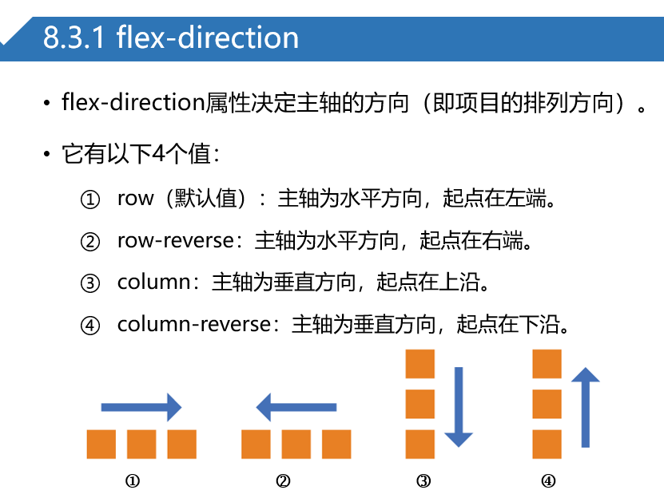

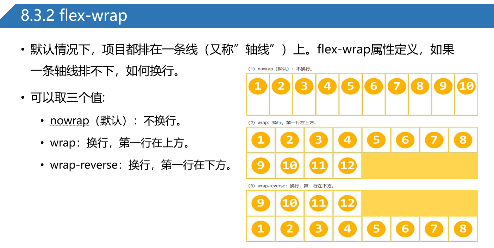

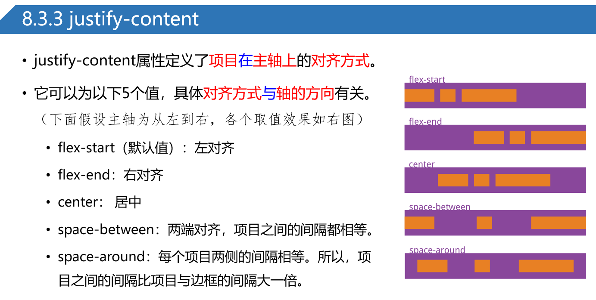

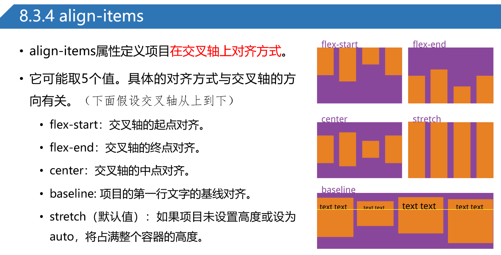

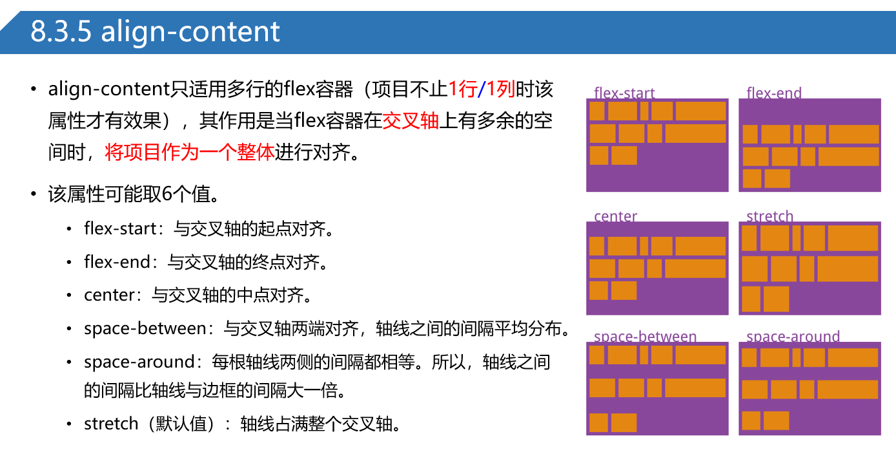

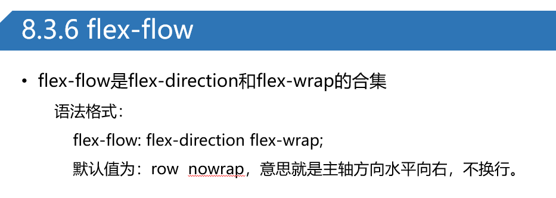

### 项目的属性：

* flex-grow    用于设置项目的放大系数

* flex-shrink   用于设置项目的缩小系数

* flex-basis    用于设置项目在主轴上的空间

* flex         是前面3个属性的简写 

* order       定义项目的排列顺序

* align-self    属性规定弹性容器内所选项目的对齐方式

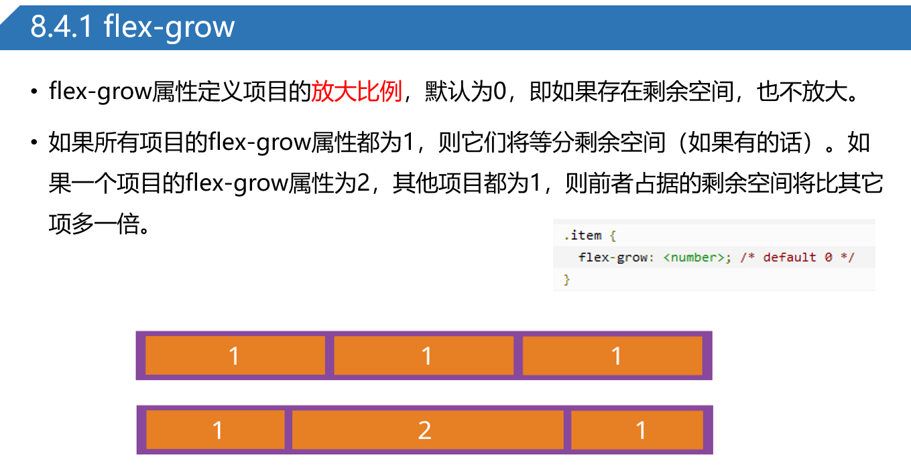

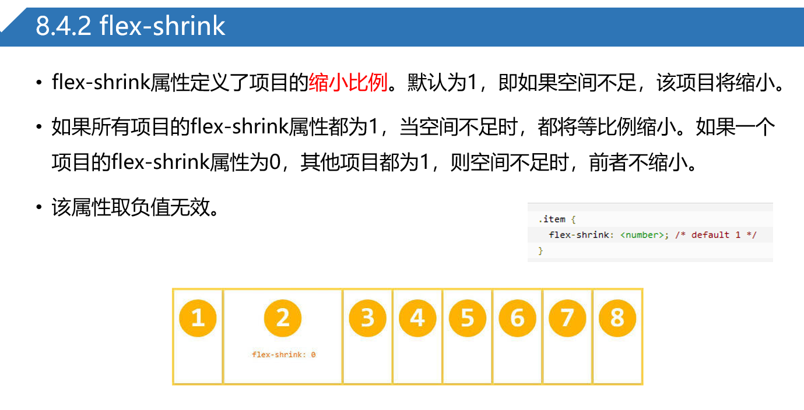

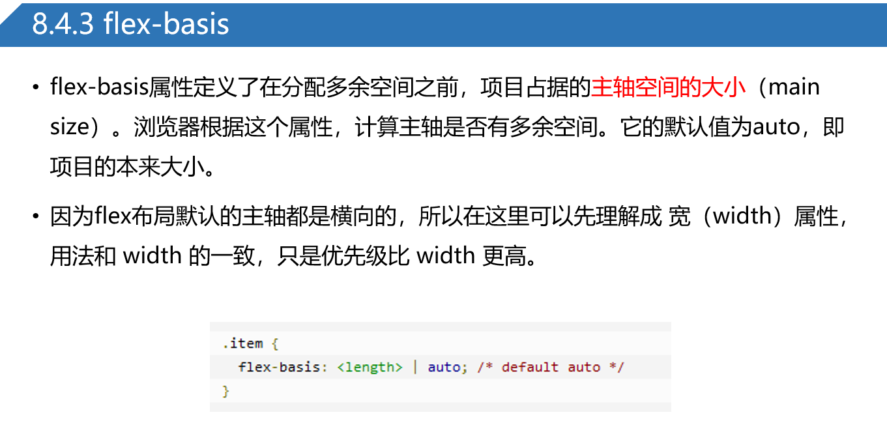

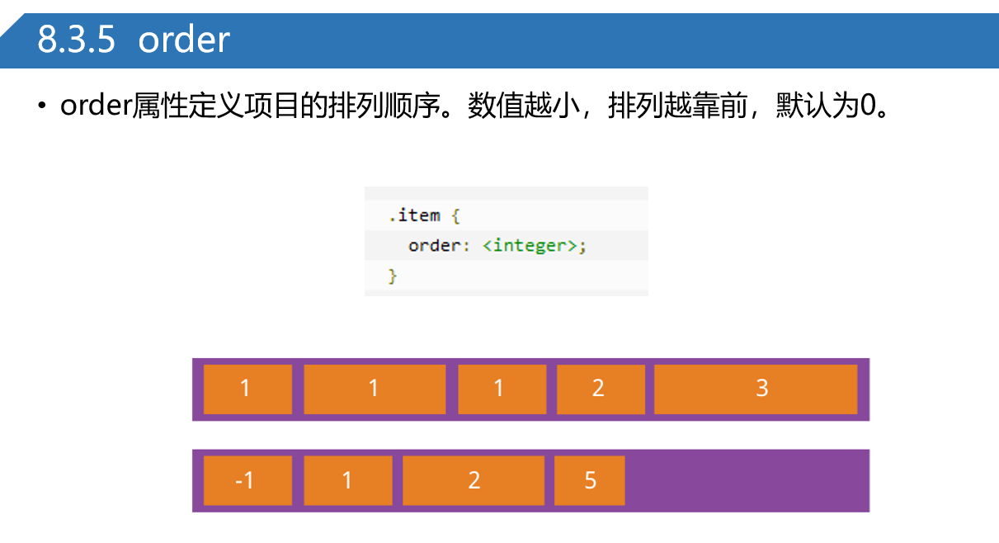

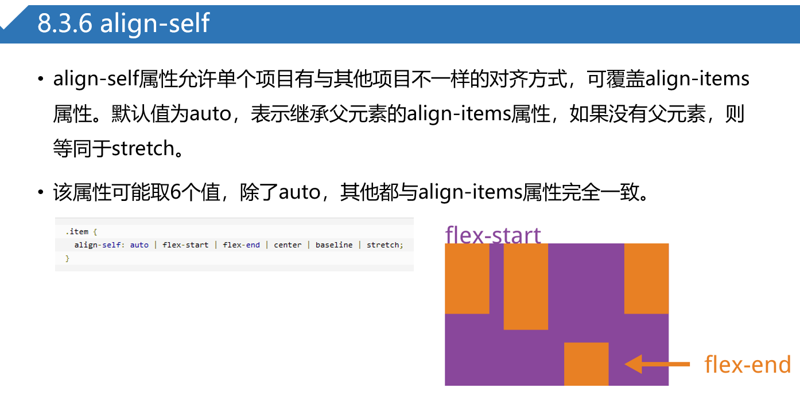

### 面试被问：

1. 主轴上项目倒着排：`flex-direction: row-reverse;`

## 移动端自适应布局方案

[比较几种移动端自适应布局方案 - 掘金 (juejin.cn)](https://juejin.cn/post/7002232528434102279)

移动端适配定义：移动端适配就是为了**让页面可以在不同的屏幕尺寸下兼容运行**，使内容大小这些能够动态的改变

对于移动端适配的理解：给一个元素的宽高以`rem`、`vw vh`、`rpx`为单位，本质上都一样，都是定义这个元素的大小占屏幕的几分之几，比如对于`vw vh`，`1vw === 屏幕宽度的百分之一`；对于`rpx`，`1rpx === 屏幕宽度的1/750`；对于`rem`，比如我们拿到了一个750px宽的设计稿，我们把屏幕等分15份，每份就是50px（这个分的方案完全是由我们自己掌握的），我们把html元素的`font-size`设置为50px，这样`1rem === 屏幕宽度的1/15`

### 微信小程序

微信小程序中的移动端适配方案为`rpx`。`rpx`是微信小程序独有的尺寸单位，规定屏幕宽为750rpx。

# 计算机网络

## OSI七层网络结构

### 对各层职责的基本了解

OSI（Open System Interconnection开放式系统互联参考模型）把**网络协议从逻辑上分为7层**。

对于互联网数据传送的分层模型，有分成七层的，有分成5层的，还有分成4层的。例如分成七层模型的如下(从上到下)：

- 应用层
- 表示层
- 会话层
- 传输层
- 网络层
- 数据链路层
- 物理层

七层中，**越往下越靠近计算机底层，越往上越靠近用户**。

五层模型中，把应用层、表示层、会话层看成是一层。从上到下各层的基本作用为：

* 应用层（http）
* 传输层（tcp、udp）
* 网络层（IP协议，划分ip地址...）
* 数据链路层：工作在物理层之上，传输给下层物理层时负责给物理层的这些0，1制定传送的规则，传输给上层网络层时按照相应的规则来进行解读0，1电信号。
* 物理层：光纤、电缆等把物理设备连接起来，传输0，1这样的电信号

## IPv4和子网掩码

### ip地址：

`192.168.0.1`其实是由四组八位二进制组成的，每一组用`.`分隔，为十进制的0-255中的一个数。

ip地址由两部分组成：网络号和主机号，如下图有几类ip地址的划分，比如A类地址，网络数128也就是说只有四组数只有第一组为网络号，其余三组代表主机号。


上面这种划分，要么网络数很多，主机数很少，要么主机数很多，网络数很少，反正问题就是不能灵活的划分网络与主机，比如一个网络里我只需要四个主机号，那么我只需要最右边的两位二进制作为主机号，其余都是网络号就行了，所以引入子网掩码来解决网络划分的问题。

### 子网掩码

子网掩码就是用来标识一个ip地址的网络号和主机号如何划分的。一个子网掩码就唯一对应了一个网络（网络下有若干个主机）

代表网络号的二进制位用`1`替换，代表主机号的二进制位用`0`替换，对于上面的例子，一个网络里只有四个主机号，那么对应的子网掩码就是

`11111111.11111111.11111111.11111100`

也就是`255.255.255.252`

比如`192.168.0.0`、`192.168.0.1`、`192.168.0.2`、`192.168.0.3`这四个ip地址（二进制表示只有最后两位不同）如果子网掩码是`255.255.255.252`的话，就表明，这四个ip属于同一个网络，且这个网络里只有这四个主机。

### IPv4地址的CIDR表示法：

对于子网掩码`11111111.11111111.11111111.11111100`有30位1，所以我们把`192.168.0.0`、`192.168.0.1`、`192.168.0.2`、`192.168.0.3`这四个ip组成的网络的划分记为`192.168.0.0/30`，也就是网络中的第一个主机号ip地址加上`/30`。

例题：

IP：`192.168.50.10`，子网掩码：`255.255.192.0`，解析其网络号与主机号


从子网掩码中得知，这个IP的前18位都是网络号，50.10正好处于后14位，直接可以得知主机号就是`50.10`，所以网络号就是`192.168`(但这样似乎不是很精确)，CIDR的写法就是`192.168.0.0/18`

## IPv6

为了进行地址扩充而生

## TCP三次握手和四次挥手

三次握手是建立连接的过程

首先客户端向服务端发送一包连接请求数据（SYN包），服务端如果同意，会回复SYN+ACK包，客户端收到后回复一包ACK包——连接建立，这个过程三次发包，故称之为三次握手。

为什么不在服务端回复SYN+ACK之后就建立连接（两次握手）？

如果两次握手就建立连接的话，客户端发送的某个SYN包在网络节点中滞留，网络恢复之后又重新到达服务端，就会再建立一个连接。客户端可以发送很多SYN包，目的只是建立一个连接请求，说白了，客户端的连接请求最终需要客户端来确认，而不能交由服务端确认。所以三次握手本质上来说就是解决网络信道不可靠的问题，为了在不可靠的信道上建立起可靠的连接。

如果两次握手就建立连接，也就是服务端每收到一个SYN服务端就进入连接状态，不管客户端是否接收到SYN+ACK，客户端可能收不到SYN+ACK包，这就会造成服务端的连接数量大于客户端的连接数量，状态不匹配。


三次握手之后，客户端和服务端进入数据传输状态。

一包数据可能被拆成多包发送，需要解决丢包问题和包的乱序问题？

TCP协议为每一个连接（无论客户端还是服务端，TCP全双工互传）建立一个发送缓冲区，为要发送的数据（字节）进行编号。发送数据时，从发送缓冲区取一部分数据组成发送报文，TCP协议的头部会附带序列号（字节编号起始号）和长度。接收端接收到数据后发送ACK包，ACK=接收序列号+长度，也就是下一包数据的起始序列号。这样发送端就可以切割发送，接收端只需要根据序列号和长度对接收到的数据进行重组获得原始数据即可。对于丢包，接收端可以要求发送端重传，丢失了100-199字节的相关数据，接收端向发送端发送ACK=100的报文即可。


两端均可以发起关闭连接请求，此时需要四次挥手进行连接关闭。

假设客户端主动发起连接关闭请求，需要发给服务端一个FIN包，自己进入终止等待1状态，这是第一次挥手。服务端收到FIN包回复一个ACK包，自己进入关闭等待状态，客户端进入终止等待2状态，这是第二次挥手。此时服务端仍然可以发送数据，客户端可以接收数据，服务端把未发送的数据都发送完毕之后，再发送一个FIN包，进入最后确认状态，这是第三次挥手。客户端收到后发送ACK包，进入超时等待状态，经过超时时间后关闭连接，服务端收到ACK包后立即关闭连接，这是第四次挥手。

为什么客户端需要进行超时等待？为了保证对方收到了ACK包，如果ACK包丢失，服务端没有收到ACK包，就会重新发送FIN包，客户端就会相应这个FIN包重发ACK包。这个机制也是为了在不可靠的网络连接中，进行可靠的连接断开确认。

四次挥手其实就是两组FIN—ACK的交流。第一组FIN—ACK是首先完成传输(想断开连接)的那一方先发送的FIN，意思就是我已经传输完毕了，你也快点传，传完就可以断开连接了，那一方接收到就回复一个ACK。然后就传送自己的没有传输完成的数据，传完就发送FIN，也就是第二组FIN—ACK的开始。这一组FIN—ACK标志着信息传输彻底完毕，可以断开连接，所以最后发送ACK包的那一方需要进入超时等待状态，确保这个ACK包务必被对方收到。


## http（应用层协议）状态码

首先知道怎么分类，Yeah！1，2，3，4，5个类

状态码们很有规律，三个数字加上一段字

（1xx）接收的请求处理中，表示请求还在进行中

1开头虽然很少用，在请求中依旧挺好用

服务器给了我个2，并不代表它肚子饿

2开头表示成功，让我想起了郑成功

请求方法有很多种，我不管你用哪一种，

（200 OK）只要请求没问题，200直接送给您

听说你要创建用户，服务器我们要怎么表示

（201 Created 已创建）201我们走起来，Post and put 我欢迎你来

（204 No Content）我没东西返回给你，不是我对你不睬不理

那你叫我怎么办，204给你看着办

（3xx重定向）资源现在不在了，被移去其它地方了

服务器说不用担心，数字3让你很安心

（301 Move Permanently 永久移动）旧的地址不好使，我给你一个新地址

301让你重定向，这是咱们资源新方向

（302 Found 临时移动，下次还得用旧地址）今天资源在这里，嘿！明天资源又转移

临时地址给出来，302跟着一起来

（304 Not Modified 未修改——没过期，直接用缓存吧）看到有条件请求，检查缓存时间轴

304不用再下载，服务器资源没修改

（4xx客户端错误）谁说客户不会错，又不是花田里的错

数字4我给出来，是你的错请你站出来

（400 Bad Request 语法错误，无法理解）这是什么鬼请求，用法错误就这理由

处理不了处理不了，400甩给你得了

（401 Unauthorized 身份认证失败）数据库查无此人，别怪我对你很不仁

请你认清你自己，401对你敬个礼

（403 Forbidden 拒绝）虽然知道你是谁，但没权限我管你谁

403禁止你通行，没有权限你真不行

（404 Not Found 找不到）地址是不是写错了，反正资源已经不在了

反正我就是没找到，404大家都知道

（409 Conflict 冲突）赔礼道歉对不起，因为请求我没法处理

409冲突问题，新老版本记得对其

客户端最没脾气，看到服务端发脾气

（5xx 服务器错误）数字5背后真无奈，到处找bug加班常在

（500 Internal Server Error 内部错误）可能代码出错误，可能数据库出错误

考虑不周未知错误，先给500随便应付

（502 Bad Gateway 网关错误）代理网关夹心饼，相应还得往上领


502不是什么胶水，而是我上游正在水

（503 Service Unavailavle 超载或者维护）503我宕机了，反正你是访问不了

我想行你已经学会了，反正我已经断气了

## 浏览器接收到url到展示页面经历了哪些过程

1. 浏览器中输入url
2. DNS域名解析，获取域名相对应的IP地址
3. 浏览器向服务器发起TCP连接（三次握手）
4. 浏览器向服务器发送HTTP请求
5. 服务器处理收到的请求并将处理结果响应至浏览器（http状态码）
6. 关闭TCP连接（四次挥手）
7. 浏览器解析渲染页面（解析HTML、CSS、JS文件并渲染）

## http协议

应用层（用户直接接触的层，比如在浏览器输入url时就需要用到http）协议。

### http工作模式

`http1.0`：单工（单工： 数据传输只允许在一个方向上的传输，只能一方来发送数据，另一方来接收数据并发送）。因为是短连接，客户端发起请求之后，服务端处理完请求并收到客户端的响应后即断开连接。

`http1.1`：半双工（半双工：数据传输允许两个方向上的传输，但是同一时间内，只可以有一方发送或接受消息）。默认开启长连接`keep-alive`，开启一个连接可发送多个请求。协商缓存的etag和强制缓存的cache-control好像就是1.1之后有的

`http2.0`：全双工（全双工：同时可进行双向传输。），允许服务端主动向客户端发送数据。

### http长链接和短链接

短链接主要是`http1.0`，每次http请求都需要重新三次握手建立TCP连接，请求完之后就四次挥手。长链接就是建立TCP连接之后可以一直进行http请求，直到长时间未请求，或者请求次数上限或者某一方主动断开TCP连接。长链接减少了重复的TCP连接建立于断开的操作（多次http请求只需要一次三次握手和四次挥手）

### websocket和http长连接的区别

http长连接解决的问题是**频繁建立与断开TCP连接的问题**，每次http请求仍然是一问一答的模式（一请求然后跟着一响应），而websocket就是完全建立了客户端与服务端之间的全双工通道，我只需要朝对方发送数据即可，无需对方响应。

## http是什么

超文本传输协议（Hyper Text Transfer Protocol，HTTP）是一个简单的请求-响应协议，它通常运行在TCP（传输层的传输控制协议TCP，Transmission Control Protocol）之上。

## http缓存

### 应用场景：

我们我们浏览器输入一个url，也就是第一次请求一个网站时，肯定需要加载所有的相关资源（html、css、js、img...），我们利用http缓存策略缓存一些资源文件，提升访问速度。

提升访问速度的原理：

我们输入网站地址到加载出页面，时间消耗主要用于CPU计算、浏览器页面渲染和网络请求。CPU计算和浏览器的渲染其实都是非常快的，而网络请求受网络状况的影响其实耗时极其巨大。所以我们**使用http缓存策略的核心就是在于减少网络请求的体积（协商缓存）和数量（强制缓存）。**

### http强制缓存

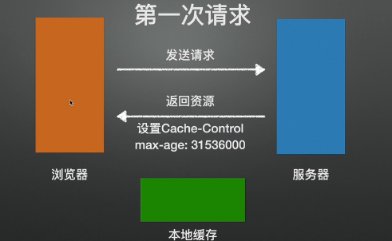

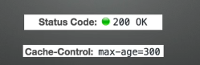

我们第一次访问一个网站的时候，服务器会返回相关资源，如果服务器认为这个资源是有必要进行缓存的（比如css文件、html文件、js、图片文件...），服务器就会在响应头（response-headers）里面添加一个`Cache-Control`字段，`max-age`（单位：s）属性决定了缓存有效时限，这样我们浏览器就会在本地缓存中存下来对应资源的文件。

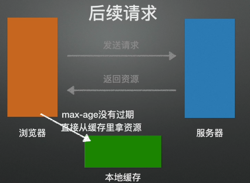


后续我们再去请求相同的网站的时候，浏览器就回去检查`max-age`是否过期，如果没过期就不会向服务器发请求去获取资源了，而是直接在缓存中拿资源，从而减少了http请求的数量。如果缓存的资源已经过期，那么就重新发送http请求。

如果服务器希望浏览器每次使用缓存前与服务器进行确认而不是直接使用缓存，那么服务器就设置响应头的`Cache-Control`字段为`no-cache`（`Cache-Control:no-cache`）这里容易被`no-cache`的字面意思误导。

其它取值：

`Cache-Control:no-store`：让浏览器不使用缓存策略，每次都请求资源。

`Cache-Control:private`：只给这个浏览器缓存，不让其他任何浏览器或者代理服务器进行缓存

`Cache-Control:public`：浏览器和代理服务器都可以对资源进行缓存

cache-control是http1.1的头字段，expires（过期时间）是http1.0的头字段,如果expires和cache-control同时存在，cache-control会覆盖expires（服务器会优先处理cache-control）

### http协商缓存

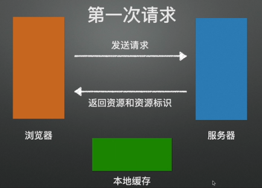

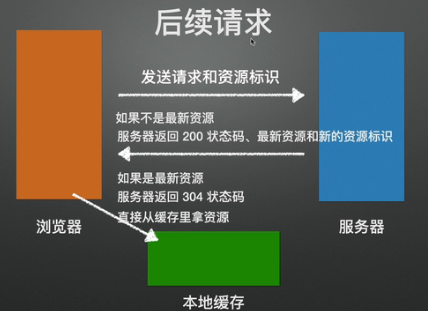

首次请求服务器除了返回资源还会返回**资源标识**，这个资源标识是供后续请求时服务器判断资源是否更新的标识。我们浏览器后续对同一服务器的请求携带资源标识，服务器根据资源标识判断浏览器里缓存的资源的版本与服务器的资源版本是否一致，如果一致服务器就返回`304`状态码，也就是让浏览器从缓存中拿取资源即可，减小了请求的体积；如果不一致，服务器就直接返回`200`状态码和最新的资源和资源标识。

#### http协商缓存的两种资源标识

* `Last-Modified`：资源上一次的修改时间

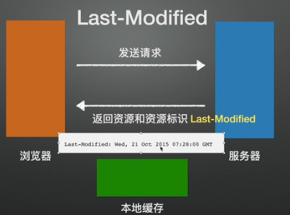

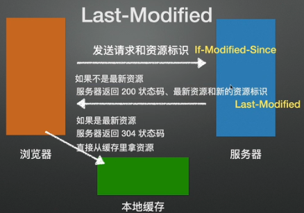

服务器返回的`Last-Modified`标识（响应头）是精确到秒的具体时间，后续浏览器再请求时，（请求头）携带`If-Modified-Since`字段携带资源标识

* `ETag`：资源对应的唯一字符串

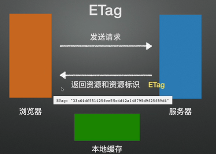

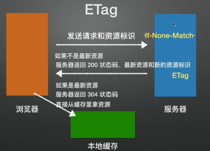

浏览器后续的请求中请求头携带的字段叫`If-None-Match`

#### Last-Modified与ETag的对比

从性能方面**优先使用Etag**

1. Last-Modified的值只精确到秒，不够精确。（一般的前端js的执行是以毫秒为单位的）
2. 文件如果每隔一段时间都重复生成，但内容相同，Last-Modified标识就无法判断，服务器会发送完全相同的资源文件，Etag用字符串标识文件，可以判断文件的内容是否相同，会返回304让浏览器使用缓存。

两者物理上的区别（后端对两者的区分）：

* 第一次响应时响应头携带了`cache-control`字段（或者`expires`），就是想使用强制缓存策略，目的是命中强缓存时完全不请求
* 第一次响应时响应头携带了资源标识字段（`Etag`或者`Last-Modified`），就是想使用协商缓存策略，目的是命中协商缓存时减小请求的体积。

### 拓展：web缓存的种类

Web缓存种类

数据库缓存，CDN缓存，代理服务器缓存，浏览器缓存。

1. 数据库缓存：当web应用关系复杂，数据表越来越多时，可以将查询后的数据放到内存中进行缓存，下次再查询时，就直接从缓存中读取，从而提高响应速度。

2. CDN缓存：当我们发送一个web请求的时候，cdn会帮我们计算去哪得到这些内容的最快，所以可以将大家经常访问的内容放到cdn，加快响应速度。

3. 代理服务器缓存：和浏览器缓存性质相似，但是代理服务器缓存面向的群体更广，规模更大。一般为大量用户服务，同一个副本会被应用多次，所以在减少响应时间和带宽上很有效果

4. 浏览器缓存：每个浏览器都实现了http缓存，我们通过浏览器使用http协议与服务端进行交互的时候，浏览器会根据一套与服务器约定的规则进行缓存工作，当我们在浏览器中点击前进和后退按钮，利用的就是浏览器的缓存机制。

**我们上面所说的http缓存就是针对的就是web缓存中的浏览器缓存，浏览器缓存的表现就是指在本地使用的计算机中开辟一个内存区，同时也开辟一个硬盘区作为数据传输的缓冲区，然后用这个缓冲区来暂时保存用户以前访问过的信息，说白了就是把一些文件存放到电脑的某个文件夹下。**

## https

因为http的报文是明文传输的，不安全，https就是在传输层TCP协议与应用层协议之间增加了一个由SSL/TSL协议构成的安全层，HTTPS=HTTP + SSL/TLS

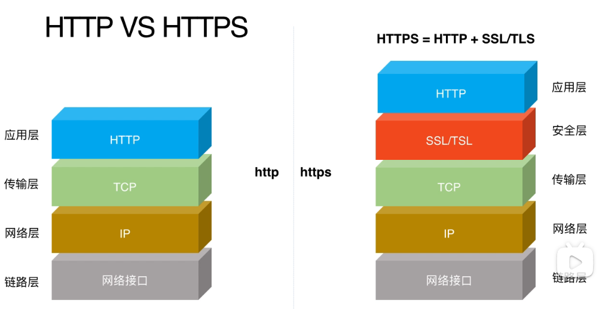

### https的相关原理——对称加密与非对称加密

* 对称加密就是以一定的规则对数据进行加密，然后对加密后的数据按照加密规则进行反向操作就可以解密，也就是说加密与解密是建立在一个加密规则的基础之上的。

* 非对称加密中有两个概念：公钥与私钥，用公钥加密的内容需要私钥进行解密，用私钥加密的内容需要公钥进行解密。速度慢，但是相对于对称加密安全。

### HTTPS基本逻辑

https是对称加密与非对称加密综合应用的场景，用户先准备一个对称加密的密钥，然后用服务端网站准备的公钥对这个对称加密的密钥进行加密，把这个加密后的对称加密密钥发给服务端网站，服务端网站用自己的私钥进行解密得到用户准备的对称加密的密钥。后面的通讯都是通过这个对称加密的密钥进行加密。这个密钥生效至服务端与客户端连接断开。下一次连接时客户端又会准备一个新的对称加密的密钥。

所以https的处理场景中，每次连接只做一次非对称加密，主要数据的加密还是对称加密。

### CA证书

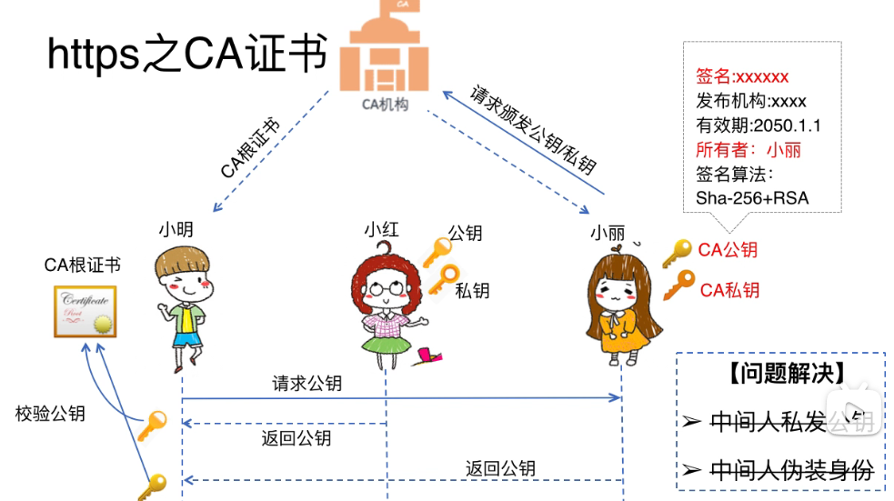

上图中，小明相当于客户端，小丽相当于服务端网站，小红就相当于通信两者之间的第三者（如黑客，发送一个假的公钥给小明，然后用对应的私钥解密出小明的信息）。小明（客户端）与小丽（服务端网站）进行https通信，需要先请求小丽的公钥，为了确保这个公钥的真实性，小丽就去第三方的权威机构（CA机构，Certificate Authority证书授权机构）进行注册，让自己的公钥成为CA公钥，而小明（客户端）那里，可以通过CA根证书对接收到的公钥进行验证，验证一个公钥究竟是不是小丽的公钥，CA根证书一般是写在我们操作系统底层的东西，是可以完全信任的东西。

## TCP与UDP比较

* 都是传输层的通信协议

区别：

* udp是无连接的，发送数据前不需要建立连接；tcp是面向连接的，需要建立连接之后传输数据
* udp是不可靠传输，tcp是可靠传输（tcp有例如阻塞控制等多种机制保证数据的无差错传递，而udp没有这些机制）。*具体机制挖坑待填*
* udp是面向报文传输；tcp将数据看成一串无结构的字节流，是面向字节流传输的
  * **UDP是面向报文的：**作为数据传输的发送方时（从应用层发送数据），UDP对应用层交下来的报文，不合并，不拆分，只是在其上面加上首部后就交给了下面的网络层，也就是说无论应用层交给UDP多长的报文，它统统发送，一次发送一个；作为数据的接收方（应用层接收网络层的数据），接到后直接去除首部，交给上面的应用层就完成任务了。因此，它需要应用层控制报文的大小
  * **TCP是面向字节流的：**它把上面应用层交下来的数据看成无结构的字节流来发送，可以想象成流水形式的，发送方TCP会将数据放入“蓄水池”（缓存区），等到可以发送的时候就发送，不能发送就等着，TCP会根据当前网络的拥塞状态来确定每个报文段的大小。
* udp支持1对1，1对多，多对多的通信；而tcp是1对1的两点通信

应用场景：

tcp是可靠的传输协议，但是效率低，udp相反。tcp适用于对数据的完整性和准确性要求较高的场景，重要文件传输，邮件发送，以及目前的互联网资源访问，都是建立在tcp连接之上的。udp使用场景就是对速度要求较高，对数据的完整性和准确性要求较低的场景，比如网络电话，视频会议，直播等实时通信


# 操作系统

[操作系统b站视频课](https://www.bilibili.com/video/BV1EB4y1a7GQ?p=20&vd_source=d1e85ba84171f8c64e1da8ec118523f6)

## 进程/线程管理

### 进程的基本概念

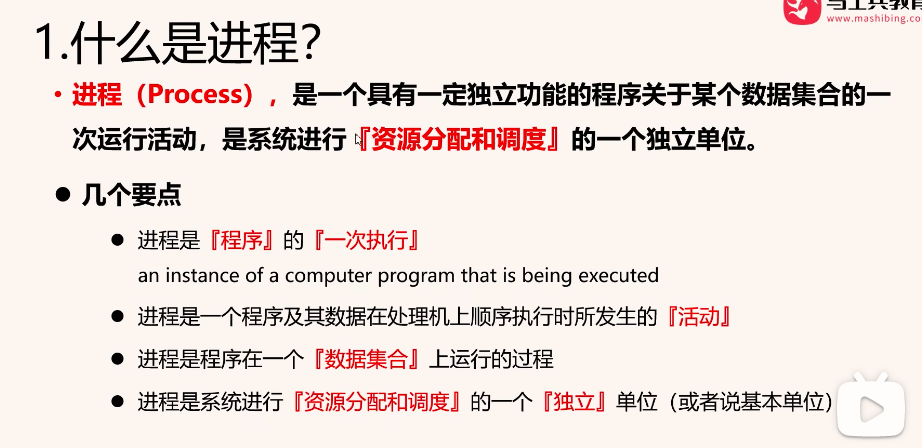

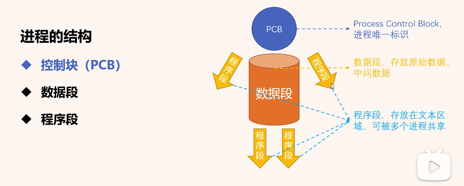

（同一个应用程序的多个进程之间共享程序段，意思就是同一个应用程序可以同时运行很多个，每个都对应了不同的PCB，但这个应用程序的所有进程都共享程序段）

### 线程的概念

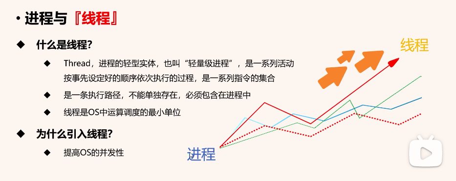

（以360电脑管家为例，打开运行之后就是一个进程，然后软件里面又有木马查杀、垃圾清理等多个功能选项，这些功能可以同时运行，每个功能的运行就是一个线程）

（进程是资源分配的基本单位，比如分配内存，io设备等；线程是资源调度的基本单位）

（为什么要引入线程：如果不引入线程，进程同时作为资源分配和资源调度的基本单位，那么每进行一个新任务都重新分配一个进程，那么就需要重新进行分配资源，划分内存，进行调度等进程创建的操作，成本是非常高的；在进程内部划分了很多的线程，以线程为单位去进行调度，多个线程之间去进行并发，很多线程都属于一个进程，所以所有线程都可以使用这个进程的资源。也就是说在支持操作系统并发的基础上减少了进程创建的开销，变相的增加了操作系统的并发性）

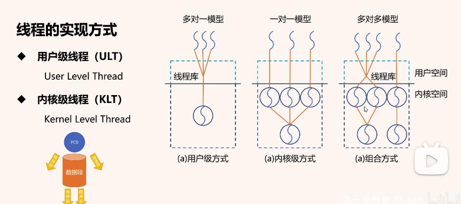

（内核级线程与用户级线程的区别就是线程控制块（类比于PCB）是存放在内核空间还是用户空间，对于用户级线程，对应内核里一个线程控制块，其实管理的是用户空间里的一个进程，然后进程再分线程，分的线程对于内核空间的线程来说是不可见的，换句话说内核空间的线程只看得见它管理的进程；对于内核级线程，就是内核空间里的一个线程控制块对应一个内核空间里的线程，但是线程本身的运行也是在用户空间里的）

### 进程的三种基本状态

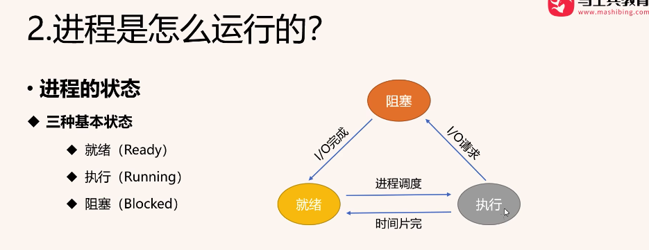

（就绪状态就是进程可运行但未运行，进程调度就是进程获得到cpu然后进入到执行状态）

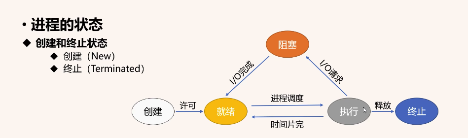


### 进程控制

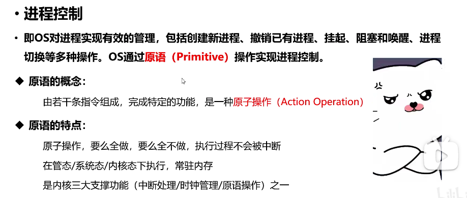

（原语就是对若干指令的封装，这一堆指令的集合就可以完成某个特定的功能，可以看成一个小函数）

### 进程控制的原语

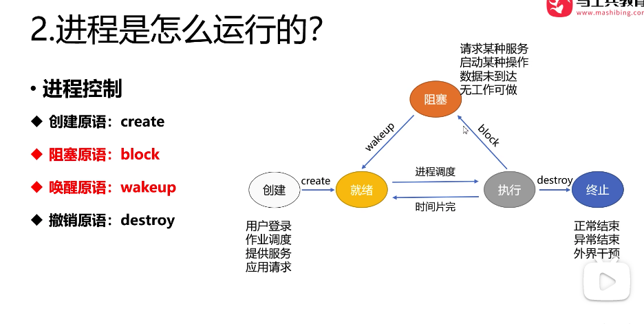

### 挂起与激活

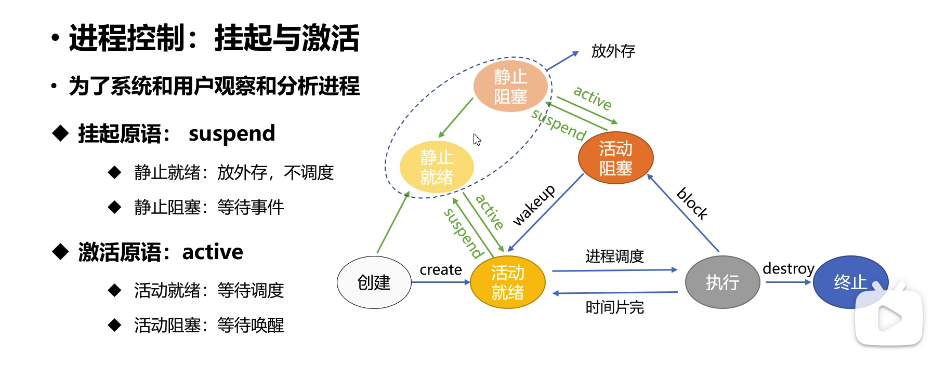

（挂起就是把内存中的进程拿到外存中不再运行，对应的激活就是将外存中的进程重新加载到内存中，挂起与激活是一种操作，对应的进程的状态是静止，精致就绪和静止阻塞）


### 进程调度的层次

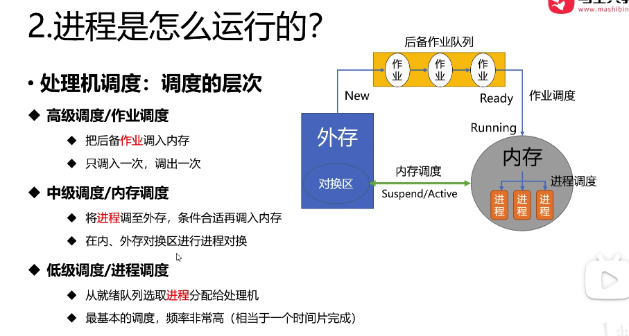

（所谓作业调度就是把外存，比如磁盘上的程序拿到内存中并创建进程的操作；内存调度就是内存中的某些进程要进行一些耗时操作，比如读取io等，就会把进程挂起，也就是拿到外存；进程调度就是给就绪队列中的进程分配处理机）

### 处理机调度过程

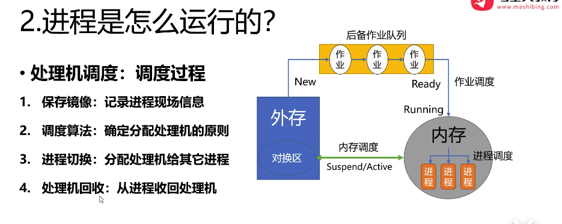

### 调度算法指标

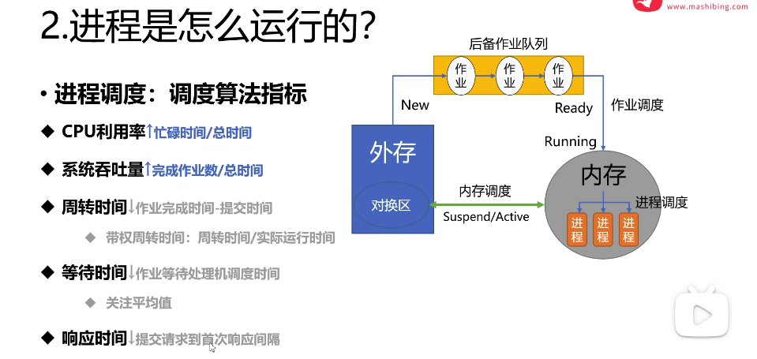

（说白了，调度算法就是为了充分利用cpu，让它一直干活，比如第一个指标cpu利用率，或者系统吞吐量，也就是单位时间内完成的作业数量，当然不同作业之间的耗时也不一样，所以这个指标也不是很精确）

### 进程调度算法

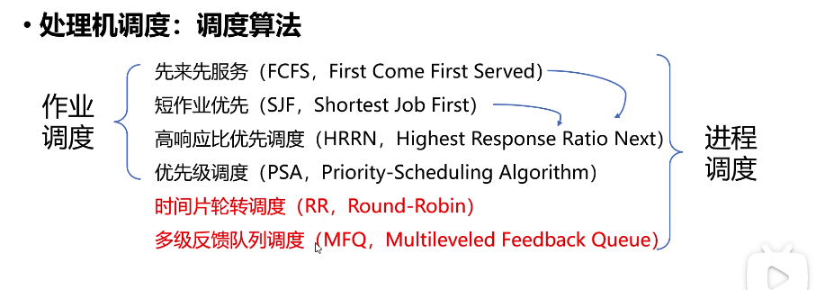

（作业调度就是进程在外存与内存之间的调度，也就是所谓的高级调度；时间片轮转调度就是给进程分配cpu的调度算法，也就是所谓的低级调度）

### 调度算法：先来先服务

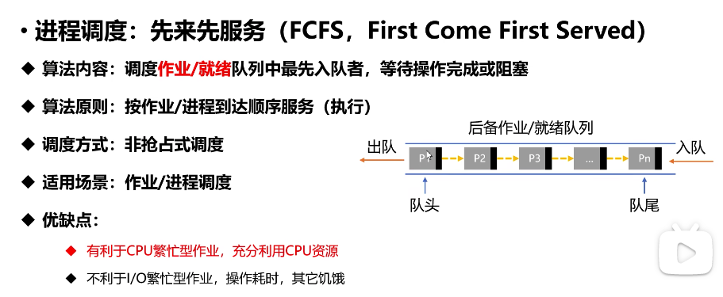

（对于作业队列中的进程，调入内存；对于就绪队列中的进程分配cpu，所以说先来先服务不是针对高级调度或者低级调度的，而是一种调度的策略与方法）

### 调度算法：时间片轮转调度

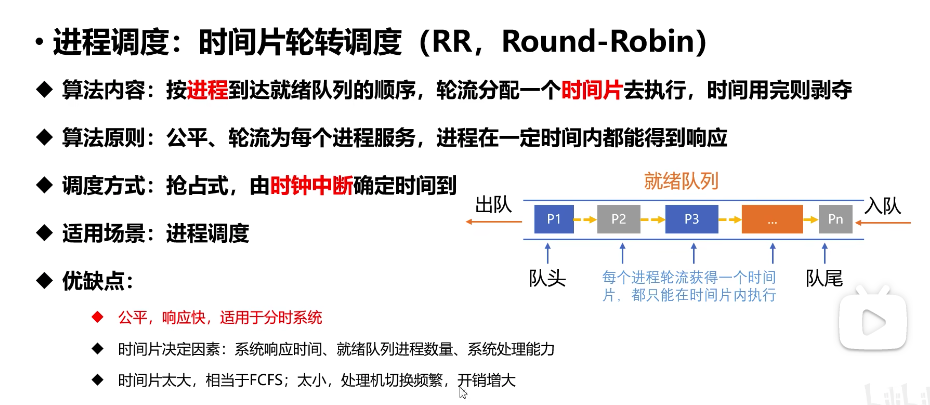

（这是针对就绪队列里的进程的，也就是低级调度算法（进程调度），对于就绪队列中的进程，挨个分配一定的时间片去执行）

### 进程通信

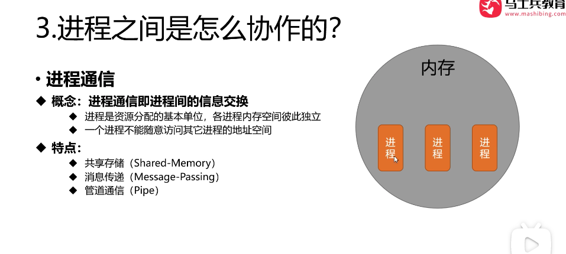

### 进程通信：共享存储

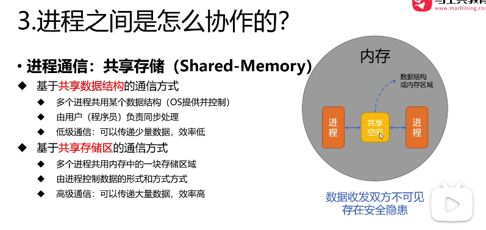

（共享数据结构就是申请一个数组或者说队列啥的一个数据结构，然后不同进程进行共享；所谓共享存储区就是申请一个内存，然后在进程创建时得到这个内存的操作权限，然后其他进程也获取这个内存的操作权限。本质上都是共享存储）

### 进程通信：管道通信

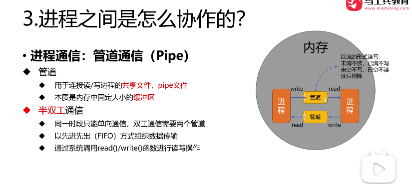

（所谓管道只是一个比喻，说白了就是一个文件，或者说一个数据缓冲区；管道通信与共享存储既然都是利用一个中间区域，区别是什么呢，管道通信就是针对两个进程之间的，但是共享存储就不知道有多少个进程使用这个存储区域，所以管道通信更安全，并且管道通信数据传输率大，效率高）

### 进程同步与互斥

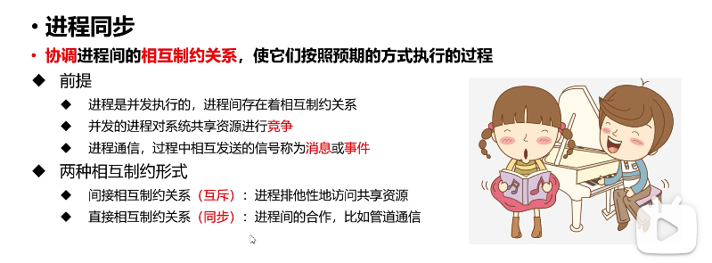

（一般我们所说的进程同步就是指进程同步与互斥的统一说法，其实是包含了同步与互斥两个概念的）

（进程的同步就是指多个进程的执行存在某种先后顺序，即某些进程的执行必须先于另一些进程，就比如进程之间的管道通信，只有写进程把缓冲区数据写满时，读进程才从阻塞状态转为就绪状态，也就是读进程需要等待写进程；进程互斥就是多个进程不允许同时使用同一资源(临界资源)）

### 实现临界区互斥

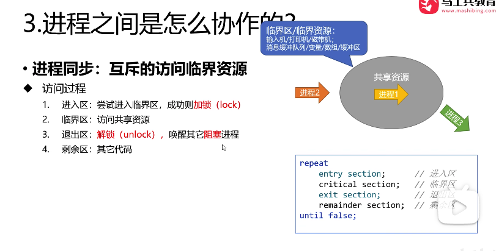

（互斥的访问临界资源(同一时刻只能被一个进程访问)，就是一个进程访问临界资源的时候，对临界资源进行加锁，不让其他进程进行访问，然后访问完了之后唤醒阻塞队列中的其他想访问临界资源的进程进行访问）

### 进行到P44（未看）

### 信号量的概念

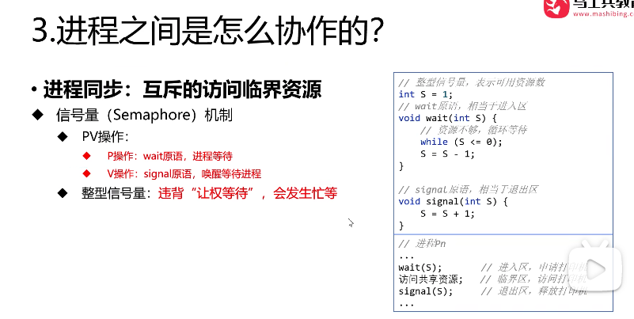

（所谓信号量，代表的是可用资源的数量，信号量就是实现进程同步与互斥的比较高级的一种方式，如果想实现进程访问资源的互斥，就把信号量设置为1）

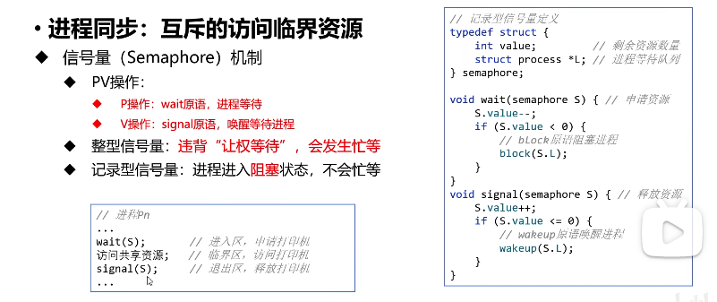

（这是使用记录型信号量对上面的整形信号量进行优化）


# ES6

## 拓展运算符`...`

作用就是把一个非嵌套的（只有一层）数组或者对象的`[]`或者`{}`“脱掉”。

常用场景：

* 脱皮——数组、对象合并 && 函数传参

~~~js
var margeArr = [...arr1, ...arr2];
var margeObj = {...obj1, ...obj2};

var args = [1, 2, 3];
func(...args)
~~~

* 作为函数形参（函数调用时传入的是参数列表，函数体内部逻辑中拿到的是args数组）

~~~js
function func(...args) {
    /*
    	使用args数组
    */
}
~~~

## Symbol——es6的第七种数据类型

### 获取Symbol类型的值：

`let sym = Symbol( 相关描述 )`

`typeof sym === symbol`（使用typeof检查说明为原始数据类型）

### 使用场景

~~~js
/*
	symbol做对象的属性名
*/
const level = Symbol("level")
const student = {
    name: "小明",
    age: 12,
    [level]: "优秀" //对象内的键名通过变量来访问
}

/*
	Symbol类型的属性不能被 for in 获取
*/
for(let pro in student) {
    console.log(pro); //name age
}

/*
	如何获取对象身上的Symbol为键的属性
*/
console.log(student[level]) // 优秀 ,symbol变量在对象外有定义的情况下通过[]访问
~~~

继续学习，但不续上例

~~~js
Symbol("level") !== Symbol("level") //两个symbol描述相同但不冲突（不是同一个） 所以可以给对象田间多个相同描述的symbol属性：
const student = {
    name: "小明",
    age: 12,
    [Symbol("level")]: "优秀",
    [Symbol("level")]: "有钱",
}

/*
	以下三种方法无法拿到对象的symbol属性值：
		1. Object.keys(student)-[name, age]
		2. Object.getOwnPropertyNames(student)-[name, age]
		3. for in - name age
*/

/*
	拿到一个对象身上的Symbol属性：
		Object.getOwnPropertySymbols(student) - [Symbol(level), Symbol(level)]
*/
let symList = Object.getOwnPropertySymbols(student);
for(let pro of symList) {
    console.log(student[pro]) // 优秀 有钱
}
~~~

### Symbol.iterator

Symbol.iterator是js的内置的一个Symbol类型的对象，一个变量有没有这个Symbol.iterator属性决定了这个变量可不可以使用`for of`进行遍历。

数组有Symbol.iterator，对象没有Symbol.iterator

~~~js
const list = [1,2,3,4,5];
console.log(student[Symbol.iterator]); // undefined 不可以使用for of 遍历
console.log(list[Symbol.iterator]); // ... 可以使用for of遍历
~~~

## Generator函数

Generator 函数是ES6引入的，主要用于异步编程

从语法上来说，定义Generator函数时，function关键字与函数名之间有一个`*`：

~~~js
function* xxfn() {
    yield "a";
    yield "b";
    yield "c";
    return "d";
}
~~~

从逻辑上来说，Generator函数最大的特点就是可以交出函数的执行权（即暂停执行）：普通函数的函数体作为一个整体，要么不执行执行全部函数体代码，而Generator函数内部可以使用`yield`关键字，将函数体进行分割。

首先，我们定义的Generator函数相当于一个工厂函数，也就是说我们调用这个函数，才会获得一个”函数“（其实是一个遍历器对象），想让这个”函数“执行，我们就需要调用其`next`方法，例如基于上面的`xxfn`函数：

~~~js
//调用Generator函数xxfn获取一个"真实的可执行的函数"(遍历器对象)_xxfn
var _xxfn = xxfn();

console.log(_xxfn.next()); 
/*
	函数会执行到第一个yield的位置，value的值就相当于yield后面的值，done属性为布尔值，表示函数是否执行完毕
	{
		value: "a",
		done: false
	}
	以后再次执行_xxfn.next会从当前执行到的位置执行到下一个yield的位置
*/
~~~

**通过调用Generator函数生成的函数的执行进度互不干扰。**

### Generator函数对象的.next方法接收参数

* 传入的参数，其实就是替换掉函数体中上一个`yield `后面的参数。
* 第一个`.next()`方法其实是启动器，在它之前没有yield语句，所以给第一个`.next()`方法传参没有意义

例子：

~~~js
function* xxfn() {
    var _n = 1;
    var _v = yield _n + 22;
    console.log("aa---:" + _v);
    yield ++_n;
    yield ++_n;
}

var _xxfn = xxfn();

console.log(_xxfn.next()); //第一次next执行到yield _n + 22（给_v赋值之前） 输出{value: 23, done: false}

_xxfn.next("abc"); // 执行到倒数第二个yield ++_n，因为这里给next传参"abc"，所以语句var _v = yield _n + 22;把yield的值赋值给_v，"abc"覆盖了_n + 22. 所以console.log("aa---:" + _v)输出了"aa---:abc"

console.log(_xxfn.next()); //这次.next就执行到函数体的最后了，输出了{value: 3, done: false}，但没有遇到retuen，所以done值为false，函数体中的变量的值该是多少就是多少，_n经过两次++之后就是3了
~~~

上面这个例子就很精确的表现了Generator函数的作用，**可以通过next方法，去分阶段的注入数据，然后函数分阶段的给出不同的返回值。**

Generator函数的实例对象有`Symbol.iterator`属性，支持`for of`遍历

~~~js
function* xxfn() {
    yield "a";
    yield "b";
    yield "c";
    return "d"
}

var _xx = xxfn();

for(var i of _xx) {
    console.log(i); // a b c
}
// 也就是说for of 遍历Generator实例对象的时候其实是遍历的所有yield后面的值
~~~

## 	类与继承

### ES5实现类与继承

对于类的理解：一个对象访问某个属性或者方法，只要是对象`obj`本身没有，就去`obj.__proto__`（也就是构造方法的原型对象）上去找，`obj.__proto__`也是个对象，如果它身上也没有，就继续访问`obj.__proto__.__proto__`。**概括来说对象找属性就是按照对象本身接着`__proto__`的顺序去找。**

存在一层关系：`obj.__proto__ === Object.prototype`，设计这个关系就是为了在构造一个类之初，也就是对象实例还不存在，`__proto__`还不存在之时，设计对象关系用的。

上面两段，想表达一个意思：**`__proto__`是对象寻找某个属性时真正的索引线，去访问父类的属性；而构造函数的prototype属性，是在设计对象，设计类时用的，我们可以通过指定构造函数的prototype，也就等于指定了未来这个类的实例通过`__proto__`会访问到哪个对象。**

smartPhone继承Phone：

~~~js
function Phone(brand, price) {
    this.brand = brand;
    this.price = price;
}
Phone.prototype.call = function() { //添加类方法就在Phone.prototype上添加
    console.log("手机打电话")
}
Phone.Chinese_name = "手机"; //给手机类添加静态属性，只属于Phone类，而不属于Phone实例（因为Phone类的实例对象只能通过__proto__访问到Phone.prototype，而和Phone这个对象没有直接联系了）

function smartPhone(brand, price, color, size) {
    /*
    	smartPhone继承Phone，就执行Phone构造函数即可（完成添加父类属性）
    */
    Phone.call(this, brand, price); //new smartPhone时new运算符已经把smartPhone的this修改了，指向构造的那个空对象，所以在实例化smartPhone时this不会指向window（说白了因为不是直接调用smartPhone，而是通过new运算符）
    this.color = color; //添加本身特有属性
    this.size = size;
}

//让smartPhone.prototype等于父类的一个实例对象，new Phone不带参数，所以这个父类实例对象没有自身的属性，只是提供一个__proto__对象
smartPhone.prototype = new Phone;
smartPhone.prototype.constructor = smartPhone //可有可无，不影响功能
~~~

### ES6 class实现继承

~~~js
class Phone {
    static Chinese_name = "手机"; //属于类本身的静态属性或者方法，前面加一个static关键字
    constructor(brand, price) {
        this.brand = brand;
        this.price = price;
    }
    
    call() {
        console.log("手机打电话");
    }
}

class smartPhone extends Phone {
    constructor(brand, price, color, size) {
        super(brand, price);
        this.color = color;
        this.size = size;
    }
    call() {
        console.log("子类重写父类的call方法之后，没办法访问到父类的call方法")
    }
}
~~~

## ES6常用代码书写技巧合集

* 支持`let const`，避免了`var`声明的变量提升的问题
* 支持模块化，`export`＋想要导出的变量或者方法；`import {} from ...`进行导入
* 支持解构赋值

~~~js
//1. 从数组或者变量中取值
const arr = [1, 3, 5, 7];
let [a, , , d] = arr

const obj = {
    a: 1,
    b: 2,
    c: 3,
    d: 4
}
let {a: k, b, c, d} = obj; //可修改别名

//2. 交换两个变量的值
let a = 1;
let b = 3;
[a, b] = [b, a];
~~~

多次解构赋值 && 嵌套结构赋值

~~~js
let obj = {
  p: [
    'Hello',
    { y: 'World' }
  ]
};

/*
	这次解构赋值其实是两次解构赋值（一次=，多次解构赋值）
		1. let { p } = obj
		2. let { p:[x, {y}] } = obj
	第一次是为了获取p的值
	第二次是为了获取p里面的属性值
	
	let { p:[x, {y}] } = obj获取obj对象的p属性里面的值，也就是获取深层嵌套的属性，我们就需要把这个属性所在的结构写清楚，然后在要获取的属性的位置写上变量即可
	说白了：为了获取x属性，{ p:[x] }就是x的结构，为了获取y，{ p: [{ y }] }就是y的结构
*/
let { p, p: [x, { y }] } = obj;
x // "Hello"
y // "World"
p // ["Hello", {y: "World"}]

const node = {
  loc: {
    start: {
      line: 1,
      column: 5
    }
  }
};

let { loc, loc: { start }, loc: { start: { line }} } = node;
line // 1
loc  // Object {start: Object}
start // Object {line: 1, column: 5}
~~~

* 支持拓展运算符（之所以`...`叫拓展运算符，是因为`...`能去掉数组或者对象的`[]`或者`{}`从而得到数组的元素或者对象的键值对，我们可以把得到的数组元素或者键值对放在新的数组或者对象中就完成了对原数组或者对象的拓展）

~~~js
//1. 拷贝数组
let arr = [1, 2, 3];
let copy = [...arr];
//2. 合并数组
let arr1 = [0, 1, 2];
let arr2 = [3, 4, 5];

let arr3 = [...arr1, ...arr2];
let arr4 = [8, 7, ...arr2, 9];//灵活放置

//3. 函数传参
function addThree(x, y, z) {
    return x + y + z;
}
const numbers = [1, 2, 3];
addThree(...numbers);

//4. 克隆对象、合并对象
let obj1 = { name: 'jrd', age: 18 };
let obj2 = { city: "beijing" }

let obj3 = { ...obj1 };
let obj4 = { ...obj1, ...obj2 };

//5. 排除一些对象属性
let params = {
    name: 'jrd',
    age: "18",
    sex: "woman"
}

let { sex, ...others } = params; //排除sex属性，就把sex属性单独写，其他属性拓展
~~~

* 支持函数参数默认值

~~~js
function test(age = 18, type = 1) {
    ...
}
~~~

* 支持对象属性简写

~~~js
const name = "jrd", age = '18', city = "beijing";
const userInfo = {
    name,
    age,
    city
}
~~~

* 支持`async`、`await`
* 支持数组的`includes`方法

~~~js
let arr = ['jrd', 'xhr', 'lsq'];
if(arr.includes("jrd")) {
    ...
}
~~~

* 支持指数操作符

2的10次方：`2**10` 

* 对象操作三大方法

1. `Object.values`

~~~js
const obj = {a: 1, b: 2, c: 3};
const values = Object.values(obj); //[1, 2, 3]
~~~

2. `Object.keys`

~~~js
const obj = {a: 1, b: 2, c: 3};
const keys = Object.keys(obj); //[a, b, c]
~~~

3. `Object.entries`

~~~js
const obj = { a: 1, b: 2, c: 3};
Object.entries(obj); // [ [a, 1], [b, 2], [c, 3] ]

//结合解构赋值方便的遍历对象
for(let [key, value] of Object.entries(obj)) {
    console.log(`key: ${key} value: ${value}`)
}
~~~

* 支持null传导运算符`?.`

~~~js
const info = message?.body?.data?.info //左侧的值不为null或者undefined的时候就会取到右侧的值，省略了非空判断
~~~

* 支持null判断运算符`??`

~~~js
const test = response.data ?? '400' //左侧的值不为null或者undefined的时候就会返回左侧的值，否则返回右侧的值
//和 || 运算符的区别就在于 || 左侧的值会进行类型转换，转换成布尔类型
~~~

* 支持模板字符串

## 新增数据结构

### Set

#### 使用场景

set和arr相互转换(去除数组重复元素）：

~~~js
let arr = [1,2,3,4,4];
//数组转set：
let set = new Set(arr);
//数组转set方法二：
let set2 = new Set();
arr.forEach(x=>set2.add(x));
//利用set构造无重复元素的数组：
arr = Array.from(set);
//arr:[1,2,3,4]
~~~

利用set也可以去除字符串中重复的元素：

~~~js
let str = "sdfhaskdgkaj";
//先将字符串转化为数组
let arr = Array.from(str);
//将数组元素放入到Set对象中
let set = new Set();
arr.forEach(x=>set.add(x));
//利用set中的元素重新构造数组，再把数组连接为字符串
arr = Array.from(set);
str = arr.join("");
~~~

#### Set实例的属性

* Set.prototype.constructor:构造函数，默认就是Set函数
* **Set.prototype.size:**返回Set实例的成员总数

#### Set实例的方法

#### 操作方法

* **Set.prototype.add(value):**添加某个值,返回Set结构本身。
* **Set.prototype.delete(value):**删除某个值，返回一个布尔值，表示删除是否成功。
* **Set.prototype.has(value):**返回一个布尔值，表示该值是否为Set的成员。
* **Set.prototype.clear():**清楚所有成员，没有返回值。

~~~js
let set = new Set();
set.add(1).add(2).add(2);//2被添加了两次

set.size//2

set.has(1)//true
set.has(3)//false

set.delete(2);
set.has(2);//false
~~~

#### 遍历方法

- `Set.prototype.keys()`：返回键名的遍历器
- `Set.prototype.values()`：返回键值的遍历器
- `Set.prototype.entries()`：返回键值对的遍历器
- `Set.prototype.forEach()`：使用回调函数遍历每个成员

**Set实例的键名和键值相同**

##### for...of

~~~js
let set = Set(["red","green","blue"]);

for(let item of set.keys()) {
    console.log(item);
}
//red
//green
//blue

for(let item of set.value()) {
    console.log(item);
}
//red
//green
//blue

for(let item of set.entries()) {
    console.log(item);
}
//["red","red"]
//["green","green"]
//["blue","blue"]

//可以省略values等方法，直接用for...of循环遍历Set
for(let x of set) {
    console.log(x);
}
~~~

##### forEach

~~~js
let set = new Set([1,2,3]);
set.forEach((value,key) => {console.log(`${key}:${value}`)});
//1:1
//2:2
//3:3
//forEach的第一个参数是处理函数，处理函数的三个参数依次为value，key（value===key）和set对象本身
~~~

##### 遍历的应用

###### 拓展运算符可以用于Set结构

~~~js
let set = new Set(["red","green","blue"]);
let arr = [...set];//["red","green","blue"];
~~~

拓展运算符和Set结构结合可以去除数组重复成员

~~~js
let arr = [3,5,6,3,3,2];
let unique = [...new Set(arr)];//[3,5,6,2]
~~~

数组的方法，比如**map**和**filter**也可以间接用于Set了

~~~js
let set = new Set([1,2,3]);//把每个元素乘2
set = new Set([...set].map((x)=>{return x*2;}));

let set = new Set([1,2,3,4,5]);//保留能被2整除的元素
set = new Set([...set].filter(x=>(x%2)==0));
~~~

**说白了就是利用拓展运算符和set对象结合完成和数组的转化，[...set]转成数组之后就可以用数组的方法，然后再用生成的数组构造新的set。**

利用Set结构实现并、交、差集

~~~js
let a = new Set([1,2,3]);
let b = new Set([4,3,2]);

//并集
let nuion = new Set([...a,...b]);

//交集
let intersect = new Set([...a].filter(x=>b.has(x)));

//差集
let difference = new Set([...a].filter(x=>!b.has(x)));
~~~

遍历操作中同步改变原来的Set结构

~~~js
//方法一
let set = new Set([1, 2, 3]);
set = new Set([...set].map(val => val * 2));
// set的值是2, 4, 6

// 方法二
let set = new Set([1, 2, 3]);
set = new Set(Array.from(set, val => val * 2));
// set的值是2, 4, 6
~~~

### WeakSet

### Map

Map结构提供了“值—值”的对应。

当键为引用类型的变量时，只有是同一个引用才视为同一个键；当键为普通类型的值（数字、字符串、布尔值），则只要两个值严格相等（===），Map将其视为同一个键。

#### 属性

* **size属性**
* **Map.prototype.set(key,value);**返回当前的Map对象，可以采用链式写法：

```javascript
let map = new Map()
  .set(1, 'a')
  .set(2, 'b')
  .set(3, 'c');
```

* **Map.prototype.get(key);**
* **Map.prototype.has(key)**
* **Map.prototype.delete(key)**
* **Map.prototype.clear()**

#### 遍历方法

- `Map.prototype.keys()`：返回键名的遍历器。
- `Map.prototype.values()`：返回键值的遍历器。
- `Map.prototype.entries()`：返回所有成员的遍历器。
- `Map.prototype.forEach()`：遍历 Map 的所有成员。

```javascript
for (let item of map.entries()) {
  console.log(item[0], item[1]);
}
// "F" "no"
// "T" "yes"

// 或者
for (let [key, value] of map.entries()) {
  console.log(key, value);
}
// "F" "no"
// "T" "yes"

// 等同于使用map.entries()
for (let [key, value] of map) {
  console.log(key, value);
}
// "F" "no"
// "T" "yes"
```

**Map 结构转为数组结构**，比较快速的方法是使用扩展运算符（`...`）。

```javascript
const map = new Map([
  [1, 'one'],
  [2, 'two'],
  [3, 'three'],
]);

[...map.keys()]
// [1, 2, 3]

[...map.values()]
// ['one', 'two', 'three']

[...map.entries()]
// [[1,'one'], [2, 'two'], [3, 'three']]

[...map]
// [[1,'one'], [2, 'two'], [3, 'three']]
```

结合数组的`map`方法、`filter`方法，可以实现 Map 的遍历和过滤（Map 本身没有`map`和`filter`方法）。

```javascript
const map0 = new Map()
  .set(1, 'a')
  .set(2, 'b')
  .set(3, 'c');

const map1 = new Map(
  [...map0].filter(([k, v]) => k < 3)
);
// 产生 Map 结构 {1 => 'a', 2 => 'b'}

const map2 = new Map(
  [...map0].map(([k, v]) => [k * 2, '_' + v])
    );
// 产生 Map 结构 {2 => '_a', 4 => '_b', 6 => '_c'}
```

**上面的filter和map函数的调用时，[k,v]这是一个参数，也就是对应数组的值，但本身数组的值是一个数组，这样写把内层数组的下标0和1取出来赋值给了k和v（变量的解构赋值）**

Map的forEach方法：

```javascript
map.forEach(function(value, key, map) {
  console.log("Key: %s, Value: %s", key, value);
});
```

## Reflect对象

说白了就是挂载了很多方法的一个对象，

* 挂载的方法比原来Object上的方法更好用（返回值更合理...）
* 而且以后方法的更新会在Reflect对象上（而非Object对象）
* `name in obj`和`delete obj[name]`这些对象行为利用Reflect的方法变成了函数行为：`Reflect.has(obj, name)`和`Reflect.deleteProperty(obj, name)`
* Proxy对象上的方法Reflect上都有一模一样的，所以可以在修改一些方法的逻辑时，可以通过另一个对象获取到方法的默认行为

下面为阮一峰es6原文：

### 概述

`Reflect`对象与`Proxy`对象一样，也是 ES6 为了操作对象而提供的新 API。`Reflect`对象的**设计目的**有这样几个。

（1） 将`Object`对象的一些明显属于语言内部的方法（比如`Object.defineProperty`），放到`Reflect`对象上。现阶段，某些方法同时在`Object`和`Reflect`对象上部署，未来的新方法将只部署在`Reflect`对象上。也就是说，从`Reflect`对象上可以拿到语言内部的方法。

（2） 修改某些`Object`方法的返回结果，让其变得更合理。比如，`Object.defineProperty(obj, name, desc)`在无法定义属性时，会抛出一个错误，而`Reflect.defineProperty(obj, name, desc)`则会返回`false`。

```javascript
// 老写法
try {
  Object.defineProperty(target, property, attributes);
  // success
} catch (e) {
  // failure
}

// 新写法
if (Reflect.defineProperty(target, property, attributes)) {
  // success
} else {
  // failure
}
```

（3） 让`Object`操作都变成函数行为。某些`Object`操作是命令式，比如`name in obj`和`delete obj[name]`，而`Reflect.has(obj, name)`和`Reflect.deleteProperty(obj, name)`让它们变成了函数行为。

```javascript
// 老写法
'assign' in Object // true

// 新写法
Reflect.has(Object, 'assign') // true
```

（4）`Reflect`对象的方法与`Proxy`对象的方法一一对应，只要是`Proxy`对象的方法，就能在`Reflect`对象上找到对应的方法。这就让`Proxy`对象可以方便地调用对应的`Reflect`方法，完成默认行为，作为修改行为的基础。也就是说，不管`Proxy`怎么修改默认行为，你总可以在`Reflect`上获取默认行为。

```javascript
Proxy(target, {
  set: function(target, name, value, receiver) {
    var success = Reflect.set(target, name, value, receiver);
    if (success) {
      console.log('property ' + name + ' on ' + target + ' set to ' + value);
    }
    return success;
  }
});
```

上面代码中，`Proxy`方法拦截`target`对象的属性赋值行为。它采用`Reflect.set`方法将值赋值给对象的属性，确保完成原有的行为，然后再部署额外的功能。

下面是另一个例子。

```javascript
var loggedObj = new Proxy(obj, {
  get(target, name) {
    console.log('get', target, name);
    return Reflect.get(target, name);
  },
  deleteProperty(target, name) {
    console.log('delete' + name);
    return Reflect.deleteProperty(target, name);
  },
  has(target, name) {
    console.log('has' + name);
    return Reflect.has(target, name);
  }
});
```

上面代码中，每一个`Proxy`对象的拦截操作（`get`、`delete`、`has`），内部都调用对应的`Reflect`方法，保证原生行为能够正常执行。添加的工作，就是将每一个操作输出一行日志。

有了`Reflect`对象以后，很多操作会更易读。

```javascript
// 老写法
Function.prototype.apply.call(Math.floor, undefined, [1.75]) // 1

// 新写法
Reflect.apply(Math.floor, undefined, [1.75]) // 1
```

### 静态方法

`Reflect`对象一共有 13 个静态方法。

- Reflect.apply(target, thisArg, args)
- Reflect.construct(target, args)
- Reflect.get(target, name, receiver)
- Reflect.set(target, name, value, receiver)
- Reflect.defineProperty(target, name, desc)
- Reflect.deleteProperty(target, name)
- Reflect.has(target, name)
- Reflect.ownKeys(target)
- Reflect.isExtensible(target)
- Reflect.preventExtensions(target)
- Reflect.getOwnPropertyDescriptor(target, name)
- Reflect.getPrototypeOf(target)
- Reflect.setPrototypeOf(target, prototype)

上面这些方法的作用，大部分与`Object`对象的同名方法的作用都是相同的，而且它与`Proxy`对象的方法是一一对应的。

# HTML标签

## script标签

### script 标签中的 async 和 defer 属性

三种script：

```html
<script src='xxx'></script>
<script src='xxx' async></script>
<script src='xxx' defer></script>
```

**对于没有任何属性的<script>**，浏览器在解析HTML的时候如果遇到没有任何属性的script标签，就会暂停解析，先发送网络请求获取JS脚本的代码内容，然后获取之后执行，执行完之后才恢复对HTML的解析。


**对于<script async>**，async表示异步，当解析HTML遇到<script async>时，请求JS脚本时并不影响HTML的解析，当获取到js的内容之后就会暂停HTML的解析去执行js脚本


所以async的<script>标签执行时机，包括多个async的<script>的先后都是不可控制的，全看网络加载速度，js脚本加载完毕就执行。

**对于<script defer>**，defer表示延迟，请求脚本内容时和async类型的script一样，也不影响HTML的加载，但是js脚本内容加载完毕之后不会立即执行，而是等待HTML解析完毕之后再执行，多个<script defer>会按照在HTML中出现的顺序在HTML解析完毕后顺序执行。


## 常见的块级元素与行内元素

### 块级元素(block element)

address - 地址
 center - 居中对齐块
 div - 常用块级元素，也是css layout的主要标签
 dl - 定义列表
 form - 交互表单
 h1 - 大标题
 h2 - 副标题
 h3 - 3级标题
 h4 - 4级标题
 h5 - 5级标题
 h6 - 6级标题
 hr - 水平分隔线
 menu - 菜单列表
 ol - 有序列表
 ul - 无序列表
 li - 列表项
 p - 段落
 pre - 格式化文本
 table - 表格
 tr - 表格中的行

### 内联元素(inline element)

a - 锚点
 b - 粗体(不推荐)
 big - 大字体
 br - 换行
 dfn - 定义字段
 em - 强调
 i - 斜体
 img - 图片
 input - 输入框
 label - 表格标签
 q - 短引用
 select - 项目选择
 span - 常用内联容器，定义文本内区块
 strong - 粗体强调
 textarea - 多行文本输入框
 u - 下划线
 var - 定义变量

### 行内、块级元素区别：

1. 块级元素独占一行，其宽度自动填满父元素宽度
    行内元素不独占一行，相邻行内元素排在同一行，直到排不下，才换行，其宽度随元素的内容而变化
2. 一般情况下，块级元素可设置 width, height属性，行内元素设置width,  height无效（置换元素除外）
    (注意：块级元素即使设置了宽度，仍然是独占一行的)
3. 块级元素可以设置margin 和 padding.  行内元素的水平方向的padding-left,padding-right,margin-left,margin-right 都产生边距效果，但竖直方向的padding-top,padding-bottom,margin-top,margin-bottom都不会产生边距效果。（水平方向有效，竖直方向无效）

## DOM事件流

HTML中与javascript交互是通过事件驱动来实现的，例如鼠标点击事件、页面的滚动事件onscroll等等，可以向文档或者文档中的元素添加事件侦听器来预订事件（`addEventlistener`）。所谓dom事件流就是一个用户行为发生了，比如鼠标点击行为，这个行为会像“流”一样经历很多的dom元素（顺着dom树，从根到事件的叶子dom，从叶子dom再传到根dom），事件经过dom的过程，就是dom事件流

（一个用户行为所引起的）DOM事件流分为三个阶段

1. 事件捕获阶段：事件从根元素一直传递到事件的叶子元素（事件所属的最小单位元素）
2. 处于目标阶段：事件正处于事件所属的最小单位元素
3. 事件冒泡阶段：事件从最小单位元素本身传递到根元素

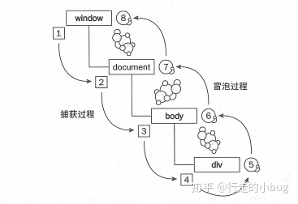

如上，我们在div上点击了一下，这个点击的行为就会触发dom事件流，点击后，事件流从1——>2——>3——>4传到div身上，这就是事件的捕获过程，div就是相当于点击事件所属的最小单位元素（div里没有其它子元素了），然后从这个叶子元素再5——>...——>8重新经过若干dom传到window根元素。

所以基于dom事件流机制，我们用户的一个行为，足以让一个dom元素分别在事件捕获阶段和事件冒泡阶段各触发一次回调函数

但是为什么我们`addEventListener`给某个dom设置了事件回调之后都只触发一次呢，其实是因为`addEventListener`函数其实是有第三个参数，一个boolen类型：默认为false，表示事件回调在冒泡阶段执行；如果为true，表示事件回调在捕获阶段执行。所以我们一般省略第三个参数，用户行为对应的回调默认在冒泡阶段执行一次。

`addEventListener`：

~~~js
element.addEventListener(event, fn, useCapture)
~~~

## 阻止事件冒泡

### 冒泡事件有哪些?

事件冒泡可以实现事件委托，但是有时候我们需要阻止事件冒泡防止一些不该发生的回调逻辑执行。

在整个js事件当中，基本所有事件都是冒泡的，几个事件是没有冒泡行为的：

* `focus`
* `onblur`
* `scroll`
* `mouseleave & mouseenter`（mouseout/mouseover会触发冒泡）

### 阻止事件冒泡的方法：

1. `e.stopPropagation()`：阻止事件的**冒泡与捕获**，**说白了就是终止当前事件流（不管事件流正处于什么阶段，如果是事件捕获阶段，也会终止事件捕获）**。这里的事件就是指某个用户行为，比如用户点击了一个dom元素，然后根元素body对click事件的回调中执行了e.stopPropagation()，那么执行完这个回调之后这个事件流就消失了，这个点击事件不会再触发其它任何回调。

   e.stopPropagation()不会阻止同一个dom元素的其它回调：

~~~js
dom.addEventListener("click", function(e) {
    e.stopPropagation();
    console.log("1")
})

dom.addEventListener("click", function(e) {
	console.log("2")
})

body.addEventListener("click", function(e) {
	console.log("body")
})

//点击dom元素之后，控制台输出1 2 ，因为e.stopPropagation()不会阻止第二个回调函数，但是事件流冒泡结束了，body的回调没有执行
~~~

​	e.stopPropagation()可以阻止事件的捕获：

~~~js
dom.addEventListener("click", function(e) {
    console.log("1")
})

dom.addEventListener("click", function(e) {
	console.log("2")
})

body.addEventListener("click", function(e) {
	console.log("body");
    e.stopPropagation();
}, true)

//点击dom之后，控制台输出"body"
~~~

2. `e.stopImmediatePropagation()`：中断当前事件流并且阻止执行当前dom元素的其它回调（**取消dom元素绑定事件的其它处理函数的解决方案**）：

~~~js
dom.addEventListener("click", function(e) {
    e.stopImmediatePropagation();
    console.log("1")
})

dom.addEventListener("click", function(e) {
	console.log("2")
})

body.addEventListener("click", function(e) {
	console.log("body")
})

//输出1，输出2的那个回调也被阻止了（这就是与stopPropagation的区别）
~~~

3. `e.cancelBubble = true`

   上面两种方法不支持IE浏览器（e.stopPropagation()&&e.stopImmediatePropagation()）但是符合W3C标准，IE浏览器中需要`e.cancelBubble = true`来阻止冒泡，`e.cancelBubble = true`的作用等价于`e.stopPropagation()`（阻止事件流冒泡但是不阻止其它回调）

   清除冒泡方法的浏览器兼容版本：

~~~js
function cancelBubble(e) {
    if(e.stopPropagation) {
        e.stopPropagation();
    }else {
        e.cancelBubble = true;
    }
}
~~~


## document对象

### document与window的关系

每个载入浏览器的 HTML 文档都会成为 Document 对象，一个html文件在浏览器中打开就会对应一个document对象，可以通过document的属性访问这个html文件的细节

window对象又是document的父级对象，window表示浏览器中打开的窗口，自然除了浏览器窗口中加载的html文件信息（document对象）还有其他的信息（window对象有很多属性和方法），比如`window.devicePixelRatio`表示当前浏览器窗口中一个css像素与用户设备像素的比率。**window对象的属性和方法都可以视为全局属性和方法。**比如`window.document`我们一般直接写document；我们直接访问devicePixelRatio也相当于访问`window.devicePixelRatio`。

### document对象的常用属性方法

属性：

~~~js
document.doctype // <!DOCTYPE html>
document.documentElement //返回html文档的根节点:<html>...</html>
document.head // <head>...</head>
document.body // <body>...</body>
~~~

方法：

* `document.createElement(Tag)`
* `document.getElementById(ID)`
* `document.getElementsByTagName(tagname)`
* `document.getElementsByClassName(classname)`
* `document.querySelector('li')`

## js阻止标签的默认行为

1. 在事件监听回调中使用事件对象的`preventDefault()`方法：

   ~~~html
   <a href="https://www.baidu.com/" target="_blank" id="a">百度</a>
   ~~~

   ~~~js
   var oA = document.getElementById("a");
   oA.onclick=function(event){
   	event.preventDefault();
   };
   // 点击之后a标签不会转跳
   ~~~

2. 在事件监听回调中`return false`

   ~~~js
   var oA = document.getElementById("a");
   oA.onclick=function(event){
   	return false;
   };
   ~~~

两者区别：

回调函数中执行event.preventDefault();不会影响后面js代码的执行；return false虽然阻止了默认行为，但也会中断回调函数中return后面的逻辑。

# JS

## js事件循环

js的代码执行顺序所遵循的机制是事件循环机制

### 宏任务与微任务

宏任务：script（整体代码）、setTimeout、setInterval、setImmediate、I/O、UI rendering

微任务：promise.then、Object.observe、MutationObserver

### 事件循环执行机制

开始执行宏任务就相当于开启一次事件循环，在执行宏任务代码体的时候我们只执行宏任务代码体中的同步代码，如果遇见微任务，那么遇见的微任务就属于这个宏任务，当宏任务的代码体中的同步代码执行完毕就接着执行刚刚遇到的所有微任务，如果执行当前宏任务的代码体时遇到了其它的宏任务，此时遇到的宏任务要就等待当前事件循环（当前宏任务代码体中的同步代码+遇到的微任务）执行完毕之后再执行。

一个事件循环中同步代码执行完毕执行微任务的时候，进入微任务代码体，要把这个微任务代码体当作一个新的事件循环来对待：即先执行代码体中的同步代码，再是微任务代码，遇见的宏任务进入全局统一的宏任务队列。只是说对于这个微任务代码体来说，执行机制与一个新的事件循环一样，但并不是一个新的事件循环。

执行完本宏任务代码体中的所有同步代码和遇到的微任务之后（先同步，再微任务），就开启下一个事件循环，也就是执行刚刚遇到的第一个宏任务，同理，这个事件循环中遇到微任务就在同步代码执行完毕之后立即执行，遇到宏任务就排队等待新的事件循环。

例：

~~~js
//分析第一次事件循环，第一个宏任务就是整体代码
setTimeout(()=>{  /* 这是整体代码这个宏任务代码体中遇到的第一个宏任务，放到宏任务队列中排队去 */
  new Promise(resolve =>{
	resolve();
  }).then(()=>{
	console.log('test');
  });

  console.log(4);
});

new Promise(resolve => {
  resolve();
  console.log(1) /* 这是整体代码这个宏任务中的同步代码，第一个输出 */
}).then( () => { /* 整体代码这个宏任务中遇到的第一个微任务，属于整体代码这个宏任务，在整体代码所有同步代码执行完毕之后第一个执行 */
  setTimeout(() => {
	  console.log("jrd");
	  Promise.resolve().then(() => {
		  console.log("jrd_sb");
	  })
  });
  console.log(3); 
  Promise.resolve().then(() => {
	console.log('before timeout');
  }).then(() => { /* 遇见.then的链式调用，每遇见一个.then就相当于遇见了一个微任务，所以这是本次宏任务的第三个微任务 */
	Promise.resolve().then(() => {
	  console.log('also before timeout')
	})
  })
})
console.log(2); /* 整体代码这个宏任务中的同步代码，第二个输出 */
~~~

第一次事件循环：一上来就遇见了一个`setTimeout`，进入宏任务等待队列，然后就是同步代码输出了`1 2`，接着就进入了第一个微任务，这个微任务代码体中，执行机制与一个新的事件循环一样，先是遇见`setTimeout`，进入宏任务等待队列，然后接着同步代码输出了`3`，接着遇见了两个.then的微任务，**这两个微任务是属于本次事件循环的第一个微任务的**。分别去执行这两个微任务，输出了`before timeout`和`also before timeout`，这两个微任务属于第一次事件循环的微任务，这两个微任务执行完毕就代表了第一次事件循环的微任务执行完毕，也就是第一次事件循环执行完毕。

然后此时宏任务队列中有两个宏任务，第一个就是一上来的第一个`setTimeout`，执行逻辑还是按照事件循环机制进行，这个宏任务最终输出了`4`和`test`，然后第二个`setTimeout`宏任务，最终输出了`jrd`和`jrd_sd`。

### plus：关于promise.then的链式调用牵扯的微任务执行顺序问题

执行一个宏任务中的代码体时，如果遇到`promise.then.then.then`，那么实际上只把第一个`promise.then`加入了微任务队列，后面的`.then.then`都是附属于`promise.then`的，也就是说，还完全没有进行执行，这时候如果有和`promise.then`同级的`promise2.then`，那么执行完`promise.then`之后肯定是去执行`promise2.then`的，`promise.then.then`所对应的微任务跟在了`promise2.then`的后面。

~~~js
  console.log(1)

  setTimeout(() => {
	console.log(2)
  }, 0)

  Promise.resolve(3).then(res => {   /***** 同级的微任务 ******/
	console.log(res);
  }).then(res => {
	Promise.resolve(4)
  }).finally(function(res) {
	console.log(res);
  }).then(res => console.log(res))

  Promise.resolve(5).then(res => {   /***** 同级的微任务 ******/
	console.log(res)
  })
  
  // 1 3 5 undefined undefined 2
~~~

下面：最后一个宏任务`console.log(p1)`输出的promise的成功原因是undefined，因为最后的finally也返回了一个promise，p1就是这个promise（finally当成普通的then方法对待就行——微任务）

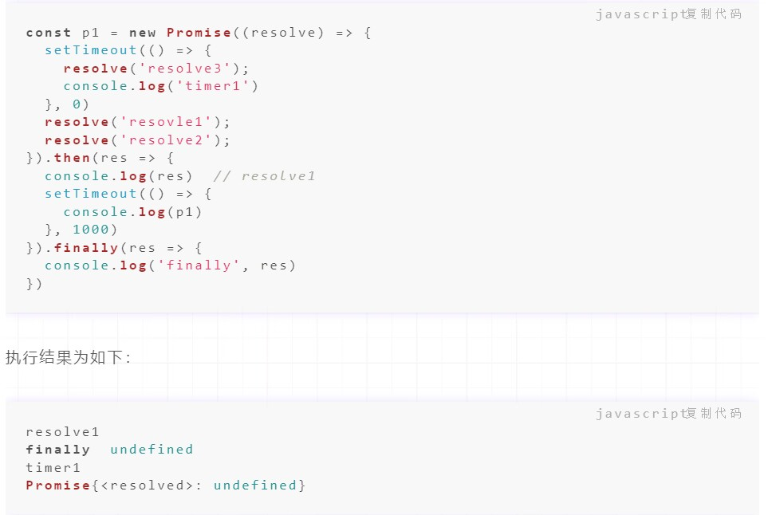

### async函数

总结：遇到`async`函数，就当同步代码去执行函数体，`async`函数体内部如果遇到`await fn()`，那么就把await后面的函数体也当作同步代码执行，即执行`fn`的函数体，**其实await后面的函数fn完全等价为把fn放到一个new Promise()的执行器中，await后面的同步代码等价于这个promise的then**

```js
async function async1() {
  console.log('async1 start')
  await async2()
  console.log('async1 end')
}

async function async2() {
  console.log('async2')
}

console.log('script start')

setTimeout(() => {
  console.log('setTimeout')
}, 0)

async1()

new Promise(resolve => {
  console.log('promise1')
  resolve()
}).then(() => {
  console.log('promise2')
})
// 结果
// script start  async1 start  async2  promise1  async1 end  promise2  setTimeout
复制代码
```

在看解析之前，我们先看一个知识点：

```js
async function foo() {
  console.log('foo')
}

async function bar() {
  console.log('bar start')
  await foo()
  console.log('bar end')
}

bar()
console.log('main script end')
// 此时这里的 bar end 其实是一个微任务
// 因为在 async/await 的时候我们已经说了，异步任务一定会返回一个 Promise，而 
// await foo() 后面的代码要想在执行 foo 函数后面执行，那么就会加入在 foo 返回的 Promise
// 的 then 里面的
// 相当于
async function foo() {
  console.log('foo')
  return new Promise(resolve => {
    resolve()
  }).then(() => {
    console.log('bar end')
  })
}
```

抛开事件循环机制，我们单纯体会一下`await`关键字的作用，首先，`await`后面预期的变量是一个promise（如果不是也会包装成promise）,await的所谓的暂停执行是什么？不是说全局的代码都因为遇见一个await暂停执行了，不要忘了，await是在async函数里面的！！，**await的暂停执行的意思是：`async`函数体内部，await后面的代码一定会等待await后面的promise状态改变之后才执行。它的暂停执行是针对`async`函数内部的。**说白了可以把async函数体理解为语法糖，`await promise`后面的代码其实都是这个promise的`then`微任务！！

~~~js
async function test() {
	console.log("1")
	await new Promise((resolve) => {
		setTimeout(() => {
			resolve()
		}, 3000)
	})
	console.log("2")
}
console.log("@@@start");
test();
console.log("end")
~~~

## typeof与instanceof的辨析

* `typeof xxx` 的作用就是判断一个变量的类型的，返回一个小写字母的字符串，而且结果也只会是几种可能中的一种：

~~~js
typeof undefined; //"undefined"

typeof true; //"boolean"

typeof 123; //"number"
typeof NaN; //"number"

typeof "jrd"; //"string"

hello = function() {};
typeof hello; //"function"
typeof Symbol; //"function"
typeof new Function(); //"function"

typeof []; //"object"
typeof {}; //"object"
typeof null; //"object" null视作空引用，所以也是object
typeof new Number(); //"object"  包括用new创建的一系列对象
~~~

* `obj instanceof Obj`就是判断一个对象`obj`的原型链上有没有`Obj.prototype`，这个结果也不固定，完全看我们怎么设计这个对象的原型链，毕竟js实现继承就是通过自定义指定一个构造函数的原型对象`prototype`实现的。

所以两者完全不是一个东西。

## js数据类型

分为两种：基本数据类型和引用数据类型

基本数据类型：`string number boolean null undefined`，引用数据类型也就是Object类，例如对象数组函数等。

这两种数据类型的值在底层的存储位置是不同的：

* 基本数据类型的值存储在栈内存中
* 引用数据类型在栈内存中存放一个地址（对象指针），通过这个地址可以找到堆内存中存放的对象

### 包装类型存在的意义

对于基本数据类型，都存在对应的包装类，其实包装类存在的意义就是：`let str = "jrd"`，我们在使用`str.length`以及使用一些字符串方法时（`str.split()`），其实都存在隐性的转换，把基本数据类型转化为对应的包装类，基本数据类型是没有这些属性和方法的，然后属性和方法调用完了之后，又隐性的转成基本数据类型。当然这些都是底层的事情了。

## 深浅拷贝的区别

深浅拷贝都是针对引用数据类型，浅拷贝指只拷贝了对象的引用，这是对指针的拷贝，拷贝之后两个指针指向的是同一个内存，某一个对象发生变化，另一个对象也随之改变；而深拷贝既拷贝了一个新的指针，也对指针指向的内容进行了拷贝。

## 实现深拷贝的方法

### 递归

~~~js
function deepClone(obj) {
    let objClone = Array.isArray(obj) ? [] : {};
    for (key in obj) {
        if (obj.hasOwnProperty(key)) {
            if (typeof obj[key] === "object") {
                objClone[key] = deepClone(obj[key]);
            } else {
                objClone[key] = obj[key];
            }
        }
    }
    return objClone;
}
~~~

### JSON.stringify && JSON.parse

~~~js
var objString = JSON.stringify(obj1);
var obj2 = JSON.parse(objString);
~~~

## 删除数组指定位置的元素

### 1.splice

`arr.splice(index, howmany, addItem...)`

### 2.delete

`delete arr[index]`：删除后index位置为`undefined`，数组长度不变

## this

### setTimeout回调函数中的this

~~~js
var obj = {
    name: 'name',
    foo: function () {
        console.log(this); // Object {name: "name"}
        /*
        	因为这是一个普通函数，有自己的this，他并是哪个对象的属性，既然不是对象调用的，所以他自然是window调用的
        */
        setTimeout(function () {
            console.log(this);  // Window
        }, 1000);
    },
    foo2: function () {
        console.log(this); // Object {name: "name"}
        /*
        	这是一个箭头函数，没有自己的this，它的this取决于它的父级上下文，上下文分为两种：全局上下文以及函数上下文，这里他在foo2函数内部，所以这个箭头函数属于函数上下文，即它的this与foo2:function(){...}这个函数是相同的，obj.foo2自然foo2函数的this为obj，所以箭头函数内this也是obj
        */
        setTimeout(() => {
            console.log(this);  // Object {name: "name"}
        }, 2000);
    }
}
~~~

### this的终极总结

* 对于`function`类型的函数（非箭头函数），它的`this`取决于：函数调用时谁（哪个对象）调用这个函数（`obj.fn()`），那么`this`就是谁，如果是函数独立调用（直接调用：`fn()`）那么this默认指向`window`，可以理解为`function`类型的函数一定属于一个对象，如果没有对象调用，那么默认就是window对象调用

* 对于箭头函数的this，它的this就是它声明时所在的父级作用域所在的对象

  这里有个作用域的概念：js中有两种作用域，函数作用域和全局作用域，也就是说，一个代码，在一个函数体内，那么它的父级作用域就是这个函数作用域，如果它不在某个函数内，那么它就属于全局作用域

普通函数的this绑定规则：[this指向/箭头函数this指向详解 - 掘金 (juejin.cn)](https://juejin.cn/post/7035257186565488670)

[ES6箭头函数的this指向详解 - 知乎 (zhihu.com)](https://zhuanlan.zhihu.com/p/57204184)

```js
//定义一个对象
    var obj = {
        x:100, //属性x
        show(){
        //延迟500毫秒，输出x的值
            setTimeout(
               //匿名函数
               function(){console.log(this.x);},
               500
           );
        }
    };
    obj.show();//打印结果：undefined
```

```js
//定义一个对象
    var obj = {
        x:100,//属性x
        show(){
            //延迟500毫秒，输出x的值
            setTimeout(
               //不同处：箭头函数
               () => { console.log(this.x)},
               500
            );
        }
    };
    obj.show();//打印结果：100
```

第一段代码中，setTimeout里面是一个`function`类型的函数，它的this取决于调用时谁调用它，它没有被任何对象显式调用，他就是独立调用的（直接执行），所以它的this就是window；第二段代码中，setTimeout里面是一个箭头函数，它的父级作用域是`show`函数，show函数是属于`obj`对象的，所以这个箭头函数的this就是obj对象

#### this例题速览：

~~~js
var name = 'window'; 

var A = {
   name: 'A',
   sayHello: function(){
      console.log(this.name)
   }
}

A.sayHello();// function类型函数被A调用，this指向A，输出'A'

var B = {
  name: 'B'
}

A.sayHello.call(B);//  function类型函数被强行指定被B调用，this指向B，输出'B'

A.sayHello.call();//  call方法不传参就等于不被任何对象调用，而是直接执行，所以this指向window
~~~

```js
var name = 'window'; 

var A = {
   name: 'A',
   sayHello: () => {
      console.log(this.name)
   }
}

A.sayHello();// 箭头函数，它的父级作用域就是全局作用域（它不属于任何一个函数）,全局作用域所属的对象就是window，输出'window'
```

```js
var name = 'window'; 

var A = {
   name: 'A',
   sayHello: function(){
      var s = () => console.log(this.name)
      return s//返回箭头函数s
   }
}
/*
	sayHello是个箭头函数，我们要看它定义时的位置：它的父级作用域是sayHello的函数作用域，所以它的this是sayHello这个函数所属的对象，自然也就是A对象！！！
*/
var sayHello = A.sayHello();
sayHello();// 输出A 

var B = {
   name: 'B';
}

sayHello.call(B); //还是A
sayHello.call(); //还是A
```

```js
var a = 0
function foo() {
  /*
  	首先这是个箭头函数，它的父级作用域是foo函数作用域，所以foo属于哪个对象，这个箭头函数的this就指向谁
  */
  let test = () => {
    console.log(this)
  }
  return test
}
let obj = { a: 1, foo: foo } // foo属于obj,自然箭头函数的this指向了obj
obj.foo()()
```
## 生成[m, n]的随机数

~~~js
function random(m, n) {
    /*
    	Math.random() ∈ [0, 1)
    */
    return Math.floor( Math.random() * (n - m + 1) ) + m;
}
~~~

## Promise常用方法

* Promise.all()：全成功返回成功
* Promise.race()：有一个成功就返回第一个成功的
* Promise.allSettled()：全部状态转变完毕返回成功，不管每一个具体成功与否
* Promise.any()：全失败返回成功

## `~`运算符

位运算：按位取反

`~num = -(num + 1)`

~~~js
var iNum1 = 25;
//25 二进制原码等于 00000000000000000000000000011001

var iNum2 = ~iNum1;
//转换为 11111111111111111111111111100110

alert(iNum2);//输出 "-26"
~~~

### ~~

**向零取整**：

~~~js
    ~~1         //  执行结果：1 
    
    ~~1.2      //  执行结果：1

    ~~-1      // 执行结果：-1

    ~~-1.2    // 执行结果：-1

    ~~0     // 执行结果： 0
~~~

## 数组去重的方法

1. `let arr = Array.from(new Set(arr))`

2. ~~~js
   /*
   	利用indexOf判断构造的数组ans里面有没有某个元素，遍历原数组，如果ans里面没有这个元素才放入ans中
   */
   let ans = [];
   originArr.forEach((value) => {
       if(ans.indexOf(value) === -1) {
           ans.push(value);
       }
   })
   ~~~

3. 上面的`ans.indexOf(value) === -1`可以替换成`!ans.includes(value)`

4. ~~~js
   /*
   	遍历时利用map记录当前数组中已经有的元素
   */
   function removeDuplicate(arr) {
     const map = new Map()
     const newArr = []
   
     arr.forEach(item => {
       if (!map.has(item)) { // has()用于判断map是否包为item的属性值
         map.set(item, true) // 使用set()将item设置到map中，并设置其属性值为true
         newArr.push(item)
       }
     })
   
     return newArr
   }
   ~~~

5. ~~~js
   /*
   	利用indexOf(item)只会返回第一个item的下标的特点
   	只有元素第一次出现时才有arr.indexOf(item) === index，重复遇到为false
   */
   function removeDuplicate(arr) {
     return arr.filter((item, index) => {
       return arr.indexOf(item) === index
     })
   }
   ~~~

## 获取对象原型的三种方法

1. `obj.__proto__`
2. `Obj.prototype`
3. **`Object.getPrototypeOf(obj)`**

## 创建对象的方法

其实这个题目是想让我们顺着js对象创建的发展历程来说一说前后创建对象的方法演变

1. 使用Object构造函数，创建完对象再添加属性（语句过多）

~~~js
//创建 Object 对象
var p = new Object()

//动态添加属性和方法
p.name = 'Tom'
p.age = 18
p.setName = function(name){
	this.name = name 
}
~~~

2. 对象字面量，直接用{}创建对象，同时里面指定属性和方法（不利于创建多个同类对象）

~~~js
var p = {
	name = 'Tom'
	age = 18
	setName: function(name){
		this.name = name
	}
}
~~~

3. 工厂模式——将对象字面量的创建方式封装一个方法，为了解决创建多个同类对象的问题，但是这样的对象没有具体的类型，都是Object类型

~~~js
function createPerson(name,age){
	var obj = {
		name: name,
		age: age,
		setName: function(name){
		this.name = name
		}
	}
	return obj
}

var p1 = createPerson('Tom',18)
~~~

4. 自定义构造函数配合new运算符——解决创建的对象没有类型的问题，但是每个对象都有独立的相同的方法，浪费内存

~~~js
function Person(name, age){
	this.name = name
	this.age = age
	this.setName = function(name){
		this.name = name
	}
}

var p1 = new Person('Tom',18)
~~~

5. 构造函数添加属性+原型添加方法（类思想）

~~~js
function Person(name, age){
	this.name = name
	this.age = age
}

Person.prototype.setName = function(name){
	this.name = name
}

var p1 = new Person('Tom',18)
~~~

## 观察者模式与订阅发布模式的区别

观察者模式中被观察者触发某种行为时通知所有观察者执行相应的逻辑，被观察者”知道“观察者的存在；发布订阅模式中，发布消息的人与订阅消息的人可以互相不知道，两者借助一个PubSub中间人来实现信息交流，信息交流的双方有更高的解耦性

## 文件相关对象

### Blob（Binary Large Object）

表示二进制大对象。MDN上对其的定义是：`Blob` 对象表示一个不可变、原始数据的类文件对象。可以通俗的说，Blob就是一只读的二进制对象。

属性：

* `size`：只读，对象中所包含数据的大小（字节）

* `type`：只读，一个字符串，表明该 `Blob` 对象所包含数据的 MIME 类型（**媒体类型**通常称为 **Multipurpose Internet Mail Extensions** 或 **MIME** 类型，是一种标准，用来表示文档、文件或字节流的性质和格式）如果类型未知，则该值为空字符串。

  * MIME类型组成：`type/subtype`，比如：

    ~~~
    text/plain
    text/html
    image/jpeg
    image/png
    audio/mpeg
    audio/ogg
    audio/*
    video/mp4
    application/*
    application/json
    application/javascript
    application/ecmascript
    application/octet-stream
    …
    ~~~

方法：

* `slice(startByte,endByte)`：按照字节范围切割文件
* `...`

获取途径：

一般Blob对象都是用构造函数自己手动创建的，所以用的也比较少。我们一般使用它的子类`File`类

### File

File类型的对象是Blob对象的子类，具备Blob对象的属性和方法（`size`，`type`，`slice()`），还有一些扩充，比如`name`属性（文件名）

获取途径：

<input type="file">获取这个dom对象之后，这个dom对象身上有一个`files`属性，这个属性是一个FileList类型的对象（类数组，当成数组来用就行），`<input type="file">.files[index]`就是File类型的对象

~~~html
<input type="file" id="file" >
~~~

~~~js
let oFile = document.querySelector("#file");
oFile.addEventListener("change", () => {
	console.log(oFile.files[0]); // 打印文件列表的第一个文件对象
})
~~~

### ArrayBuffer

`ArrayBuffer`和`Blob`都是二进制容器，但`ArrayBuffer`更底层，是一段纯粹的内存上的二进制数据，我们可以对其任何一个字节进行单独的修改，也可以根据我们的需要以我们指定的形式读取指定范围的数据；`Blob`就是将二进制数据做了一个封装，我们拿到的就是一个整体，可以看到它的整体属性大小、类型；可以对其分割，但看不到它内部的细节

### FormData（表单数据对象）

`FormData`对象并不直接和文件对象挂钩，而是我们前端在向后端传数据的时候，可以借助FormData对象，FormData对象里面可以存放很多键值对，键值对的值可以是`File`对象

基本使用方法：

~~~js
/*
	我们先new FormData创建一个formdata实例后，用append方法添加键值对
*/
const fd = new FormData();

fd.append("name", name);
fd.append('type', type);
fd.append("size", size);
fd.append("fileName", fileName);
fd.append("uploadedSize", uploadedSize);
fd.append("file", file); // file为File类型的对象

...
/*
	将fd发送给后端的post接口进行处理
*/
axios.post(url, fd);
~~~

## 为什么要进行大文件切片上传

总之来说就是提高传输的稳定性、可靠性

* 防止一次请求的体积过大导致失败——>前端上传文件时如果文件很大，上传时会出现各种问题，比如连接超时了，网断了，都会导致上传失败。
* 文件切片之后服务端可以进行分布式存储

## 原型对象上的constructor属性

### 获取方式

构造函数的`prototype`（也就是实例对象的`__proto__`）上，其实还有一个`constructor`属性，所以比如我们在es5中函数的方式实现继承的话：

~~~js
//smartPhone继承Phone,我们除了修改smartPhone的原型对象为Phone类的一个实例之外，我们还需要给Phone实例添加一个constructor属性，因为prototype、以及prototype.constructor这都是针对smartPhone类的信息，所以constructor指向smartPhone构造函数本身
smartPhone.prototype = new Phone;
smartPhone.prototype.constructor = smartPhone
~~~

其实我们通过一个对象实例去访问这个对象的构造方法的话，我们是要通过`obj.__proto__`先拿到原型对象，然后在原型对象上去访问`obj.__proto__.constructor`属性来拿到这个对象的构造函数。按照然后为了方便我们程序员操作，我们js里的内置对象（`new Map()`这种方式得到的对象），以及用es6的class去自定义的类，其实他们的类实例上都直接挂载了一个`constructor`属性，也就是说：

~~~js
function Person() {
    this.name = "jrd"
}
let p = new Person();

console.log(p.constructor === p.__proto__.constructor) // true!!
~~~

综上`constructor`的来源其实有两个：

* 原型对象上（中规中矩，合情合理的获取渠道）
* 实例对象上（为了方便程序员操作特意加上的）

### 作用

比如`Function`、`RegExp`、`Date`、`Map`、`Set`等这种内置引用类型，以及我们使用`class`自定义的构造函数，如果把类实例传给对应的构造函数，那么这次new构造的结果就是一个原实例的拷贝（拷贝实例与原实例里面的内容相同，而且两者不是同一引用——但不能绝对的说就是深拷贝，比如对于Date类实例，他实例里存放的时间信息相同，且本身引用不同，就完全是深拷贝，但是对于Map这种，如果它的键是一个对象，那么拷贝出来的对象这个键仍然是同一个对象）。

例：

~~~js
// 1. 对于class创建的构造函数
function Person() {
    this.name = "jrd"
}
let p = new Person();
let clone = new Person(p);
console.log(p === clone); // false (两者不是同一引用，但里面的内容（属性）相同)

// 2. Date类型
let date;
let dateClone;
setTimeout(() => {
    date = new Date();
    console.log(date); // Tue Dec 20 2022 11:33:06 GMT+0800 (中国标准时间)
})
setTimeout(() => {
    dateClone = new Date(date);
    console.log(dateClone) // Tue Dec 20 2022 11:33:06 GMT+0800 (中国标准时间) ——> Data实例的信息只与创建的一瞬间的时间有关，dataClone用date作为构造函数的参数，虽然晚于date创建，但与date的时间信息完全一样
},4000)

// 3. Map类型
let obj = {
    a: "hhh",
};
let map = new Map();
map.set(obj, "jrd");
let clone = new Map(map);
console.log(clone === map); // false，两者不是同一引用
console.log(map.has(obj));	// true
console.log(clone.has(obj)); // true,说明两者内容相同，但从某种程度上来说，这其实就是深拷贝呀，map类型如果键是引用，克隆对象就不该换掉这个对象
~~~

利用上面的这些类的构造函数的特性（接收实例会进行“深”拷贝）可以做什么?写深拷贝函数：

**如果进行深拷贝的过程中，遇见了这种类型的引用类型，我们就可以通过他们的`constructor`属性拿到他们本身的构造函数，然后用他们自己作为构造函数的参数，就可以实现这个引用数据的深拷贝。**

详情见：前端面试手撕，实现深拷贝——解决循环引用

## onclick与addEventListener监听点击事件的区别

区别：

1. 一个dom元素通过onclick只能指定一个回调，如果多次通过onclick后面的回调会覆盖前面的回调；addEventListener添加的事件回调会依次执行
2. addEventListener对任何DOM都是有效的，而onclick仅限于HTML（**dom分类有关，不理解。挖坑代填**）
3. 从功能方面来讲，addEventListener更强大，它的第三个参数可以指定回调函数触发的时机（冒泡阶段还是捕获阶段）;而onclick默认就是在冒泡阶段执行。
4. addEventLister添加的回调需要用`removeEventListener`方法来移除（前提是保留了回调函数的引用，匿名函数就无法移除了）；onclick移除回调的方法就是`dom.onclick = null`
5. IE9之前（IE7、IE8）addEventListener&&removeEventListener对应attachEvent && detachEvent

相同点：

1. 两者回调函数的内部`this`都指向绑定事件的dom元素（`this === event.target`）

## attachEvent && detachEvent

说白了就是对应主流浏览器中的`addEventListener`和`removeEventLister`，attachEvent && detachEvent是IE7、IE8中的方法，不遵循W3C标准。

与`addEventListener`和`removeEventLister`的区别

* attachEvent && detachEvent两者只接收两个参数，第一个就是监听的事件名，第二个是事件回调，没有第三个参数来控制事件执行时机
* attachEvent && detachEvent的第一个参数，必须以`"on"`开头，比如onclick，onmouseover等；而addEventListener不加on。

## String.match

两种用法：

1. match的参数为字符串

~~~js
string.match(str);
/*
	返回一个数组
		第0项：匹配到的字符串（等于match的参数）
		第"index"项：str在string中的起始索引
		第"input"项：调用match的字符串
	举例：
		console.log("hellloo".match("l"));
		输出：['l', index: 2, input: 'hellloo', groups: undefined]
	匹配不到返回null
*/
~~~

2. match的参数为正则对象

~~~js
string.match(regexp);
/*
	返回值的结构取决于regexp是否设置了g参数（是否开启全局匹配）
		开启了全局匹配：
			返回一个数组，数组中是所有匹配到的符合正则规则的子字符串
		未开启全局匹配：
			返回一个数组，数组结构与match参数为str时一样：第0项是第一个匹配到的值，还有"input"和"index"属性		
     匹配不到返回null
*/
/*
	举例
*/
console.log("h8ell231loo46214".match(/\d/)); // ['8', index: 1, input: 'h8ell231loo46214', groups: undefined]
console.log("h8ell231loo46214".match(/\d/g)); // ['8', '2', '3', '1', '4', '6', '2', '1', '4']
~~~

## RegExp.exec

用法：

~~~js
regexp.exec(str);
/*
	返回一个数组，匹配不到返回null
*/
/*
	如果regexp没设置g参数（非全局匹配）
		那么返回的数组存放的是第一个匹配结果的详细信息：第0项为第一个匹配到的字符串，第1、2、3...项为regexp的子表达式（regexp的括号中的子regexp）匹配到的内容，还有一个"input"属性以及"index"属性
	如果regexp设置了g参数（全局匹配）
		返回的数组结构和不设置g参数相同，区别是设置了g参数的正则对象调用exec进行匹配时，每次匹配到内容时会修改正则对象的lastIndex属性为匹配结果最后一个字符的位置加一，表示这个正则对象下一次调用exec方法匹配字符串时从字符串的lastIndex位置开始匹配，如果匹配不到内容，返回null，并且重置lastIndex为0.（也就是说我们可以用一个全局正则表达式去连续调用exec匹配同一个字符串，这样就能得到每一个匹配的子字符串的详细信息数组）
*/
let test = new RegExp(/\d([hg])/g) // ['2h', 'h', index: 6, input: 'fahsd12hgkads2', groups: undefined]
console.log(test.exec("fahsd12hgkads2"));
console.log(test.lastIndex) // 8
~~~

## match与exec的区别

1. match是字符串的方法；exec是正则对象的方法
2. 非全局匹配情况下（无g正则），match与exec返回的数组是一样的；全局匹配下：match返回匹配的结果集合，exec返回每一项匹配结果的详细信息，但是会改变正则对象的lastIndex

## 正则表达式相关

### 正则表达式中`.`表示什么

1. 在中括号`[]`外部：`.`表示任意字符，如果想表示`.`字符本身，需要前面加反斜杠`\`进行转义，即：`\.`
2. 在中括号`[]`内部：`.`表示`.`这个字符本身

## encodeURIComponent && decodeURIComponent

看手撕——url参数解析为对象 部分

## 对于js中面向对象编程以及函数式编程的理解

参考文章：https://blog.csdn.net/weixin_39737757/article/details/110423838

首先总结一下编程的本质：程序中，数据存储的方式五花八门，操作的方式同样多样，但编程说白了就是去**操作数据**。

### 从传统语言来说

数据存储方式：

* OO（object oriented面向对象）中，数据存放在对象的属性里
* 对于函数式，数据存放在闭包（各级作用域）里面，包括全局作用域

数据访问方式：

* 对于OO，我们拿到一个对象，使用这个对象访问他自身内部的数据
* 对于函数式，我们访问数据通过函数作用域链向上逐层查找

**OO所谓的对象，本质上就是函数式中的作用域**：

~~~js
function foo(x){
  let bar = x
  return function(){
     return bar
  }
}
let Bar = foo(1)
console.log(Bar())//1
~~~

~~~js
class Foo{
  constructor(x){
    this.bar = x
  }
  Bar(){
    return this.bar
  }
}
let foo = new Foo(1)
console.log(foo.Bar())
~~~

所以说：**函数式编程有一个巨大的优势，就是作用域链，也就是说函数可以访问的变量范围要远远大于OO，灵活性就成几何级数上升。换句话也可以说OO的约束性更强。**

### 针对js：

在JS中约束进一步被打破：JS中可以修改函数的“作用域”（通过修改this），类的成员方法可以以另一个对象为作用域（通过修改this）。JS还可以更换父类（修改原型链），这在其他OO语言是难以想象和不可理喻的。

所以Javascript可以用最简短代码来代替OO许多代码，究其本质，就是OO需要不断的传递、持有不同的作用域——对象。而Javascript只需要处在作用域链内，即可轻易访问到所需要的数据。

我的理解：**OO访问变量是拿到对象之后，向里访问，所以访问变量时需要先拿对象，访问不同变量需要切换不同对象；而函数式编程则是从当前位置（作用域内）由里向外访问变量，这样就方便的多**。

## 闭包

### 为什么js的函数都可以称之为闭包

广义而言，所有JS的函数都可以称为闭包，因为JS函数在创建时保存了当前的词法环境——如何理解？

答：js的执行环境本身就是一个scope（浏览器的window/node的global），我们通常称之为全局作用域。每个函数，不论多深，都可以认为是全局scope的子作用域，可以理解为闭包。


## “冷门”函数

**开发冷门，源码热门**


### `Element.insertBefore`

~~~js
let insertedNode = parentNode.insertBefore(newNode, referenceNode);
~~~

参数

- `newNode`：将要插入的节点
- `referenceNode`：即被参照的节点（即要插在该节点之前），而且必须是父元素的子元素或者`null`，**是一个必须参数，可以为null，即新插入的元素将会插入到父元素的子元素列表末尾。**
- `insertedNode`：插入后的节点，所以它与`newNode`是同一个节点。例如：

~~~html
<body>
	<div>
		<p class="p1" id="p1">这是P1</p>
		<p class="p2" data-name="p2">这是p2</p>
	</div>
	<p id="p3">这是p3</p>
	<script>
		let div = document.getElementsByTagName('div')[0];
		let p2 = document.getElementsByClassName('p2')[0];
		let p1 = document.getElementById('p1');
		let p3 = document.getElementById('p3');

		let returnDom = div.insertBefore(p2,p1);
		console.log(returnDom === p2); // 输出 true
	</script>
</body>
~~~


### `Object.assign`


~~~
 Object.assign(target, ...sources)
 参数： target--->目标对象
       source--->源对象
       返回值：target，即目标对象
~~~


~~~js
let target = { name: 'guxin', age: 18 }
let source = { state: 'signle', age: 22 }
let result = Object.assign(target, source)
console.log(target) // { name: "guxin", age: 22, state: "signle" }
console.log(result === target) // true
~~~

合并对象时对属性的拷贝不是深拷贝，是属性值，即如果源对象的属性值是一个对象的引用，那么得到的目标对象的属性也指向那个引用。

用来进行对象合并，或者可以进行对象浅拷贝，如拷贝出来一个新对象，且为target和source的合并体：

~~~js
let result = Object.assign({}, target, source);
~~~


# VUE

## 对MVVM模型的理解

1. M：模型（Model）：对应data中的数据
2. V：视图（View）：模板，DOM元素
3. VM：视图模型（ViewModel），也就是Vue实例对象，通过Vue实例对象搭建M与V之间的关联（把data绑定在DOM上；监听DOM的行为，通过回调修改data——双向数据绑定）


## Vue与jquery的区别

*  jquery是使用选择器（）选取DOM对象，对其进行赋值、取值、事件绑定等操作，和原生的HTML的区别只在于可以更方便的选取和操作DOM对象，而数据和界面是在一起的。
* Vue 则是通过Vue实例对象将数据和View完全分离开来了。对数据进行操作不再需要引用相应的 DOM 对象，他们通过 Vue 实例对象实现双向的绑定。这就是传说中的 MVVM。

## 虚拟dom与diff算法

所谓虚拟dom：就是用js对象去模拟我们的dom结构

我们现在使用的vue等前端框架，不同于传统网页开发：直接去操作dom元素。而是维护数据，通过监听数据的改变进而帮助我们去操作dom，因为浏览器中js的执行速度>>>操作dom的速度，所以我们vue框架在真正操作dom元素之前，会借助数据改变前后的两个虚拟dom（模拟真实dom的js对象）进行比对，从而找出两者的差异，达到最小化操作真实dom的目的。

所谓diff算法，就是比对两个虚拟dom寻找差异的算法，本质就是寻找两个js对象之间的差异。

## provide与inject实现父子组件通信

与props不同，props是实现直接父子关系父传子的通信，而provide与inject是实现父组件给所有后代组件的通信（父组件通过provide可以传父组件中维护的数据，也可以直接传`this`，相当于把父组件实例传过去，这样子组件甚至可以通过父组件实例调用父组件方法...就很灵活了）：

父组件：

~~~js
data() {
  return {
    message: "father",
  }
},
provide() {
  return {
    provided: this.message,
  }
}
~~~

子（只要是后代就行——>子组件的子组件，任意一个后代子组件）组件：

~~~js
export default {   
    name: "testTwo",
    inject: ["provided"],
    ...
}
~~~

特殊情况，比如爷爷组件provide了一个`provided`变量，父亲组件也提供了`provided`属性，此时孙子组件通过`inject`接收到的`provided`的值是父亲组件的值（就近原则）

## vue-cli的缺点

* 单页面应用，也就是只有一个html文件，对应只有一套title、描述等信息，不利于seo（搜索引擎优化）
* 查看网页源代码（不是查看控制台的html结构，控制台里显式div里面有很多子元素），源代码的html文件里面只有一个<div id="app"></div>，没有子元素也没有其它的结构，因为其它的结构都是获取服务端数据之后通过js生成html然后渲染上去的。爬虫抓取的是源代码，所以这样就不利于seo

## vue如何进行首屏加载优化

### 首页白屏的原因

因为我们vue是单页面应用（页面的转换全靠路由，一直都是一个html文件）。单页面应用的html是靠js生成的，所以首屏要加载很大的js文件（app.js vendor.js）,所以网速差的时候会产生一定程度的白屏。

### 首屏优化方法

1. 在路由返回内容之前添加loading（骨架屏），改善用户体验
2. 使用首屏SSR（**Server-Side Render**, 即服务端渲染）+转跳SPA方式来优化
3. 改单页面应用为多页面应用（多个页面分担了页面的加载压力），使用quicklink（单页面配合路由）技术
4. 协议优化（使用http2）
5. 使用web worker（h5新增，让js实现多线程，肯定比单线程快）
7. 优化webpack配置
   1. webpack的code-split结合vue-router做懒加载（路由懒加载——>按需加载）
   2. webpack的contenthash模式，针对文件级别更改做缓存
8. 图片使用webp（比png，jpg要小很多），小图采用base64编码、精灵图等
9. Vue打包优化结合cdn的使用：

我们发现，在不进行打包优化处理的一般情况下，vue项目进行打包之后生成的最大的两个js文件，主要是chunk-vendors.js，非常大，其实它的大部分体积来自于项目中依赖的包。我们配置vue.config.js，配置externals属性，来避免对一些依赖包进行打包：

~~~js
module.exports={
    configureWebpack:{
        externals: {
            'element-ui': 'ELEMENT',
            'vue': 'Vue',
        }
    }
}
~~~

externals对象的键值对中键就是对应的第三方包的包名，比如我们在项目的main.js中引入vue的时候：`import Vue from 'vue'`中的from "vue"这里的vue就是第三方包名，我们externals配置项的键对应不想进行打包的包名，然后键对应的value其实是第三方包对应的cdn资源加载运行之后给window对象添加的对象属性名

解释：如上，我们不想对“vue”进行打包，对应的，我们必须要在打包生成的html文件中通过添加<script src="cdnURL">的形式引入vue，项目才能正常使用vue，cdn引入资源的原理是什么呢？其实就是我们通过<script>标签请求到响应的cdn服务器的js脚本之后进行执行，执行完毕之后其实就是给`window`添加了一个对象属性，我们通过window上的这个对象属性就可以正常使用vue了。这个给window添加的对象属性的属性名就是`externals`配置项里对应的值，也就是上面的"Vue"。所以我们在配置`externals`时键很容易确定，我们不想打包哪个三方库键就是这个三方库，重点就是去确定这个三方库的cdn会给我们的window对象最终添加一个什么属性，这个属性作为键的值。

经过上面的配置再结合cdn引入：

`public/index.html`:

~~~html
<body>
    <div id="app"></div>
    <script src="https://cdn.bootcdn.net/ajax/libs/vue/2.6.11/vue.runtime.min.js"></script>
    <script src="https://unpkg.com/element-ui@2.10.1/lib/index.js"></script>
</body>
~~~

我们就能大大减小我们打包后生成的js代码的体积，虽然js是单线程的，但浏览器本身是进程模型（浏览器中存在若干进程，进程中又有若干线程），网络请求是浏览器的网络进程完成的，然后其他任务，比如html的解析等是由浏览器的其它相关进程完成的，所以这样从某种程度上来说，我们通过配置webpack打包忽略结合cdn的方式，既减小了项目的打包体积，也充分利用了浏览器的多进程模型，增加了首屏渲染速度。

## vue路由转跳的方式

1. `<router-link to="...">`
2. `this.$router.push`
3. `this.$router.replace`
4. `this.$router.go(n)`

## keep-alive的底层实现原理（挖坑代填——源码学习）

[彻底揭秘keep-alive原理 - 掘金 (juejin.cn)](https://juejin.cn/post/6844903837770203144)

## vue-router底层原理（挖坑代填）

## Vue3 CompositionAPI && Vue2 mixin

mixin的目的就是某些逻辑整体的抽离，封装以增加代码的可复用性与可维护性

### mixin的缺点：

* 命名冲突：组件中的data与混入中的data发生命名冲突，组件中的data变量会覆盖mixin中的data，导致我们不能毫无顾虑的使用一个混入而保证整个组件的逻辑的正确

  自己写一些混入增加一些心智负担排查一下命名冲突还好，但是如果第三方的mixin作为带有自己命名属性的npm包被加载进来，命名冲突问题就会比较麻烦

* 隐式依赖：mixin与使用它的组件之间没有层次关系，这就意味着mixin和组件除了操作本身的数据之外：mixin中的逻辑可以使用（依赖）组件中的数据

  这种情况通常是在mixin被用于共享输入验证时出现的，mixin可能会期望一个组件有一个输入值，它将在自己的validate方法中使用。这就导致我们不敢去轻易的重构组件，或者修改组件中的某个数据，因为可能有若干个mixin依赖着组件中的某个data变量，导致组件与mixin形成了一种隐式相互依赖的关系。（特别是大型项目很多mixin...，依赖一团糟

* 逻辑抽离层级难以控制：使用一个mixin，那么就引入了他的所有data与method，但是我们可能只是使用mixin的一部分功能

### Composition API解决mixin的问题

* 先但从组合式api本身特点来讲，不是与mixin比较，与整个vue2比较：vue2是配置型编程，组合式api是函数式编程，这样我们相关的业务逻辑与data就不用分开写了
* 解决命名冲突：我们需要在setup中显式的返回需要的属性以及方法，我们封装的函数（对比mixin）创建的属性与方法最终需要return
* 解决隐式依赖：mixin使用消费组件（使用mixin的组件）上定义的data属性，合成函数(Composition Function)还**可以调用消费组件中定义的局部变量**。不过，不同之处在于，现在**必须将此变量显式传递给合成函数**：

~~~js
import useCompFunction from "./useCompFunction";
export default {
  setup () {
    // 某个局部值的合成函数需要用到
    const myLocalVal = ref(0);
 
    // 它必须作为参数显式地传递
    const { ... } = useCompFunction(myLocalVal);
  }
}
~~~

* 更灵活的抽离逻辑：
* 在之前使用mixin中我们在页面中混入一个模块，那就代表这接受这个模块所有的配置。那如果A,B页面需要模块的所有业务选项，C页面却只需要一部分数据和方法。就很不好处理。
  但是在composition组件中因为组件需要在setup()中return才会注册到页面组件中，所以我们可以放心大胆的按业务功能块进行抽离，在不需要所有业务块的C页面中我们只return其需要的属性方法即可。

参考文章：

https://blog.csdn.net/weixin_39168678/article/details/115211863

https://www.cnblogs.com/goloving/p/15472355.html

## vue中style标签的scoped原理

首先知道css的一种选择器——属性选择器：

举例：

如果您希望把包含标题（title）的所有元素变为红色，可以写作：

```css
*[title] {color:red;}
```

与上面类似，可以只对有 href 属性的锚（a 元素）应用样式：

```css
a[href] {color:red;}
```

**说白了给一个选择器添加[属性]可以缩小一个选择器的选择范围**

scoped原理：

一个`.vue`文件中（如果存在添加了scoped属性的style标签）所有的模版里的标签，编译后都会添加一个与这个组件唯一对应的属性：

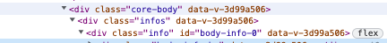

一个`.vue`文件中的  添加了scoped属性的  style标签里的  所有选择器  的最后，编译后会添加属性选择器（属性选择器使用组件的唯一属性）：

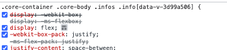

（选择器`.core-container  ...  .infos .info`的最后给.info添加属性选择器：.info[...]。

一个scoped组件内的所有选择器都在最后添加了一个属性选择器，所以这样组件内的选择器只能选中组件内的元素。

如果想在scoped父组件中选中scoped子组件的元素也有方法：使用**深度作用选择器**：

* 如果项目使用的是css原生样式，那么可以直接使用 >>> 穿透修改
* 对于less,我们可以使用/deep/
* 对于sass,我们可以使用::v-deep

举例：

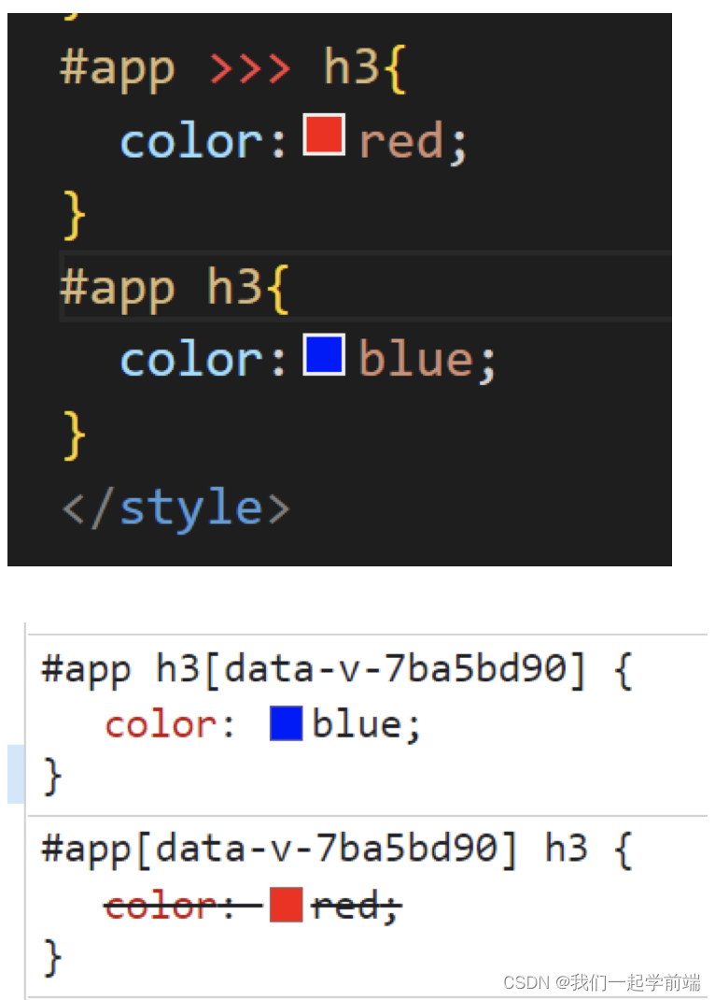

分析：这肯定是在一个scoped组件中，data-v-7ba5bd90就是父组件的属性，对于blue颜色，我们没有使用深度选择器，h3后面自动添加了属性选择器，子组件里的标签没有这个属性，自然选择不到子组件里的h3元素，对于red颜色，我们使用了深度作用选择器`#app >>> h3`，它在编译时只给`>>>`之前的选择器添加了属性选择器，然后`>>>`后面的选择器没有添加属性选择器，这样自然就能选中到子组件内部的h3元素了。

# 输出题

## 1.

~~~js
function Foo() {
    getName = function () { alert (1); };
    return this;
}
Foo.getName = function () { alert (2);};
Foo.prototype.getName = function () { alert (3);};
var getName = function () { alert (4);};
function getName() { alert (5);}
 
//请写出以下输出结果：
Foo.getName();
getName();
Foo().getName();
getName();
new Foo.getName();
new Foo().getName();
new new Foo().getName();
~~~

解析：

### 第一问：Foo.getName();

`Foo.getName = function () { alert (2);};`相当于给Foo这个函数对象添加了一个`getName`方法，从类的角度来讲，把Foo看作一个构造函数，`Foo.getName = function () { alert (2);};`就是给Foo类添加了一个静态方法。自然`Foo.getName();`就是调用Foo类的静态方法`getName`，输出2

### 第二问：getName();

相关的代码为：

~~~js
var getName = function () { alert (4);};
function getName() { alert (5);}
~~~

这里涉及函数声明与函数表达式的区别

~~~js
// 函数声明
function wscat(type) {
	return type === "wscat";
}
// 函数表达式
var oaoafly = function(type) {
	return type === "oaoafly";
}
~~~

* 函数声明：声明的整个函数体会提升至作用域首部
* 函数表达式，使用var接收，只是会把变量的声明提升至首部

如果两者同名，后来出现的函数表达式会对提升至作用域首部的函数声明进行覆盖。

相关例题：

~~~js
getName() //oaoafly
var getName = function() {
	console.log('wscat')
}
getName() //wscat
function getName() {
	console.log('oaoafly')
}
getName() //wscat
~~~

回到第二问，`var getName = function () { alert (4);};`其实是把提升至首部的函数声明`function getName() { alert (5);}`进行了覆盖，所以输出4。

### 第三问：Foo().getName();

`Foo()`中返回`this`，其实就是返回`window`，其实就是再调用一遍window上的`getName`方法，但是`Foo()`函数中`getName = function () { alert (1); };`，对`getName`的赋值并没有使用`let`或者`var`，所以`Foo`作用域中没有`getName`就会寻找`Foo`的父级作用域，也就是相当于找到了window的`getName`，相当于对window对象的getName进行了修改。所以输出1

### 第四问：getName();

相当于调用window的`getName`，所以同上输出1

### 第五问：new Foo.getName();

考察点在于运算符优先级，`.`优先于`new`运算符，所以`new Foo.getName();`相当于`new (Foo.getName)();`，即把`Foo.getName`这个函数当作构造函数，这里又涉及`new`的内部行为，其实就是构造一个空对象`obj`，然后执行`Foo.getName.apply(obj)`让这个对象去执行`Foo.getName`，不管是不是这个对象进行执行`Foo.getName`都无所谓啊，不管谁执行`Foo.getName`都是输出一个2。（说白了new运算符改变执行`Foo.getName`的`this`，但输出什么和`this`无关，都是单纯执行``Foo.getName`）

### 第六问：new Foo().getName();

同第五问，主要在于运算符优先级的确定：**记住，访问属性运算符`.`的优先级仅低于`()`，然后new运算符的优先级低于`.`,(所谓优先级就是指这个符号发挥作用的顺序，`()`的作用就是把里面划分为一个整体，`.`运算符的作用就是划分为两边，访问左边对象的右边的属性)**，所以`.`先发挥作用，然后左边的`new`运算符再发挥作用，结合为`new Foo()`,最终`new Foo().getName();`的执行逻辑为`new Foo() . getName();`，`new Foo()`返回了`new`操作构造的那个对象，因为`Foo`的实例没有自己的`getName`方法自然会访问到`Foo`的原型对象上的`getName`，所以输出3

### 第七问：new new Foo().getName();

其实答案已经不重要了，只要我们明白这个题目在考察的知识点是运算符优先级

实际的执行顺序为：`new ((new Foo()).getName)();`输出3

## 2.

~~~js
var num = 123;
function f1() {
    this.num = 456;
    console.log(num);
}
new f1(); // 123
f1(); // 456
~~~

`new f1()`让构造的对象去执行`f1`，`this.num`只是给构造的对象添加一个属性，和变量的声明毫无关系，所以`f1`里并没有`num`变量，自然访问父级作用域window,输出123

直接执行`f1()`，`this.num = 456;`先修改了window的num变量值，然后`f1`函数作用域中并没有`num`，`console.log(num);`输出window的num，456.

## 3.

浏览器中：

~~~js
console.log(a)
~~~

输出：Uncaught ReferenceError: a is not defined

~~~js
console.log(a);var a
~~~

输出：undefined

## 4.闭包相关

匿名函数访问了外层函数作用域的变量，外层的函数上下文得以保存——>`var a = 2`得以保存，所以输出2

```JavaScript
var a = 1
function f(){
    var a = 2
    return function(){
        console.log(a)
    }
}
var res = f()
res()
```

## 5.含有async的事件循环(2022.12.15百度一面)

~~~js
setTimeout(function() {
    console.log("1");
}, 0);
async function async1() {
    console.log(2);
    const data = await async2();
    console.log("3");
    return data;
}
async function async2() {
    return new Promise((resolve) => {
        console.log("4");
        resolve("async2的结果");
    }).then((data) => {
        console.log("5");
        return data;
    })
}
async1().then((data) => {
    console.log("6");
    console.log(data);
});
new Promise(function (resolve) {
    console.log("7");
}).then(function() {
    console.log("8");
})
~~~

解析：

1. 遇见`async`函数async1，当作同步代码执行，输出2
2. `async`函数内部遇见`await`，await后面的函数当作同步代码，即开始执行async2，输出4，并遇见第一个微任务（未来输出"5"并返回"async2的结果"）
3. 回到函数async1中，`console.log("3") && return data`当作`await async2()`的`then`函数体，所以这是第二个微任务（未来输出"3"）
4. 遇见第三个微任务（未来输出"6"和"async2的结果"）
5. 同步代码输出"7"
6. 遇见第四个微任务（未来输出"8"）
7. 微任务执行输出："5"  "3"  "6"   "async2的结果"  "8"
8. setTimeout输出"1"

# 跨域问题解决方案

## jsonp

利用jsonp，原理就是利用<script src="server_url">标签请求服务器接口时不受同源策略的限制，前端可以接收到后端返回的js脚本并且执行。

需要后端编写jsonp接口，前端利用<script>进行请求时通过query参数传递前端的回调函数名，后端返回的脚本就是用模板字符串拼接出来的对这个回调函数的调用，只是附带参数。

服务端.js：

~~~js
const express = require('express');

const cors = require('cors');

const app = express();

//jsonp接口必须在配置cors中间件之前挂载，否则会被当作cors接口
app.get('/api/jsonp', (req, res) => {
    const funcName = req.query.callback;
    //我们想传给客户端的数据
    const data = { name: 'jrd', age: 20 };
    //返回给客户端的字符串脚本
    const scriptStr = `${funcName}(${JSON.stringify(data)})`;
    console.log(scriptStr);
    res.send(scriptStr);
})

//应用cors第三方中间件（cors()返回中间件函数）解决跨域问题
app.use(cors());

app.get('/', (req, res) => {
    console.log("@@@");
    res.send('服务器返回的get数据');
})

app.listen(80, () => {
    console.log('服务器启动成功');
})
~~~

客户端.html：

~~~html
<!DOCTYPE html>
<html lang="en">
<head>
    <meta charset="UTF-8">
    <meta http-equiv="X-UA-Compatible" content="IE=edge">
    <meta name="viewport" content="width=device-width, initial-scale=1.0">
    <title>解决跨域——获取jsonp接口的数据</title>
	<script type="text/javascript">
		//执行服务器传来的脚本时用到的数据处理函数
		function jsonpCallback(jsonpData) {
			console.log('来自服务器的数据:');
			console.log(jsonpData);
		}
	</script>
	<!-- 通过script标签向服务器的/api/jsonp接口请求（不受同源策略限制的请求）数据，并且用query参数告诉服务器函数名，方便服务器构造js函数调用脚本 -->
	<script src="http://127.0.0.1/api/jsonp?callback=jsonpCallback"></script>
</head>
<body>
	
</body>
</html>
~~~

### 为什么script，img，link内嵌标签不受跨域影响

要理解JSONP跨域的script标签请求为什么不受同源策略的限制这个问题的重点就在于**：浏览器如何判断script标签内脚本资源的来源**

可以这么理解，**脚本的来源取决于脚本所嵌入的资源的来源**，比如说访问A主机的当前HTML文件中有一个script标签，这个script标签的src属性请求了一个js脚本，**因为这个脚本是由A主机的HTML文件的嵌入的script标签发起请求获取的**，因此这个脚本的来源是属于A主机的。

到了这里，问题的答案也就出来了，jsonp的script标签请求回来的资源与当前域是相同的域（浏览器判断资源来源的时候不管script，img，link标签里的内容是怎么来的，而是直接认为这个标签本身属于当前域下的html文件，所以不跨域），因此不受同源策略的影响

### jsonp的优缺点

优点：

* 兼容性好，更古老的浏览器
* 不受同源策略限制

缺点：

* 它只支持GET请求而不支持POST等其它类型的HTTP请求
* jsonp在调用失败的时候不会返回各种HTTP状态码，没有关于JSONP调用的错误处理，一旦回调函数调用失败，浏览器会以静默失败的方式处理
* 安全性低（返回的js脚本被修改，所有调用此jsop的域名都受影响，因为是跨域接口，所以危险影响范围大，危险不在同一域名下）

## cors

原理：cors（Cross-Origin Resource Sharing，跨域资源共享）就是一系列的HTTP响应头，也就是服务器端向客户端响应数据的时候配置了这些HTTP响应头之后，浏览器就不再拦截跨域资源了。

cors注意事项

* cors在服务器端进行配置，客户端浏览器无需做任何额外的配置，只要服务器端配置了cors，客户端浏览器就可以请求开启了cors的接口。

* cors在浏览器中有兼容性（只有支持XMLHttpRequest Level2的浏览器才能正常访问开启了cors的服务器接口）
* 开启了cors的接口默认只对若干种请求头和请求方式有效，如果客户端的请求使用了默认请求头和默认请求方式之外的请求头和请求方法，我们服务端就需要配置相应的响应头，下面是三个与cors接口相关的响应头：
  *  `Access-Control-Allow-Origin`：决定我们的服务器允许跨域只针对指定的客户端ip，而不响应其它客户端。Access-Control-Allow-Origin的值除了是具体的ip地址以外，还可以是`*`，表示响应任何客户端的请求。
  * `Access-Control-Allow-Headers`：允许客户端使用指定的请求头（不在默认允许客户端使用的9个请求头之外的请求头）。因为cors仅支持客户端向服务器发送9个指定的请求头，如果使用了9个请求头之外的请求头，请求就会失败。
  * `Access-Control-Allow-Methods`：默认情况下，cors仅支持客户端发起GET、POST、HEAD请求，但如果客户端希望通过PUT、DELETE等方式请求服务器，就需要配置Access-Control-Allow-Methods。
* OPTIONS类型的请求即**预检请求**，预检请求的请求体与响应体都不携带真实数据，只是为了得知本次非简单http请求是否会被同源策略限制。当发起**跨域请求**时，由于安全原因，**触发一定条件时（请求头与请求方法不在默认许可范围内）**浏览器会在正式请求之前**自动先发起OPTIONS请求**，即CORS预检请求，服务器若接受该跨域请求，浏览器才继续发起正式请求。

服务端.js：

~~~js
const express = require('express');

//需要现在项目中安装cors：npm install cors
//引入第三方模块
const cors = require('cors');

const app = express();

//应用cors第三方中间件（cors()返回中间件函数）解决跨域问题
app.use(cors());

app.get('/', (req, res) => {
    console.log("@@@");
    res.send('服务器返回的get数据');
})
app.post('/', (req, res) => {
    console.log("@@@");
    res.send('服务器返回的post数据');
})

app.listen(80, () => {
    console.log('服务器启动成功');
})
~~~

## 开发环境下vue脚手架提供代理服务器

~~~js
//webpack为我们提供了“代理服务器”解决跨域问题
//在webpack.config.js中进行配置，这个文件就相当于我们vue项目中的vue.config.js
//vue.config.js中添加“代理”配置
devServer: {
    proxy: {
        //api代表如果前端发送的请求路径中如果有api，那么就把这个请求发送给target对应的服务器（相当于webpack提供的服务器对真正的服务器进行代理）
        '/api': {
            target:'http://gmall-h5-api.atguigu.cn'
        }
    }
}
~~~

## nginx代理跨域

## nodejs代理跨域

## 使用cors中间件（上面cors方法的服务端例子就是nodejs的实现）

# 前端鉴权

## session认证机制

### （不说session认证机制）先说什么是session？

session是一种服务端的状态管理技术（所谓状态管理就是数据存储）。以nodejs为例，**只要我们使用了session中间件：**

~~~js
//配置session中间件
app.use(session({
    secret: '761214Jl',
    cookie: { maxAge: 10000 }, //cookie的有效时长，10s
    resave: false,
    saveUninitialized: true
}))
~~~

* 服务器端的变化：

那么就等于在服务端开启了session存储，对于每一个请求服务器的浏览器（细分到浏览器，而不是ip）服务器都会默认自动创建一个session对象，这个session对象是存储在服务器的，服务器可以在这个对象上存储信息，以及销毁这个对象等各种操作。

* 客户端（浏览器）的变化：

客户端请求使用了session中间件的服务器，服务器第一次响应客户端的时候就会通过设置响应头（`Set-Cookie`）的方式自动给浏览器添加一个cookie字段`connect.sid`，也就是sessionID，以后客户端再请求服务器的时候就会自动携带这个cookie，也就是通过这个cookie字段，找到服务器中对应的session对象。

**服务器端的session对象与发给客户端的cookie字段（connect.sid）是一一对应的，服务器端也正是通过客户端传来的cookie来寻找到服务器端对应的session对象**。

测试：

服务端.js：

~~~js
const express = require('express');

const session = require('express-session');

const app = express();

//配置session中间件
app.use(session({
    secret: '761214Jl',
    //cookie: { maxAge: 10000 }, //cookie的有效时长，10s
    resave: false,
    saveUninitialized: true
}))

app.get('/api/login', (req, res) => {
    //输出session对象的user属性
    console.log(req.session.user);
    console.log(req.session);
    console.log(`当前的唯一会话ID，藏在cookie里的value：${ req.sessionID }`);
    //修改session对象的uesr属性为jrd
    req.session.user = 'jrd';
    res.send('成功请求');
})

app.listen(80, () => {
    console.log('服务器已经启动！');
})
~~~

代码解释：服务器端我们配置了session中间件，当浏览器请求http://localhost/api/login时，会先尝试输出`req.session.user`，即session对象的user属性，第一次访问当然会输出`undefined`，因为后面给session对象添加了user属性为"jrd"，后面的访问自然会输出"jrd"，然后输出一下session对象（这一步没什么特别的意义）,然后输出`req.sessionID`，这个属性也就是传给客户端的cookie的值，与服务器端的session对象一一对应。

测试过程：

* 先用edge浏览器发送请求http://localhost/api/login，输出user属性时输出了`undefined`，但以后的访问都会输出`"jrd"`，这说明了**服务器端session对象的存储功能。**

* 先用edge浏览器请求一次服务器，user输出了`undefined`，但是用chrome浏览器再发请求，user依然输出了`undefined`，这说明**对于不同浏览器，这个session对象是不同的。**
* 同上，先用edge浏览器请求一次服务器，然后用chrome浏览器的控制台执行命令`document.cookie="connect.sid=xxxxx"`（把edge浏览器的cookie信息复制到chrome浏览器中），服务器的控制台上user输出了`jrd`，此时两者的`req.sessionID`都是同一个，都是edge浏览器第一次请求时创建的那一个字符串。这说明**服务器端是通过客户端发送来的cookie进行寻找对应的session对象的。（session与cookie一一对应）**
* 配置session中间件时，如果设置`cookie: { maxAge: 10000 }, //cookie的有效时长，10s`，那么cookie在一定时间后就会失效，我们在浏览器一直发请求，会看到一定时间内输出的`req.sessionID`都是同一个字符串，直到某一次有效时间到了，输出的`req.sessionID`就是一个新值了，原本服务器端的session对象已经销毁了，以及浏览器端存储的cookie也消失了。新的请求创建了新的session对象以及cookie。这说明了**cookie可以设置有效时长。**

所以说白了session认证机制就是借助存储，客户端使用cookie进行存储sessionID，服务端使用session对象进行存储，解决了http请求的无状态性。

session认证机制一般适用于**服务端渲染（SSR：server side render；对应客户端渲染就是CSR，client side render）**的开发模式中，所谓渲染，就是指数据填充于dom结构中的过程，服务端渲染，就是指在服务器把数据放到html中，然后一起返回给前端。（自然而然，客户端渲染就是指数据放在html中的事情在客户端完成，也就对应现在主流的前后端分离的开发模式，客户端请求数据，然后再放到dom中）

这里给一个使用session认证机制的服务端渲染的服务端实例：

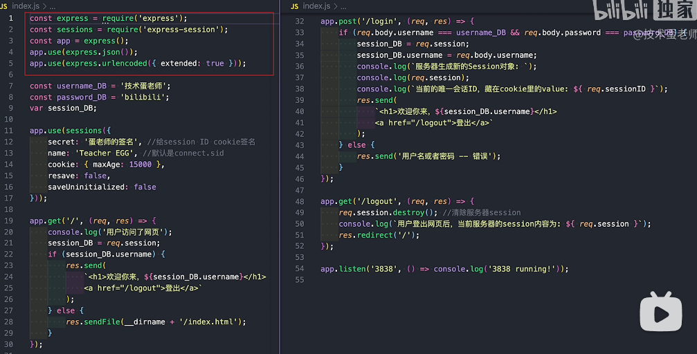

用`username_DB`和`password_DB`模拟从数据库中取出的用户名和密码，session_DB模拟存储在数据库中的session对象。

先看"/login"接口，如果用户访问，且发来的用户名和密码验证通过，我们就会给session_DB（也就是`req.session`）添加一个`username`属性（其实这个`username`属性就模拟了我们在数据库中根据用户名获取这个用户的一切的详细信息，也就是给session对象添加上用户的具体信息），然后`res.send`返回给客户端的是一个我们使用模板字符串拼接的已经把用户隐私数据（登录成功之后访问数据库获得的数据）放上去的html模板。

然后就是"/"接口，也就是用户主页，如果以前已经登陆过，客户端再次访问"/"，服务器端就会根据客户端携带的cookie访问到那个曾经创建的session对象，并且直接返回拼接好用户数据的html。

上面就是**服务端渲染下的session鉴权机制**。

## jwt认证机制

### 什么是jwt？

如果同一时间大量用户访问服务器，服务器存储了大量的sessionID（存放大量session对象），就会增大服务器压力，或者说多台服务器进行存储session，又会涉及到服务器之间的通信。而且session认证机制需要结合cookie才能实现，但是cookie默认是不支持跨域访问的，为了解决跨域又需要进行很多额外的配置。session认证机制的劣势，再加之逐渐流行的前后端分离的开发模式，JWT（json web token）鉴权机制出现了。

逻辑概括：服务端配置了jwt相关的中间件之后，对于客户端的身份认证请求（比如登录），会生成一个token字符串，token是由服务器端的真实用户信息加密而来的（这些信息其实就是以后各种需要权限的请求的答案，只是我们没法解密，只能靠服务器才能解密），以后客户端请求那些需要身份权限的接口时，请求头的`Authorization`携带上这个token，服务器端对token进行解密就解析出了用户信息。（这里的用户信息就不是混合着数据的html了，而是具体的数据，比如用户名之类的键值对，这也就是前后端分离的开发模式，我们前端只单纯的请求数据，而不是整个HTML资源）

jwt组成结构：

* Header（头部）：header部分声明需要用什么算法来生成签名
* Payload（有效荷载）：各种数据，真实数据以及一些配置数据，比如有效期之类的
* Signature（签名）：header和payload进行base64编码，这两段编码结合服务器端jwt的密码进行算法（header指定的算法）运算生成签名（同来增加安全性的手段）

三者之间使用英文"."分隔：`Header.Payload.Signature`，这样一个完整的jwt就可以发送给客户端了，以后服务端再收到token，就结合jwt的密码和token进行算法解密，解析出真实的数据。

### express中使用JWT

`npm install jsonwebtoken express-jwt`

* jsonwebtoken用于生成JWT字符串
* express-jwt用于将JWT字符串解析还原成JSON对象

定义secret密钥：为了防止JWT在网络传输中被破解，我们自定义一个密钥字符串在加密和解密时使用

`const secretKey = '761214Jl'`

#### 登陆成功后生成JWT字符串

~~~js
app.post('/api/login', function(req, res) {
    //省略登录失败情况下的逻辑
    //用户登陆成功之后，生成JWT字符串，通过token属性相应给客户端
    res.send({
        status: 200,
        massage: '登陆成功',
        //调用 jwt.sign() 生成 JWT 字符串，三个参数分别是：用户信息对象、加密密钥、配置对象（expiresIn有效时限）
        token: jwt.sign({ username: 'jrd' }, secretKey, { expiresIn: '30s' })
    })
})
~~~

#### 将JWT字符串还原为JSON对象

客户端每次在访问那些有权限的接口（所谓权限就是服务器需要客户端携带token进行请求）的时候，需要通过请求头中的Authorization字段，将Token字符串发送到服务器进行身份验证。

此时服务器通过express-jwt这个中间件，将客户端请求头中携带的token解析还原称JSON对象

~~~js
//app.use()注册中间件
//expressJWT({secret:secretKey})就是用来解析Token的中间件
//.unless({ path: [/^\/api\//]})用来指定哪些接口不需要访问权限
app.use(expressJWT({secret:secretKey}).unless({ path: [/^\/api\//]}))
~~~

配置了这个中间件之后，在那些有权限的接口中（也就是客户端请求时携带了token的接口），使用`req.user`对象来访问从JWT中解析出来的用户信息

~~~js
app.get('/admin/getinfo', function(req, res) {
    //只要用户携带了token并且被成功解析,req就有user这个属性
    console.log(req.user)
})
~~~

#### 捕获解析JWT失败后产生的错误

当使用express-jwt解析Token字符串时，如果客户端发送过来的Token字符串过期或者不合法，会产生一个解析失败的错误，导致项目崩溃。我们需要配置错误中间件捕获错误并进行处理。

~~~js
app.use((err, req, res, next) => {
    // 根据err.name判断是否为token解析失败的错误
    if(err.name === 'UnauthorizedError') {
        return res.send({ status: 401, message: '无效的token' })
    }
    //其它原因导致的错误
    res.send({
        status: 500,
        message: '未知错误'
    })
})
~~~

# webpack中plugin和loader

* 首先从代码层面上来说：
  * loader就是一个函数，接收源文件的文本内容或者上一个loader处理完成之后的返回值
  * plugin是一个类（构造函数）webpack给这个类提供了一个`apply`方法，这个方法接收一个编译器参数`compiler`，通过`compiler`这个对象可以访问webpack打包的整个过程的一些特定时间结点（`compiler.hooks.emit.tap`：emit指对应回调在打包的资源输出到output文件夹之前，tap与之对应的tapAsync，应该是与同步异步相关），通过回调函数的形式来增加webpack的逻辑，从而一定程度上改变最终webpack打包的输出结果
* 从逻辑层面上来说：
  * loader就类似于一个文件编译器，经过loader的处理，把一个文件输出为另一个文件，或者说传给下一个loader，最终经过若干个loader的处理，实现了把匹配到的文件进行了（流水线式的）内容的转化
  * plugin就相当于webpack打包过程中的生命周期函数，在打包的某些特定结点宏观的操作输出结果，而不是具体局限于操作某个文件（比如`HtmlWebpackPlugin`最终在打包输出之前在output文件夹中通过<script>标签增加了一个引入了打包输出文件的index.html；`ESLintPlugin`应该就是在webpack进行文件编译之前这个时间结点对代码逻辑进行检查）。就如同plugins的意思一样，插件，webpack使用了插件之后，相当于对原本的文件编译功能进行了拓展。

# wx小程序与vue的区别

## 数据绑定

vue中可以通过`v-model`语法糖的形式便捷实现双向数据绑定，而小程序中要想实现双向数据绑定必须分为两步：模型绑定视图，视图中监听事件操作模型数据；从语法层面来说，小程序监听视图时不能直接给回调函数传参，需要通过`id=paramsValue`或者`data-key=value`的形式，回调函数需要借助事件对象来获取参数值：`event.currentTarget.dataset.key`或者`event.currentTarget.id`

## 数据更新

小程序中需要借助`this.setData({ key: value })`来修改data中维护的数据；vue中通过`this.`就可以操作data中维护的数据

# 小程序中两个页面（组件）间数据通信，数据共享

1. 路由转跳传参——>通信
2. pubsub三方库——>通信
3. APP全局数据对象——>共享
4. 本地存储——>共享
5. MobX（类似于vue中的vuex）——>共享

# 情景题

建一个vue项目，随机生成验证码（100以内的加减乘除，如：12+13=？），判断用户输入的答案是否正确

~~~vue
<template>
  <div id="app">
    <div>{{ yanzhengma }}</div>
    <input type="text" v-model="input">
    <div>{{isTrue}}</div>
  </div>
</template>

<script>
export default {
  name: "App",
  data() {
    return {
      first: 0,
      second: 0,
      compute: "+",
      input: undefined,
    };
  },
  mounted() {
    this.updateCode();
  },
  methods: {
    updateCode() {
      this.first = Math.floor(Math.random() * 101);
      this.second = Math.floor(Math.random() * 101);
      this.compute = ["+", "-", "x", "÷"][Math.floor(Math.random() * 4)];
    },
  },
  computed: {
    yanzhengma() {
      return "" + this.first + this.compute + this.second + "=?";
    },
    isTrue() {
      switch(this.compute) {
        case "+":
          return (this.first + this.second) == this.input;
        case "-":
          return (this.first - this.second) == this.input;
        case "x":
          return (this.first * this.second) == this.input;
        case "÷":
          return (this.first / this.second) == this.input;
      }
      return false;
    }
  },
};
</script>

<style>

</style>
~~~

# 模块化

## commonjs和es6中模块化的区别

1. CommonJS模块输出的是一个值的拷贝，ES6模块输出的是值得引用
2. CommonJS模块是运行时加载，ES6模块是编译时输出接口（加载）
3. CommonJS是单个值导出（导出module.export对象）,ES6可以导出多个
4. CommonJS是动态语法，require就相当于一个函数，可以写在判断里，ES6 Module静态语法，只能写在顶层
5. CommonJS的this是当前模块，ES6 Module的this是undefined

## export default 和 export 的区别

### export

#### 输出方式

- 使用export向外暴露的成员，只能使用`{ }`来包裹，这种形式，叫做【按需导出】
- export可以向外暴露多个成员

#### 接收方式

* 当export向外暴露了多个成员，但是某些成员，在import导入时，不需要，可以不在`{ }`中定义

* 使用export导出的成员，在导入时必须严格按照导出时候的名称，来使用`{ }`【按需接收】（在导入时如果想换个变量名称接收，可以使用`as`来起别名）

### export default

#### 输出方式

- 在一个模块中，export default 只允许向外暴露一次（一个模块中，可以同时使用export default 和export 向外暴露成员）

#### 接收方式

- export default 向外暴露的成员，可以使用任意变量来接收

**简言之：`export { ... }`是按需导出，需要对应`import { ... } from ...`来按需导入；export默认导出，接收时可以使用任意变量接收，且不用{}；一个模块中可以混合使用按需导出与默认导出，默认导出只能有一个**

# 被问到的乱七八糟知识

## png格式图片和jpg格式图片有什么区别？

* png是无损压缩，可以在PS中重新编辑。
* .jpg格式是一种压缩的图片文件，不能再次编辑，而且在解析度上也是不如.png格式。

## 面向对象的三大特点

* 封装
* 多态
* 继承

# 前端安全问题

## XSS（Cross Site Scripting：跨站脚本）

### 概述：

xss就是用户在访问页面的时候，攻击者通过各种手段插入自己的<srcipt>脚本，然后用户访问页面时就会执行这个脚本，通过这种脚本执行获取用户的信息（比如获取cookie，然后发送到攻击者自己的网站）

### 危害：

* 挂马（在用户打开网页时激活木马执行）
* 盗取用户的cookie
* DDOS（拒绝服务）客户端浏览器（服务器的服务能力达到上限以至于拒绝服务，如发送畸形的http请求）
* 删除目标文章、恶意篡改数据
* ...

### XSS种类

* 反射型：发请求的时候，xss的代码出现在请求链接（url）中，作为一部分输入提交到服务器，然后服务器处理后响应浏览器，这段xss代码就被浏览器执行。这是非持久性的，常见场景就是攻击者通过邮件或者聊天软件发送一个url，然后用户点击就gg。
* 存储型：与反射型的差别就在于这段xss代码会被存储到服务器的数据库，以后只要读取这段数据就会触发xss攻击。这是持久性的，常见场景就是用户留言，提交了一条包含xss代码的留言，以后查看留言内容时就会触发脚本

* dom型，不涉及服务器，就单纯在浏览器里修改dom结构达成攻击

### xss存在的根本原因

说白了就是我们前端对url参数和用户提交输入的地方没有做充分的过滤，所以一些不合法的参数以及输入内容到达了web服务器，导致前端访问页面时执行这些脚本。

### 防范策略

* （客户端、浏览器）对输入（url参数）进行过滤（浏览器过滤url，我们前端处理表单输入）

  比如ajax参数，表单参数中的`<script>alert(1)</script>`，把<script>标签替换掉（黑名单策略，即规定不合法的内容，把不合法的换掉；对应还有白名单策略，比如用户名，我们规定只有哪种格式是合法的，白名单方式可以百分百拦截所有xss攻击，但是比如回复帖子等地方就不能用白名单策略）

* （服务器）对输出进行编码，将不安全的脚本进行编码和转译，比如html脚本中用`&lt;`代替`<`

* cookie设置http-only：xss一般用js读取用户cookie，如果我们服务端设置`http-only`那么js就不能读取到这个cookie（浏览器仍然可以正常使用）

## CSRF（Cross-site request forgery：跨域请求伪造）

我们正常访问的一个网站有csrf的漏洞，这个网站我们已经登录了（此时浏览器的cookie里存放了sessionId，已经鉴权成功），可以进行一些如转账等的操作。这时候我们访问另一个网站，这个网站只有一个标签，其`src`属性就是我们刚刚已经登录的那个网站的一个（转账等隐私操作）接口。这就相当于黑客利用图片资源嵌入了一些恶意操作。

### csrf的根本原因

本质就是黑客利用我们的登录状态伪造请求，正巧当前正常访问的网站它的本身安全验证强度不够，比如上面我们只验证用的sessionId存在，那么就认为他已经登录（完全不知道是另一个网页请求的），其实现在的一些接口需要输入验证码等操作就是为了确定是用户本意的操作，防止伪造。

### 防范策略

说白了就是防止黑客利用我们的登录状态伪造请求。

* 使用post请求代替get请求，因为<script>、等标签发送的都是get请求，当然利用<form>也可以发送post请求，只是说post请求防范的情况更多一点，更安全

* 加入验证码逻辑（只有携带了验证码的请求我们后端才认可），我们为了鉴别这种csrf的伪请求，我们可以让用户输入验证码，还有那种滑块类型的验证码等，黑客只发一个请求地址根本没有获得验证码的方法，自然后端不认可这个请求，这样就可以确保这次请求是一个用户行为而非黑客行为。

* 设置cookie的SameSite属性：

  `Set-Cookie: sessionId = abc; SameSite=None`

  SameSite取值：

  * Strict：跨站点不会发送cookie，只有当前网页URL与请求目标一致携带cookie
  * Lax：（默认值）大多数情况下也不会发送第三方cookie，但是导航到目标网址的get请求除外
  * None：关闭SameSite属性

* http请求头上加入`referer`字段标识请求的页面是哪一个，服务器根据referer进行判断，只有是预期的那一个ip地址发送过来的请求才响应。（当然也不是完全安全，因为referer可以进行篡改伪造）

* Anti CSRF Token：对于每次网页请求，服务端生成一个唯一token在session中存储（或者其他方式存储），这个token就放在我们页面的<header>部分，我们请求时携带这个token，服务器判断只有token合法才响应（伪造请求无法获取本地存储的token）。
* 加入自定义的Header

## XS-Leaks（跨站泄露）

通过对http缓存进行查询，通过查询结果来推断用户的相关信息

（现在浏览器已经对缓存资源进行分域名管理了，xs-leaks得到了一定的解决）

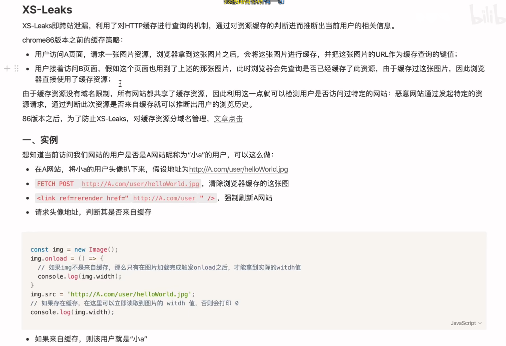

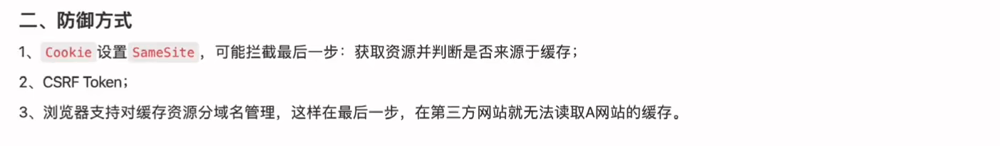

留坑代填

[小姐姐详解前端安全问题_哔哩哔哩_bilibili](https://www.bilibili.com/video/BV15i4y1j798/?spm_id_from=333.337.search-card.all.click&vd_source=d1e85ba84171f8c64e1da8ec118523f6)

# 前端工程化

## SSR（server side rendering）、SSG(static site generation：静态站点生成)、CSR（对应SPA单页面应用）

三者都属于渲染方案这个大的概念之下

SSR与SSG的对比：

* ssg就是在构建（相当于部署服务时）的时候直接把html输出到磁盘（服务器的本地存储），客户端访问时直接把提前加载好的html返回给客户端，也就是只生成1次html，特点就是快，不占用服务器资源，适合使用于个人博客系统
* ssr就是服务端渲染，针对每次http请求都去生成html，占用服务器资源比较大，但是相比于ssg应用可以实现复杂的交互性（交互性不是说点击有反应这种交互，ssg当然也有交互性，但是针对所有的用户，都是相同对待，而ssr针对不同的用户有不同的对待）
* 两者因为返回给客户端的都是已经构建好的html，所以都有利于seo

CSR（spa）与SSR的对比：

* CSR单页面应用，不会来回的页面切换，用户体验好；
* 如果项目较大，CSR首屏时间较长，用户体验差
* CSR相较于SSR，服务端的压力较小

* CSR客户端渲染，一般就是我们vue框架这种，一开始html结构就一个div空壳子，内容都是js后来生成的，不利于seo

# 项目经验

## 鼠标位置相关属性

window的某些事件的回调函数接收的事件对象`e`的属性：

* screenX与screenY，参照点是屏幕的左上角
* clientX与clientY，参照点是浏览器内容区域的左上角（不算导航栏），这个参照点会随着滚动条的移动而移动（client的意思可以理解为以用户为中心，用户不管滚动条在什么位置，用户看到的就是浏览器方框里的内容，参照点永远是浏览器可视区域的左上角）
* pageX和pageY，同client，参照点是浏览器内容区域的左上角，但是参照点不会随着滚动条而变动（说白了就是参照点永远式滚动条拉到最上面时的左上角，与page的意思对应，参照物就是这个页面，不管滚动条在上面位置，页面还是这个页面，参照点永远是页面的左上角）
* offsetX和offetY，参照点是事件源元素的左上角

## dom大小相关属性

* `HTMLElement.offsetWidth`：返回当前dom元素的包含border在内的宽度
* `HTMLElement.offsetHeight`：返回当前dom元素包含border在内的高度

## Vue框架中mounted生命周期中window.addEventListener("scroll")失效踩坑

解决方案：addEventListener第三个参数设置为true（冒泡触发）就可以正确执行回调函数

滚动事件应该和点击事件的传递机制不太一样，用户的滚轮操作相当于是事件流，这个事件流经过了有滚动条的元素，就会触发元素的scroll事件

原理：产生滚动条的元素是window的子元素，一般是body甚至是更具体的子元素，所以如果addEventLister的回调在捕获阶段执行的话，相当于事件流传到window就结束了，事件流没有经过有滚动条的子元素，所以压根没触发scroll事件，一旦设置了window在捕获阶段执行回调，那么用户的滚动行为就会经过有滚动条的元素（window的子元素），这样相当于addEventListener("scroll")中的scroll事件触发了，这样才会执行回调。

## 获取一个元素的顶部距离页面顶部的距离

1. offsetTop：元素到offsetParent顶部的距离

2. offsetParent：距离元素最近的一个具有定位的祖宗元素（relative，absolute，fixed），若祖宗都不符合条件，offsetParent为body。如下图所示：获取child的offsetTop，图1的offsetParent为father，图2的offsetParent为body

~~~js
export function getOffsetTop(obj: HTMLElement): number {
    let offsetTop = 0;
    while (obj != window.document.body && obj != null) {
        offsetTop += obj.offsetTop;
        obj = obj.offsetParent as HTMLElement;
    }
    return offsetTop;
}
~~~

## window.scrollTo方法无效

调用scrollTo的元素不一定是window，而应该是有滚动条的那一个元素

~~~typescript
const box = document.querySelector(".wrap");
if (index === 0) {
    box && box.scrollTo({
        top: 470,
        behavior: 'smooth'
    });
}
~~~

基于上面的理论，还有第二种情况：那就是滚动元素`scrollDom`是<body>（`document.body`），那么`scrollDom.scrollTo`也是无效的，这时候需要调用`window.scrollTo`。比较奇怪，遇到这个坑能解决就行了

### 判断滚动条是哪个元素产生的

浏览器中执行如下，然后滚动

~~~js
function findscroller(element){
  element.onscroll=function () {
    console.log(element)
  }
  Array.from(element.children).forEach(findscroller);
}
findscroller(document.body)
~~~

## vue中img标签:src动态设置路径无法正确加载图片的问题

因为:src里面如果写了某些js表达式，比如字符串拼接等操作，确实能正确无误的拼接出来我们想要的图片资源的路径字符串，但是之所以运行项目图片就找不到了是因为项目在webpack的devServer运行之后，默认的vue-cli配置下，图片会被打包处理成name.hash的图片名，也就是说打包之后图片名变了，不管我们:src里怎么进行计算，算出来的都是一个死的固定的字符串，我们用固定的字符串去在打包后的资源目录中寻找图片自然找不到图片

如果我们想动态设置图片路径，就需要用到`:src="require(img_url)"`的形式设置图片路径，这样的话可以确保我们的vue项目在打包后也能正确解析图片的路径，具体原理应该就涉及vue模版编译的知识了，这里挖坑待填。

还有一个疑问就是vue文件（esm）中，是如何做到使用cjs语法的呢（`require`函数的调用），包括路由懒加载，路由文件中懒加载路由组件时使用`import()`函数，这种不同模块规范下的模块的互相调用是怎么实现的？是打包工具，还是vue提供的支持呢？

## 精灵图代替gif图优化首屏加载

度成长项目首页的banner图片，右侧有一个动画效果，没有让设计直接给出gif动图，而是给出了动画每一帧的横版精灵图，让后通过关键帧动画，改变背景图的位置实现动画效果，生成关键帧动画代码的库：gka

vue项目中，在一个ts文件模块里，通过require引入图片资源项目就是跑不起来，会报错。import引入图片资源就没事。初步判断就是和webpack打包时的代码处理的loader逻辑相关，require没法正确处理。

## 记录度成长首页吸顶导航栏的实现

效果：


实现：给导航栏添加一个属性`position: sticky，官方简介：

设置了`position:sticky`的元素并不会脱离文档流。

- 当元素在区域内，元素不受定位的影响（`top`、`left`等设置无效）
- 当发生滚动，元素就要移出区域时，定位又会变成`fixed`，根据设置的`left`、`top`的值进行定位，像是`fixed`效果

概括来说就是：**元素在屏幕内的时候相当于position:relative，定位属性top、left等不生效；元素将要被移出屏幕时相当于position:fixed，根据top等定位属性进行定位**。


## offset、scroll、client


先贴一篇文章，后面用到哪个具体的属性再详细学习：

---

在下开发中经常碰到 offset、scroll、client 这几个关键字，比如 offsetLeft、offsetHeight、scrollHeight、clientTop 什么的，每次都要各种实验，这里总结一下，一劳永逸。

　　1. offset

　　offset 指偏移，包括这个元素在文档中占用的所有显示宽度，包括滚动条、 padding、 border，不包括 overflow隐藏的部分

　　offsetParent属性返回一个对象的引用，这个对象是距离调用 offsetParent的父级元素中最近的(在包含层次中最靠近的)，并且是已进行过CSS定位的容器元素。如果这个容器元素未进行CSS定位, 则 offsetParent属性的取值为根元素的引用。

​	如果当前元素的父级元素中没有进行CSS定位(position为 absolute/relative)， offsetParent 为 body

　　如果当前元素的父级元素中有CSS定位( position 为 absolute/relative)， offsetParent 取父级中最近的元素

　　obj.offsetWidth 指 obj 控件自身的绝对宽度，不包括因 overflow 而未显示的部分，也就是其实际占据的宽度，整型，单位：像素。

　　offsetWidth = border-width*2+ padding-left+ width+ padding-right

　　obj.offsetHeight 指 obj 控件自身的绝对高度，不包括因 overflow 而未显示的部分，也就是其实际占据的高度，整型，单位：像素。

　　offsetHeight = border-width*2+ padding-top+ height+ padding-bottom

　　obj.offsetTop 指 obj 相对于版面或由 offsetParent 属性指定的父坐标的计算上侧位置，整型，单位：像素。

　　offsetTop= offsetParent的padding-top + 中间元素的offsetHeight + 当前元素的margin-top

　　obj.offsetLeft 指 obj 相对于版面或由 offsetParent 属性指定的父坐标的计算左侧位置，整型，单位：像素。

　　offsetLeft= offsetParent的padding-left + 中间元素的offsetWidth + 当前元素的margin-left

　　2. scroll

　　scroll指滚动，包括这个元素没显示出来的实际宽度，包括 padding，不包括滚动条、 border

　　scrollHeight 获取对象的滚动高度，对象的实际高度;

　　scrollLeft 设置或获取位于对象左边界和窗口中目前可见内容的最左端之间的距离

　　scrollTop 设置或获取位于对象最顶端和窗口中可见内容的最顶端之间的距离

　　scrollWidth 获取对象的滚动宽度

　　3. client

　　client指元素本身的可视内容，不包括 overflow被折叠起来的部分，不包括滚动条、 border，包括 padding

　　clientWidth 对象可见的宽度，不包括滚动条等边线，会随窗口的显示大小改变

　　clientHeight 对象可见的高度

　　clientTop、clientLeft 这两个返回的是元素周围边框的厚度，一般它的值就是0。因为滚动条不会出现在顶部或者左侧

---

### offset详解：

#### offset相关的位置属性

有`offsetTop`和`offsetLeft`，都大概知道offsetTop是指当前元素距离父元素顶部的距离，我们记录一下具体包括什么：

`offsetTop= offsetParent的padding-top + 中间元素的offsetHeight + 当前元素的margin-top`：也就是说可以把当前元素包含border在内的部分看作一个整体，也就是border与margin的交界线作为起点，然后向上找，首先堆加到offsetTop上的就是当前元素的margin-top，如果offsetParent就是当前元素的直接父元素的话，那么就碰到父元素的padding-top了，堆加到offsetTop上，结束。

**写完上边的那一段，感觉是一坨大便，我觉着不应该用这种堆加的、面向过程的方式去理解，而应该面向结果的方式理解：offsetTop就是当前元素的除了margin的部分，距离定位父元素content左上角的距离**

#### offset大小相关的属性

有`offsetHeight`和`offsetWidth`：

`offsetHeight = border-width*2+ padding-top+ height+ padding-bottom`，说白了就是去除margin部分的元素的大小，毕竟margin就是透明的，一直给人的感觉就是不属于一个元素，像是一个元素周围的空气。

### scroll详解：

计数时具体包含不包含滚动条这里先不详细研究了，感觉完全类似于offset，scroll相关的属性也分为位置相关和大小相关两种，这里算不上详解，大概介绍一下：位置相关的`scrollTop`就是当前滚动元素能看到的部分的顶部，距离元素真实顶部的距离；大小相关的`scrollHeight`就是指滚动元素真实的高度（滚动条从顶拉到底经历的高度）

### client详解：

（看上面的文章吧，说的很好了，暂无自己的理解）


https://blog.csdn.net/qq_28992047/article/details/108735134


## z-index失效

z-index属性只有在定位元素中才生效，浮动元素z-index不生效


# 备战秋招面经

## HTML相关

## CSS相关

### margin属性

主要想再明确一下标准盒模型中盒子的结构。

`边界，元素周围生成额外的空白区。“空白区”通常是指其他元素不能出现且父元素背景可见的区域。——CSS权威指南`

如上，我觉着“父元素背景可见的区域”已经说明盒子之间的关系了：

1. 首先，盒子的背景（color或者image）是渲染的是content与padding区域。
2. 所以子盒子的margin就是距离父元素border与padding交界线的距离，而且margin是透明的（保证父元素背景可见）

再来说一下定位：

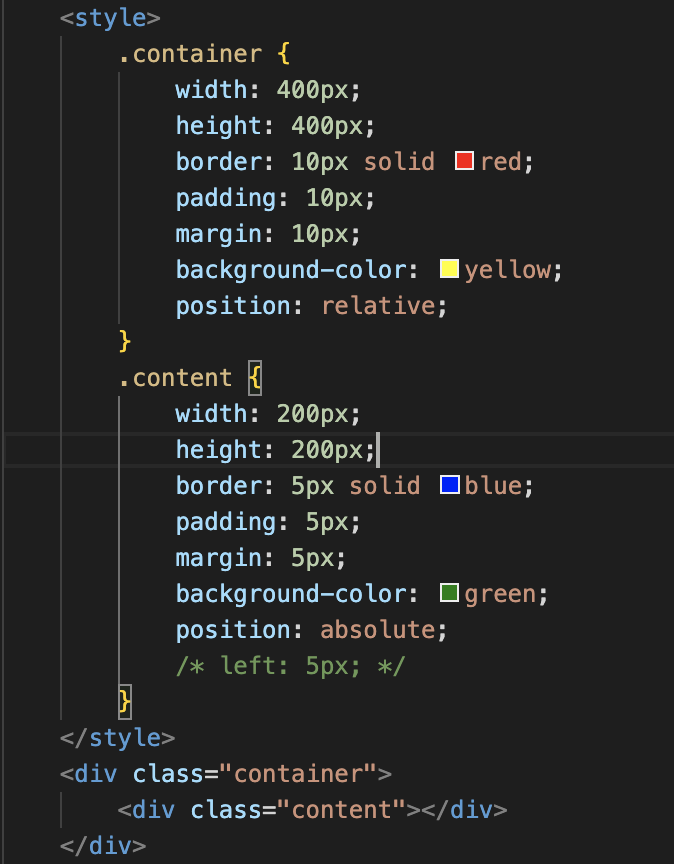

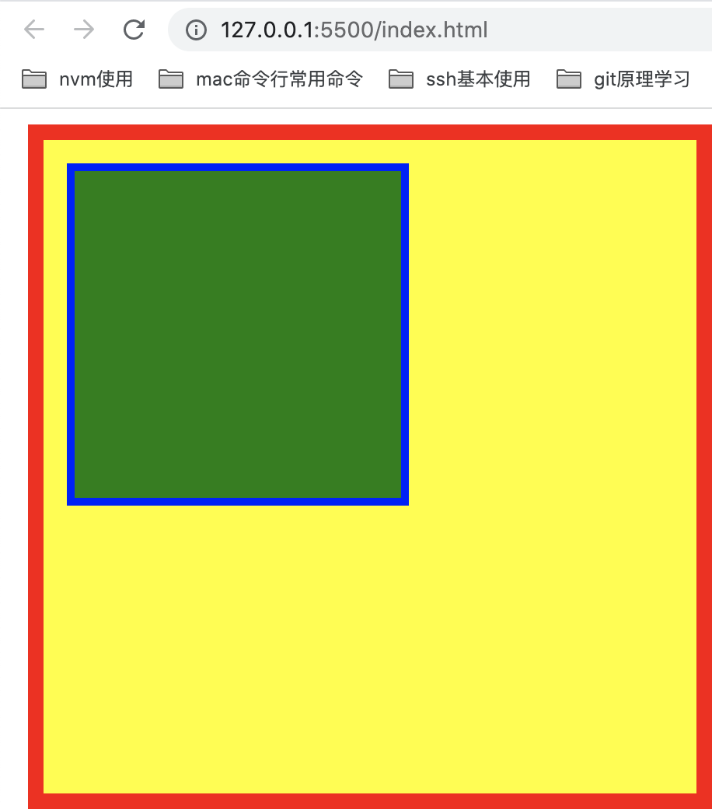

解开注释后：


说明元素定位参照父元素时，参照的也是父元素content+padding部分的左上角（padding与border交界线的左上角）。

### 实现正方形

纯CSS实现子元素为正方形，边长为父元素宽度的一半，且相对于父元素垂直水平居中，请问应如何实现？

**基于当margin-top/bottom，padding-top/bottom使用百分比时，是基于父元素宽度的，借助这个特点实现了宽高同且为父元素宽度一半**

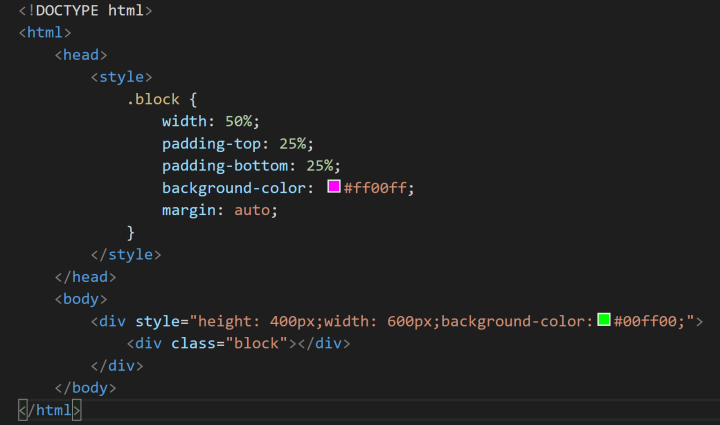

实现水平居中垂直居中：...

### 移动端适配相关

#### （看法）为什么一些h5移动端组件库如mint-ui和antd-mobile不使用rem，而是使用px？

现在h5移动端比较流行rem布局，rem能够使得页面在不同尺寸的屏幕，都有更一致的显示（和ui稿保持一致、不同尺寸下显示不变形等）。所以想请教一下：

1. 为什么一些h5移动端组件库如mint-ui和antd-mobile不使用rem，而是使用px？

2. 这一类公共组件库在设计时对于适应屏幕是如何考虑的？

**从技术层面来说**

如果业务方在项目中引入了不同的组件库，这些组件库使用rem适配方案，但是是基于不同html的font-size的。这样就会出现混乱。

**从用户体验来说（有点扯淡——与适配原则想违背）**

“用户在大屏手机上想看到的是更多的内容，而不是更大的字体和更大的按钮”

### css布局（目前之间单记录一下概念的理解）

#### 静态布局

（当前pc端一些门户网站仍采用—度成长）

页面里的大小全部写死，并为页面主体部分（布局的最外层父元素）设置`min-width`并居中，这样的话如果屏幕过大出现空白填充边缘，页面过小出现滚动条来保证主体部分的稳定呈现。

#### 流式布局

（单纯使用流式布局已成为历史）

所有容器盒子的宽度都用百分比，这样随着屏幕宽度的改变，每个元素的宽度都随之改变，容器之间整体的布局不会改变，也就是所谓的流式。但是容器的高度以及内部文字的字体大小等都是写死的px，这些东西不是“流式”的，所以极端屏幕是没发正常显示内容的。

#### 自适应布局

（也不会单单使用作为布局方案吧）

说白了就是媒体查询，根据不同的屏幕分辨率采用不同的静态布局，更直接点形容就是一个静态布局的集合，在不同的屏幕分辨率区间内使用其中的一种。自然随着屏幕大小（浏览器窗口）的动态改变，里面的元素大小都不会变化（每个设备大小区间内都是静态布局）。

#### 弹性布局（rem/em布局）

所有东西都采用相对单位rem，然后页面中所有元素保持的都是一个相对大小。参照基准就是html的font-size，这样的话因为html的font-size不变，自然弹性布局也是一个死布局。

#### 响应式布局

使用媒体查询动态改变html的font-size，并且使用rem弹性布局方案。可以理解为结合了流式（容器元素采用百分比）➕弹性（容器内部全部是相对大小）➕自适应（都采用了采用媒体查询，这里是动态改变html的font-size）。

## js相关

### cjs和es module

#### **背景**

最早js是没有模块化解决方案的，commonJs就是后来出现的一种模块化规范，现在的node运行环境就在使用这种模块化规范；es module就是ES6推出的模块化方案。两种方案都是服务于模块化，模块化就是为了解决如变量污染，代码维护，文件依赖相关的问题。

#### **基本语法**

（导入导出相关，cjs中`module.exports、exports、require`；es module中`import、export`，相关语法未整理

#### **区别**

* 导入导出的语法不同

* cjs导出的是一个值的拷贝，并且可以进行修改（cjs接收另一个模块的值的时候收到的并不是导出的变量本身，而是相当于给导入模块中的同名变量进行了一个赋值操作，导入模块中的变量是导出模块变量的复制品，两者除了值相同再无关系）：

  ~~~js
  //moduleone.js
  let module_one_num = 0;
  function add() {
      module_one_num ++;
  }
  function checkNum() {
      console.log(module_one_num);
  }
  module.exports = {
      module_one_num,
      add,
      checkNum,
  }
  
  //moduletwo.js
  let { module_one_num, add, checkNum } = require("./moduleone.js");
  add();
  console.log(module_one_num);
  checkNum();
  
  //执行node moduletwo.js
  //输出：
  //0 1
  //解释：模块2中的module_one_num其实和模块1中的module_one_num不是一个变量，我们执行add（add函数还是传的模块1中的原函数引用），相当于模块1中的add函数执行，导致模块1中的计数➕1，所以console.log(module_one_num);输出模块2中的计数并没有改变，为0；然后我们通过checkNum函数查看模块1中的计数，发现为1
  ~~~

  es module导出的是变量的引用（类似于引用，说白了就是内存中的变量本身），但是在引入这个值的模块中无法直接修改，会报错

  ~~~js
  // moduleone.js
  let module_one_num = 0;
  function add() {
      module_one_num ++;
  }
  function checkNum() {
      console.log(module_one_num);
  }
  export {module_one_num, add, checkNum};
  
  // modulethree.js
  import { module_one_num, add, checkNum } from "./moduleone.js";
  
  console.log(module_one_num);
  // module_one_num ++;  // 报错
  add();
  checkNum();
  
  export { module_one_num };
  
  // 我们在浏览器环境中（es module规范）执行一下modulethree.js模块：
  
  // index.html
  <script type="module">
      import { module_one_num } from "./modulethree.js";  // 输出： 0 1
  </script>
  
  // 解析：
  // 其实module_one_num ++;报错就说明问题了，这个module_one_num就是模块1里的那个变量（同一个变量），es module不允许我们直接对其进行修改
  ~~~

* CommonJs可以动态加载语句，代码发生在运行时；Es Module是静态的，不可以动态加载语句，只能声明在该文件作用域的最顶部，代码发生在编译时


### 胡思乱想

#### 在js中，通过bind或者其他手段改变了一个函数的this指向之后，那么这个函数的作用域链会改变吗？

chatgpt：

当使用`bind`或其他手段来改变JavaScript函数的`this`指向时，函数的作用域链并不会改变。

JavaScript的作用域链是在函数创建时确定的，并且与`this`指向无关。作用域链是由函数在创建时的词法环境（即其被定义时的环境）和嵌套作用域链构成的。

当一个函数被调用时，它的作用域链在该函数的执行上下文中被创建。这个执行上下文包含了函数的参数、变量和`this`的值，但是作用域链是不可变的。因此，即使通过`bind`或其他手段改变了函数的`this`指向，其作用域链仍然保持不变。

小demo：

~~~js
function setup() {
  let name = "jrd";
  return function () {
    console.log(name);
  };
}
const obj = {};
const test = setup().bind(obj);
test(); // 正常输出"jrd"，所以总结来说就是函数的作用域链与它的this并没有直接关系，this被改变，作用域链也不会变，作用域链只与其创建时的词法环境有关（创建时由函数嵌套关系就定了）
~~~


### js小手写

#### 1、'北京,天津,河北 北京 天津 北京'字符串转成数组

转换目标：`['北京', '天津', '河北', '北京', '天津', '北京']`

方法一：

~~~js
'北京,天津,河北 北京 天津 北京'.split(',').join(" ").split(' '); // 先得到","分隔的数组，用空格链接，拼接成字符串后城市之间的分隔符就都是空格了，再split
~~~

方法二（`split`搭配正则）：

~~~js
// 补充一个小知识盲点，正则中 xxx|xxx 和 [xxx]都表示“或”，区别就是"|"左右可以连接任何正则表达式，而"[]"内部只能是字符，或者字符范围，比如a-z
// split除了可以接收字符串作为分割字符串的标识，还可以是正则表达式，即用正则匹配到的内容对字符串进行分割
'北京,天津,河北 北京 天津 北京'.split(/,| /); // 使用"|"表示“或”
'北京,天津,河北 北京 天津 北京'.split(/[, ]/);  // 使用"[]"表示“或”
~~~

方法三（直接用正则匹配文字）：

~~~js
'北京,天津,河北 北京 天津 北京'.match(/[^\u0000-\u00FF]{1,}/g); // {1,}表示前面的正则字符重复1+次，表示匹配至少一个汉字
~~~


## TypeScript相关

### extends关键字

#### 表示接口的继承

接口A继承接口B：`interface InterfaceA extends InterfaceB {}`，表示把接口B中的所有属性添加到接口A的声明中

如下面“给泛型添加约束”中所描述的一样，接口A继承接口B表示把接口B中的所有属性添加到接口A的声明中只是最基本的情况，类似于A要包含B中的所有属性，还有一种情况，当B中某个属性为联合类型时，A继承B，那么可以在A中对B中这个属性进行重写，A中这个属性的类型为B中联合类型集合中的某一个：

~~~typescript
interface test {
    id: string | number
}

// test2继承test，并对test中的id（联合类型属性）进行重写，类型为联合类型集合中的某一个
interface test2 extends test {
    id: number
}

const testobj: test2 = {
    // id: "jrd" // 报错："jrd"不是number类型
    id: 123
}
~~~

#### 给泛型添加约束

<T extends T2>表示对传入的类型T进行约束，T必须要满足一定的条件才不报错，满足条件分两种情况：

* **当T2为一个接口时（里面包含一些属性），这时候要求T接口（对象、变量）含有T2接口中的所有属性，可以多（有T2没有的属性），但不能少。**`interface T2 { length: number }`，T为对象类型，或者字符串、数组等，但他们身上有一定的属性要求：比如T可以接收字符串，因为字符串"abc"含有length属性

* **当T2为一个联合类型，这时候要求T为T2中的某一个类型。**比如`<T extends number | string>`，那么给T传入number类型或者string类型

  ~~~typescript
  function myFun<T extends number | string> (param: T) {
      return param
  }
  myFun(123);
  myFun(true); // 报错，未通过约束限制
  myFun("abc");
  ~~~

#### 作为条件类型中的布尔判断式

`T1 extends T2 ? T3 : T4`：根据`T1 extends T2`的真假（完全等同于泛型约束的判断标准）自己制定返回一个类型（T3或者T4），说白了充当三元运算符的逻辑判断部分

## 计算机网络相关

### 网络模型

#### OSI七层模型

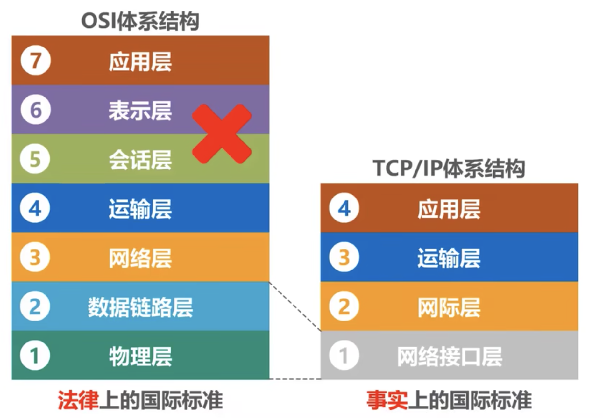

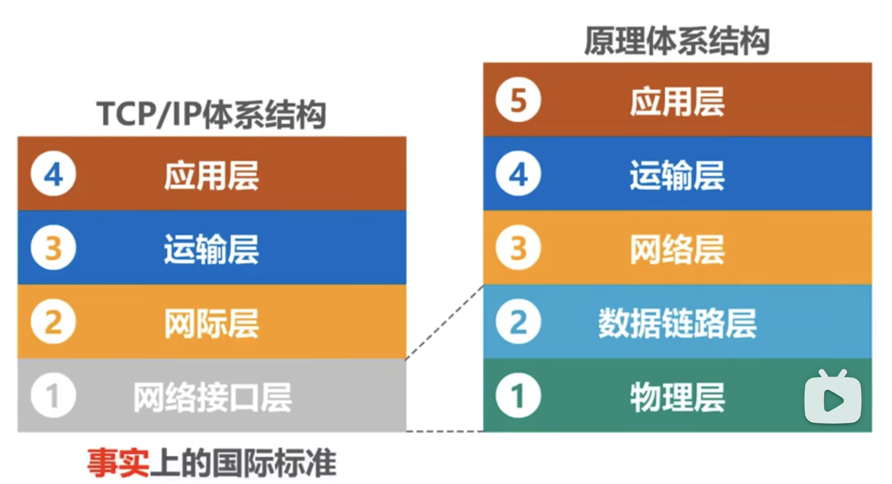

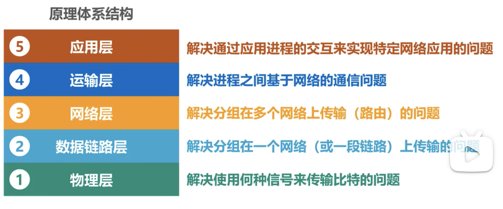

#### TCP/IP五层协议

* 应用层：http，https，DNS域名解析，FTP文件传输。（别挖坑，说熟悉的就行了）
* 传输层：TCP，UDP
* 网络层：IP，ARP（根据IP地址寻找MAC地址），ICMP（不熟别说了）
* 数据链路层：...
* 物理层：...

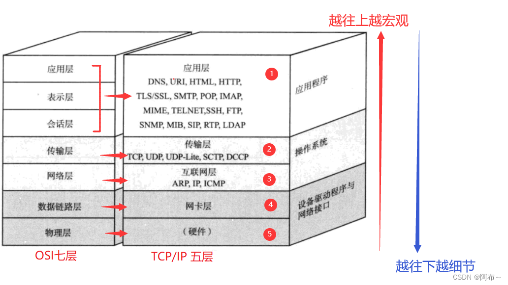

### TCP与UDP

#### TCP与UDP的概念与特点

简介：都是运输层协议

特点的话对比着来说（详情看计网笔记）：

1. TCP面向连接，UDP无需连接；
2. TCP只支持单播；UDP可以单播，多播，广播
3. TCP面向字节流；UDP面向报文
4. TCP提供的是可靠服务；UDP提供给应用层的是不可靠服务——>UDP因为检查出来错误直接丢弃报文，虽然不可靠，但是快；TCP可靠但是慢——>应用场景：UDP应用于视频等实时应用；TCP应用于文件传输等
5. TCP报文首部字段有很多，比如什么序号、确认号、检验和等（应为要处理的逻辑多）；UDP的首部仅仅是在网络层基础上添加了区分应用进程的端口号

#### TCP可靠传输的实现

（根据个人理解来的，网上有很多很细的答案）

可靠传输：没差错、不缺失、不重复、有顺序

没差错：检验和字段+检错算法

不缺失：超时重传机制，每个发送的TCP报文都等待一个确认报文，时限内收不到就重传此TCP报文

不重复：根据滑动窗口，每收到一个TCP确认报文，发送窗口都会根据确认报文的确认号ack移动滑动窗口，将不在滑动窗口外的，已经发送的数据丢弃

有顺序：接收方根据收到的TCP数据报的seq进行排序然后再交给应用层

#### TCP的拥塞控制

所谓拥塞，就是对网络性能资源的需求超出了所能提供的限度，不但网络性能资源不会随需求增加，反而会破坏网络性能导致网络性能资源随需求增加而下降。

四种拥塞控制算法维护一个拥塞窗口cwnd（详情看计网笔记）：

1. 慢开始：每一TCP交互轮次没有超时就2倍增长cwnd，cwnd增长快，慢是指cwnd小，但不是增长速度小
2. 拥塞避免：cwnd超过慢开始门限之后，每次TCP交互cwnd增加1，避免并不是说能避免拥塞，而是指cwnd线性增长，比较不容易出现拥塞。
3. 快重传：为了防止拥塞误判（比如TCP报文丢失造成超时重传而不是拥塞），发送方在TCP数据报超时重传之前，一旦收到对某个数据报3个连续的重复确认就立即重传对应的报文，这样就可以避免误判
4. 快恢复：一旦收到了三个连续的重复确认，我们并不直接把cwnd置为1从头开始（超时重传时的处理方法），而是置为收到三个连续重复确认时cwnd的一半

#### TCP的流量控制

TCP使用**滑动窗口机制**实现对发送方的流量控制：让发送方的发送速率不要太快，要让接收方来得及接收，避免造成数据丢失（发送方的发送速率要考虑接收方的接收能力）：

发送方每发送一个TCP数据报，都会根据收到的TCP确认报文的`ack`和`rwnd`对自己的发送窗口进行移动

* 发送窗口的起始点移动到`ack`
* 发送窗口的大小调整为`rwnd`

#### TCP三报文握手

##### 过程举例

1. 两台要基于TCP进行通信的主机，其中一台主机的某个应用进程主动发起TCP连接，称为TCP客户；另一台被动等待TCP连接建立的应用进程成为TCP服务器


2. 最初两端的TCP进程都处于关闭状态


3. TCP服务器进程创建传输控制块，用来存储TCP连接中的一些重要信息，TCP服务器进程进入**监听状态**，等待TCP客户端的连接请求。TCP服务器应用进程是被动等待来自TCP客户进程的连接请求，而不是主动发起，称为被动打开连接

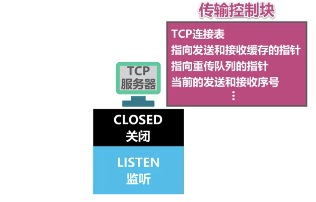

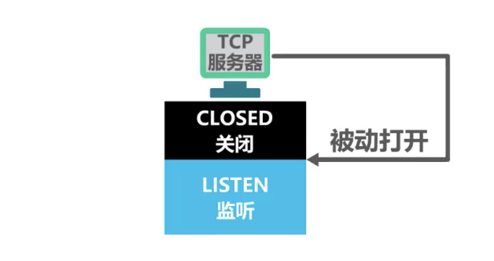

4. TCP客户进程也是先创建传输控制块，然后在打算建立TCP连接时想TCP服务进程发送TCP连接请求报文段，并进入**同步已发送状态**，成为主动打开连接：

   `SYN=1`：TCP连接请求报文段首部中的同步位SYN=1表示这是一个连接请求报文段（SYN被设置为1的报文段不能携带数据，但要消耗掉一个序号）

   `seq=x`：序号字段seq设置初始值x表示TCP客户进程所选择的初始序号

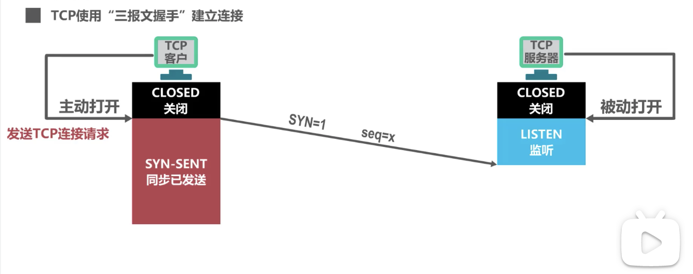

5. 服务器进程发送连接请求确认报文段，并进入**同步已接收**状态

   `SYN=1 && ACK=1`：表示这是一个连接请求确认报文段

   `seq=y`：TCP服务进程选择一个初始值y作为初始序号

   `ack=x+1`：确认字段ack设置为x+1，表示对TCP连接请求报文初始序号的确认

   （这个报文段也不能携带数据，因为SYN为1，但同样消耗掉一个序号

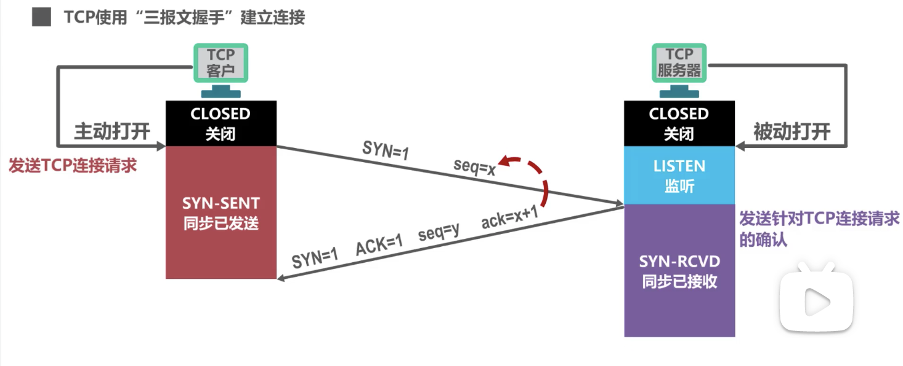

6. TCP客户进程收到连接请求确认报文段之后还要发送一个普通的TCP确认报文段（普通：没有SYN），并进入连接已建立状态；服务进程收到这个确认报文之后也进入连接已建立状态，双方可以进行数据传输了：

   `ACK=1`：表示这是一个普通的确认报文段

   `seq=x+1`：因为第一个连接请求报文的序号为`x`并且不携带数据

   `ack=y+1`：这是对TCP服务进程所选初始序号的确认

   TCP规定，普通的TCP报文段可以携带数据，但如果不携带数据，则不消耗序号，也就是说下一个TCP数据报文段的序号还是`x+1`

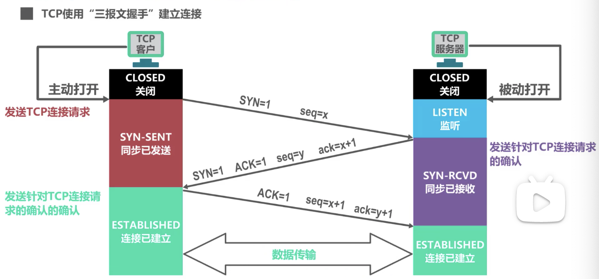

##### 最后一个普通的确认报文是否多余？

（能否使用两报文握手建立连接呢）

**三报文握手是为了防止已经失效的TCP连接请求报文段突然又传送到TCP服务器，进而让服务器进入连接建立状态，导致错误（浪费资源）**

举例说明：

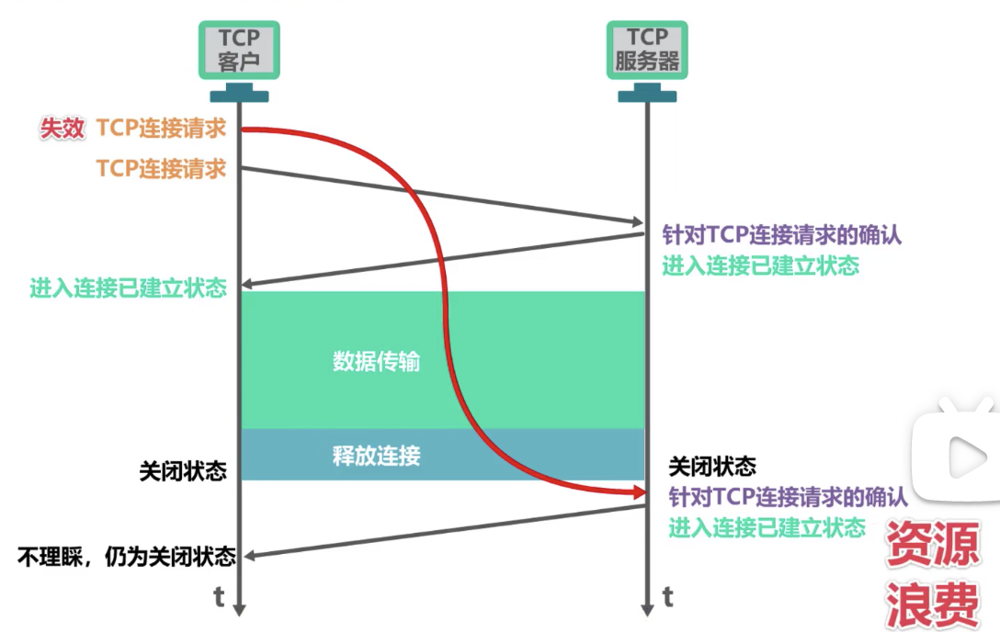

第一个TCP连接请求在网络中滞留了，然后导致TCP客户进程超时重传，然后第二个TCP连接正常建立最后正常关闭，但是这时候那个滞留的TCP连接请求又到了TCP客户进程那里（这时候我们假设是两报文握手），这就导致TCP服务进程建立连接，并发送确认报文，但是TCP客户进程那边已经是关闭状态了，不会理会这个确认报文，所以不进行处理——TCP服务进程独自等待

**简而言之，TCP客户进程建立连接时可能因为连接请求的滞留而发送多个连接请求，为了防止已经失去时效（针对TCP客户进程已经失去时效）的连接请求让TCP服务进程独自进入连接建立状态，所以TCP客户进程最后还要发送一个TCP确认报文。**

#### TCP四报文挥手

##### 过程举例

双方都可以主动关闭连接，假设TCP客户进程主动关闭连接：

1. TCP客户进程发送TCP连接释放报文段，并进入终止等待1状态

   `FIN=1 && ACK=1`：表明这是一个TCP连接释放报文段，同时也对之前收到的报文进行确认

   `seq=u`：u等于TCP客户进程之前已发送的字节序号加一

   （TCP规定终止位FIN等于1的报文段即使不携带数据，也要消耗掉一个序号

   `ack=v`：v等于客户进程之前已经收到的最后一个字节的序号加一

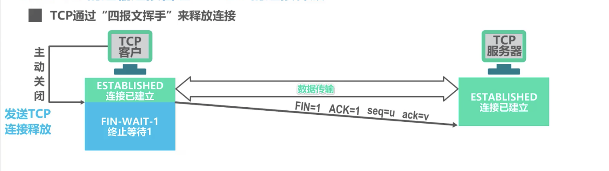

2. TCP服务进程收到连接释放报文段之后发送一个普通的TCP确认报文并进入关闭等待状态

   `ACK=1`：表示这是一个普通的确认报文

   `seq=v`：v等于服务器进程之前已传送的字节序号加一，也就是释放请求报文的ack=v中的v

   `ack=u+1`：对连接释放报文的确认

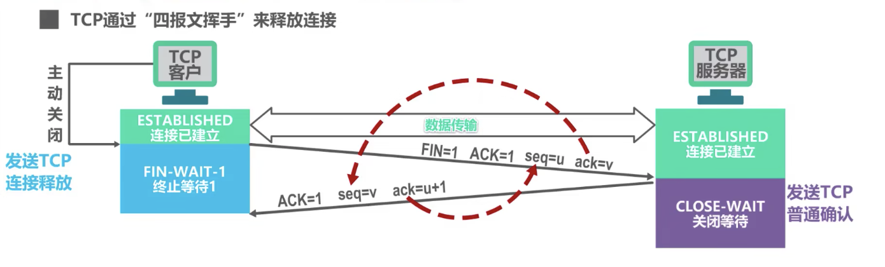

 3. TCP服务进程通知高层应用进程——TCP客户进程要断开与自己的TCP连接，这时候TCP客户进程到TCP服务进程这个方向的连接就释放了。

    这时TCP连接属于半关闭状态：TCP客户进程已经没有数据要发送了

 4. TCP服务进程继续发送数据，TCP客户进程处于终止等待2状态等待并接收TCP服务进程的数据传输

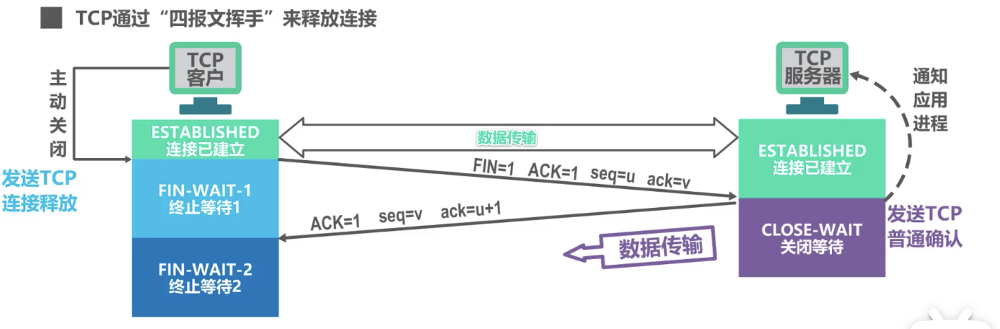

5. TCP服务进程数据发送完毕，使用TCP服务进程的应用进程通知TCP服务进程释放连接，TCP服务进程发送TCP连接释放报文段并进入最后确认状态

   `FIN=1 && ACK=1`：表示这是一个连接释放报文段，同时也对之前收到的报文段进行确认

   `seq=w`：TCP服务进程在半关闭状态又发送了一些数据，所以为w（而非v）

   `ack=u+1`：这是对之前收到的连接释放报文的重复确认

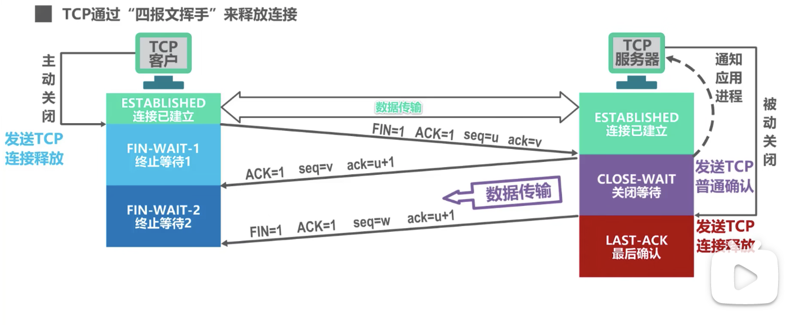

6. TCP客户进程针对释放报文发送一个普通确认报文随之进入时间等待状态，确认号ack字段的值设置为w+1（针对收到的上一个关闭报文的seq=w），seq为u+1（针对发送的上一个释放报文的seq=u）

7. 这时候TCP服务进程进入关闭状态，但是TCP客户进程还要经过2MSL后才能进入关闭状态

   （MSL：Maximum Segment Lifetime最长报文段寿命

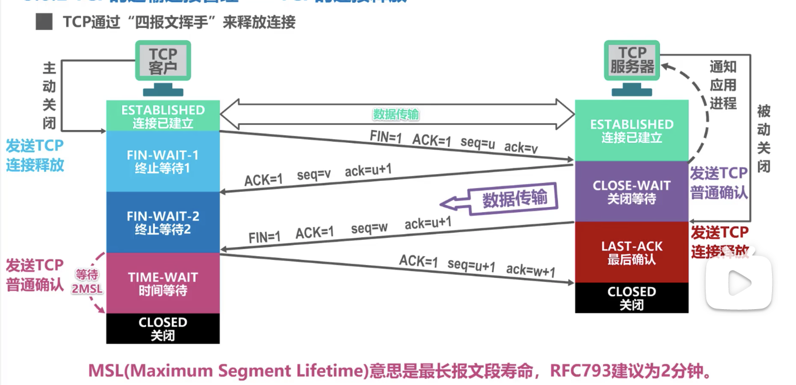

##### TCP服务进程有必要等待2MSL再关闭TCP连接吗？

**时间等待状态以及处于该状态2倍MSL的时长可以确保TCP服务进程可以收到TCP应用进程最后的确认报文**

TCP客户进程发送了最后一个连接释放确认报文后直接进入关闭状态，但是确认报文丢失了，导致TCP服务进程收不到最后的确认，没法关闭，然后超时重传连接释放报文，但是TCP客户进程已经关闭....TCP服务进程反复重传TCP释放报文，而且收不到确认报文无法进入关闭状态。

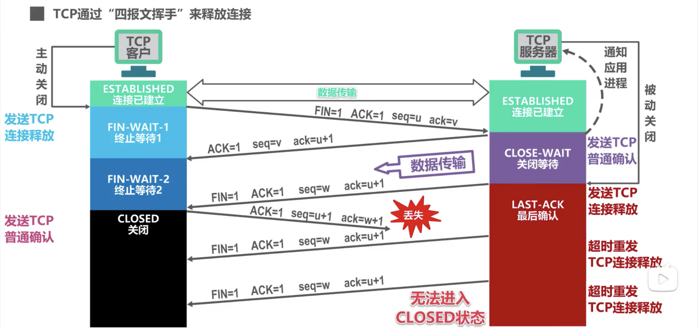

### http协议

#### http请求报文格式

前置概念：

* ascll码：因为计算机信息计算，传输都是针对二进制数的，所以ascll编码就是：现代英语和西欧语言中英文字母以及一些字符对应的二进制数，比如A的ascll码为65（二进制）

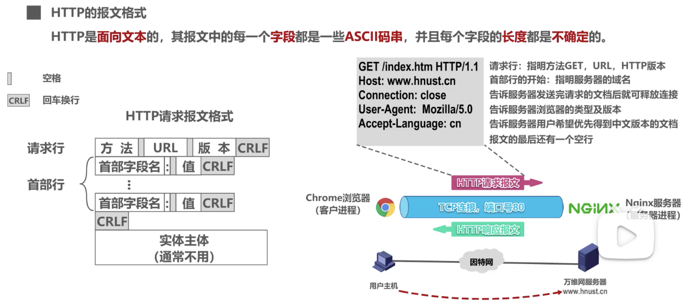

**重点提取：**

* http是面向文本的：请求报文（响应报文）都是文本，报文中的每一个字段都是ascll码串，每个字段长度都不是固定的，所以http请求报文（包括响应报文）的格式化不限制字段的长度

* 请求报文格式直接一个例子：

  ~~~
  GET<空格>/index.html<空格>HTTP/1.1<换行>
  Host:<空格>www.baidu.com<换行>
  ...
  Key:<空格>value
  <空行>
  <请求数据>  // 抓包抓了半天没有找到带有请求数据的http请求，不是https就是没数据的http
  ~~~

* http请求报文常用的首部字段

  * `Host`：指明服务器的域名或者ip地址。该字段可以为空但必须有，否则服务器返回400 bad request
  * `If-modified-since`：针对浏览器的协商缓存策略，`If-modified-since`字段的值为上一次相同请求的http响应报文中`Last-Modified`字段的值，服务器端判断资源如果没过期，返回`304`状态码，客户端直接使用浏览器缓存
  * `If-None-Match`：与`If-modified-since`同理，其值对应的响应字段为`Etag`。`Last-Modified`与`Etag`两者只是协商缓存策略的两种不同的资源标识
  * `Connection`：若取值为`close`即告诉服务器发送完请求的资源就可以立即释放TCP连接

#### http响应报文格式

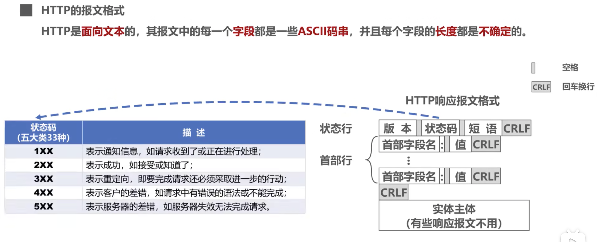

**重点提取：**

* 基本格式与请求报文类似，只有第一行状态行，例如`HTTP/1.1 200 OK`

* http响应报文常用的首部字段：

  * `cache-control:max-age=?`/`expires`：http强制缓存相关，表示资源的一个有效时间（若下一次http请求相同的资源，如果没过期直接用浏览器缓存而不用发请求。）

    plus：cache-control是http1.1的头字段，expires（过期时间）是http1.0的头字段,如果expires和cache-control同时存在，cache-control会覆盖expires（服务器会优先处理cache-control）

  * ...

* http常用状态码：
  * ...


#### http1.0

HTTP 1.0规定浏览器与服务器只保持短暂的连接，浏览器的每次请求都需要与服务器建立一个TCP连接，服务器完成请求处理后立即断开TCP连接，服务器不跟踪每个客户也不记录过去的请求。

**简单概括：短暂连接 && 无状态**


#### http1.1

1. 增加以及改进了很多首部字段，分别提供了不同的特性与功能：
   * 支持长连接，请求报文中设置`Connection: keep-alive`即响应通信完成后不会立即断开TCP连接（对应短连接的请求头`Connection: close`）
   * 比如http/1.0中通过`expires`设置资源过期时间，http/1.1增加`Cache-control`字段控制缓存相关，其取值：
     * private：客户端可以缓存
     * public：客户端和代理服务器均可缓存
     * max-age=xxx：缓存的资源将在 xxx 秒后过期
     * no-cache：需要使用协商缓存来验证是否过期
     * no-store：不可缓存
   * 以及响应报文中资源标识字段提供了`Etag`（http/1.0：`Last-Modified`），对应的请求报文中头部字段`If-None-Match`（http/1.0：`If-modified-since`）
   * 增加`host`字段：例如这么一种情况，我们的A项目和B项目都部署在一个（大型）服务器上，两个项目肯定是在不同端口（基于操作系统的规定），我们给服务器的ip地址申请了两个域名，希望通过域名a能访问A项目，域名b能访问B项目。我们用一个Nginx服务代理两个不同端口上的A和B项目，也就是客户端的请求发给Nginx服务器，Nginx服务器再转发给A或者B，`host`字段就是用来让Nginx区分转发给谁的字段，这时候`host`字段的值就是一个标志，只是规范上我们一般取不同的域名。这时候如果没有`host`字段，我们的http报文到达了目的ip的目的端口（Nginx服务），也不能正确找到目的应用程序。

2. 支持流水线（Pipelining）的工作方式： HTTP 1.1允许客户端不用等待上一次请求结果返回，就可以发出下一次请求，但服务器端必须按照接收到客户端请求的先后顺序依次回送响应结果，以保证客户端能够区分出每次请求的响应内容。

3. 增加100（continue）状态码——节约带宽

   HTTP/1.1加入了一个新的状态码100（Continue）。客户端事先发送一个只带头域的请求，如果服务器因为权限拒绝了请求，就回送响应码401（Unauthorized）；如果服务器接收此请求就回送响应码100，客户端就可以继续发送带实体的完整请求了。100 (Continue) 状态代码的使用，允许客户端在发request消息body之前先用request header试探一下server，看server要不要接收request body，再决定要不要发request body。**防止白白传输较大的数据**

4. Chunked Transfer Coding（不了解）

5. revalidation：HTTP/1.1在1.0的基础上加入了一些cache的新特性，当缓存对象的Age超过Expire时变为stale对象，cache不需要直接抛弃stale对象，而是与源服务器进行重新激活

#### http/1.0与http/1.1的队头阻塞问题

队头阻塞问题本质上是由于http基本的**请求-应答**模型所导致的，而与是否开启长连接没有关系：所谓队列，是指客户端的等待处理（响应）的http请求组成了一个队列，先发出的http请求位于队头，发出越早越靠近队头。

* http/1.0规定：只有这一次请求的响应到达之后，才能发出下一个请求，如果这一次请求的响应迟迟收不到（因为网络问题或者响应本身耗时大），就会导致下一个请求无法发送，后面的所有请求都同样阻塞了。此时队列理解为：队列中存放的是所有等待发送的http请求，队列中的http请求队首出队时相当于发出请求并等待响应（当然也包括TCP连接、释放的一整套流程），然后才是下一个队头出队。**http/1.0的队列位于客户端**
* http/1.1中即使`connection: keep-alive`开启长连接并且使用流水线工作方式解除了对发送请求要在上一个请求收到响应之后这个限制，但也要求客户端收到响应时按照http请求发送的顺序接收，此时队列里存放的相当于所有发送出去的（服务端接收到的）http请求，队首出队相当于收到了队首请求的响应（服务端发出了对队首请求的响应），**http/1.1的队列位于服务端**

plus：http/1.1的流水线技术存在各种各样的问题，所以很多浏览器要么根本不支持它，要么就直接默认关闭，并且开启的条件很苛刻…而且实际上好像并没有什么用处。

所以总而言之，**http/1.1并没有解决队头阻塞问题，只是把先进先出队列从客户端（请求队列）迁移到服务端（响应队列）**

因为http/2.0之前的http协议本身无法解决队头阻塞问题，所以也就有了浏览器连接的并发支持：对于同一个域名,浏览器最多只能同时创建 6~8 个 TCP 连接 (不同浏览器不一样)，但是并发数量是有限制的，限制的原因有很多，其中一方面极端一点可以理解为防止DDos攻击（攻击一个服务器：向一个服务器发送超出服务器多请求处理能力的超多请求）

浏览器请求并发规则与限制原因相关文章：https://blog.csdn.net/xzhlg57656/article/details/128716566


#### http2.0

相关参考

https://cloud.tencent.com/developer/article/2137506

http://events.jianshu.io/p/51b2a9c98fca

##### 二进制分帧

说白了就是在应用层的http2.0报文到传输层被封装为TCP报文之前会经过一个二进制分帧层，这个Binary Framing层就会把http2的报文处理成二进制帧的格式，原来的`http/1.x`报文总体分为头部帧`headers frame`和数据帧`data frame`，然后头部帧 和数据帧又能够分为多个片断帧，例如`data frame = data_1 + data_2 + ... + data_n`。

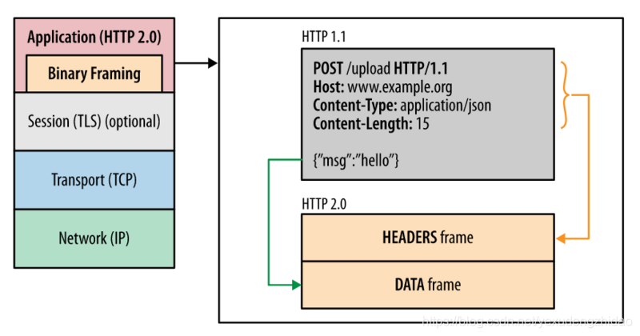


具体每个帧的格式（说白了就是http报文的一种格式）：

注意每一帧又分为`Frame Header`和`Frame Playload`


##### 流

**流的概念**：流是二进制帧的双向传输序列，换句话说一个 HTTP/2 的流就等同于一个 HTTP/1 里的一个“请求-应答”。（对于一个http2的请求与这个请求的响应，请求的所有片段帧与响应的所有片段帧使用同一个流ID）

**流的特点**：

https://cloud.tencent.com/developer/article/2137506

1. HTTP/2遵循一个TCP上复用多个“请求 - 应答”，意味着一个 HTTP/2 连接上可以同时发出多个流传输数据，并且流可以并发传输实现“多路复用”；
2. 客户端和服务器都可以创建流，并且互不干扰；
3. HTTP/2支持服务端推送，流可以从客户端或者服务端出发；
4. 流内部的帧是有严格顺序的，但是流之间互相独立；
5. 流可以设置优先级，让服务器优先处理特定资源，比如先传 HTML/CSS，后传图片，优化用户体验；
6. **流 ID 不能重用**，只能**顺序**递增，客户端发起的 Stream ID 是奇数，服务器端发起的 Stream ID 是偶数；
7. 在流上发送“**RST_STREAM**”帧可以随时终止流，取消流的接收或发送；
8. 第 0 号流比较特殊，它**不能关闭，也不能发送数据帧**，只能发送**控制帧**，用于流量控制。

##### 多路复用

所谓http2多路复用，可以理解为**多个http请求-问答复用一个TCP连接**，即代替了HTTP1.x的序列和阻塞机制，所有的相同域名请求都通过同一个TCP连接并发完成，消除了因多个 TCP 连接而带来的延时和内存消耗。
单个TCP连接上可以并行交错的请求和响应，流之间互不干扰。但对于每个流（请求-应答），内部的帧是有严格顺序的。

##### 服务器推送

**在客户端请求之前预判性的响应**

服务端根据客户端的请求，提前返回多个响应，推送额外的资源给客户端。如下图，客户端请求stream 1(/page.html)。服务端在返回stream 1的消息的同时推送了stream 2(/script.js)和stream 4(/style.css)


##### 头部压缩

HPACK算法头部压缩的思想就是客户端与服务端都维护一份相同的字典，字典中的键`key`为哈夫曼编码，字典中的`value`为原来http1.x的首部字段键值对。

（哈夫曼编码：出现频率高的编码短

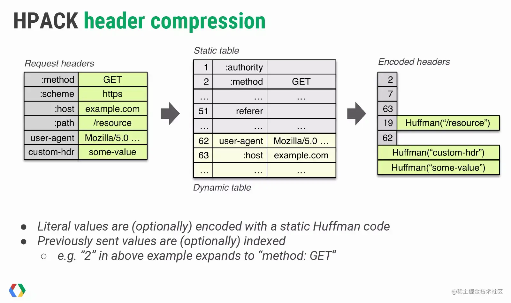

#### https

参考文章：https://juejin.cn/post/6844904100035821575#heading-74

按照以前的理解，https大致为：

客户端生成一个对称加密的密钥用公钥加密后传给服务端，客户端用私钥解密得到对称加密的密钥，往后的通讯都通过这个对称加密密钥进行加密传输。

结合下图，纠正错误：

* 首先上面所说的我们最终给报文加密的对称加密的密钥（会话密钥），是分别在客户端与服务端生成的，而不是客户端生成并传送给服务端的。客户端通过非对称加密并传输给服务端的是预主密钥，这是生成最后会话密钥的一个组成部分。

https过程理解升级版（大致意思）：

1. 客户端生成随机数1并传送给服务端（传送的还有其他东西并且随机数什么的都是根据某种对应的算法）

2. 服务端响应，生成随机数2（还包括证书和签名——一些安全相关的东西）并传送给客户端

3. （客户端验证证书签名后）生成预主密钥，预主密钥用公钥加密后传送给服务端——>`随机数1+随机数2+预主密钥=会话密钥`

   （**非对称加密**传送预主密钥）

4. 服务端用私钥解密得到预主密钥——>`随机数1+随机数2+预主密钥=会话密钥`

5. 服务端与客户端的通信就通过相同的会话密钥对信息进行**对称加密**

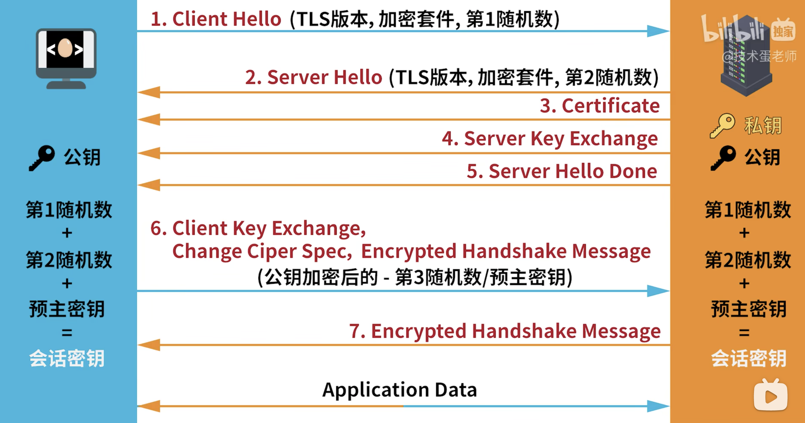

#### http“最佳实践”

参考文章：https://juejin.cn/post/7034668672262242318#heading-30

**最佳CP `HTTP2 + HTTPS`感觉说白了就是http2来给https的性能消耗（握手传输+加密计算）擦屁股，从而速度、安全双得。**

https其实就是建构在SSL/TLS之上的 http协议，所以要比较https比http多用多少服务器资源，这个主要看SSL/TLS本身消耗多少服务器CPU资源。网络部分：http使用TCP 三次握手建立连接，客户端和服务器需要交换3个包，https除了 TCP 的三个包，还要加上 ssl握手需要的9个包，所以一共是12个包。CPU部分因为HTTPS有加解密过程，所以会消耗更多的资源。而HTTP2.0 标准中，虽然没有强制提出要使用加密（HTTPS）但是目前**主流浏览器，chrome、火狐等都已经公开宣布只支持加密的HTTP2（浏览器商也有强制绑定）**，所以目前互联网上能见到的HTTP2基本都是基于HTTPS协议的。HTTPS保证了传输的安全性却造成了额外的性能开销，而HTTP2的出现正好通过多路复用，头部压缩等特性大大的提升了传输性能。不得不说，HTTP2 + HTTPS是新一代web服务的最佳组合。

### 域名系统DNS（Domain Name System）

#### DNS协议理解

DNS是域名系统的缩写，个人理解就是因特网上分布的web应用，提供域名到ip地址的转换服务，所以DNS不是网络协议

#### DNS同时使用TCP和UDP协议？

**DNS与TCP/UDP的关系：**DNS是应用层的一个应用进程，其产生的DNS请求报文是一个应用层报文，然后这个DNS请求到了运输层会被TCP或者UDP协议包装成TCP数据报或者UDP数据报

* 子域名服务器向父域名服务器发送DNS查询以更新数据变更时（服务器间数据同步）使用TCP协议，追求准确
* 客户端向DNS服务器查询域名时使用UDP协议，追求快速

#### DNS完整的查询过程

在浏览器中输入一个域名回车：

1. DNS客户端进程所在的主机首先会在自己的**DNS高速缓存**中查找IP，没有找到
2. 向网络中的DNS服务器A进行**递归查询（所谓递归：查询操作比作一个函数query(出发点)，`query(用户主机)`函数体内`return query(DNS服务器)`）**向DNS服务器A索要最后的一个查询结果，这个DNS服务器A执行**迭代查询**：根据查询结果依次查询其他的DNS服务器直到找到ip
3. 最后DNS服务器A把查询到的域名对应的ip地址传给客户端DNS应用进程

## 工程化

### CICD

#### 概念

CICD本质上来说就是我们软件开发过程中一系列标准的流程

CI——continus integration，持续集成的意思，通俗解释就是频繁的将代码集成到主干，再通俗一点就是我们频繁的向main分支提交代码。这样做的好处有两点：

* **快速发现错误。（出错了，因为更新内容比较少，定位也比较容易）**每完成一点更新，就集成到主干，可以快速发现错误，定位错误也比较容易。
* **防止分支大幅偏离主干。（尤其是多人合作开发，主干分支在不断更新，我们这边被主干落远了很可能集成（merge或者pr）也集成不上去了）**如果不是经常集成，主干又在不断更新，会导致以后集成的难度变大，甚至难以集成。

**持续集成的目的，就是让产品可以快速迭代，同时还能保持高质量。**即然这种频繁的提交（持续集成）很有必要，那如何对这种行为本身进行保障呢

保证持续集成安全性的核心措施就是：代码集成到主干之前，必须通过自动化测试。只要有一个测试用例失败，就不能集成。

比如我们github Actions中的配置workflow，里面配置`.yml`文件，里面定义一些行为以及这些行为触发什么对应的操作，比如提交代码时自动跑lint检查等。其实这就是CI的保障措施


CD—— **持续交付（Continuous delivery）** 或者 **持续部署（continuous deployment）** 或者是两者的并集。

**持续交付（Continuous delivery）指的是，频繁地将软件的新版本，交付给质量团队或者用户，以供评审。**如果评审通过，代码就进入生产阶段。

**持续部署（continuous deployment）是持续交付的下一步，指的是代码通过评审以后，自动部署到生产环境。**


我觉着，公司里的提测就是一种containous delivery行为，然后测试没问题之后的上线，就是continuous deployment行为。都是CD

#### 实操

用github action可以模拟，编写`.yml`文件配置`行为：脚本`，脚本里跑一下测试，就模拟了ci的保障工作，比较简单。然后github配合vercel，完全可以做到全自动部署（vercel关联一下github项目就傻瓜式的完成了cd...）

以后有机会再动手尝试自己的cicd吧

https://devpress.csdn.net/cicd/62ed9b157e66823466181357.html


### 包管理工具安装依赖生成的lock文件需要提交到远程仓库吗

需要，`package.json`里面的依赖列表只能限制直接依赖的版本，但是`.lock`文件详细记录了包括间接依赖在内的所有依赖的版本，所以为了保证间接依赖也安装正确，所以`lock`文件是有必要记录并提交的。


## 设计模式


### 工厂模式


参考axios源码，`axios.create`方法就是一个工厂函数（可以用来创建实例）：

~~~js
class Axios {
  ...
}

// plus: 代码有出入，但核心就是这样子
function createInstance(defaultConfig) {
  
  const instance = new Axios(defaultConfig);
  
  ...

  // Factory for creating new instances——源码里的备注，意思是axios上挂载的这个create函数，就是一个工厂函数，我们拿着axios.create即可以用来创建新的Axios实例
  instance.create = function create(instanceConfig) {
    return createInstance(mergeConfig(defaultConfig, instanceConfig));
  };

  return instance;
}
  
const axios = createInstance(defaults);

export { axios as default, Axios... } // 这是最后整个axios库的导出，所以说白了默认导出的是一个Axios类的实例
~~~

这里写上面的源码主要还是想针对以往项目里对axios的封装进行一下解释（通透了），一般的封装：

~~~js
import axios from "axios";

const requests = axios.create({
    ... // 一些配置
})
  
//请求拦截器
requests.interceptors.request.use(...);

//响应拦截器
requests.interceptors.response.use(...);

export default requests;
~~~

解释一下：

1. `import axios from 'axios'`本身引入的`axios`就是`Axios`类的实例，通过源码可知，创建`axios`的时候并不是单纯`new Axios`出来的，而是借助`createInstance`方法又给`new`出来的对象进行了一些额外的操作，包括挂载了`create`（工厂）方法，所以我们在项目中可以执行`axios.create`
2. 再来说一下`Axios`实例身上的`create`方法，它是递归调用`createInstance`方法，但是把原配置对象与新传入的配置对象进行了`mergeConfig`，所以我们可以通过`axios.create({配置})`来给新的`Axios`实例添加配置


### 单例模式

以项目中axios的使用为例，我们整个项目封装好了一个`Axios`对象之后，整个项目都在使用这一个`Axios`实例进行网络请求

包括Vue源码中，`reactivity`模块的`effect.ts`文件中，为了收集`reactive`对象（某个属性）的依赖，也只全局创建了一个`WeakMap`类型的对象`targetMap`——全局唯一的容器

以及Vue很多`.ts`文件中一些标记变量都是整个文件（模块）共享，比如`activeEffect`（上一个被触发的副作用/即将被收集的副作用）...


### 策略模式

chatGPT给出的例子：

~~~js
class Context {
  constructor(strategy) {
    this.strategy = strategy;
  }

  executeStrategy(num1, num2) {
    return this.strategy(num1, num2);
  }
}

const add = (num1, num2) => num1 + num2;
const subtract = (num1, num2) => num1 - num2;
const multiply = (num1, num2) => num1 * num2;
const divide = (num1, num2) => num1 / num2;

const context = new Context(add);
console.log(context.executeStrategy(10, 5));  // Output: 15

context.strategy = subtract;
console.log(context.executeStrategy(10, 5));  // Output: 5

context.strategy = multiply;
console.log(context.executeStrategy(10, 5));  // Output: 50

context.strategy = divide;
console.log(context.executeStrategy(10, 5));  // Output: 2
~~~

在上面的示例中，Context 类代表一个上下文对象，它包含一个策略对象，并使用 executeStrategy() 方法执行算法。策略对象是一个函数，包括 add、subtract、multiply 和 divide 四种算法，它们分别接收两个数字参数并返回计算结果。

在运行时，可以根据需要选择不同的策略函数，并将其传递给上下文对象。上下文对象将委托执行请求给策略函数，而不需要知道具体的实现细节。

自己的理解：我们根据不同的情景可以让 **策略接口选择不同的策略**（策略可以灵活更改、替换）

策略模式是遵循**开闭原则**（设计原则之一）的一种设计模式，开闭原则是指：**对扩展开放，对修改关闭**。通俗的意思就是假如我们要给某个类添加功能，我们应该使用继承的方式创建一个子类，然后从子类中拓展功能，对于父类来说，作为一个基类，可以随意被继承——对拓展是开放的；父类本身的代码逻辑在拓展过程中是不会被修改的——对修改关闭。

以自己的组件库开发经历来说，我写了一个配置型组件（而不同于主流组件库中的父子组件通过插槽组合来实现功能的特点），我们组件ui的生成，都基于自身接收的配置，**配置型组件的一个优势就是完全符合开闭原则。**

* **针对某个配置项拓展一个新的配置取值，这里就是一种策略的拓展，策略拓展本身也是开闭原则（增加逻辑而不修改以前）的体现**
* 针对新增配置项，其实和策略模式没啥关系，因为这相当于新增一个策略接口，但这种行为是符合开闭原则的。

业务编码中，使用`Map`代替`级联if-else`也是策略模式的应用：

~~~typescript
const doSomething = (age: number) => {
  if(age === 20) { ... }
  if(age === 30) { ... }
  if(age === 40) { ... }
  ...
}

// 使用策略模式：
// 存放策略的Map，key就相当于策略接口值，后面的函数就是对应的策略
const doMap: { [key: number]: (...any[]) => any } = { // 这里对象的key只能为string类型，语法层面可能有问题，不重要
  20: () => { ... },
  30: () => { ... },
  40: () => { ... }
}

// doSomething就相当于策略接口，根据接收的参数选择不同的策略
const doSomething = (age: number) => {
  doMap[age]?.();
}
~~~

#### 总结：

**聊到策略模式，首先是符合开闭原则的一种设计模式，举个具体的例子，就是配置型风格的组件，不管是拓展属性取值或者是拓展属性，都是拓展策略的体现（拓展属性取值更切合一点）。再从平时业务代码开发中举个例子就是策略Map代替级连if**


### 适配器模式

通过一个适配器对数据进行一种加工处理，从而得到我们想要的数据格式，比如对后端数据的预处理等行为

比如创建一个给对象添加`id`的适配器：

~~~html
<!DOCTYPE html>
<html lang="en">
  <head>
    <meta charset="UTF-8" />
    <meta http-equiv="X-UA-Compatible" content="IE=edge" />
    <meta name="viewport" content="width=device-width, initial-scale=1.0" />
    <title>Document</title>
  </head>
  <body>
    <script>
      const datas1 = [
        { a: "123", b: "456" },
        { c: "423", d: "fsda" },
        { x: "dfas", x1: "123" },
      ];
      class Adapter {
        constructor(datas) {
          this.datas = datas;
        }
        transform() {
          return this.datas.map((data, index) => {
            return Object.assign({ id: index }, data);
          });
        }
      }
      // 创建适配器实例
      const adapter = new Adapter(datas1);
      // 处理数据（进行适配）
      const dataAfterAdapter = adapter.transform();
      console.log(dataAfterAdapter);
    </script>
  </body>
</html>
~~~


### 装饰器模式

一般的实现方式：通常是通过创建一个装饰器类来包装现有对象，并在运行时动态地重写或添加新的行为（不同于类的继承是通过创建一个新的子类来继承和修改父类的属性和方法来实现）：

~~~typescript
class Man {
  say() {
    console.log("我是普通人")
  }
}

class SuperMan {
  man: Man
  constructor(man) {
    this.man = man
  }
  say() {
    this.man.say()
    console.log("我变成超人了")
  }
}

const man = new Man();
const superMan = new SuperMan(man);
man.say();
superMan.say();
~~~


### 代理模式

Vue3的`reactive`函数返回的响应式数据实际上就是一个`Proxy`（代理）对象，`const reactiveObj = reactive(obj)`就相当于`reactiveObj`实现了对`obj`对象`get`与`set`行为的代理（代理对象就像一个中间人）


### 观察者模式

（见前端面试手撕）


### 发布订阅模式

（见前端面试手撕）


## 性能优化


### vue路由懒加载

本质实际上是`webpack`提供的能力（`webpack`提供的`import`函数），组件对象使用`() => import("/xxx/xxx.vue")`来代替，可以在打包时将路由组件单独打包为一个js文件，只在使用到这个组件时执行。

异步组件同理，都是拆分单独的js文件，首屏优化的一个小策略就是可以将一些条件控制渲染的组件通过异步组件的形式导入，这样就有效减少首屏js文件的大小。具体来说就是比如一个组件是靠`v-if`控制渲染的，而且一开始为`false`，就没必要通过`import xxx from "/xxx"`的形式引入，而是通过`xxx = defineAsyncComponent(() => import("./xxx.vue"));`的形式进行引入。


## 前端安全问题

### xss

百度安全规定里是不允许vue项目使用`v-html`指令的，就是为了避免`xss`攻击，我当时的业务场景就是展示一些静态的语句段落，但是并不是一整段，而是夹杂有换行的文段，所以在静态段落字符串`text`中拼接了`<br />`标签，然后通过`v-html="text"`渲染在`<div>`里，提交走流水线的时候报错了，就是因为为了防止`xss`攻击`v-html`被公司禁止了。

试想一下，如果我要通过`v-html`渲染的数据是用户可以操作的数据，比如从数据库中获取的数据，如果说用户把一些恶意脚本（`<script>`）字符串写入了数据库然后我们正好需要对这个数据库字段进行展示，是不是就把恶意的`<script>`脚本渲染在页面上了，就造成了`xss`攻击。

所以也就比较好理解`xss`的防御措施了，一是对用户的输入数据进行足够充分的过滤，通俗来说就是把`html`标签这种敏感的字符串进行过滤；二就是考虑如果数据库中存在了不安全字符串，要设法减少这类字符串渲染为`dom`的渠道，就比如禁用`v-html`指令。

`v-html`也不是完全不能用，使用`vue-dompurify-html`插件即可，使用方法：

~~~
// 安装插件
npm install vue-dompurify-html

// 注册插件
import VueDOMPurifyHTML from 'vue-dompurify-html'
Vue.use(VueDOMPurifyHTML)

// 使用v-dompurify-html代替v-html指令
<div v-dompurify-html="rawHtml"></div>
~~~


## 浏览器

### 运行机制概览

#### 1、浏览器是多进程的

浏览器是多进程的，操作系统会给每个tab标签页分配资源（cpu、内存等），但是也并不是说严格的一个标签页对应一个进程，实际的进程数量是要多与标签页数量的，因为会有主进程等相较于标签页进程来说更高层次的一些浏览器进程，而且打开一个新的标签页，浏览器进程的数量会增加不止一个，下面mac系统中监视chrome浏览器，在我只打开了4个标签页的基础上就会发现若干个进程，并且随着新标签页的打开，进程数量会增加（不止一个）

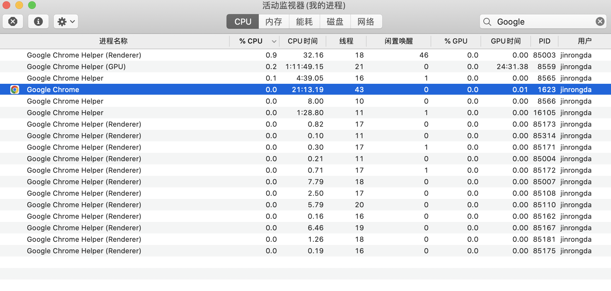

当然可以直接在（chrome浏览器——>更多工具——>任务管理器）中查看更详细的浏览器相关的进程信息，这里看的更直观，会发现浏览器主进程以及标签页、浏览器插件都独立创建了相关进程，如下图：

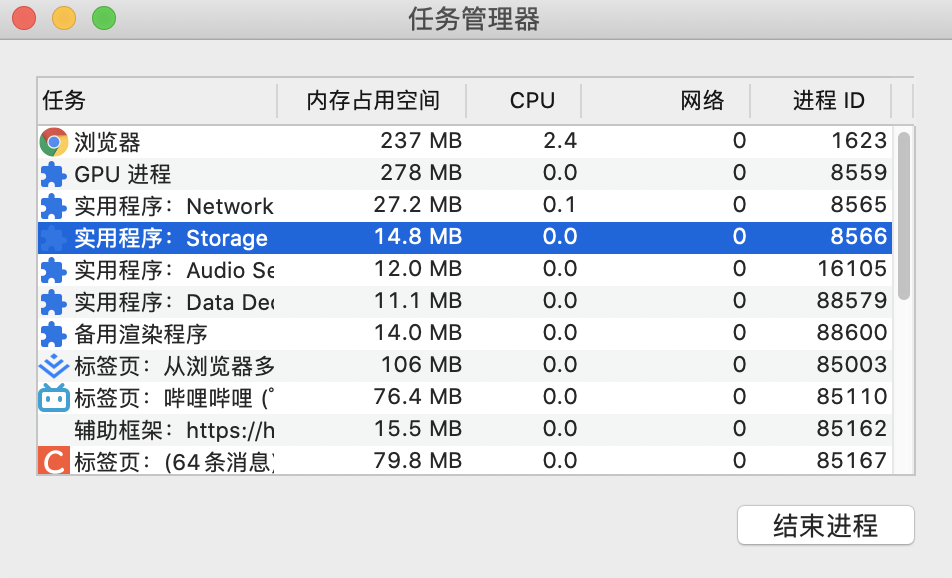

#### 2、浏览器包含的进程

参考[掘金](https://juejin.cn/post/6844903553795014663)

* Browser进程：浏览器的主进程（负责协调、主控），只有一个。作用有

  - 负责浏览器界面显示，与用户交互。如前进，后退等

  - 负责各个页面的管理，创建和销毁其他进程

  - 将Renderer进程得到的内存中的Bitmap，绘制到用户界面上

  - 网络资源的管理，下载等

* 第三方插件进程：每种类型的插件对应一个进程，仅当使用该插件时才创建

* GPU进程：最多一个，用于3D绘制等

* 浏览器渲染进程（浏览器内核）（Renderer进程，内部是多线程的）：默认每个Tab页面一个进程，互不影响。主要作用为
  - 页面渲染，脚本执行，事件处理等

**自己的理解**：

1. Browser主进程只有一个，相当于一个控制中心，功能是总领性质的，比如打开新的标签页时创建对应的renderer进程、将renderer进程（渲染）得到的内存中的bitmap绘制到用户界面上等
2. 使用插件也会创建相关的插件进程
3. 进行3D绘制的GPU进程（最多只存在一个）
4. renderer进程，浏览器渲染进程，也就是浏览器内核做的事情，页面渲染、js的代码执行、事件处理等，当然这个进程是多线程的，不同的任务由不同的线程去做

#### 3、浏览器多进程优势

1. 首先所谓的浏览器多核模型并不是指使用多个真正的物理核心或处理器，而是利用操作系统提供的线程或进程来实现并行处理，多核模型的最直观的优势其实也就是操作系统多进程多线程带来的优势：增加浏览器多中行为的并发性，提高cpu运行效率
2. 增加浏览器的稳定性和安全性，也就是说每个任务都在独立的线程或者进程中执行，如果一个任务崩溃，不会导致整个浏览器崩溃，说白了还是操作系统进程与线程带来的优势，因为进程是操作系统资源分配的基本单位，线程是资源调度的基本单位，因为它们是基本单位，所以不同进程之间，不同线程之间就不会互相影响。
3. 浏览器插件也是独占进程的，这里有个沙盒的概念：沙盒模型（Sandbox Model）是一种计算机安全概念，用于隔离和限制程序的执行环境，以保护系统的安全和稳定性。所以多进程还有一个优势就是所谓的使用沙盒模型进行插件隔离提高稳定性。和上面还是一个意思，都是指防止一个进程崩了整个浏览器也崩。

#### 4、浏览器内核——渲染进程

**浏览器的渲染进程是多线程的**，一些常驻线程：

1、GUI渲染线程

- 负责渲染浏览器界面，解析HTML，CSS，构建DOM树和RenderObject树，布局和绘制等。
- 当界面需要重绘（Repaint）或由于某种操作引发回流(reflow)时，该线程就会执行
- 注意，**GUI渲染线程与JS引擎线程是互斥的**，当JS引擎执行时GUI线程会被挂起（相当于被冻结了），GUI更新会被保存在一个队列中**等到JS引擎空闲时**立即被执行。

2、JS引擎线程

- 也称为JS内核，负责处理Javascript脚本程序。（例如V8引擎）
- JS引擎线程负责解析Javascript脚本，运行代码。
- JS引擎一直等待着任务队列中任务的到来，然后加以处理，一个Tab页（renderer进程）中无论什么时候都只有一个JS线程在运行JS程序
- 同样注意，**GUI渲染线程与JS引擎线程是互斥的**，所以如果JS执行的时间过长，这样就会造成页面的渲染不连贯，导致页面渲染加载阻塞。

3、事件触发线程

- 归属于浏览器而不是JS引擎，用来控制事件循环（可以理解，JS引擎自己都忙不过来，需要浏览器另开线程协助）
- 当JS引擎执行代码块如setTimeOut时（也可来自浏览器内核的其他线程,如鼠标点击、AJAX异步请求等），会将对应任务添加到事件线程中
- 当对应的事件符合触发条件被触发时，该线程会把事件添加到待处理队列的队尾，等待JS引擎的处理
- 注意，由于JS的单线程关系，所以这些待处理队列中的事件都得排队等待JS引擎处理（当JS引擎空闲时才会去执行）

4、定时触发器线程

- 传说中的`setInterval`与`setTimeout`所在线程
- 浏览器定时计数器并不是由JavaScript引擎计数的,（因为JavaScript引擎是单线程的, 如果处于阻塞线程状态就会影响记计时的准确）
- 因此通过单独线程来计时并触发定时（计时完毕后，添加到事件队列中，等待JS引擎空闲后执行）
- 注意，W3C在HTML标准中规定，规定要求setTimeout中低于4ms的时间间隔算为4ms。

5、异步http请求线程

- 在XMLHttpRequest在连接后是通过浏览器新开一个线程请求
- 将检测到状态变更时，如果设置有回调函数，异步线程就**产生状态变更事件**，将这个回调再放入事件队列中。再由JavaScript引擎执行。

**我的理解**：宏观上对各个线程的作用进行理解就是，GUI渲染线程没啥难理解的，就是处理html和css并渲染的功能；js引擎线程，也就是常说的js内核，作用也很直观，就是运行js代码；事件触发线程负责在事件队列中添加各种事件回调，比如setTimeout计时到了之后就向事件队列中添加上其回调函数；定时器触发线程就是负责计时的，说白了就是setTimeout和setIterval的计时，因为js引擎线程如果负责计时的话，如果阻塞就会影响计时的准确性，所以有必要新开一个单独负责计时的计时器触发线程；http网络请求也是由单独的请求线程负责的。

#### 5、Browser进程和浏览器内核（Renderer进程）的通信过程

如果自己打开任务管理器，然后打开一个浏览器，就可以看到：**任务管理器中出现了两个进程（一个是主控进程，一个则是打开Tab页的渲染进程）**， 然后在这前提下，看下整个的过程：(简化了很多)

- Browser进程收到用户请求，首先需要获取页面内容（譬如通过网络下载资源），随后将该任务通过RendererHost接口传递给Render进程
- Renderer进程的Renderer接口收到消息，简单解释后，交给渲染线程，然后开始渲染
  - 渲染线程接收请求，加载网页并渲染网页，这其中可能需要Browser进程获取资源和需要GPU进程来帮助渲染
  - 当然可能会有JS线程操作DOM（这样可能会造成回流并重绘）
  - 最后Render进程将结果传递给Browser进程
- Browser进程接收到结果并将结果绘制出来

**自己的理解**：首先明确整体架构，Browser进程就是浏览器主进程，renderer进程是浏览器渲染进程，也就是常说的浏览器内核，其中这个进程之中又有我们熟知的各个线程，比如js引擎线程、GUI渲染线程、事件触发线程、计时线程以及网络请求线程，现在我们考虑的是浏览器主进程和渲染进程这两个进程之间的通信，首先是主进程接收到用户的网页请求(网页操作，比如打开新页面)之后，通过某些接口将渲染任务传递给渲染进程，渲染进程各个线程开始协同工作，最终把渲染的结果传递给主进程，最终主进程将页面显示出来。

#### 6、WebWorker，JS的多线程？

前文中有提到JS引擎是单线程的，而且JS执行时间过长会阻塞页面，那么JS就真的对cpu密集型计算无能为力么？

所以，后来HTML5中支持了`Web Worker`。

MDN的官方解释是：

```js
Web Worker为Web内容在后台线程中运行脚本提供了一种简单的方法。线程可以执行任务而不干扰用户界面

一个worker是使用一个构造函数创建的一个对象(e.g. Worker()) 运行一个命名的JavaScript文件 

这个文件包含将在工作线程中运行的代码; workers 运行在另一个全局上下文中,不同于当前的window

因此，使用 window快捷方式获取当前全局的范围 (而不是self) 在一个 Worker 内将返回错误
```

这样理解下：

- 创建Worker时，JS引擎向浏览器申请开一个子线程（子线程是浏览器开的，完全受主线程控制，而且不能操作DOM）
- JS引擎线程与worker线程间通过特定的方式通信（postMessage API，需要通过序列化对象来与线程交互特定的数据）

所以，如果有非常耗时的工作，请单独开一个Worker线程，这样里面不管如何翻天覆地都不会影响JS引擎主线程， 只待计算出结果后，将结果通信给主线程即可，perfect!

而且注意下，**JS引擎是单线程的**，这一点的本质仍然未改变，Worker可以理解是浏览器给JS引擎开的外挂，专门用来解决那些大量计算问题。

**我的理解**：我们可以在当前的js引擎线程上通过调用api的方式创建一个新的js执行线程，也就是所谓的web worker多线程，这个线程的js执行与原本的js引擎是不同的全局上下文，所以不会干扰原本的js引擎线程，这个新开的线程最后把计算所得的结果传递给js引擎线程即完成了任务，也就是所谓的js多线程，但js引擎线程是单独的一个线程这个本质问题是没有改变的。

#### 7、WebWorker与SharedWorker

既然都到了这里，就再提一下`SharedWorker`（避免后续将这两个概念搞混）

- WebWorker只属于某个页面，不会和其他页面的Render进程（浏览器内核进程）共享
  - 所以Chrome在Render进程中（每一个Tab页就是一个render进程）创建一个新的线程来运行Worker中的JavaScript程序。
- SharedWorker是浏览器所有页面共享的，不能采用与Worker同样的方式实现，因为它不隶属于某个Render进程，可以为多个Render进程共享使用
  - 所以Chrome浏览器为SharedWorker单独创建一个进程来运行JavaScript程序，在浏览器中每个相同的JavaScript只存在一个SharedWorker进程，不管它被创建多少次。

看到这里，应该就很容易明白了，本质上就是进程和线程的区别。SharedWorker由独立的进程管理，WebWorker只是属于render进程下的一个线程

**我的理解**：原文已经说的非常清楚了，我也是第一次知道`SharedWorker`这个概念，看来也是浏览器提供的一种可手动控制的提高并发的手段，只是说它是一个进程，是所有浏览器的渲染线程共享的，而`WebWorker`是属于某个`renderer`进程的一个线程。

#### 8、浏览器渲染流程

这里只是说浏览器内核（js引擎）拿到了`html`文件之后如何处理：

1. 解析html建立dom树
2. 解析css构建render树（将CSS代码解析成树形的数据结构，然后结合DOM合并成render树）
3. 布局render树（Layout/reflow），负责各元素尺寸、位置的计算
4. 绘制render树（paint），绘制页面像素信息
5. 浏览器会将各层的信息发送给GPU，GPU会将各层合成（composite），显示在屏幕上。

#### 9、load事件与DOMContentLoaded事件的先后

**我的理解**：说白了就是解析html生成dom完毕后，不管css等其他资源的加载完成与否就触发`DOMContentLoaded`事件；面上所有的DOM，样式表，脚本，图片都已经加载完成了才触发`onLoad`事件。顺序是：`DOMContentLoaded -> load`

#### 10、css加载相关

**css是由单独的下载线程异步下载的**，所以css加载不会阻塞DOM树解析（异步加载时DOM照常构建），但会阻塞render树渲染（渲染时需等css加载完毕，因为render树需要css信息）

#### 11、css硬件加速

[原文参考](https://juejin.cn/post/6844903553795014663#heading-7)

#### 12、浏览器中js的运行机制

**我的理解**：以前只是知道宏任务与微任务影响下的js的执行逻辑，这里我结合js渲染进程的各个线程的配合关系来重新叙述一遍js事件循环——首先**js引擎线程**执行`script`中的所有同步代码（script属于宏任务），js引擎执行的代码在一个执行栈中，执行栈中的所有同步代码，对于异步代码又分为宏任务和微任务，在执行过程中如果遇到以`Promise.then`为代表的微任务就把微任务放到微任务队列中，这个微任务队列应该是属于**js引擎线程**管理，在同步代码的执行过程中如果遇到以`setTimeout`为代表的宏任务，就把`setTimeout`交由**定时器触发线程**，当时间条件满足时**事件触发线程**就会把异步任务的回调函数放入一个事件队列中，当前js执行栈中所有同步代码执行完毕后，紧接着执行微任务队列中的代码，微任务队列全部处理完毕后，当前的宏任务就算执行完毕了（**js引擎线程**控制的执行栈与微任务队列都空了），这时候**js引擎线程**应该是被挂起的，GUI线程接管渲染操作，渲染完成后继续由**js引擎线程**接管，js引擎线程检查宏任务事件队列，将队头取出放入执行栈中执行，相当于开启了一个新的宏任务执行，以此循环。

#### 13、说说定时器

明白了上面的js运行机制，就可以解释定时器为什么有误差了，因为`setTimeout`的计时虽然是由定时器触发线程掌管的，这个计时是基本准确的，但是计时完成后并不是说立即执行回调，而是**js事件触发线程**将回调函数放入宏任务队列中等待，只有**js引擎线程**将当前的宏任务执行完毕后才会从宏任务队列中取出等待的定时器回调，所以造成了误差。

由于这种计时机制，`setInterval`方法会出现比较极端的情况：每隔一段时间都准时向宏任务队列中放入回调函数，但是**js引擎线程**并不一定此时是空闲的，所以可能照成`setInterval`回调函数在宏任务队列中堆积，然后突然**js引擎线程**空闲了，然后连续执行很多个`setInterval`的逻辑，造成时间偏差过大。

使用`setTimeout`模拟`setInterval`：

~~~js
function runTimer() {
    (function inner() {
        let t = setTimeout(() => {
            console.log('要执行的代码逻辑')
            clearTimeout(t);
            inner();
        }, 1000);
    })();
}
~~~

这样写重写`setInterval`也不是说就能保证准确的执行时间间隔的精度，效果就是只有本次代码逻辑执行完毕后才会开启**定时器触发线程**的计时，而`setInterval`是不停的进行计时，并把回调放入宏任务队列，而不管回调的执行情况。

# 项目总结

## Daxt.js

### 如何实现的css的服务端渲染呢？

在我第一次引入css时，简单配置了`css-loader`和`style-loader`，但是发现控制台报错了，大致意思就是`window`变量等一些浏览器相关的特性的缺失，我就意识到问题所在应该是服务端环境的原因，经过百度，了解到了`"isomorphic-style-loader"`，它是具备`style-loader`的全部基本功能的，也就是说打包生成的js代码会把`css-loader`返回的css样式插入到`<header />`中，相较于`style-loader`的特别之处在于还在全局作用域提供了几个api，其中核心方法`_getCss`和`_insertCss`，其中`_getCss(服务器端使用)`这个方法可以处理css-module对象并返回样式的字符串，`_insertCss(浏览器端使用)`用于处理`css-loader`生成的css styles对象，然后将他们插入到dom中。

对于服务端的`renderToString`，我创建了一个数组，编写`insertCss`方法，并通过`context`传给组件。`isomorphic-style-loader`在进行css代码编译组件时就会对组件内引入的css对象调用`insertCss`方法，`insertCss`的逻辑很简单，也是我们自己编写的，就是调用`_getCss`获取到css样式字符串，然后将字符串放入到数组中，最终我们拿到了收集了各个组件css的数组后，通过模版字符串的插值语法简单放入到渲染的html模版中即可。

~~~js
server.get('*', (req, res, next) => {
  const css = new Set() // CSS for all rendered React components
  const insertCss = (...styles) => styles.forEach(style => css.add(style._getCss()))
  const body = ReactDOM.renderToString(
    <StyleContext.Provider value={{ insertCss }}>
      <App />
    </StyleContext.Provider>
  )
  const html = `<!doctype html>
    <html>
      <head>
        <script src="client.js" defer></script>
        <style>${[...css].join('')}</style>
      </head>
      <body>
        <div id="root">${body}</div>
      </body>
    </html>`
  res.status(200).send(html)
})
~~~

但我们知道，服务端渲染的核心就是保证双端渲染的一致性，不让浏览器会报错的，所以还要进行客户端代码的编写，首先核心思路是明确的，就是要让客户端组件调用`_insertCss`方法，做到与服务端渲染的统一，这里我封装了一个hook，先用`useContext`从上下文对象中拿到`insertCss`方法，然后再判断当前的代码运行环境，我是根据window对象（`typeof window === 'object'`）判断的，在hook中我定义了一个`runEffect`方法，如果是客户端运行，那么用`useEffect`包装一下`insertCss`，在组件卸载时可以调用`isomorphic-style-loader`提供的api进行样式清除，如果是服务端环境，那么直接执行`runEffect`添加样式即可，因为服务端是不会执行`useEffect`的逻辑的，并且代码只在`renderToString`静态渲染时执行一次，所以不需要考虑组件的运行逻辑，无需进行样式的清除。这里我还尝试了类组件，经过我的测试发现，不同于`useEffect`这些react18函数式组件的特性hook，`componentDidMount`生命周期回调在服务端也是会执行的，所以对于类组件可以编写一个高阶组件来提取添加样式的逻辑。

~~~js
import { useContext, useEffect } from 'react'
import StyleContext from './StyleContext'

// To detect if it's in SSR process or in browser. Wrapping with
// the function makes rollup's replacement of "this" avoidable
// eslint-disable-next-line func-names
const isBrowser = (() => this && typeof this.window === 'object')()

function useStyles(...styles) {
  const { insertCss } = useContext(StyleContext)
  if (!insertCss) throw new Error('Please provide "insertCss" function by StyleContext.Provider')
  const runEffect = () => {
    const removeCss = insertCss(...styles)
    return () => {
      setTimeout(removeCss, 0)
    }
  }
  if (isBrowser) {
    useEffect(runEffect, [])
  } else {
    runEffect()
  }
}

export default useStyles
~~~

经过上面的编码，在需要进行css的服务端渲染的组件内调用`useStyles`这个hook即可。

这样我们就实现了静态html模版中对css字符串的拼接以及浏览器端js代码对于样式的添加。


### redux是如何引入的呢？

首先我们明确的一点是需要给不管是客户端`hydrateRoot`还是服务端的`renderToString`提供一个`store`实例

~~~jsx
// client
import { Provider } from "react-redux";
const App = () => {
  return (
    <Provider store={getClientStore()}>
      <BrowserRouter>{getRoutes(routesConfig)}</BrowserRouter>
    </Provider>
  );
};
hydrateRoot(...)
            
// server同理，通过<Provider>提供一个store实例         
~~~

但这里有个坑，就是不能用单例模式，需要提供创建store实例的工厂函数，不然就会导致所有用户共用服务端的同一个store的数据。对于客户端和服务端，创建store的逻辑是不能共享的，这里就牵扯一个异步数据服务端渲染的问题，提一嘴，因为项目里组件的异步数据，也就是需要从远程服务器获取的数据我的存储策略是放到redux中，所以对于服务端node服务的响应逻辑是等待所有异步逻辑执行完毕，这里我是借助`redux-thunk`和`axios`向远程服务器发送`ajax`请求并给`store`实例填充数据，并在`Promise.all`的成功回调用进行对浏览器的响应，所以服务端的`store`不需要进行数据初始化，因为本身的一个请求过程就是对store数据的获取过程，但是客户端不同，我们需要做到客户端`store`数据与服务端`store`数据的统一，毕竟这是ssr的原则，所以我们要给客户端`createStore`时提供一个`defaultState`。

具体这个`defaultState`通过读取`window.context`对象获取的，这里涉及到双端通信的一个问题，我们客户端需要获取服务端请求的异步数据，在服务端进行字符串拼接时我插入了一段`<script>`脚本，将服务端已经填充好数据的`store`的`state`填充到`window.context`中，也就是说存放到`window`身上的一个对象中，以供客户端渲染创建`store`时使用。这样也就做到了异步数据的双端通信，也就是所谓的数据注水与脱水吧。

这个双端数据一致性的解决方案就是受到淘宝、京东、掘金等这些典型的ssr网站的启发，因为查看他们网站的源代码，就会发现插入了很多只在`window`上挂载数据的`<script>`标签。


### 异步数据是如何进行ssr的呢？

首先我选择使用模块化的redux进行组件状态管理，优点就是数据流清晰，纯函数设计，没有副作用。

首先实现服务端的异步数据获取逻辑，对于需要异步数据的组件，我在它的组件函数上挂载了一个静态方法`loadData`，并且同步配置到路由配置文件中，给路由配置对象添加一个`loadData`属性，当进行服务端渲染时，通过`matchRoutes`方法获取到要首屏要渲染的路由组件后，调用所有组件的`loadData`方法，将异步请求的数据存放到`store`中并把所有网络请求的返回的promise对象保存在数组中，最终`Promise.all`确保获取所有组件的异步数据后，在回调中进行`res.send`。其实这些都是一个正常的逻辑思路，真正做到异步数据的ssr，难点在于客户端如何与服务端进行通信，如何让客户端同样拿到服务端请求来的异步数据，我的解决方案是借助插入静态脚本的形式对`window`进行赋值，就是把`store`中的异步数据存放到`window.context`对象中，这里只需要在返回的模版字符串中插入一段`<script>`脚本即可。

对于客户端，创建`store`实例时，从`window.context`读取服务端请求到的异步数据，就做到了双端同构。

然后至于`loadData`的具体实现的话就是借助`redux-thunk`中间件以及`axios`，派发action后发送网络请求并修改`store`中的数据。

这个双端数据一致性的解决方案就是受到淘宝、京东、掘金等这些典型的ssr网站的启发，因为打开他们的官网，然后查看他们网站的源代码，就会发现插入了很多只在`window`上挂载数据的`<script>`标签。

（并不是所有的接口都需要进行ssr渲染，就像掘金这种技术网站，打开它的源代码就可以发现他的首屏文章列表其实是没有进行ssr的，因为这种针对不同用户定制化的东西其实ssr反而可能会干扰seo爬虫的判断。）


### 为什么要做node中间层代理呢？如何做node中间层代理的呢？

首先就从这种浏览器——node server——server这种项目架构本身来讲，这是基于现代数据驱动视图框架如vue，react要想做ssr的必由之路，因为框架提供的ssr相关api就是需要node作为js运行环境的，所以可以说没得选，我们需要一个node中间层来承担静态页面结构的处理并返回，本身node作为中间层是有很多其他的优势的，比如负载均衡，以及数据处理（让我们前端更专注于展示，后端专注于数据，而复杂的计算数据的处理逻辑交给node中间层），但是同时这种三端的架构也有一个很明显的弊端就是增加了错误的排查成本，如果说我们让客户端浏览器直接与api server进行通信，那么三者就形成了两两关联的结构，每一个错误都无法准确定位是哪端出了问题，所以让三者之间的联系称为线性结构是非常必要的，也就是实现node服务作为远程服务器的代理，而不让浏览器直接与远程服务器进行通信。其实我认为这种东西并不是说用了取得了多大的收益，而是一种规范且优雅的架构模式与设计方法，就像我们本身的编码是一样的。

这里我使用了`express-http-proxy`中间件，设计一个需要进行代理的请求字段，对此字段开头的请求转发至远程服务器，这里随之产生的一个问题就是一个组件中服务端的异步请求（loadData中）与客户端的异步请求（生命周期中）要写两种请求地址，大大降低的代码的可维护性与开发体验，针对这个问题我进行了一下优化，我创建了两个`axios`的实例并配置了不同的`baseURL`，以供客户端与服务端分别使用，为了进一步让用户对于客户端与服务端无感的发送网络请求，我就思考到一个问题，客户端请求与服务端请求本质上操作的是两个不同的redux的`store`对象，所以使用`redux-thunk`的`thunk.withExtraArgument`将不同的`axios`的传递给了`redux`，这样就做到了用户不用主观的去分析浏览器与客户端的请求，而只需要写一套代码。算是降低了开发的心智负担，算是一种开发体验优化吧。


### 如何进一步做seo优化的？

我对于title和description进行了优化，也完成了ssr，就是站在巨人的肩膀上，使用了`react-helmet`，本身`react-helmet`对于ssr有很友好完善的支持，只需要在组件中使用`<Helmet>`组件包裹`<title>`和`<meta>`最后在模版中添加两个字段即可完成ssr，其实本身的实现并不难，但重要的是在这次优化之前，我对搜索引擎的seo机制进行了一些深入的了解，并且有了一些自己关于提高网站seo排名的见解。

其实对于现在的新一代搜索引擎来说，都是基于全局上下文进行网站解析的，而不是说根据一个`title`或者一个`description`就对网站有了一个主题的定位，文字原创性、多媒体的清晰度，原创性、以及外部链接与内部链接，外部链接尽可能的多、内部链接的网站内容相关度与网站本身的相关度尽可能的强，都是搜索引擎进行seo排名时参考的因素，但是并不是说title和description就没用了，只是说搜索引擎并不会片面的只看title和description，并且如果说我们的网站想获取一个好的点击率，一个好的title和description是必不可少的，就比如淘宝等电商平台，搜索结果前三个都是淘宝官网，但我们一般偏向于点击`淘宝网-淘！我喜欢(title)——淘宝网- 亚洲较大的网上交易平台，提供各类服饰...(description)`这种内容丰富的链接。


### 如何引入路由的？

首先从api层面，要做ssr的话与普通的spa应用是不同的，`router6`为服务端提供了`StaticRouter`组件，作用是可以根据`location={req.path}`静态分析出首屏需要渲染的路由组件，然后返回正确的HTML内容；然后对于客户端，我们可以直接选择基于HTML5的`history`API来管理路由状态的`BrowserRouter`。(**TODO：路由相关话题**)

其实为了引入路由，我的代码经历重构与一些后续迭代的，最初只是为了引入`router6`，可以进行一个路由组件的正常切换，所以直接用`router6`的最新语法，也就是`<routes>`包裹`<route>`的形式，导出这么一段jsx的结构，所以添加新路由以及进行路由修改的话就直接在配置文件中操作`<route>`配置项了。

但是到后面为了进行异步数据的ssr时，这样开箱即用的路由配置反而成痛点了，因为一些路由组件需要向远程服务器获取异步数据，所以原有的组件配置第一个弊端就是携带的信息量不足，就比如说我们在服务端进行路由匹配得知了首屏要渲染的路由组件后，还需要知道它是否需要进行异步数据的获取以及要执行哪个方法去进行一个异步请求的触发

所以基于上面的痛点，我进行了第一次路由代码的重构，将路由配置修改为配置对象的形式，然后提供一个`getRoutes`方法对配置对象进行一层map遍历去生成对应的`Route`结构。这样的话得益于配置对象的路由存储形式，就可以在路由配置对象中添加属性，对于异步数据获取函数，我定义了一个`loadData`方法，在服务端进行响应之前，就会首先根据请求的地址进行路由匹配，然后等待所有的首屏路由组件的`loadData`方法执行完毕后进行响应。第一次重构主要是解决了异步数据获取的问题。

然后紧接着意识到一个问题就是`getRoutes`方法的不完善，此时一层遍历，是无法正确生成嵌套路由的，很多时候`<Route>`下面是有子`<Route>`的，这个解决方法也比较简单了，在`getRoutes`方法中抽取生成`<Route>`标签的逻辑为一个函数，对于拥有`children`属性的配置对象，递归调用这个函数生成子`<Route>`即可，最终返回`<Routes>`包裹的最终路由结构。

~~~jsx
export const getRoutes = (routesConfig) => {
  const getRouteStructure = (routesConfig) => {
    const RouteStructure = routesConfig.map((route, index) => {
      if (route.children && route.children.length > 0) {
        return (
          <Route {...route} key={index}>
            {getRouteStructure(route.children)}
          </Route>
        );
      } else {
        return <Route {...route} key={index} />;
      }
    });
    return RouteStructure;
  };

  return <RouterRoutes>{getRouteStructure(routesConfig)}</RouterRoutes>;
};
~~~


### 如何实现热更新模拟的？

其实就是一开始开发的时候没次更新代码都需要重新打包，然后重启node服务运行打包生成的项目文件，第一反应就是nodemon和webpack的watch模式来模拟热更，首先三个`dev`命名空间开头的脚本，两个用来执行`webpack`打包指令，开启`--watch`模式，也就是说打包的入口文件及其引用文件内容发生改变就会重新打包，然后用`nodemon`对打包生成的文件进行运行并`watch`监听，一旦监听文件改变重启node服务，最后一个脚本使用`npm-run-all`这个工具同时启动所有`dev`为前缀的脚本即完成了热更——项目代码变动，触发webpack的重新打包，打包产物变化，触发nodemon的项目重启。因为也看过公司里的一些开发体验优化相关的脚本配置，也是用这个工具链功能的组合来生成一些更强大、更有好的功能，所以我就有了这个启发完成了这个小优化。

~~~json
"scripts": {
  "dev": "npm-run-all --parallel dev:**",
  "dev:build:server": "webpack --config webpack.server.js --watch",
  "dev:build:client": "webpack --config webpack.client.js --watch",
  "dev:start": "nodemon --watch build --exec node ./build/bundle.js"
},
~~~


### 动态降级策略
