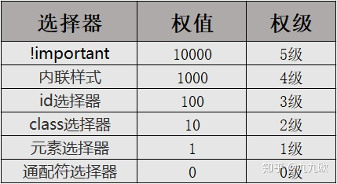

# CSS

## CSS伪类与伪元素

伪类选择器：

| 属性         | 描述                                   |
| ------------ | -------------------------------------- |
| :active      | 向被激活的元素添加样式                 |
| :focus       | 向拥有键盘输入焦点的元素添加样式       |
| :hover       | 当鼠标悬浮在元素上方时，向元素添加样式 |
| :link        | 向未被访问的链接添加样式               |
| :visited     | 向已被访问的链接添加样式               |
| :first-child | 向元素的第一个子元素添加样式           |
| :lang        | 向带有指定lang属性的元素添加样式       |

伪元素选择器（一般使用双冒号）：

| 属性          | 描述                           |
| ------------- | :----------------------------- |
| :first-letter | 向文本的第一个字母添加特殊样式 |
| :first-line   | 向文本的首行添加特殊样式       |
| :before       | 在元素之前添加内容             |
| :after        | 在元素之后添加内容             |

理解：伪类就是给已经存在的dom元素**整体**添加样式，比如`div:hover`就是鼠标悬浮时div的样式；伪元素就是对dom元素的**部分内容**进行修改，比如`div::first-letter`就是div第一行的样式（类似于给第一行增加一个span），`div::after`就相当于在原本的dom内容之后又增加了一部分内容（相当于在div之后又加了一个span），之所以叫伪元素，是因为好像给原本的dom结构增加了新的dom元素一样。

因为`:before`和`:after`相当于在原来dom的基础上添加新的dom结构，必需有`content`属性（可以为""空字符串）。

可以用伪元素来清除父容器中元素浮动的影响，撑开父容器：

~~~CSS
.main::after {
    /*
        内容设置为空
    */
    content: '';
    /*
        display: block即让伪元素独占一行
    */
    display: block;
    /*
        ::after相当于是在父容器最后添加的一个非浮动流元素，设置clear: both即表示不占用浮动元素空出来的位置
    */
    clear: both;
}
~~~

## 浮动

### 对浮动的理解（曾经的课堂笔记）

* 浮动元素使用套路：
  * 搭配标准流父级盒子：先用标准流父级盒子排列上下位置，之后盒子内部采取浮动排列左右
  * 浮动盒子之间没有间隙，若想设置通过margin、
* 清除浮动：
  * clear：针对设置clear属性的盒子自己产生效果，例如一个盒子是左浮动盒子，他的前面还有一个左浮动盒子，按说他跟在前浮动盒子的右边，给他一个clear：left；那么他将会跑到下一行去。这种位置的变化是在“浮动流”里进行的改变，某个浮动流中的盒子设置了clear并不影响他是一个浮动盒子，只是说他在浮动流中的位置可能发生改变。
  * **clear的作用对象有两种：第一种就是本身已经浮动的元素，第二种就是标准流里的元素，如果作用在浮动元素上，那么clear意思是“浮动流”内部另起一行继续排列浮动流；如果作用在标准流元素上，clear的意思就是不去占浮动元素空出来的位置。**所以一种应用场景：父盒子没有指定高度，希望随着内容的多少进行自动变化，这时候如果父盒子里的元素全部浮动了，那么父盒子相当于没有标准流的内容了，这时候父盒子高度变成了0，这也叫浮动塌陷，解决方法是在父盒子内部的最下面加一个块级元素，然后这个块级元素设置clear：both；这样他就不去补占浮动元素的空位，就会排在父级盒子的最下面，也就把父级盒子撑开了

## CSS使元素不可见（隐藏元素）的方法

1. `display:none`：会让元素在页面上彻底消失，元素原本占有的空间也会被其它元素占有，所以会导致浏览器的重绘和重排
2. `visibility:hidden`（visibility默认值为visible）：元素在页面隐藏后其占据的空间依然会保留，所以只会导致浏览器的重绘
3. `opacity: 0`：透明度为0，表示完全透明
4. `z-index: -1`：被压住

## position属性

取值：

* `static`：默认值，没有定位，元素出现在正常的文档流中
* `absolute`：生成绝对定位的元素，相对于static定位以外的第一个父元素进行定位。（搭配使用 "left", "top", "right" 以及 "bottom" 属性进行定位）
* `fixed`：生成绝对定位的元素，相对于浏览器窗口进行定位。（元素的位置通过 "left", "top", "right" 以及 "bottom" 属性进行规定）
* `relative`：生成相对定位的元素，相对于其正常位置进行定位。
* `inherit`：规定应该从父元素继承 position 属性的值。

## 选择器权重



* 选择器权重可以叠加，比如`#id .class span`，span标签的权重就是`111`，但是权重不会因为叠加而跃迁，也就是说10个class选择器也没有一个id选择器的权重高，权重高的选择器生效
* 权重相同时，位置靠后的选择器生效

# 计算机网络

## OSI七层网络结构

### 对各层职责的基本了解

OSI（Open System Interconnection开放式系统互联参考模型）把**网络协议从逻辑上分为7层**。

对于互联网数据传送的分层模型，有分成七层的，有分成5层的，还有分成4层的。例如分成七层模型的如下(从上到下)：

- 应用层
- 表示层
- 会话层
- 传输层
- 网络层
- 数据链路层
- 物理层

七层中，**越往下越靠近计算机底层，越往上越靠近用户**。

五层模型中，把应用层、表示层、会话层看成是一层。从上到下各层的基本作用为：

* 应用层（http）
* 传输层（tcp、udp）
* 网络层（IP协议，划分ip地址...）
* 数据链路层：工作在物理层之上，传输给下层物理层时负责给物理层的这些0，1制定传送的规则，传输给上层网络层时按照相应的规则来进行解读0，1电信号。
* 物理层：光纤、电缆等把物理设备连接起来，传输0，1这样的电信号

## IPv4和子网掩码

### ip地址：

`192.168.0.1`其实是由四组八位二进制组成的，每一组用`.`分隔，为十进制的0-255中的一个数。

ip地址由两部分组成：网络号和主机号，如下图有几类ip地址的划分，比如A类地址，网络数128也就是说只有四组数只有第一组为网络号，其余三组代表主机号。


上面这种划分，要么网络数很多，主机数很少，要么主机数很多，网络数很少，反正问题就是不能灵活的划分网络与主机，比如一个网络里我只需要四个主机号，那么我只需要最右边的两位二进制作为主机号，其余都是网络号就行了，所以引入子网掩码来解决网络划分的问题。

### 子网掩码

子网掩码就是用来标识一个ip地址的网络号和主机号如何划分的。一个子网掩码就唯一对应了一个网络（网络下有若干个主机）

代表网络号的二进制位用`1`替换，代表主机号的二进制位用`0`替换，对于上面的例子，一个网络里只有四个主机号，那么对应的子网掩码就是

`11111111.11111111.11111111.11111100`

也就是`255.255.255.252`

比如`192.168.0.0`、`192.168.0.1`、`192.168.0.2`、`192.168.0.3`这四个ip地址（二进制表示只有最后两位不同）如果子网掩码是`255.255.255.252`的话，就表明，这四个ip属于同一个网络，且这个网络里只有这四个主机。

### IPv4地址的CIDR表示法：

对于子网掩码`11111111.11111111.11111111.11111100`有30位1，所以我们把`192.168.0.0`、`192.168.0.1`、`192.168.0.2`、`192.168.0.3`这四个ip组成的网络的划分记为`192.168.0.0/30`，也就是网络中的第一个主机号ip地址加上`/30`。

例题：

IP：`192.168.50.10`，子网掩码：`255.255.192.0`，解析其网络号与主机号


从子网掩码中得知，这个IP的前18位都是网络号，50.10正好处于后14位，直接可以得知主机号就是`50.10`，所以网络号就是`192.168`(但这样似乎不是很精确)，CIDR的写法就是`192.168.0.0/18`

## IPv6

为了进行地址扩充而生

## TCP三次握手和四次挥手

三次握手是建立连接的过程

首先客户端向客户端发送一包连接请求数据（SYN包），服务端如果同意，会回复SYN+ACK包，客户端收到后回复一包ACK包——连接建立，这个过程三次发包，故称之为三次握手。

为什么不在服务端回复SYN+ACK之后就建立连接（两次握手）？

如果两次握手就建立连接的话，客户端发送的某个SYN包在网络节点中滞留，网络恢复之后又重新到达服务端，就会再建立一个连接。客户端可以发送很多SYN包，目的只是建立一个连接请求，说白了，客户端的连接请求最终需要客户端来确认，而不能交由服务端确认。所以三次握手本质上来说就是解决网络信道不可靠的问题，为了在不可靠的信道上建立起可靠的连接。

如果两次握手就建立连接，也就是服务端每收到一个SYN服务端就进入连接状态，不管客户端是否接收到SYN+ACK，客户端可能收不到SYN+ACK包，这就会造成服务端的连接数量大于客户端的连接数量，状态不匹配。


三次握手之后，客户端和服务端进入数据传输状态。

一包数据可能被拆成多包发送，需要解决丢包问题和包的乱序问题？

TCP协议为每一个连接（无论客户端还是服务端，TCP全双工互传）建立一个发送缓冲区，为要发送的数据（字节）进行编号。发送数据时，从发送缓冲区取一部分数据组成发送报文，TCP协议的头部会附带序列号（字节编号起始号）和长度。接收端接收到数据后发送ACK包，ACK=接收序列号+长度，也就是下一包数据的起始序列号。这样发送端就可以切割发送，接收端只需要根据序列号和长度对接收到的数据进行重组获得原始数据即可。对于丢包，接收端可以要求发送端重传，丢失了100-199字节的相关数据，接收端向发送端发送ACK=100的报文即可。


两端均可以发起关闭连接请求，此时需要四次挥手进行连接关闭。

假设客户端主动发起连接关闭请求，需要发给服务端一个FIN包，自己进入终止等待1状态，这是第一次挥手。服务端收到FIN包回复一个ACK包，自己进入关闭等待状态，客户端进入终止等待2状态，这是第二次挥手。此时服务端仍然可以发送数据，客户端可以接收数据，服务端把未发送的数据都发送完毕之后，再发送一个FIN包，进入最后确认状态，这是第三次挥手。客户端收到后发送ACK包，进入超时等待状态，经过超时时间后关闭连接，服务端收到ACK包后立即关闭连接，这是第四次挥手。

为什么客户端需要进行超时等待？为了保证对方收到了ACK包，如果ACK包丢失，服务端没有收到ACK包，就会重新发送FIN包，客户端就会相应这个FIN包重发ACK包。这个机制也是为了在不可靠的网络连接中，进行可靠的连接断开确认。

四次挥手其实就是两组FIN—ACK的交流。第一组FIN—ACK是首先完成传输(想断开连接)的那一方先发送的FIN，意思就是我已经传输完毕了，你也快点传，传完就可以断开连接了，那一方接收到就回复一个ACK。然后就传送自己的没有传输完成的数据，传完就发送FIN，也就是第二组FIN—ACK的开始。这一组FIN—ACK标志着信息传输彻底完毕，可以断开连接，所以最后发送ACK包的那一方需要进入超时等待状态，确保这个ACK包务必被对方收到。


## http（应用层协议）状态码

首先知道怎么分类，Yeah！1，2，3，4，5个类

状态码们很有规律，三个数字加上一段字

（1xx）接收的请求处理中，表示请求还在进行中

1开头虽然很少用，在请求中依旧挺好用

服务器给了我个2，并不代表它肚子饿

2开头表示成功，让我想起了郑成功

请求方法有很多种，我不管你用哪一种，

（200 OK）只要请求没问题，200直接送给您

听说你要创建用户，服务器我们要怎么表示

（201 Created 已创建）201我们走起来，Post and put 我欢迎你来

（204 No Content）我没东西返回给你，不是我对你不睬不理

那你叫我怎么办，204给你看着办

（3xx重定向）资源现在不在了，被移去其它地方了

服务器说不用担心，数字3让你很安心

（301 Move Permanently 永久移动）旧的地址不好使，我给你一个新地址

301让你重定向，这是咱们资源新方向

（302 Found 临时移动，下次还得用旧地址）今天资源在这里，嘿！明天资源又转移

临时地址给出来，302跟着一起来

（304 Not Modified 未修改——没过期，直接用缓存吧）看到有条件请求，检查缓存时间轴

304不用再下载，服务器资源没修改

（4xx客户端错误）谁说客户不会错，又不是花田里的错

数字4我给出来，是你的错请你站出来

（400 Bad Request 语法错误，无法理解）这是什么鬼请求，用法错误就这理由

处理不了处理不了，400甩给你得了

（401 Unauthorized 身份认证失败）数据库查无此人，别怪我对你很不仁

请你认清你自己，401对你敬个礼

（403 Forbidden 拒绝）虽然知道你是谁，但没权限我管你谁

403禁止你通行，没有权限你真不行

（404 Not Found 找不到）地址是不是写错了，反正资源已经不在了

反正我就是没找到，404大家都知道

（409 Conflict 冲突）赔礼道歉对不起，因为请求我没法处理

409冲突问题，新老版本记得对其

客户端最没脾气，看到服务端发脾气

（5xx 服务器错误）数字5背后真无奈，到处找bug加班常在

（500 Internal Server Error 内部错误）可能代码出错误，可能数据库出错误

考虑不周未知错误，先给500随便应付

（502 Bad Gateway 网关错误）代理网关夹心饼，相应还得往上领


502不是什么胶水，而是我上游正在水

（503 Service Unavailavle 超载或者维护）503我宕机了，反正你是访问不了

我想行你已经学会了，反正我已经断气了

## 浏览器接收到url到展示页面经历了哪些过程

1. 浏览器中输入url
2. DNS域名解析，获取域名相对应的IP地址
3. 浏览器向服务器发起TCP连接（三次握手）
4. 浏览器向服务器发送HTTP请求
5. 服务器处理收到的请求并将处理结果响应至浏览器（http状态码）
6. 关闭TCP连接（四次挥手）
7. 浏览器解析渲染页面（解析HTML、CSS、JS文件并渲染）

## http协议

应用层（用户直接接触的层，比如在浏览器输入url时就需要用到http）协议。

### http工作模式

`http1.0`：单工（单工： 数据传输只允许在一个方向上的传输，只能一方来发送数据，另一方来接收数据并发送）。因为是短连接，客户端发起请求之后，服务端处理完请求并收到客户端的响应后即断开连接。

`http1.1`：半双工（半双工：数据传输允许两个方向上的传输，但是同一时间内，只可以有一方发送或接受消息）。默认开启长连接`keep-alive`，开启一个连接可发送多个请求。

`http2.0`：全双工（全双工：同时可进行双向传输。），允许服务端主动向客户端发送数据。

### http长链接和短链接

短链接主要是`http1.0`，每次http请求都需要重新三次握手建立TCP连接，请求完之后就四次挥手。长链接就是建立TCP连接之后可以一直进行http请求，直到长时间未请求，或者请求次数上限或者某一方主动断开TCP连接。长链接减少了重复的TCP连接建立于断开的操作（多次http请求只需要一次三次握手和四次挥手）

### websocket和http长连接的区别

http长连接解决的问题是**频繁建立与断开TCP连接的问题**，每次http请求仍然是一问一答的模式（一请求然后跟着一响应），而websocket就是完全建立了客户端与服务端之间的全双工通道，我只需要朝对方发送数据即可，无需对方响应。

## http是什么

超文本传输协议（Hyper Text Transfer Protocol，HTTP）是一个简单的请求-响应协议，它通常运行在TCP（传输层的传输控制协议TCP，Transmission Control Protocol）之上。

## http缓存

### 应用场景：

我们我们浏览器输入一个url，也就是第一次请求一个网站时，肯定需要加载所有的相关资源（html、css、js、img...），我们利用http缓存策略缓存一些资源文件，提升访问速度。

提升访问速度的原理：

我们输入网站地址到加载出页面，时间消耗主要用于CPU计算、浏览器页面渲染和网络请求。CPU计算和浏览器的渲染其实都是非常快的，而网络请求受网络状况的影响其实耗时极其巨大。所以我们**使用http缓存策略的核心就是在于减少网络请求的体积（协商缓存）和数量（强制缓存）。**

### http强制缓存


我们第一次访问一个网站的时候，服务器会返回相关资源，如果服务器认为这个资源是有必要进行缓存的（比如css文件、html文件、js、图片文件...），服务器就会在响应头（response-headers）里面添加一个`Cache-Control`字段，`max-age`（单位：s）属性决定了缓存有效时限，这样我们浏览器就会在本地缓存中存下来对应资源的文件。


后续我们再去请求相同的网站的时候，浏览器就回去检查`max-age`是否过期，如果没过期就不会向服务器发请求去获取资源了，而是直接在缓存中拿资源，从而减少了http请求的数量。如果缓存的资源已经过期，那么就重新发送http请求。

如果服务器希望浏览器每次使用缓存前与服务器进行确认而不是直接使用缓存，那么服务器就设置响应头的`Cache-Control`字段为`no-cache`（`Cache-Control:no-cache`）这里容易被`no-cache`的字面意思误导。

其它取值：

`Cache-Control:no-store`：让浏览器不使用缓存策略，每次都请求资源。

`Cache-Control:private`：只给这个浏览器缓存，不让其他任何浏览器或者代理服务器进行缓存

`Cache-Control:public`：浏览器和代理服务器都可以对资源进行缓存

cache-control是http1.1的头字段，expires（过期时间）是http1.0的头字段,如果expires和cache-control同时存在，cache-control会覆盖expires（服务器会优先处理cache-control）

### http协商缓存


首次请求服务器除了返回资源还会返回**资源标识**，这个资源标识是供后续请求时服务器判断资源是否更新的标识。我们浏览器后续对同一服务器的请求携带资源标识，服务器根据资源标识判断浏览器里缓存的资源的版本与服务器的资源版本是否一致，如果一致服务器就返回`304`状态码，也就是让浏览器从缓存中拿取资源即可，减小了请求的体积；如果不一致，服务器就直接返回`200`状态码和最新的资源和资源标识。

#### http协商缓存的两种资源标识

* `Last-Modified`：资源上一次的修改时间


服务器返回的`Last-Modified`标识（响应头）是精确到秒的具体时间，后续浏览器再请求时，（请求头）携带`If-Modified-Since`字段携带资源标识

* `ETag`：资源对应的唯一字符串


浏览器后续的请求中请求头携带的字段叫`If-None-Match`

#### Last-Modified与ETag的对比

从性能方面**优先使用Etag**

1. Last-Modified的值只精确到秒，不够精确。（一般的前端js的执行是以毫秒为单位的）
2. 文件如果每隔一段时间都重复生成，但内容相同，Last-Modified标识就无法判断，服务器会发送完全相同的资源文件，Etag用字符串标识文件，可以判断文件的内容是否相同，会返回304让浏览器使用缓存。

两者物理上的区别（后端对两者的区分）：

* 第一次响应时响应头携带了`cache-control`字段（或者`expires`），就是想使用强制缓存策略，目的是命中强缓存时完全不请求
* 第一次响应时响应头携带了资源标识字段（`Etag`或者`Last-Modified`），就是想使用协商缓存策略，目的是命中协商缓存时减小请求的体积。

## https

因为http的报文是明文传输的，不安全，https就是在传输层TCP协议与应用层协议之间增加了一个由SSL/TSL协议构成的安全层，HTTPS=HTTP + SSL/TLS


### https的相关原理——对称加密与非对称加密

* 对称加密就是以一定的规则对数据进行加密，然后对加密后的数据按照加密规则进行反向操作就可以解密，也就是说加密与解密是建立在一个加密规则的基础之上的。

* 非对称加密中有两个概念：公钥与私钥，用公钥加密的内容需要私钥进行解密，用私钥加密的内容需要公钥进行解密。速度慢，但是相对于对称加密安全。

### HTTPS基本逻辑

https是对称加密与非对称加密综合应用的场景，用户先准备一个对称加密的密钥，然后用服务端网站准备的公钥对这个对称加密的密钥进行加密，把这个加密后的对称加密密钥发给服务端网站，服务端网站用自己的私钥进行解密得到用户准备的对称加密的密钥。后面的通讯都是通过这个对称加密的密钥进行加密。这个密钥生效至服务端与客户端连接断开。下一次连接时客户端又会准备一个新的对称加密的密钥。

所以https的处理场景中，每次连接只做一次非对称加密，主要数据的加密还是对称加密。

### CA证书


上图中，小明相当于客户端，小丽先当于服务端网站，小红就相当于通信两者之间的第三者（如黑客，发送一个假的公钥给小明，然后用对应的私钥解密出小明的信息）。小明（客户端）与小丽（服务端网站）进行https通信，需要先请求小丽的公钥，为了确保这个公钥的真实性，小丽就去第三方的权威机构（CA机构，Certificate Authority证书授权机构）进行注册，让自己的公钥成为CA公钥，而小明（客户端）那里，可以通过CA根证书对接收到的公钥进行验证，验证一个公钥究竟是不是小丽的公钥，CA根证书一般是写在我们操作系统底层的东西，是可以完全信任的东西。

## TCP与UDP比较

* 都是传输层的通信协议

区别：

* udp是无连接的，发送数据前不需要建立连接；tcp是面向连接的，需要建立连接之后传输数据
* udp是不可靠传输，tcp是可靠传输（tcp有例如阻塞控制等多种机制保证数据的无差错传递，而udp没有这些机制）。*具体机制挖坑待填*
* udp是面向报文传输；tcp将数据看成一串无结构的字节流，是面向字节流传输的
  * **UDP是面向报文的：**作为数据传输的发送方时（从应用层发送数据），UDP对应用层交下来的报文，不合并，不拆分，只是在其上面加上首部后就交给了下面的网络层，也就是说无论应用层交给UDP多长的报文，它统统发送，一次发送一个；作为数据的接收方（应用层接收网络层的数据），接到后直接去除首部，交给上面的应用层就完成任务了。因此，它需要应用层控制报文的大小
  * **TCP是面向字节流的：**它把上面应用层交下来的数据看成无结构的字节流来发送，可以想象成流水形式的，发送方TCP会将数据放入“蓄水池”（缓存区），等到可以发送的时候就发送，不能发送就等着，TCP会根据当前网络的拥塞状态来确定每个报文段的大小。
* udp支持1对1，1对多，多对多的通信；而tcp是1对1的两点通信

应用场景：

tcp是可靠的传输协议，但是效率低，udp相反。tcp适用于对数据的完整性和准确性要求较高的场景，重要文件传输，邮件发送，以及目前的互联网资源访问，都是建立在tcp连接之上的。udp使用场景就是对速度要求较高，对数据的完整性和准确性要求较低的场景，比如网络电话，视频会议，直播等实时通信

# ES6

## 拓展运算符`...`

作用就是把一个非嵌套的（只有一层）数组或者对象的`[]`或者`{}`“脱掉”。

常用场景：

* 脱皮——数组、对象合并 && 函数传参

~~~js
var margeArr = [...arr1, ...arr2];
var margeObj = {...obj1, ...obj2};

var args = [1, 2, 3];
func(...args)
~~~

* 作为函数形参（函数调用时传入的是参数列表，函数体内部逻辑中拿到的是args数组）

~~~js
function func(...args) {
    /*
    	使用args数组
    */
}
~~~

## Symbol——es6的第七种数据类型

### 获取Symbol类型的值：

`let sym = Symbol( 相关描述 )`

`typeof sym === symbol`（使用typeof检查说明为原始数据类型）

### 使用场景

~~~js
/*
	symbol做对象的属性名
*/
const level = Symbol("level")
const student = {
    name: "小明",
    age: 12,
    [level]: "优秀" //对象内的键名通过变量来访问
}

/*
	Symbol类型的属性不能被 for in 获取
*/
for(let pro in student) {
    console.log(pro); //name age
}

/*
	如何获取对象身上的Symbol为键的属性
*/
console.log(student[level]) // 优秀 ,symbol变量在对象外有定义的情况下通过[]访问
~~~

继续学习，但不续上例

~~~js
Symbol("level") !== Symbol("level") //两个symbol描述相同但不冲突（不是同一个） 所以可以给对象田间多个相同描述的symbol属性：
const student = {
    name: "小明",
    age: 12,
    [Symbol("level")]: "优秀",
    [Symbol("level")]: "有钱",
}

/*
	以下三种方法无法拿到对象的symbol属性值：
		1. Object.keys(student)-[name, age]
		2. Object.getOwnPropertyNames(student)-[name, age]
		3. for in - name age
*/

/*
	拿到一个对象身上的Symbol属性：
		Object.getOwnPropertySymbols(student) - [Symbol(level), Symbol(level)]
*/
let symList = Object.getOwnPropertySymbols(student);
for(let pro of symList) {
    console.log(student[pro]) // 优秀 有钱
}
~~~

### Symbol.iterator

Symbol.iterator是js的内置的一个Symbol类型的对象，一个变量有没有这个Symbol.iterator属性决定了这个变量可不可以使用`for of`进行遍历。

数组有Symbol.iterator，对象没有Symbol.iterator

~~~js
const list = [1,2,3,4,5];
console.log(student[Symbol.iterator]); // undefined 不可以使用for of 遍历
console.log(list[Symbol.iterator]); // ... 可以使用for of遍历
~~~

## Generator函数

Generator 函数是ES6引入的，主要用于异步编程

从语法上来说，定义Generator函数时，function关键字与函数名之间有一个`*`：

~~~js
function* xxfn() {
    yield "a";
    yield "b";
    yield "c";
    return "d";
}
~~~

从逻辑上来说，Generator函数最大的特点就是可以交出函数的执行权（即暂停执行）：普通函数的函数体作为一个整体，要么不执行执行全部函数体代码，而Generator函数内部可以使用`yield`关键字，将函数体进行分割。

首先，我们定义的Generator函数相当于一个工厂函数，也就是说我们调用这个函数，才会获得一个”函数“（其实是一个遍历器对象），想让这个”函数“执行，我们就需要调用其`next`方法，例如基于上面的`xxfn`函数：

~~~js
//调用Generator函数xxfn获取一个"真实的可执行的函数"(遍历器对象)_xxfn
var _xxfn = xxfn();

console.log(_xxfn.next()); 
/*
	函数会执行到第一个yield的位置，value的值就相当于yield后面的值，done属性为布尔值，表示函数是否执行完毕
	{
		value: "a",
		done: false
	}
	以后再次执行_xxfn.next会从当前执行到的位置执行到下一个yield的位置
*/
~~~

**通过调用Generator函数生成的函数的执行进度互不干扰。**

### Generator函数对象的.next方法接收参数

* 传入的参数，其实就是替换掉函数体中上一个`yield `后面的参数。
* 第一个`.next()`方法其实是启动器，在它之前没有yield语句，所以给第一个`.next()`方法传参没有意义

例子：

~~~js
function* xxfn() {
    var _n = 1;
    var _v = yield _n + 22;
    console.log("aa---:" + _v);
    yield ++_n;
    yield ++_n;
}

var _xxfn = xxfn();

console.log(_xxfn.next()); //第一次next执行到yield _n + 22（给_v赋值之前） 输出{value: 23, done: false}

_xxfn.next("abc"); // 执行到倒数第二个yield ++_n，因为这里给next传参"abc"，所以语句var _v = yield _n + 22;把yield的值赋值给_v，"abc"覆盖了_n + 22. 所以console.log("aa---:" + _v)输出了"aa---:abc"

console.log(_xxfn.next()); //这次.next就执行到函数体的最后了，输出了{value: 3, done: false}，但没有遇到retuen，所以done值为false，函数体中的变量的值该是多少就是多少，_n经过两次++之后就是3了
~~~

上面这个例子就很精确的表现了Generator函数的作用，**可以通过next方法，去分阶段的注入数据，然后函数分阶段的给出不同的返回值。**

Generator函数的实例对象有`Symbol.iterator`属性，支持`for of`遍历

~~~js
function* xxfn() {
    yield "a";
    yield "b";
    yield "c";
    return "d"
}

var _xx = xxfn();

for(var i of _xx) {
    console.log(i); // a b c
}
// 也就是说for of 遍历Generator实例对象的时候其实是遍历的所有yield后面的值
~~~

## 	类与继承

### ES5实现类与继承

对于类的理解：一个对象访问某个属性或者方法，只要是对象`obj`本身没有，就去`obj.__proto__`（也就是构造方法的原型对象）上去找，`obj.__proto__`也是个对象，如果它身上也没有，就继续访问`obj.__proto__.__proto__`。**概括来说对象找属性就是按照对象本身接着`__proto__`的顺序去找。**

存在一层关系：`obj.__proto__ === Object.prototype`，设计这个关系就是为了在构造一个类之初，也就是对象实例还不存在，`__proto__`还不存在之时，设计对象关系用的。

上面两段，想表达一个意思：**`__proto__`是对象寻找某个属性时真正的索引线，去访问父类的属性；而构造函数的prototype属性，是在设计对象，设计类时用的，我们可以通过指定构造函数的prototype，也就等于指定了未来这个类的实例通过`__proto__`会访问到哪个对象。**

smartPhone继承Phone：

~~~js
function Phone(brand, price) {
    this.brand = brand;
    this.price = price;
}
Phone.prototype.call = function() { //添加类方法就在Phone.prototype上添加
    console.log("手机打电话")
}
Phone.Chinese_name = "手机"; //给手机类添加静态属性，只属于Phone类，而不属于Phone实例（因为Phone类的实例对象只能通过__proto__访问到Phone.prototype，而和Phone这个对象没有直接联系了）

function smartPhone(brand, price, color, size) {
    /*
    	smartPhone继承Phone，就执行Phone构造函数即可（完成添加父类属性）
    */
    Phone.call(this, brand, price); //new smartPhone时new运算符已经把smartPhone的this修改了，指向构造的那个空对象，所以在实例化smartPhone时this不会指向window（说白了因为不是直接调用smartPhone，而是通过new运算符）
    this.color = color; //添加本身特有属性
    this.size = size;
}

//让smartPhone.prototype等于父类的一个实例对象，new Phone不带参数，所以这个父类实例对象没有自身的属性，只是提供一个__proto__对象
smartPhone.prototype = new Phone;
smartPhone.prototype.constructor = smartPhone //可有可无，不影响功能
~~~

### ES6 class实现继承

~~~js
class Phone {
    static Chinese_name = "手机"; //属于类本身的静态属性或者方法，前面加一个static关键字
    constructor(brand, price) {
        this.brand = brand;
        this.price = price;
    }
    
    call() {
        console.log("手机打电话");
    }
}

class smartPhone extends Phone {
    constructor(brand, price, color, size) {
        super(brand, price);
        this.color = color;
        this.size = size;
    }
    call() {
        console.log("子类重写父类的call方法之后，没办法访问到父类的call方法")
    }
}
~~~

## ES6常用代码书写技巧合集

* 支持`let const`，避免了`var`声明的变量提升的问题
* 支持模块化，`export`＋想要导出的变量或者方法；`import {} from ...`进行导入
* 支持解构赋值

~~~js
//1. 从数组或者变量中取值
const arr = [1, 3, 5, 7];
let [a, , , d] = arr

const obj = {
    a: 1,
    b: 2,
    c: 3,
    d: 4
}
let {a: k, b, c, d} = obj; //可修改别名

//2. 交换两个变量的值
let a = 1;
let b = 3;
[a, b] = [b, a];
~~~

* 支持拓展运算符（之所以`...`叫拓展运算符，是因为`...`能去掉数组或者对象的`[]`或者`{}`从而得到数组的元素或者对象的键值对，我们可以把得到的数组元素或者键值对放在新的数组或者对象中就完成了对原数组或者对象的拓展）

~~~js
//1. 拷贝数组
let arr = [1, 2, 3];
let copy = [...arr];
//2. 合并数组
let arr1 = [0, 1, 2];
let arr2 = [3, 4, 5];

let arr3 = [...arr1, ...arr2];
let arr4 = [8, 7, ...arr2, 9];//灵活放置

//3. 函数传参
function addThree(x, y, z) {
    return x + y + z;
}
const numbers = [1, 2, 3];
addThree(...numbers);

//4. 克隆对象、合并对象
let obj1 = { name: 'jrd', age: 18 };
let obj2 = { city: "beijing" }

let obj3 = { ...obj1 };
let obj4 = { ...obj1, ...obj2 };

//5. 排除一些对象属性
let params = {
    name: 'jrd',
    age: "18",
    sex: "woman"
}

let { sex, ...others } = params; //排除sex属性，就把sex属性单独写，其他属性拓展
~~~

* 支持函数参数默认值

~~~js
function test(age = 18, type = 1) {
    ...
}
~~~

* 支持对象属性简写

~~~js
const name = "jrd", age = '18', city = "beijing";
const userInfo = {
    name,
    age,
    city
}
~~~

* 支持`async`、`await`
* 支持数组的`includes`方法

~~~js
let arr = ['jrd', 'xhr', 'lsq'];
if(arr.includes("jrd")) {
    ...
}
~~~

* 支持指数操作符

2的10次方：`2**10` 

* 对象操作三大方法

1. `Object.values`

~~~js
const obj = {a: 1, b: 2, c: 3};
const values = Object.values(obj); //[1, 2, 3]
~~~

2. `Object.keys`

~~~js
const obj = {a: 1, b: 2, c: 3};
const keys = Object.keys(obj); //[a, b, c]
~~~

3. `Object.entries`

~~~js
const obj = { a: 1, b: 2, c: 3};
Object.entries(obj); // [ [a, 1], [b, 2], [c, 3] ]

//结合解构赋值方便的遍历对象
for(let [key, value] of Object.entries(obj)) {
    console.log(`key: ${key} value: ${value}`)
}
~~~

* 支持null传导运算符`?.`

~~~js
const info = message?.body?.data?.info //左侧的值不为null或者undefined的时候就会取到右侧的值，省略了非空判断
~~~

* 支持null判断运算符`??`

~~~js
const test = response.data ?? '400' //左侧的值不为null或者undefined的时候就会返回左侧的值，否则返回右侧的值
//和 || 运算符的区别就在于 || 左侧的值会进行类型转换，转换成布尔类型
~~~

* 支持模板字符串

## 新增数据结构

### Set

#### 使用场景

set和arr相互转换(去除数组重复元素）：

~~~js
let arr = [1,2,3,4,4];
//数组转set：
let set = new Set(arr);
//数组转set方法二：
let set2 = new Set();
arr.forEach(x=>set2.add(x));
//利用set构造无重复元素的数组：
arr = Array.from(set);
//arr:[1,2,3,4]
~~~

利用set也可以去除字符串中重复的元素：

~~~js
let str = "sdfhaskdgkaj";
//先将字符串转化为数组
let arr = Array.from(str);
//将数组元素放入到Set对象中
let set = new Set();
arr.forEach(x=>set.add(x));
//利用set中的元素重新构造数组，再把数组连接为字符串
arr = Array.from(set);
str = arr.join("");
~~~

#### Set实例的属性

* Set.prototype.constructor:构造函数，默认就是Set函数
* **Set.prototype.size:**返回Set实例的成员总数

#### Set实例的方法

#### 操作方法

* **Set.prototype.add(value):**添加某个值,返回Set结构本身。
* **Set.prototype.delete(value):**删除某个值，返回一个布尔值，表示删除是否成功。
* **Set.prototype.has(value):**返回一个布尔值，表示该值是否为Set的成员。
* **Set.prototype.clear():**清楚所有成员，没有返回值。

~~~js
let set = new Set();
set.add(1).add(2).add(2);//2被添加了两次

set.size//2

set.has(1)//true
set.has(3)//false

set.delete(2);
set.has(2);//false
~~~

#### 遍历方法

- `Set.prototype.keys()`：返回键名的遍历器
- `Set.prototype.values()`：返回键值的遍历器
- `Set.prototype.entries()`：返回键值对的遍历器
- `Set.prototype.forEach()`：使用回调函数遍历每个成员

**Set实例的键名和键值相同**

##### for...of

~~~js
let set = Set(["red","green","blue"]);

for(let item of set.keys()) {
    console.log(item);
}
//red
//green
//blue

for(let item of set.value()) {
    console.log(item);
}
//red
//green
//blue

for(let item of set.entries()) {
    console.log(item);
}
//["red","red"]
//["green","green"]
//["blue","blue"]

//可以省略values等方法，直接用for...of循环遍历Set
for(let x of set) {
    console.log(x);
}
~~~

##### forEach

~~~js
let set = new Set([1,2,3]);
set.forEach((value,key) => {console.log(`${key}:${value}`)});
//1:1
//2:2
//3:3
//forEach的第一个参数是处理函数，处理函数的三个参数依次为value，key（value===key）和set对象本身
~~~

##### 遍历的应用

###### 拓展运算符可以用于Set结构

~~~js
let set = new Set(["red","green","blue"]);
let arr = [...set];//["red","green","blue"];
~~~

拓展运算符和Set结构结合可以去除数组重复成员

~~~js
let arr = [3,5,6,3,3,2];
let unique = [...new Set(arr)];//[3,5,6,2]
~~~

数组的方法，比如**map**和**filter**也可以间接用于Set了

~~~js
let set = new Set([1,2,3]);//把每个元素乘2
set = new Set([...set].map((x)=>{return x*2;}));

let set = new Set([1,2,3,4,5]);//保留能被2整除的元素
set = new Set([...set].filter(x=>(x%2)==0));
~~~

**说白了就是利用拓展运算符和set对象结合完成和数组的转化，[...set]转成数组之后就可以用数组的方法，然后再用生成的数组构造新的set。**

利用Set结构实现并、交、差集

~~~js
let a = new Set([1,2,3]);
let b = new Set([4,3,2]);

//并集
let nuion = new Set([...a,...b]);

//交集
let intersect = new Set([...a].filter(x=>b.has(x)));

//差集
let difference = new Set([...a].filter(x=>!b.has(x)));
~~~

遍历操作中同步改变原来的Set结构

~~~js
//方法一
let set = new Set([1, 2, 3]);
set = new Set([...set].map(val => val * 2));
// set的值是2, 4, 6

// 方法二
let set = new Set([1, 2, 3]);
set = new Set(Array.from(set, val => val * 2));
// set的值是2, 4, 6
~~~

### WeakSet

### Map

Map结构提供了“值—值”的对应。

当键为引用类型的变量时，只有是同一个引用才视为同一个键；当键为普通类型的值（数字、字符串、布尔值），则只要两个值严格相等（===），Map将其视为同一个键。

#### 属性

* **size属性**
* **Map.prototype.set(key,value);**返回当前的Map对象，可以采用链式写法：

```javascript
let map = new Map()
  .set(1, 'a')
  .set(2, 'b')
  .set(3, 'c');
```

* **Map.prototype.get(key);**
* **Map.prototype.has(key)**
* **Map.prototype.delete(key)**
* **Map.prototype.clear()**

#### 遍历方法

- `Map.prototype.keys()`：返回键名的遍历器。
- `Map.prototype.values()`：返回键值的遍历器。
- `Map.prototype.entries()`：返回所有成员的遍历器。
- `Map.prototype.forEach()`：遍历 Map 的所有成员。

```javascript
for (let item of map.entries()) {
  console.log(item[0], item[1]);
}
// "F" "no"
// "T" "yes"

// 或者
for (let [key, value] of map.entries()) {
  console.log(key, value);
}
// "F" "no"
// "T" "yes"

// 等同于使用map.entries()
for (let [key, value] of map) {
  console.log(key, value);
}
// "F" "no"
// "T" "yes"
```

**Map 结构转为数组结构**，比较快速的方法是使用扩展运算符（`...`）。

```javascript
const map = new Map([
  [1, 'one'],
  [2, 'two'],
  [3, 'three'],
]);

[...map.keys()]
// [1, 2, 3]

[...map.values()]
// ['one', 'two', 'three']

[...map.entries()]
// [[1,'one'], [2, 'two'], [3, 'three']]

[...map]
// [[1,'one'], [2, 'two'], [3, 'three']]
```

结合数组的`map`方法、`filter`方法，可以实现 Map 的遍历和过滤（Map 本身没有`map`和`filter`方法）。

```javascript
const map0 = new Map()
  .set(1, 'a')
  .set(2, 'b')
  .set(3, 'c');

const map1 = new Map(
  [...map0].filter(([k, v]) => k < 3)
);
// 产生 Map 结构 {1 => 'a', 2 => 'b'}

const map2 = new Map(
  [...map0].map(([k, v]) => [k * 2, '_' + v])
    );
// 产生 Map 结构 {2 => '_a', 4 => '_b', 6 => '_c'}
```

**上面的filter和map函数的调用时，[k,v]这是一个参数，也就是对应数组的值，但本身数组的值是一个数组，这样写把内层数组的下标0和1取出来赋值给了k和v（变量的解构赋值）**

Map的forEach方法：

```javascript
map.forEach(function(value, key, map) {
  console.log("Key: %s, Value: %s", key, value);
});
```

## Reflect对象

说白了就是挂载了很多方法的一个对象，

* 挂载的方法比原来Object上的方法更好用（返回值更合理...）
* 而且以后方法的更新会在Reflect对象上（而非Object对象）
* `name in obj`和`delete obj[name]`这些对象行为利用Reflect的方法变成了函数行为：`Reflect.has(obj, name)`和`Reflect.deleteProperty(obj, name)`
* Proxy对象上的方法Reflect上都有一模一样的，所以可以在修改一些方法的逻辑时，可以通过另一个对象获取到方法的默认行为

下面为阮一峰es6原文：

### 概述

`Reflect`对象与`Proxy`对象一样，也是 ES6 为了操作对象而提供的新 API。`Reflect`对象的**设计目的**有这样几个。

（1） 将`Object`对象的一些明显属于语言内部的方法（比如`Object.defineProperty`），放到`Reflect`对象上。现阶段，某些方法同时在`Object`和`Reflect`对象上部署，未来的新方法将只部署在`Reflect`对象上。也就是说，从`Reflect`对象上可以拿到语言内部的方法。

（2） 修改某些`Object`方法的返回结果，让其变得更合理。比如，`Object.defineProperty(obj, name, desc)`在无法定义属性时，会抛出一个错误，而`Reflect.defineProperty(obj, name, desc)`则会返回`false`。

```javascript
// 老写法
try {
  Object.defineProperty(target, property, attributes);
  // success
} catch (e) {
  // failure
}

// 新写法
if (Reflect.defineProperty(target, property, attributes)) {
  // success
} else {
  // failure
}
```

（3） 让`Object`操作都变成函数行为。某些`Object`操作是命令式，比如`name in obj`和`delete obj[name]`，而`Reflect.has(obj, name)`和`Reflect.deleteProperty(obj, name)`让它们变成了函数行为。

```javascript
// 老写法
'assign' in Object // true

// 新写法
Reflect.has(Object, 'assign') // true
```

（4）`Reflect`对象的方法与`Proxy`对象的方法一一对应，只要是`Proxy`对象的方法，就能在`Reflect`对象上找到对应的方法。这就让`Proxy`对象可以方便地调用对应的`Reflect`方法，完成默认行为，作为修改行为的基础。也就是说，不管`Proxy`怎么修改默认行为，你总可以在`Reflect`上获取默认行为。

```javascript
Proxy(target, {
  set: function(target, name, value, receiver) {
    var success = Reflect.set(target, name, value, receiver);
    if (success) {
      console.log('property ' + name + ' on ' + target + ' set to ' + value);
    }
    return success;
  }
});
```

上面代码中，`Proxy`方法拦截`target`对象的属性赋值行为。它采用`Reflect.set`方法将值赋值给对象的属性，确保完成原有的行为，然后再部署额外的功能。

下面是另一个例子。

```javascript
var loggedObj = new Proxy(obj, {
  get(target, name) {
    console.log('get', target, name);
    return Reflect.get(target, name);
  },
  deleteProperty(target, name) {
    console.log('delete' + name);
    return Reflect.deleteProperty(target, name);
  },
  has(target, name) {
    console.log('has' + name);
    return Reflect.has(target, name);
  }
});
```

上面代码中，每一个`Proxy`对象的拦截操作（`get`、`delete`、`has`），内部都调用对应的`Reflect`方法，保证原生行为能够正常执行。添加的工作，就是将每一个操作输出一行日志。

有了`Reflect`对象以后，很多操作会更易读。

```javascript
// 老写法
Function.prototype.apply.call(Math.floor, undefined, [1.75]) // 1

// 新写法
Reflect.apply(Math.floor, undefined, [1.75]) // 1
```

### 静态方法

`Reflect`对象一共有 13 个静态方法。

- Reflect.apply(target, thisArg, args)
- Reflect.construct(target, args)
- Reflect.get(target, name, receiver)
- Reflect.set(target, name, value, receiver)
- Reflect.defineProperty(target, name, desc)
- Reflect.deleteProperty(target, name)
- Reflect.has(target, name)
- Reflect.ownKeys(target)
- Reflect.isExtensible(target)
- Reflect.preventExtensions(target)
- Reflect.getOwnPropertyDescriptor(target, name)
- Reflect.getPrototypeOf(target)
- Reflect.setPrototypeOf(target, prototype)

上面这些方法的作用，大部分与`Object`对象的同名方法的作用都是相同的，而且它与`Proxy`对象的方法是一一对应的。

# HTML标签

## script标签

### script 标签中的 async 和 defer 属性

三种script：

```html
<script src='xxx'></script>
<script src='xxx' async></script>
<script src='xxx' defer></script>
```

**对于没有任何属性的<script>**，浏览器在解析HTML的时候如果遇到没有任何属性的script标签，就会暂停解析，先发送网络请求获取JS脚本的代码内容，然后获取之后执行，执行完之后才恢复对HTML的解析。


**对于<script async>**，async表示异步，当解析HTML遇到<script async>时，请求JS脚本时并不影响HTML的解析，当获取到js的内容之后就会暂停HTML的解析去执行js脚本


所以async的<script>标签执行时机，包括多个async的<script>的先后都是不可控制的，全看网络加载速度，js脚本加载完毕就执行。

**对于<script defer>**，defer表示延迟，请求脚本内容时和async类型的script一样，也不影响HTML的加载，但是js脚本内容加载完毕之后不会立即执行，而是等待HTML解析完毕之后再执行，多个<script defer>会按照在HTML中出现的顺序在HTML解析完毕后顺序执行。


## 常见的块级元素与行内元素

### 块级元素(block element)

address - 地址
 center - 居中对齐块
 div - 常用块级元素，也是css layout的主要标签
 dl - 定义列表
 form - 交互表单
 h1 - 大标题
 h2 - 副标题
 h3 - 3级标题
 h4 - 4级标题
 h5 - 5级标题
 h6 - 6级标题
 hr - 水平分隔线
 menu - 菜单列表
 ol - 有序列表
 ul - 无序列表
 li - 列表项
 p - 段落
 pre - 格式化文本
 table - 表格
 tr - 表格中的行

### 内联元素(inline element)

a - 锚点
 b - 粗体(不推荐)
 big - 大字体
 br - 换行
 dfn - 定义字段
 em - 强调
 i - 斜体
 img - 图片
 input - 输入框
 label - 表格标签
 q - 短引用
 select - 项目选择
 span - 常用内联容器，定义文本内区块
 strong - 粗体强调
 textarea - 多行文本输入框
 u - 下划线
 var - 定义变量

### 行内、块级元素区别：

1. 块级元素独占一行，其宽度自动填满父元素宽度
    行内元素不独占一行，相邻行内元素排在同一行，直到排不下，才换行，其宽度随元素的内容而变化
2. 一般情况下，块级元素可设置 width, height属性，行内元素设置width,  height无效（置换元素除外）
    (注意：块级元素即使设置了宽度，仍然是独占一行的)
3. 块级元素可以设置margin 和 padding.  行内元素的水平方向的padding-left,padding-right,margin-left,margin-right 都产生边距效果，但竖直方向的padding-top,padding-bottom,margin-top,margin-bottom都不会产生边距效果。（水平方向有效，竖直方向无效）

# JS

## js事件循环

js的代码执行顺序所遵循的机制是事件循环机制

### 宏任务与微任务

宏任务：script（整体代码）、setTimeout、setInterval、setImmediate、I/O、UI rendering

微任务：promise.then、Object.observe、MutationObserver

### 事件循环执行机制

开始执行宏任务就相当于开启一次事件循环，在执行宏任务代码体的时候我们只执行宏任务代码体中的同步代码，如果遇见微任务，那么遇见的微任务就属于这个宏任务，当宏任务的代码体中的同步代码执行完毕就接着执行刚刚遇到的所有微任务，如果执行当前宏任务的代码体时遇到了其它的宏任务，此时遇到的宏任务要就等待当前事件循环（当前宏任务代码体中的同步代码+遇到的微任务）执行完毕之后再执行。

一个事件循环中同步代码执行完毕执行微任务的时候，进入微任务代码体，要把这个微任务代码体当作一个新的事件循环来对待：即先执行代码体中的同步代码，再是微任务代码，遇见的宏任务进入全局统一的宏任务队列。只是说对于这个微任务代码体来说，执行机制与一个新的事件循环一样，但并不是一个新的事件循环。

执行完本宏任务代码体中的所有同步代码和遇到的微任务之后（先同步，再微任务），就开启下一个事件循环，也就是执行刚刚遇到的第一个宏任务，同理，这个事件循环中遇到微任务就在同步代码执行完毕之后立即执行，遇到宏任务就排队等待新的事件循环。

例：

~~~js
//分析第一次事件循环，第一个宏任务就是整体代码
setTimeout(()=>{  /* 这是整体代码这个宏任务代码体中遇到的第一个宏任务，放到宏任务队列中排队去 */
  new Promise(resolve =>{
	resolve();
  }).then(()=>{
	console.log('test');
  });

  console.log(4);
});

new Promise(resolve => {
  resolve();
  console.log(1) /* 这是整体代码这个宏任务中的同步代码，第一个输出 */
}).then( () => { /* 整体代码这个宏任务中遇到的第一个微任务，属于整体代码这个宏任务，在整体代码所有同步代码执行完毕之后第一个执行 */
  setTimeout(() => {
	  console.log("jrd");
	  Promise.resolve().then(() => {
		  console.log("jrd_sb");
	  })
  });
  console.log(3); 
  Promise.resolve().then(() => {
	console.log('before timeout');
  }).then(() => { /* 遇见.then的链式调用，每遇见一个.then就相当于遇见了一个微任务，所以这是本次宏任务的第三个微任务 */
	Promise.resolve().then(() => {
	  console.log('also before timeout')
	})
  })
})
console.log(2); /* 整体代码这个宏任务中的同步代码，第二个输出 */
~~~

第一次事件循环：一上来就遇见了一个`setTimeout`，进入宏任务等待队列，然后就是同步代码输出了`1 2`，接着就进入了第一个微任务，这个微任务代码体中，执行机制与一个新的事件循环一样，先是遇见`setTimeout`，进入宏任务等待队列，然后接着同步代码输出了`3`，接着遇见了两个.then的微任务，**这两个微任务是属于本次事件循环的第一个微任务的**。分别去执行这两个微任务，输出了`before timeout`和`also before timeout`，这两个微任务属于第一次事件循环的微任务，这两个微任务执行完毕就代表了第一次事件循环的微任务执行完毕，也就是第一次事件循环执行完毕。

然后此时宏任务队列中有两个宏任务，第一个就是一上来的第一个`setTimeout`，执行逻辑还是按照事件循环机制进行，这个宏任务最终输出了`4`和`test`，然后第二个`setTimeout`宏任务，最终输出了`jrd`和`jrd_sd`。

### plus：关于promise.then的链式调用牵扯的微任务执行顺序问题

执行一个宏任务中的代码体时，如果遇到`promise.then.then.then`，那么实际上只把第一个`promise.then`加入了微任务队列，后面的`.then.then`都是附属于`promise.then`的，也就是说，还完全没有进行执行，这时候如果有和`promise.then`同级的`promise2.then`，那么执行完`promise.then`之后肯定是去执行`promise2.then`的，`promise.then.then`所对应的微任务跟在了`promise2.then`的后面。

~~~js
  console.log(1)

  setTimeout(() => {
	console.log(2)
  }, 0)

  Promise.resolve(3).then(res => {   /***** 同级的微任务 ******/
	console.log(res);
  }).then(res => {
	Promise.resolve(4)
  }).finally(function(res) {
	console.log(res);
  }).then(res => console.log(res))

  Promise.resolve(5).then(res => {   /***** 同级的微任务 ******/
	console.log(res)
  })
  
  // 1 3 5 undefined undefined 2
~~~

下面：最后一个宏任务`console.log(p1)`输出的promise的成功原因是undefined，因为最后的finally也返回了一个promise，p1就是这个promise（finally当成普通的then方法对待就行——微任务）


## typeof与instanceof的辨析

* `typeof xxx` 的作用就是判断一个变量的类型的，返回一个小写字母的字符串，而且结果也只会是几种可能中的一种：

~~~js
typeof undefined; //"undefined"

typeof true; //"boolean"

typeof 123; //"number"
typeof NaN; //"number"

typeof "jrd"; //"string"

hello = function() {};
typeof hello; //"function"
typeof Symbol; //"function"
typeof new Function(); //"function"

typeof []; //"object"
typeof {}; //"object"
typeof null; //"object" null视作空引用，所以也是object
typeof new Number(); //"object"  包括用new创建的一系列对象
~~~

* `obj instanceof Obj`就是判断一个对象`obj`的原型链上有没有`Obj.prototype`，这个结果也不固定，完全看我们怎么设计这个对象的原型链，毕竟js实现继承就是通过自定义指定一个构造函数的原型对象`prototype`实现的。

所以两者完全不是一个东西。

## js数据类型

分为两种：基本数据类型和引用数据类型

基本数据类型：`string number boolean null undefined`，引用数据类型也就是Object类，例如对象数组函数等。

这两种数据类型的值在底层的存储位置是不同的：

* 基本数据类型的值存储在栈内存中
* 引用数据类型在栈内存中存放一个地址（对象指针），通过这个地址可以找到堆内存中存放的对象

### 包装类型存在的意义

对于基本数据类型，都存在对应的包装类，其实包装类存在的意义就是：`let str = "jrd"`，我们在使用`str.length`以及使用一些字符串方法时（`str.split()`），其实都存在隐性的转换，把基本数据类型转化为对应的包装类，基本数据类型是没有这些属性和方法的，然后属性和方法调用完了之后，又隐性的转成基本数据类型。当然这些都是底层的事情了。

## 深浅拷贝的区别

深浅拷贝都是针对引用数据类型，浅拷贝指只拷贝了对象的引用，这是对指针的拷贝，拷贝之后两个指针指向的是同一个内存，某一个对象发生变化，另一个对象也随之改变；而深拷贝既拷贝了一个新的指针，也对指针指向的内容进行了拷贝。

## 实现深拷贝的方法

### 递归

~~~js
function deepClone(obj) {
    let objClone = Array.isArray(obj) ? [] : {};
    for (key in obj) {
        if (obj.hasOwnProperty(key)) {
            if (typeof obj[key] === "object") {
                objClone[key] = deepClone(obj[key]);
            } else {
                objClone[key] = obj[key];
            }
        }
    }
    return objClone;
}
~~~

### JSON.stringify && JSON.parse

~~~js
var objString = JSON.stringify(obj1);
var obj2 = JSON.parse(objString);
~~~

## 删除数组指定位置的元素

### 1.splice

`arr.splice(index, howmany, addItem...)`

### 2.delete

`delete arr[index]`：删除后index位置为`undefined`，数组长度不变

## this

### setTimeout回调函数中的this

~~~js
var obj = {
    name: 'name',
    foo: function () {
        console.log(this); // Object {name: "name"}
        /*
        	因为这是一个普通函数，有自己的this，他并是哪个对象的属性，既然不是对象调用的，所以他自然是window调用的
        */
        setTimeout(function () {
            console.log(this);  // Window
        }, 1000);
    },
    foo2: function () {
        console.log(this); // Object {name: "name"}
        /*
        	这是一个箭头函数，没有自己的this，它的this取决于它的父级上下文，上下文分为两种：全局上下文以及函数上下文，这里他在foo2函数内部，所以这个箭头函数属于函数上下文，即它的this与foo2:function(){...}这个函数是相同的，obj.foo2自然foo2函数的this为obj，所以箭头函数内this也是obj
        */
        setTimeout(() => {
            console.log(this);  // Object {name: "name"}
        }, 2000);
    }
}
~~~

## 生成[m, n]的随机数

~~~js
function random(m, n) {
    /*
    	Math.random() ∈ [0, 1)
    */
    return Math.floor( Math.random() * (n - m + 1) ) + m;
}
~~~

## Promise常用方法

* Promise.all()：全成功返回成功
* Promise.race()：有一个成功就返回第一个成功的
* Promise.allSettled()：全部状态转变完毕返回成功，不管每一个具体成功与否
* Promise.any()：全失败返回成功

## `~`运算符

位运算：按位取反

`~num = -(num + 1)`

~~~js
var iNum1 = 25;
//25 二进制原码等于 00000000000000000000000000011001

var iNum2 = ~iNum1;
//转换为 11111111111111111111111111100110

alert(iNum2);//输出 "-26"
~~~

### ~~

**向零取整**：

~~~js
    ~~1         //  执行结果：1 
    
    ~~1.2      //  执行结果：1

    ~~-1      // 执行结果：-1

    ~~-1.2    // 执行结果：-1

    ~~0     // 执行结果： 0
~~~

## 数组去重的方法

1. `let arr = Array.from(new Set(arr))`

2. ~~~js
   /*
   	利用indexOf判断构造的数组ans里面有没有某个元素，遍历原数组，如果ans里面没有这个元素才放入ans中
   */
   let ans = [];
   originArr.forEach((value) => {
       if(ans.indexOf(value) === -1) {
           ans.push(value);
       }
   })
   ~~~

3. 上面的`ans.indexOf(value) === -1`可以替换成`!ans.includes(value)`

4. ~~~js
   /*
   	遍历时利用map记录当前数组中已经有的元素
   */
   function removeDuplicate(arr) {
     const map = new Map()
     const newArr = []
   
     arr.forEach(item => {
       if (!map.has(item)) { // has()用于判断map是否包为item的属性值
         map.set(item, true) // 使用set()将item设置到map中，并设置其属性值为true
         newArr.push(item)
       }
     })
   
     return newArr
   }
   ~~~

5. ~~~js
   /*
   	利用indexOf(item)只会返回第一个item的下标的特点
   	只有元素第一次出现时才有arr.indexOf(item) === index，重复遇到为false
   */
   function removeDuplicate(arr) {
     return arr.filter((item, index) => {
       return arr.indexOf(item) === index
     })
   }
   ~~~

# VUE

## 对MVVM模型的理解

1. M：模型（Model）：对应data中的数据
2. V：视图（View）：模板，DOM元素
3. VM：视图模型（ViewModel），也就是Vue实例对象，通过Vue实例对象搭建M与V之间的关联（把data绑定在DOM上；监听DOM的行为，通过回调修改data——双向数据绑定）


## Vue与jquery的区别

*  jquery是使用选择器（）选取DOM对象，对其进行赋值、取值、事件绑定等操作，和原生的HTML的区别只在于可以更方便的选取和操作DOM对象，而数据和界面是在一起的。
* Vue 则是通过Vue实例对象将数据和View完全分离开来了。对数据进行操作不再需要引用相应的 DOM 对象，他们通过 Vue 实例对象实现双向的绑定。这就是传说中的 MVVM。

## 虚拟dom与diff算法

所谓虚拟dom：就是用js对象去模拟我们的dom结构

我们现在使用的vue等前端框架，不同于传统网页开发：直接去操作dom元素。而是维护数据，通过监听数据的改变进而帮助我们去操作dom，因为浏览器中js的执行速度>>>操作dom的速度，所以我们vue框架在真正操作dom元素之前，会借助数据改变前后的两个虚拟dom（模拟真实dom的js对象）进行比对，从而找出两者的差异，达到最小化操作真实dom的目的。

所谓diff算法，就是比对两个虚拟dom寻找差异的算法，本质就是寻找两个js对象之间的差异。

## provide与inject实现父子组件通信

与props不同，props是实现直接父子关系父传子的通信，而provide与inject是实现父组件给所有后代组件的通信（父组件通过provide可以传父组件中维护的数据，也可以直接传`this`，相当于把父组件实例传过去，这样子组件甚至可以通过父组件实例调用父组件方法...就很灵活了）：

父组件：

~~~js
data() {
  return {
    message: "father",
  }
},
provide() {
  return {
    provided: this.message,
  }
}
~~~

子（只要是后代就行——>子组件的子组件，任意一个后代子组件）组件：

~~~js
export default {   
    name: "testTwo",
    inject: ["provided"],
    ...
}
~~~

特殊情况，比如爷爷组件provide了一个`provided`变量，父亲组件也提供了`provided`属性，此时孙子组件通过`inject`接收到的`provided`的值是父亲组件的值（就近原则）

## vue-cli的缺点

* 单页面应用，也就是只有一个html文件，对应只有一套title、描述等信息，不利于seo（搜索引擎优化）
* 查看网页源代码（不是查看控制台的html结构，控制台里显式div里面有很多子元素），源代码的html文件里面只有一个<div id="app"></div>，没有子元素也没有其它的结构，因为其它的结构都是获取服务端数据之后通过js生成html然后渲染上去的。爬虫抓取的是源代码，所以这样就不利于seo

## vue如何进行首屏加载优化

### 首页白屏的原因

因为我们vue是单页面应用（页面的转换全靠路由，一直都是一个html文件）。单页面应用的html是靠js生成的，所以首屏要加载很大的js文件（app.js vendor.js）,所以网速差的时候会产生一定程度的白屏。

### 首屏优化方法

1. 在路由返回内容之前添加loading（骨架屏），改善用户体验
2. 使用首屏SSR（**Server-Side Render**, 即服务端渲染）+转跳SPA方式来优化
3. 改单页面应用为多页面应用（多个页面分担了页面的加载压力），使用quicklink（单页面配合路由）技术
4. 协议优化（使用http2）
5. 使用web worker（h5新增，让js实现多线程，肯定比单线程快）
7. 优化webpack配置
   1. webpack的code-split结合vue-router做懒加载（路由懒加载——>按需加载）
   2. webpack的contenthash模式，针对文件级别更改做缓存
8. 图片使用webp（比png，jpg要小很多），小图采用base64编码、精灵图等
9. Vue打包优化结合cdn的使用：

我们发现，在不进行打包优化处理的一般情况下，vue项目进行打包之后生成的最大的两个js文件，主要是chunk-vendors.js，非常大，其实它的大部分体积来自于项目中依赖的包。我们配置vue.config.js，配置externals属性，来避免对一些依赖包进行打包：

~~~js
module.exports={
    configureWebpack:{
        externals: {
            'element-ui': 'ELEMENT',
            'vue': 'Vue',
        }
    }
}
~~~

externals对象的键值对中键就是对应的第三方包的包名，比如我们在项目的main.js中引入vue的时候：`import Vue from 'vue'`中的from "vue"这里的vue就是第三方包名，我们externals配置项的键对应不想进行打包的包名，然后键对应的value其实是第三方包对应的cdn资源加载运行之后给window对象添加的对象属性名

解释：如上，我们不想对“vue”进行打包，对应的，我们必须要在打包生成的html文件中通过添加<script src="cdnURL">的形式引入vue，项目才能正常使用vue，cdn引入资源的原理是什么呢？其实就是我们通过<script>标签请求到响应的cdn服务器的js脚本之后进行执行，执行完毕之后其实就是给`window`添加了一个对象属性，我们通过window上的这个对象属性就可以正常使用vue了。这个给window添加的对象属性的属性名就是`externals`配置项里对应的值，也就是上面的"Vue"。所以我们在配置`externals`时键很容易确定，我们不想打包哪个三方库键就是这个三方库，重点就是去确定这个三方库的cdn会给我们的window对象最终添加一个什么属性，这个属性作为键的值。

经过上面的配置再结合cdn引入：

`public/index.html`:

~~~html
<body>
    <div id="app"></div>
    <script src="https://cdn.bootcdn.net/ajax/libs/vue/2.6.11/vue.runtime.min.js"></script>
    <script src="https://unpkg.com/element-ui@2.10.1/lib/index.js"></script>
</body>
~~~

我们就能大大减小我们打包后生成的js代码的体积，虽然js是单线程的，但浏览器本身是进程模型（浏览器中存在若干进程，进程中又有若干线程），网络请求是浏览器的网络进程完成的，然后其他任务，比如html的解析等是由浏览器的其它相关进程完成的，所以这样从某种程度上来说，我们通过配置webpack打包忽略结合cdn的方式，既减小了项目的打包体积，也充分利用了浏览器的多进程模型，增加了首屏渲染速度。

## vue路由转跳的方式

1. `<router-link to="...">`
2. `this.$router.push`
3. `this.$router.replace`
4. `this.$router.go(n)`

# 输出题

## 1.

~~~js
function Foo() {
    getName = function () { alert (1); };
    return this;
}
Foo.getName = function () { alert (2);};
Foo.prototype.getName = function () { alert (3);};
var getName = function () { alert (4);};
function getName() { alert (5);}
 
//请写出以下输出结果：
Foo.getName();
getName();
Foo().getName();
getName();
new Foo.getName();
new Foo().getName();
new new Foo().getName();
~~~

解析：

### 第一问：Foo.getName();

`Foo.getName = function () { alert (2);};`相当于给Foo这个函数对象添加了一个`getName`方法，从类的角度来讲，把Foo看作一个构造函数，`Foo.getName = function () { alert (2);};`就是给Foo类添加了一个静态方法。自然`Foo.getName();`就是调用Foo类的静态方法`getName`，输出2

### 第二问：getName();

相关的代码为：

~~~js
var getName = function () { alert (4);};
function getName() { alert (5);}
~~~

这里涉及函数声明与函数表达式的区别

~~~js
// 函数声明
function wscat(type) {
	return type === "wscat";
}
// 函数表达式
var oaoafly = function(type) {
	return type === "oaoafly";
}
~~~

* 函数声明：声明的整个函数体会提升至作用域首部
* 函数表达式，使用var接收，只是会把变量的声明提升至首部

如果两者同名，后来出现的函数表达式会对提升至作用域首部的函数声明进行覆盖。

相关例题：

~~~js
getName() //oaoafly
var getName = function() {
	console.log('wscat')
}
getName() //wscat
function getName() {
	console.log('oaoafly')
}
getName() //wscat
~~~

回到第二问，`var getName = function () { alert (4);};`其实是把提升至首部的函数声明`function getName() { alert (5);}`进行了覆盖，所以输出4。

### 第三问：Foo().getName();

`Foo()`中返回`this`，其实就是返回`window`，其实就是再调用一遍window上的`getName`方法，但是`Foo()`函数中`getName = function () { alert (1); };`，对`getName`的赋值并没有使用`let`或者`var`，所以`Foo`作用域中没有`getName`就会寻找`Foo`的父级作用域，也就是相当于找到了window的`getName`，相当于对window对象的getName进行了修改。所以输出1

### 第四问：getName();

相当于调用window的`getName`，所以同上输出1

### 第五问：new Foo.getName();

考察点在于运算符优先级，`.`优先于`new`运算符，所以`new Foo.getName();`相当于`new (Foo.getName)();`，即把`Foo.getName`这个函数当作构造函数，这里又涉及`new`的内部行为，其实就是构造一个空对象`obj`，然后执行`Foo.getName.apply(obj)`让这个对象去执行`Foo.getName`，不管是不是这个对象进行执行`Foo.getName`都无所谓啊，不管谁执行`Foo.getName`都是输出一个2。（说白了new运算符改变执行`Foo.getName`的`this`，但输出什么和`this`无关，都是单纯执行``Foo.getName`）

### 第六问：new Foo().getName();

同第五问，主要在于运算符优先级的确定：**记住，访问属性运算符`.`的优先级仅低于`()`，然后new运算符的优先级低于`.`,(所谓优先级就是指这个符号发挥作用的顺序，`()`的作用就是把里面划分为一个整体，`.`运算符的作用就是划分为两边，访问左边对象的右边的属性)**，所以`.`先发挥作用，然后左边的`new`运算符再发挥作用，结合为`new Foo()`,最终`new Foo().getName();`的执行逻辑为`new Foo() . getName();`，`new Foo()`返回了`new`操作构造的那个对象，因为`Foo`的实例没有自己的`getName`方法自然会访问到`Foo`的原型对象上的`getName`，所以输出3

### 第七问：new new Foo().getName();

其实答案已经不重要了，只要我们明白这个题目在考察的知识点是运算符优先级

实际的执行顺序为：`new ((new Foo()).getName)();`输出3

## 2.

~~~js
var num = 123;
function f1() {
    this.num = 456;
    console.log(num);
}
new f1(); // 123
f1(); // 456
~~~

`new f1()`让构造的对象去执行`f1`，`this.num`只是给构造的对象添加一个属性，和变量的声明毫无关系，所以`f1`里并没有`num`变量，自然访问父级作用域window,输出123

直接执行`f1()`，`this.num = 456;`先修改了window的num变量值，然后`f1`函数作用域中并没有`num`，`console.log(num);`输出window的num，456.

## 3.

浏览器中：

~~~js
console.log(a)
~~~

输出：Uncaught ReferenceError: a is not defined

~~~js
console.log(a);var a
~~~

输出：undefined

# 跨域问题解决方案

## jsonp

利用jsonp，原理就是利用<script src="server_url">标签请求服务器接口时不受同源策略的限制，前端可以接收到后端返回的js脚本并且执行。

需要后端编写jsonp接口，前端利用<script>进行请求时通过query参数传递前端的回调函数名，后端返回的脚本就是用模板字符串拼接出来的对这个回调函数的调用，只是附带参数。

服务端.js：

~~~js
const express = require('express');

const cors = require('cors');

const app = express();

//jsonp接口必须在配置cors中间件之前挂载，否则会被当作cors接口
app.get('/api/jsonp', (req, res) => {
    const funcName = req.query.callback;
    //我们想传给客户端的数据
    const data = { name: 'jrd', age: 20 };
    //返回给客户端的字符串脚本
    const scriptStr = `${funcName}(${JSON.stringify(data)})`;
    console.log(scriptStr);
    res.send(scriptStr);
})

//应用cors第三方中间件（cors()返回中间件函数）解决跨域问题
app.use(cors());

app.get('/', (req, res) => {
    console.log("@@@");
    res.send('服务器返回的get数据');
})

app.listen(80, () => {
    console.log('服务器启动成功');
})
~~~

客户端.html：

~~~html
<!DOCTYPE html>
<html lang="en">
<head>
    <meta charset="UTF-8">
    <meta http-equiv="X-UA-Compatible" content="IE=edge">
    <meta name="viewport" content="width=device-width, initial-scale=1.0">
    <title>解决跨域——获取jsonp接口的数据</title>
	<script type="text/javascript">
		//执行服务器传来的脚本时用到的数据处理函数
		function jsonpCallback(jsonpData) {
			console.log('来自服务器的数据:');
			console.log(jsonpData);
		}
	</script>
	<!-- 通过script标签向服务器的/api/jsonp接口请求（不受同源策略限制的请求）数据，并且用query参数告诉服务器函数名，方便服务器构造js函数调用脚本 -->
	<script src="http://127.0.0.1/api/jsonp?callback=jsonpCallback"></script>
</head>
<body>
	
</body>
</html>
~~~

### 为什么script，img，link内嵌标签不受跨域影响

要理解JSONP跨域的script标签请求为什么不受同源策略的限制这个问题的重点就在于**：浏览器如何判断script标签内脚本资源的来源**

可以这么理解，**脚本的来源取决于脚本所嵌入的资源的来源**，比如说访问A主机的当前HTML文件中有一个script标签，这个script标签的src属性请求了一个js脚本，**因为这个脚本是由A主机的HTML文件的嵌入的script标签发起请求获取的**，因此这个脚本的来源是属于A主机的。

到了这里，问题的答案也就出来了，jsonp的script标签请求回来的资源与当前域是相同的域（浏览器判断资源来源的时候不管script，img，link标签里的内容是怎么来的，而是直接认为这个标签本身属于当前域下的html文件，所以不跨域），因此不受同源策略的影响

### jsonp的优缺点

优点：

* 兼容性好，更古老的浏览器
* 不受同源策略限制

缺点：

* 它只支持GET请求而不支持POST等其它类型的HTTP请求
* jsonp在调用失败的时候不会返回各种HTTP状态码，没有关于JSONP调用的错误处理，一旦回调函数调用失败，浏览器会以静默失败的方式处理
* 安全性低（返回的js脚本被修改，所有调用此jsop的域名都受影响，因为是跨域接口，所以危险影响范围大，危险不在同一域名下）

## cors

原理：cors（Cross-Origin Resource Sharing，跨域资源共享）就是一系列的HTTP响应头，也就是服务器端向客户端响应数据的时候配置了这些HTTP响应头之后，浏览器就不再拦截跨域资源了。

cors注意事项

* cors在服务器端进行配置，客户端浏览器无需做任何额外的配置，只要服务器端配置了cors，客户端浏览器就可以请求开启了cors的接口。

* cors在浏览器中有兼容性（只有支持XMLHttpRequest Level2的浏览器才能正常访问开启了cors的服务器接口）
* 开启了cors的接口默认只对若干种请求头和请求方式有效，如果客户端的请求使用了默认请求头和默认请求方式之外的请求头和请求方法，我们服务端就需要配置相应的响应头，下面是三个与cors接口相关的响应头：
  *  `Access-Control-Allow-Origin`：决定我们的服务器允许跨域只针对指定的客户端ip，而不响应其它客户端。Access-Control-Allow-Origin的值除了是具体的ip地址以外，还可以是`*`，表示响应任何客户端的请求。
  * `Access-Control-Allow-Headers`：允许客户端使用指定的请求头（不在默认允许客户端使用的9个请求头之外的请求头）。因为cors仅支持客户端向服务器发送9个指定的请求头，如果使用了9个请求头之外的请求头，请求就会失败。
  * `Access-Control-Allow-Methods`：默认情况下，cors仅支持客户端发起GET、POST、HEAD请求，但如果客户端希望通过PUT、DELETE等方式请求服务器，就需要配置Access-Control-Allow-Methods。
* OPTIONS类型的请求即**预检请求**，预检请求的请求体与响应体都不携带真实数据，只是为了得知本次非简单http请求是否会被同源策略限制。当发起**跨域请求**时，由于安全原因，**触发一定条件时（请求头与请求方法不在默认许可范围内）**浏览器会在正式请求之前**自动先发起OPTIONS请求**，即CORS预检请求，服务器若接受该跨域请求，浏览器才继续发起正式请求。

服务端.js：

~~~js
const express = require('express');

//需要现在项目中安装cors：npm install cors
//引入第三方模块
const cors = require('cors');

const app = express();

//应用cors第三方中间件（cors()返回中间件函数）解决跨域问题
app.use(cors());

app.get('/', (req, res) => {
    console.log("@@@");
    res.send('服务器返回的get数据');
})
app.post('/', (req, res) => {
    console.log("@@@");
    res.send('服务器返回的post数据');
})

app.listen(80, () => {
    console.log('服务器启动成功');
})
~~~

## 开发环境下vue脚手架提供代理服务器

~~~js
//webpack为我们提供了“代理服务器”解决跨域问题
//在webpack.config.js中进行配置，这个文件就相当于我们vue项目中的vue.config.js
//vue.config.js中添加“代理”配置
devServer: {
    proxy: {
        //api代表如果前端发送的请求路径中如果有api，那么就把这个请求发送给target对应的服务器（相当于webpack提供的服务器对真正的服务器进行代理）
        '/api': {
            target:'http://gmall-h5-api.atguigu.cn'
        }
    }
}
~~~

## nginx代理跨域

## nodejs代理跨域

## 使用cors中间件（上面cors方法的服务端例子就是nodejs的实现）

# 前端鉴权

## session认证机制

### （不说session认证机制）先说什么是session？

session是一种服务端的状态管理技术（所谓状态管理就是数据存储）。以nodejs为例，**只要我们使用了session中间件：**

~~~js
//配置session中间件
app.use(session({
    secret: '761214Jl',
    cookie: { maxAge: 10000 }, //cookie的有效时长，10s
    resave: false,
    saveUninitialized: true
}))
~~~

* 服务器端的变化：

那么就等于在服务端开启了session存储，对于每一个请求服务器的浏览器（细分到浏览器，而不是ip）服务器都会默认自动创建一个session对象，这个session对象是存储在服务器的，服务器可以在这个对象上存储信息，以及销毁这个对象等各种操作。

* 客户端（浏览器）的变化：

客户端请求使用了session中间件的服务器，服务器第一次响应客户端的时候就会通过设置响应头（`Set-Cookie`）的方式自动给浏览器添加一个cookie字段`connect.sid`，也就是sessionID，以后客户端再请求服务器的时候就会自动携带这个cookie，也就是通过这个cookie字段，找到服务器中对应的session对象。

**服务器端的session对象与发给客户端的cookie字段（connect.sid）是一一对应的，服务器端也正是通过客户端传来的cookie来寻找到服务器端对应的session对象**。

测试：

服务端.js：

~~~js
const express = require('express');

const session = require('express-session');

const app = express();

//配置session中间件
app.use(session({
    secret: '761214Jl',
    //cookie: { maxAge: 10000 }, //cookie的有效时长，10s
    resave: false,
    saveUninitialized: true
}))

app.get('/api/login', (req, res) => {
    //输出session对象的user属性
    console.log(req.session.user);
    console.log(req.session);
    console.log(`当前的唯一会话ID，藏在cookie里的value：${ req.sessionID }`);
    //修改session对象的uesr属性为jrd
    req.session.user = 'jrd';
    res.send('成功请求');
})

app.listen(80, () => {
    console.log('服务器已经启动！');
})
~~~

代码解释：服务器端我们配置了session中间件，当浏览器请求http://localhost/api/login时，会先尝试输出`req.session.user`，即session对象的user属性，第一次访问当然会输出`undefined`，因为后面给session对象添加了user属性为"jrd"，后面的访问自然会输出"jrd"，然后输出一下session对象（这一步没什么特别的意义）,然后输出`req.sessionID`，这个属性也就是传给客户端的cookie的值，与服务器端的session对象一一对应。

测试过程：

* 先用edge浏览器发送请求http://localhost/api/login，输出user属性时输出了`undefined`，但以后的访问都会输出`"jrd"`，这说明了**服务器端session对象的存储功能。**

* 先用edge浏览器请求一次服务器，user输出了`undefined`，但是用chrome浏览器再发请求，user依然输出了`undefined`，这说明**对于不同浏览器，这个session对象是不同的。**
* 同上，先用edge浏览器请求一次服务器，然后用chrome浏览器的控制台执行命令`document.cookie="connect.sid=xxxxx"`（把edge浏览器的cookie信息复制到chrome浏览器中），服务器的控制台上user输出了`jrd`，此时两者的`req.sessionID`都是同一个，都是edge浏览器第一次请求时创建的那一个字符串。这说明**服务器端是通过客户端发送来的cookie进行寻找对应的session对象的。（session与cookie一一对应）**
* 配置session中间件时，如果设置`cookie: { maxAge: 10000 }, //cookie的有效时长，10s`，那么cookie在一定时间后就会失效，我们在浏览器一直发请求，会看到一定时间内输出的`req.sessionID`都是同一个字符串，直到某一次有效时间到了，输出的`req.sessionID`就是一个新值了，原本服务器端的session对象已经销毁了，以及浏览器端存储的cookie也消失了。新的请求创建了新的session对象以及cookie。这说明了**cookie可以设置有效时长。**

所以说白了session认证机制就是借助存储，客户端使用cookie进行存储sessionID，服务端使用session对象进行存储，解决了http请求的无状态性。

session认证机制一般适用于**服务端渲染（SSR：server side render；对应客户端渲染就是CSR，client side render）**的开发模式中，所谓渲染，就是指数据填充于dom结构中的过程，服务端渲染，就是指在服务器把数据放到html中，然后一起返回给前端。（自然而然，客户端渲染就是指数据放在html中的事情在客户端完成，也就对应现在主流的前后端分离的开发模式，客户端请求数据，然后再放到dom中）

这里给一个使用session认证机制的服务端渲染的服务端实例：


用`username_DB`和`password_DB`模拟从数据库中取出的用户名和密码，session_DB模拟存储在数据库中的session对象。

先看"/login"接口，如果用户访问，且发来的用户名和密码验证通过，我们就会给session_DB（也就是`req.session`）添加一个`username`属性（其实这个`username`属性就模拟了我们在数据库中根据用户名获取这个用户的一切的详细信息，也就是给session对象添加上用户的具体信息），然后`res.send`返回给客户端的是一个我们使用模板字符串拼接的已经把用户隐私数据（登录成功之后访问数据库获得的数据）放上去的html模板。

然后就是"/"接口，也就是用户主页，如果以前已经登陆过，客户端再次访问"/"，服务器端就会根据客户端携带的cookie访问到那个曾经创建的session对象，并且直接返回拼接好用户数据的html。

上面就是**服务端渲染下的session鉴权机制**。

## jwt认证机制

### 什么是jwt？

如果同一时间大量用户访问服务器，服务器存储了大量的sessionID（存放大量session对象），就会增大服务器压力，或者说多台服务器进行存储session，又会涉及到服务器之间的通信。而且session认证机制需要结合cookie才能实现，但是cookie默认是不支持跨域访问的，为了解决跨域又需要进行很多额外的配置。session认证机制的劣势，再加之逐渐流行的前后端分离的开发模式，JWT（json web token）鉴权机制出现了。

逻辑概括：服务端配置了jwt相关的中间件之后，对于客户端的身份认证请求（比如登录），会生成一个token字符串，token是由服务器端的真实用户信息加密而来的（这些信息其实就是以后各种需要权限的请求的答案，只是我们没法解密，只能靠服务器才能解密），以后客户端请求那些需要身份权限的接口时，请求头的`Authorization`携带上这个token，服务器端对token进行解密就解析出了用户信息。（这里的用户信息就不是混合着数据的html了，而是具体的数据，比如用户名之类的键值对，这也就是前后端分离的开发模式，我们前端只单纯的请求数据，而不是整个HTML资源）

jwt组成结构：

* Header（头部）：header部分声明需要用什么算法来生成签名
* Payload（有效荷载）：各种数据，真实数据以及一些配置数据，比如有效期之类的
* Signature（签名）：header和payload进行base64编码，这两段编码结合服务器端jwt的密码进行算法（header指定的算法）运算生成签名（同来增加安全性的手段）

三者之间使用英文"."分隔：`Header.Payload.Signature`，这样一个完整的jwt就可以发送给客户端了，以后服务端再收到token，就结合jwt的密码和token进行算法解密，解析出真实的数据。

### express中使用JWT

`npm install jsonwebtoken express-jwt`

* jsonwebtoken用于生成JWT字符串
* express-jwt用于将JWT字符串解析还原成JSON对象

定义secret密钥：为了防止JWT在网络传输中被破解，我们自定义一个密钥字符串在加密和解密时使用

`const secretKey = '761214Jl'`

#### 登陆成功后生成JWT字符串

~~~js
app.post('/api/login', function(req, res) {
    //省略登录失败情况下的逻辑
    //用户登陆成功之后，生成JWT字符串，通过token属性相应给客户端
    res.send({
        status: 200,
        massage: '登陆成功',
        //调用 jwt.sign() 生成 JWT 字符串，三个参数分别是：用户信息对象、加密密钥、配置对象（expiresIn有效时限）
        token: jwt.sign({ username: 'jrd' }, secretKey, { expiresIn: '30s' })
    })
})
~~~

#### 将JWT字符串还原为JSON对象

客户端每次在访问那些有权限的接口（所谓权限就是服务器需要客户端携带token进行请求）的时候，需要通过请求头中的Authorization字段，将Token字符串发送到服务器进行身份验证。

此时服务器通过express-jwt这个中间件，将客户端请求头中携带的token解析还原称JSON对象

~~~js
//app.use()注册中间件
//expressJWT({secret:secretKey})就是用来解析Token的中间件
//.unless({ path: [/^\/api\//]})用来指定哪些接口不需要访问权限
app.use(expressJWT({secret:secretKey}).unless({ path: [/^\/api\//]}))
~~~

配置了这个中间件之后，在那些有权限的接口中（也就是客户端请求时携带了token的接口），使用`req.user`对象来访问从JWT中解析出来的用户信息

~~~js
app.get('/admin/getinfo', function(req, res) {
    //只要用户携带了token并且被成功解析,req就有user这个属性
    console.log(req.user)
})
~~~

#### 捕获解析JWT失败后产生的错误

当使用express-jwt解析Token字符串时，如果客户端发送过来的Token字符串过期或者不合法，会产生一个解析失败的错误，导致项目崩溃。我们需要配置错误中间件捕获错误并进行处理。

~~~js
app.use((err, req, res, next) => {
    // 根据err.name判断是否为token解析失败的错误
    if(err.name === 'UnauthorizedError') {
        return res.send({ status: 401, message: '无效的token' })
    }
    //其它原因导致的错误
    res.send({
        status: 500,
        message: '未知错误'
    })
})
~~~

# webpack中plugin和loader

* 首先从代码层面上来说：
  * loader就是一个函数，接收源文件的文本内容或者上一个loader处理完成之后的返回值
  * plugin是一个类（构造函数）webpack给这个类提供了一个`apply`方法，这个方法接收一个编译器参数`compiler`，通过`compiler`这个对象可以访问webpack打包的整个过程的一些特定时间结点（`compiler.hooks.emit.tap`：emit指对应回调在打包的资源输出到output文件夹之前，tap与之对应的tapAsync，应该是与同步异步相关），通过回调函数的形式来增加webpack的逻辑，从而一定程度上改变最终webpack打包的输出结果
* 从逻辑层面上来说：
  * loader就类似于一个文件编译器，经过loader的处理，把一个文件输出为另一个文件，或者说传给下一个loader，最终经过若干个loader的处理，实现了把匹配到的文件进行了内容的转化
  * plugin就相当于webpack打包过程中的生命周期函数，在打包的某些特定结点宏观的操作输出结果，而不是具体局限于操作某个文件（比如`HtmlWebpackPlugin`最终在打包输出之前在output文件夹中通过<script>标签增加了一个引入了打包输出文件的index.html；`ESLintPlugin`应该就是在webpack进行文件编译之前这个时间结点对代码逻辑进行检查）。就如同plugins的意思一样，插件，webpack使用了插件之后，相当于对原本的文件编译功能进行了拓展。

# wx小程序与vue的区别

## 数据绑定

vue中可以通过`v-model`语法糖的形式便捷实现双向数据绑定，而小程序中要想实现双向数据绑定必须分为两步：模型绑定视图，视图中监听事件操作模型数据；从语法层面来说，小程序监听视图时不能直接给回调函数传参，需要通过`id=paramsValue`或者`data-key=value`的形式，回调函数需要借助事件对象来获取参数值：`event.currentTarget.dataset.key`或者`event.currentTarget.id`

## 数据更新

小程序中需要借助`this.setData({ key: value })`来修改data中维护的数据；vue中通过`this.`就可以操作data中维护的数据

# 小程序中两个页面（组件）间数据通信，数据共享

1. 路由转跳传参——>通信
2. pubsub三方库——>通信
3. APP全局数据对象——>共享
4. 本地存储——>共享
5. MobX（类似于vue中的vuex）——>共享

# 情景题

建一个vue项目，随机生成验证码（100以内的加减乘除，如：12+13=？），判断用户输入的答案是否正确

~~~vue
<template>
  <div id="app">
    <div>{{ yanzhengma }}</div>
    <input type="text" v-model="input">
    <div>{{isTrue}}</div>
  </div>
</template>

<script>
export default {
  name: "App",
  data() {
    return {
      first: 0,
      second: 0,
      compute: "+",
      input: undefined,
    };
  },
  mounted() {
    this.updateCode();
  },
  methods: {
    updateCode() {
      this.first = Math.floor(Math.random() * 101);
      this.second = Math.floor(Math.random() * 101);
      this.compute = ["+", "-", "x", "÷"][Math.floor(Math.random() * 4)];
    },
  },
  computed: {
    yanzhengma() {
      return "" + this.first + this.compute + this.second + "=?";
    },
    isTrue() {
      switch(this.compute) {
        case "+":
          return (this.first + this.second) == this.input;
        case "-":
          return (this.first - this.second) == this.input;
        case "x":
          return (this.first * this.second) == this.input;
        case "÷":
          return (this.first / this.second) == this.input;
      }
      return false;
    }
  },
};
</script>

<style>

</style>
~~~

# 模块化

## commonjs和es6中模块化的区别

1. CommonJS模块输出的是一个值的拷贝，ES6模块输出的是值得引用
2. CommonJS模块是运行时加载，ES6模块是编译时输出接口（加载）
3. CommonJS是单个值导出（导出module.export对象）,ES6可以导出多个
4. CommonJS是动态语法，require就相当于一个函数，可以写在判断里，ES6 Module静态语法，只能写在顶层
5. CommonJS的this是当前模块，ES6 Module的this是undefined

## export default 和 export 的区别

### export

#### 输出方式

- 使用export向外暴露的成员，只能使用`{ }`来包裹，这种形式，叫做【按需导出】
- export可以向外暴露多个成员

#### 接收方式

* 当export向外暴露了多个成员，但是某些成员，在import导入时，不需要，可以不在`{ }`中定义

* 使用export导出的成员，在导入时必须严格按照导出时候的名称，来使用`{ }`【按需接收】（在导入时如果想换个变量名称接收，可以使用`as`来起别名）

### export default

#### 输出方式

- 在一个模块中，export default 只允许向外暴露一次（一个模块中，可以同时使用export default 和export 向外暴露成员）

#### 接收方式

- export default 向外暴露的成员，可以使用任意变量来接收

**简言之：`export { ... }`是按需导出，需要对应`import { ... } from ...`来按需导入；export默认导出，接收时可以使用任意变量接收，且不用{}；一个模块中可以混合使用按需导出与默认导出，默认导出只能有一个**

# 被问到的乱七八糟知识

## png格式图片和jpg格式图片有什么区别？

* png是无损压缩，可以在PS中重新编辑。

* .jpg格式是一种压缩的图片文件，不能再次编辑，而且在解析度上也是不如.png格式。

# 前端安全问题

## XSS（Cross Site Scripting：跨站脚本）

### 概述：

xss就是用户在访问页面的时候，攻击者通过各种手段插入自己的<srcipt>脚本，然后用户访问页面时就会执行这个脚本，通过这种脚本执行获取用户的信息（比如获取cookie，然后发送到攻击者自己的网站）

### 危害：

* 挂马（在用户打开网页时激活木马执行）
* 盗取用户的cookie
* DDOS（拒绝服务）客户端浏览器（服务器的服务能力达到上限以至于拒绝服务，如发送畸形的http请求）
* 删除目标文章、恶意篡改数据
* ...

### XSS种类

* 反射型：发请求的时候，xss的代码出现在请求链接（url）中，作为一部分输入提交到服务器，然后服务器处理后响应浏览器，这段xss代码就被浏览器执行。这是非持久性的，常见场景就是攻击者通过邮件或者聊天软件发送一个url，然后用户点击就gg。
* 存储型：与反射型的差别就在于这段xss代码会被存储到服务器的数据库，以后只要读取这段数据就会触发xss攻击。这是持久性的，常见场景就是用户留言，提交了一条包含xss代码的留言，以后查看留言内容时就会触发脚本

* dom型，不涉及服务器，就单纯在浏览器里修改dom结构达成攻击

### xss存在的根本原因

说白了就是我们前端对url参数和用户提交输入的地方没有做充分的过滤，所以一些不合法的参数以及输入内容到达了web服务器，导致前端访问页面时执行这些脚本。

### 防范策略

* （客户端、浏览器）对输入（url参数）进行过滤（浏览器过滤url，我们前端处理表单输入）

  比如ajax参数，表单参数中的`<script>alert(1)</script>`，把<script>标签替换掉（黑名单策略，即规定不合法的内容，把不合法的换掉；对应还有白名单策略，比如用户名，我们规定只有哪种格式是合法的，白名单方式可以百分百拦截所有xss攻击，但是比如回复帖子等地方就不能用白名单策略）

* （服务器）对输出进行编码，将不安全的脚本进行编码和转译，比如html脚本中用`&lt;`代替`<`

* cookie设置http-only：xss一般用js读取用户cookie，如果我们服务端设置`http-only`那么js就不能读取到这个cookie（浏览器仍然可以正常使用）

## CSRF（Cross-site request forgery：跨域请求伪造）

我们正常访问的一个网站有csrf的漏洞，这个网站我们已经登录了（此时浏览器的cookie里存放了sessionId，已经鉴权成功），可以进行一些如转账等的操作。这时候我们访问另一个网站，这个网站只有一个标签，其`src`属性就是我们刚刚已经登录的那个网站的一个（转账等隐私操作）接口。这就相当于黑客利用图片资源嵌入了一些恶意操作。

### csrf的根本原因

本质就是黑客利用我们的登录状态伪造请求，正巧当前正常访问的网站它的本身安全验证强度不够，比如上面我们只验证用的sessionId存在，那么就认为他已经登录（完全不知道是另一个网页请求的），其实现在的一些接口需要输入验证码等操作就是为了确定是用户本意的操作，防止伪造。

### 防范策略

说白了就是防止黑客利用我们的登录状态伪造请求。

* 使用post请求代替get请求，因为<script>、等标签发送的都是get请求，当然利用<form>也可以发送post请求，只是说post请求防范的情况更多一点，更安全

* 加入验证码逻辑（只有携带了验证码的请求我们后端才认可），我们为了鉴别这种csrf的伪请求，我们可以让用户输入验证码，还有那种滑块类型的验证码等，黑客只发一个请求地址根本没有获得验证码的方法，自然后端不认可这个请求，这样就可以确保这次请求是一个用户行为而非黑客行为。

* 设置cookie的SameSite属性：

  `Set-Cookie: sessionId = abc; SameSite=None`

  SameSite取值：

  * Strict：跨站点不会发送cookie，只有当前网页URL与请求目标一致携带cookie
  * Lax：（默认值）大多数情况下也不会发送第三方cookie，但是导航到目标网址的get请求除外
  * None：关闭SameSite属性

* http请求头上加入`referer`字段标识请求的页面是哪一个，服务器根据referer进行判断，只有是预期的那一个ip地址发送过来的请求才响应。（当然也不是完全安全，因为referer可以进行篡改伪造）

* Anti CSRF Token：对于每次网页请求，服务端生成一个唯一token在session中存储（或者其他方式存储），这个token就放在我们页面的<header>部分，我们请求时携带这个token，服务器判断只有token合法才响应（伪造请求无法获取本地存储的token）。
* 加入自定义的Header

## XS-Leaks（跨站泄露）

通过对http缓存进行查询，通过查询结果来推断用户的相关信息

（现在浏览器已经对缓存资源进行分域名管理了，xs-leaks得到了一定的解决）


留坑代填

[小姐姐详解前端安全问题_哔哩哔哩_bilibili](https://www.bilibili.com/video/BV15i4y1j798/?spm_id_from=333.337.search-card.all.click&vd_source=d1e85ba84171f8c64e1da8ec118523f6)

# 前端工程化

## SSR（server side rendering）、SSG(static site generation：静态站点生成)、CSR

三者都属于渲染方案这个大的概念之下

SSR与SSG的对比：

* ssg就是在构建（相当于部署服务时）的时候直接把html输出到磁盘（服务器的本地存储），客户端访问时直接把提前加载好的html返回给客户端，也就是只生成1次html，特点就是快，不占用服务器资源，适合使用于个人博客系统
* ssr就是服务端渲染，针对每次http请求都去生成html，占用服务器资源比较大，但是相比于ssg应用可以实现复杂的交互性（交互性不是说点击有反应这种交互，ssg当然也有交互性，但是针对所有的用户，都是相同对待，而ssr针对不同的用户有不同的对待）
* 两者因为返回给客户端的都是已经构建好的html，所以都有利于seo